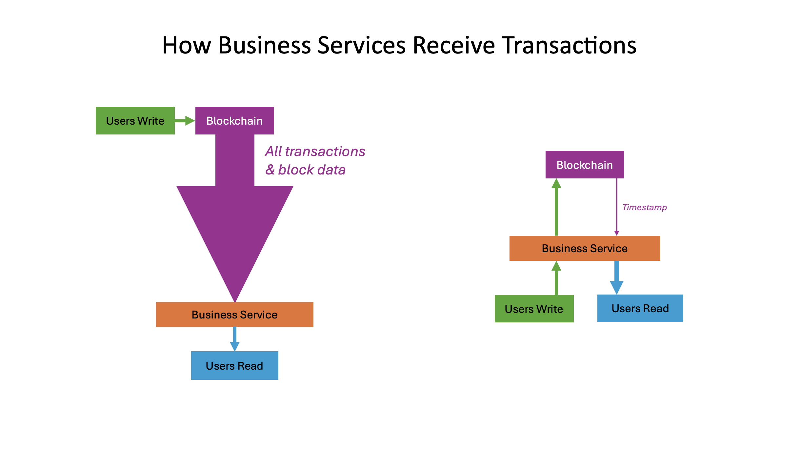

# Smart Contracts

A smart contract is a self-executing contract where terms of the contract are implemented in code. A common misconception is that Bitcoin is incapable of executing smart contracts, paving the way for the creation of other blockchains like [Ethereum](https://ethereum.org/).

The bitcoin scripting language is designed to be as primitive as possible. Using a set of OP codes, the language achieves maximum security while minimising attack surfaces through intentional limitations, which often leads to an underestimation of Bitcoin’s true potential. In fact, by simply focusing on the Bitcoin scripting language, there is a risk that many other interesting features of the protocol may be overlooked. To understand how Bitcoin is smart-contract friendly, one needs to zoom in and out on the bitcoin transaction, as well as the entire stage on which the bitcoin transaction plays its role.

By doing this, it becomes apparent that there are many ways to construct smart contracts on bitcoin. We can summarise them roughly as

* smart locking scripts
* smart use of sighash flags
* layered networks
* payment channels.

<figure><figcaption></figcaption></figure>

\
