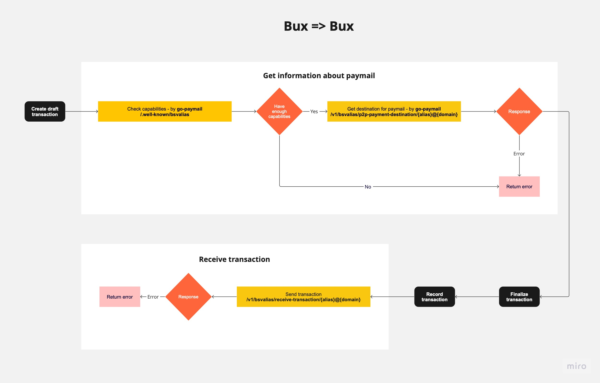
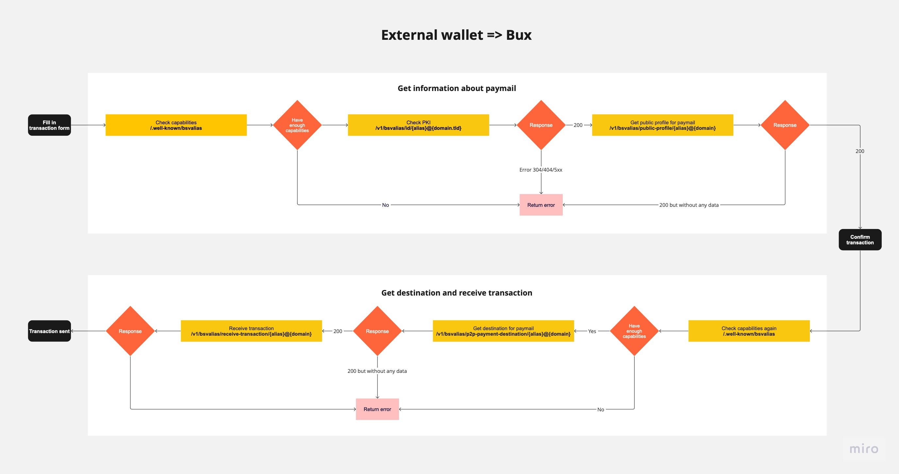
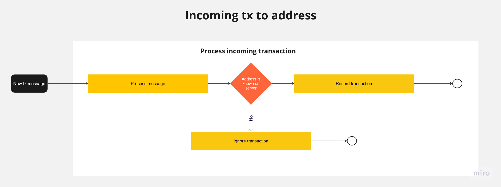

# Incoming transactions

SPV Wallet is able to work with both old-fashioned address transactions and transactions using paymail protocol.

1. [Paymail transaction](#incoming-paymail-transaction)
2. [Address transaction](#incoming-address-transaction)

## Incoming paymail transaction

### SPV Wallet to SPV Wallet transaction

This diagram show how incoming paymail transaction is processed.


#### Create draft transaction

Draft transaction is a preparation before creating actual transaction. It calculates fee, change and contains receiver address and expiration time. Draft transaction creation is triggered in spv-wallet-go-client by methods: `SendToRecipients`, `DraftToRecipients`or `DraftTransaction` \
In SPV Wallet every model has BeforeCreate hook which is called before creating model. In draft transaction it gathers information about receiver paymail.

1. Checking capabilities - `/.well-known/bsvalias`\
   Capability Discovery is the process by which a paymail client learns the supported features of a paymail service and their respective endpoints and configurations.\
   Example response:

    ```json
   {
    "bsvalias": "1.0",
    "capabilities": {
        "2a40af698840": "https://johnsmith.serveo.net/v1/bsvalias/p2p-payment-destination/{alias}@{domain.tld}",
        "5f1323cddf31": "https://johnsmith.serveo.net/v1/bsvalias/receive-transaction/{alias}@{domain.tld}",
        "6745385c3fc0": false,
        "a9f510c16bde": "https://johnsmith.serveo.net/v1/bsvalias/verify-pubkey/{alias}@{domain.tld}/{pubkey}",
        "f12f968c92d6": "https://johnsmith.serveo.net/v1/bsvalias/public-profile/{alias}@{domain.tld}",
        "paymentDestination": "https://johnsmith.serveo.net/v1/bsvalias/address/{alias}@{domain.tld}",
        "pki": "https://johnsmith.serveo.net/v1/bsvalias/id/{alias}@{domain.tld}"
    }
    }
   ```

2. P2P Payment Destination - `/v1/bsvalias/p2p-payment-destination/{alias}@{domain}`\
   This endpoint returns a JSON object containing the payment destination information for the given paymail handle.\
   ⚠️ Every call on this endpoint creates new destination (with new address) which is saved in db.\
   Example response:

    ```json
   {
    "outputs": [
        {
            "address": "1NSTSMD448yok4y128CENUeGX5mTbFrK1H",
            "satoshis": 1000,
            "script": "76a914eb2b1be9b79baff275f44f556a0cade66582fc7f88ac"
        }
    ],
    "reference": "90030d54ee6e6d35b4cb7c62fd25dad5"
    }
   ```

Every endpoint connected to paymail is defined in `go-paymail` library.

### Finalize transaction

Finalize transaction is a method defined in [spv-wallet-go-client](../../spv-wallet-go-client/README.md) which is called after creating draft transaction. It creates actual transaction (using go-bt library) and return its hex.

### Record Transaction

Record transaction is a method which saves all information about created transaction in db. During this process we create three objects:

1. **Transaction** - contains information about transaction
2. **SyncTransaction** - contains information about transaction synchronization
3. **IncomingTransaction** - contains information about incoming transaction

#### Steps in Record transaction

1. Create **Transaction** based on **DraftTransaction** and tx hex
2. Validate if tx was created successfully by checking if tx id is not empty
3. Validate **Transaction** if ITC (Incoming Transaction Check) is enabled - env variable `disable_itc`
   * If sent draft transaction id was empty
     1. Create and save **IncomingTransaction** with **Transaction** id and hex
     2. Create and save **SyncTransaction** with **Transaction** id
     3. Set values for **SyncTransaction**
        * `BroadcastStatus` - `skipped`
        * `P2PStatus` - `skipped`
        * `Metadata` - from **Transaction**
        >  incoming transaction should have been broadcasted already\
        `SyncStatus` is set to `ready` by default. It will be changed to `complete` after successful operation in `SyncTransaction` hook
     4. Create and return new **Transaction** based on **IncomingTransaction**
   * If sent **DraftTransaction** id was not empty
     1. Check if **DraftTransaction** exists and match with **Transaction**
4. Save **Transaction**

Every model in SPV Wallet Engine have `BeforeCreated` and `AfterCreated` hooks which are creating operations that are executed before and after creating model.\
In **Transaction** model we have `BeforeCreated` hook which can create **SyncTransaction** and **IncomingTransaction**.\
In **SyncTransaction** model we have `AfterCreated` hook which triggers broadcasting.

SPV Wallet Engine also have tasks which are launched every 30 seconds and are responsible for many operation e.g. broadcasting and synchronizing transactions.

Broadcasting is a process of sending transaction to the network. It can be triggered by `AfterCreated` hook in **SyncTransaction** model or in `BroadcastTransaction` task.
Broadcasting is done to different providers (several using mAPI but whatsOnChain and NowNodes are using their own api). SPV Wallet Engine broadcasts transactions in parallel to all providers.
The client is notified of the fastest provider that will respond to the broadcast successfully at exactly the same moment- meaning it doesn't have to wait for responses from the other providers.

## From external source

This diagram show how external incoming paymail transaction is processed.


### Get information about paymail

1. Checking capabilities - `/.well-known/bsvalias`\
    Capability Discovery is the process by which a paymail client gets information about the supported features of a paymail service and their respective endpoints and configurations.\
    Example response:

    ```json
   {
    "bsvalias": "1.0",
    "capabilities": {
        "2a40af698840": "https://domain.serveo.net/v1/bsvalias/p2p-payment-destination/{alias}@{domain.tld}",
        "5f1323cddf31": "https://domain.serveo.net/v1/bsvalias/receive-transaction/{alias}@{domain.tld}",
        "6745385c3fc0": false,
        "a9f510c16bde": "https://domain.serveo.net/v1/bsvalias/verify-pubkey/{alias}@{domain.tld}/{pubkey}",
        "f12f968c92d6": "https://domain.serveo.net/v1/bsvalias/public-profile/{alias}@{domain.tld}",
        "paymentDestination": "https://domain.serveo.net/v1/bsvalias/address/{alias}@{domain.tld}",
        "pki": "https://domain.serveo.net/v1/bsvalias/id/{alias}@{domain.tld}"
    }
    }
   ```

2. Public Key Infrastructure - Checking if paymail is valid - `/v1/bsvalias/id/{alias}@{domain.tld}`\
   Each paymail handle `{alias}@{domain}` must be issued a stable ECDSA public key that should not be used as part of any on-chain transaction.
    Example response for known paymail handle:

    ```json
    {
    "bsvalias": "1.0",
    "handle": "johnsmith@domain.com",
    "pubkey": "0326c74b9c9ee488ff93df77f01011336ac98a942650c2c8946dcba2bbfa01eb56"
    }
    ```

3. Public profile - `/v1/bsvalias/public-profile/{alias}@{domain}`\
    This endpoint returns a JSON object containing the public profile information for the given paymail handle.\
    Example response:

    ```json
    {
    "avatar": "https://url.to.avatar.com/test.png",
    "name": "jsmith"
    }
   ```

### Confirm transaction

This is the part where user confirm that he want to send the transaction (example: submit the form by clicking the send button)

### Create transaction

1. Checking capabilities - `/.well-known/bsvalias`\
    As above, checking if it is possible to send transaction to this paymail.
2. P2P Payment Destination - `/v1/bsvalias/p2p-payment-destination/{alias}@{domain}`\
    This endpoint returns a JSON object containing the payment destination information for the given paymail handle.\
    ⚠️ As above, every call on this endpoint creates new destination (with new address) which is saved in db.\
    Example response:

    ```json
   {
    "outputs": [
        {
            "address": "1NSTSMD448yok4y128CENUeGX5mTbFrK1H",
            "satoshis": 1000,
            "script": "76a914eb2b1be9b79baff275f44f556a0cade66582fc7f88ac"
        }
    ],
    "reference": "90030d54ee6e6d35b4cb7c62fd25dad5"
    }
   ```

3. Receive transaction - `/v1/bsvalias/receive-transaction/{alias}@{domain}`\
    This endpoint is used to receive a transaction for a paymail handle. It uses RecordTransaction method from SPV Wallet Engine which is described [here](#record-transaction).

## Incoming address transaction

This diagram show how incoming address transaction is processed.


The `mempool:transactions` indicates that a new transaction has occurred in the mempool. The SPV Wallet checks the transaction against the registered addresses in its own database, if the recipient of the transaction is a known address SPV Wallet will record transaction (whitout broadcasting).
