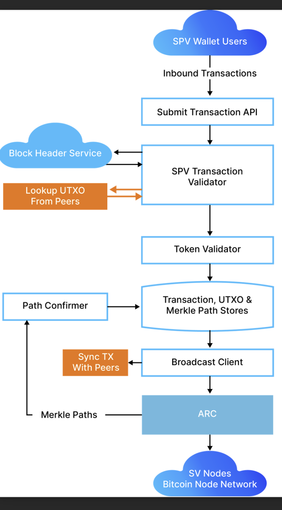

# Overlay Services

### Definition

An overlay in computer networking refers to a virtual network built on top of an existing physical network. It augments or extends the underlay, providing services like routing, peer-to-peer networking, or distributed computing. In BSV, overlays operate on the BSV Node Network, offering services like transaction lookups, token management, and open predicates.



## Overlays a Glance

Global Listening is the typical historical way Blockchains have gathered transactions so that they can be indexed and read back by client applications.

<figure><figcaption>
Global Listening
</figcaption></figure>

Overlays encapsulate a different approach. They rely on [SPV](../../bsv-skills-center/bsv-protocol-documentation/light-clients-and-spv-processes/simplified-payment-verification-spv/) to validate transactions they receive from clients, and allow users to read transaction data back without having to index all block data.\

<figure><figcaption>
Overlay SPV
</figcaption></figure>

## Business Context

Current BSV applications often rely on reading timestamped immutable data from the blockchain, which is not feasible at high transaction volumes without Simplified Payment Verification (SPV) and the division of labor. Overlays distribute demand for immutable data across many services, enabling businesses to minimize waste and select services based on their needs and costs.

### Features of an Overlay

Overlays ingest and validate transactions using SPV, maintain the valid chain of headers, submit valid transactions to the BSV Node Network, and maintain transaction propagation status. They also acquire and distribute Merkle paths for mined transactions, sync with peers, and optionally expose UTXO and transaction lookups.

### Infrastructure Dependencies

Overlays depend on the BSV Node Network for new header announcements, a Merkle Service for calculating Merkle paths, and widespread use of SPV data structures within wallets and applications. They provide a cost-effective, scalable, and secure solution for businesses by ensuring data integrity and network resilience.

### User Types

Overlays cater to various users including:

• Private Overlays: For specific individuals or businesses.

• Public Overlays: For developers without infrastructure, like [ARC](<../../important-concepts/details/SPV Wallet/broadcasting.md>).

• Ring Fenced Overlays: For financial institutions with jurisdictional restrictions.

• Open Protocol Overlays: For experimental applications by entrepreneurial developers.

### Use-Cases

Overlays have diverse use-cases across industries such as:

• Event and Airline Ticketing

• Cloud Storage and eCommerce

• Central Banks for Digital Currencies

• Token Protocols: Specific transaction types for tokens like STAS and Tokenized.

• Wallet Providers: For providers like Handcash, Centbee, and RockWallet.

• Fungible Tokens (FTs): For CBDCs, PIDMs, stable coins, etc.

• Non-Fungible Tokens (NFTs): For hotel keys, allocated gold, etc.

• Open Predicates (OPs): For computation markets.

• Data Predicates (DPs): For storage markets.

• Backup Services: For transaction and metadata recovery.

• Explorers: For development, receipts, or status checks.

## Technical Components

#### Web API

Exposes endpoints for submitting transactions and looking up transactions by ID.

#### Store

Maintains transactions, UTXOs, headers, Merkle paths, and metadata.

#### Validator

Runs SPV and additional business logic.

#### Listener

Monitors headers, alerts, and transaction rejections.

#### Synchronizer

Syncs state with other overlay nodes.

#### Path Confirmer

Requests Merkle proofs for unconfirmed transactions.

## Architecture

What we have today looks something like this:

<figure><picture><source srcset="../../.gitbook/assets/filtered_image_updated.png" media="(prefers-color-scheme: dark)"></picture><figcaption></figcaption></figure>

## Future Outlook

The future of overlay networks includes advancements in scalability, security, and regulatory compliance, positioning BSV as a leading platform for various industries.

### Technical Changes

<figure><figcaption></figcaption></figure>

We expect there to be a scaled Merkle Service which will replace ARC's microservice BlockTx as the component which calculates Merkle paths. This change is anticipated because Teranode blocks can get siginificantly bigger, and BlockTx is not built for anything larger than 4GB blocks. Teranode announces subtrees while constructing its own block, so the work can start early and propagation can be executed on block discovery without there being a massive spike in computational effort at that moment only to be left unused until a new block is found. The work is instead distributed over the duration of the block assembly process. More on that as alpha versions are released.
