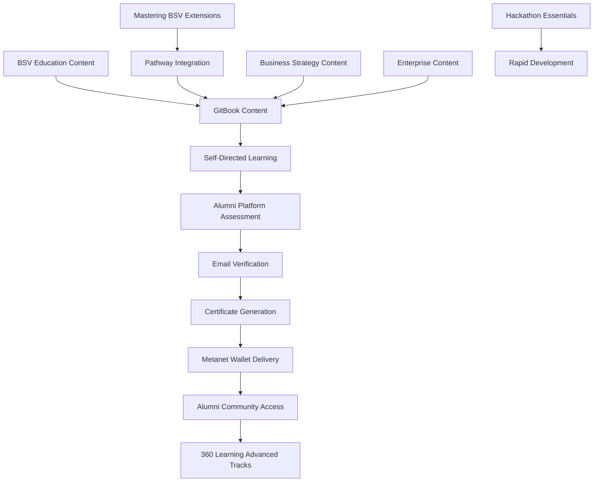

# BSV Academy - Complete System Guide

This comprehensive guide provides the complete technical overview of the BSV Academy's unified curriculum system. Here you'll find detailed information about the integration architecture, content structure, assessment framework, and technical implementation details.

> **New to BSV?** Start with our [pathway selector](../README.md) to find the right entry point for your goals.

## 🎯 System Overview

This unified onboarding system brings together:

* **BSV Education Curriculum** - Zero-to-hero technical content
* **Mastering BSV Content** - Advanced STOs and enterprise applications (integrated as pathway extensions)
* **Business Strategy Content** - Commercial implementation guidance
* **Enterprise Architecture** - Large-scale deployment patterns
* **Assessment Framework** - Formal certification system
* **Community Integration** - Alumni platform and networking

### Integration Architecture



## 🚀 Learning Pathways

### 🆕 New to BSV?

Start with [**Foundations**](01-foundations/) to build essential knowledge:

* [BSV Evolution](01-foundations/bsv-evolution.md) - Understanding the paradigm shift
* [Environment Setup](01-foundations/environment-setup.md) - Development tools configuration
* [Wallet Setup](01-foundations/wallet-setup.md) - Modern wallet integration

### ⚡ Hackathon Participant?

Jump to [**Hackathon Essentials**](05-hackathon-essentials/) for rapid development:

* [Quick Start Guide](05-hackathon-essentials/quick-start-guide.md) - 15-minute setup to building
* [Essential Tools](05-hackathon-essentials/essential-tools.md) - Rapid development utilities
* [Sample Projects](05-hackathon-essentials/sample-projects.md) - Complete application templates

### 👨‍💻 Developer?

Explore [**Technical Track**](02-pathways/technical/) for comprehensive development skills:

* [Building Blocks](broken-reference) - Core BSV components
* [BRC-100 Integration](broken-reference) - Modern wallet patterns
* [Smart Contracts](broken-reference) - sCrypt development
* [Advanced Topics](broken-reference) - Scaling and optimization
* [**Advanced STOs**](broken-reference) - Expert-level STO mastery (13 modules)

### 💼 Business Leader?

Follow [**Business Track**](02-pathways/business/) for strategic implementation:

* [Value Propositions](02-pathways/business/value-propositions/) - Business case development
* [ROI Analysis](02-pathways/business/roi-analysis.md) - Financial modeling
* [Implementation Strategy](02-pathways/business/implementation-strategy.md) - Deployment planning
* [**Advanced Business STOs**](02-pathways/business/05-advanced-business-stos/table-of-contents/) - Expert business applications (7 modules)

### 🏢 Enterprise Architect?

Advance to [**Enterprise Track**](02-pathways/enterprise/) for large-scale solutions:

* [Architecture Patterns](02-pathways/enterprise/architecture.md) - System design
* [Integration Strategies](02-pathways/enterprise/integration-patterns.md) - Legacy connectivity
* [Security & Compliance](broken-reference) - Enterprise requirements

### 🎓 Academic Researcher?

Master [**Academic Track**](02-pathways/academic/) for scholarly contributions:

* [Research Foundations](02-pathways/academic/research-foundations.md) - Academic methodology
* [Economic Models](02-pathways/academic/economic-models.md) - Theoretical analysis
* [Network Analysis](02-pathways/academic/network-analysis.md) - Empirical research
* [**Advanced Academic STOs**](02-pathways/academic/05-advanced-academic-stos/table-of-contents/) - Theoretical mastery (8 modules)

## 📚 Content Structure

```
packages/onboarding/
├── 00-introduction/          # System overview and navigation
├── 01-foundations/           # Essential BSV concepts (MIGRATED)
│   ├── bsv-evolution.md     # From BSV education: paradigm shift
│   ├── environment-setup.md  # Development tools configuration
│   └── wallet-setup.md      # Modern wallet integration
├── 02-pathways/             # Specialized learning tracks
│   ├── technical/           # Developer-focused content (ENHANCED)
│   │   ├── 01-building-blocks/
│   │   │   ├── brc100-wallet-integration.md  # MIGRATED from BSV education
│   │   │   ├── overlay-services.md           # Application-layer protocols
│   │   │   └── spv-proofs.md                # Verification methods
│   │   ├── 02-smart-contracts/              # sCrypt development
│   │   ├── 03-advanced-topics/              # Scaling and optimization
│   │   ├── 04-examples/                     # Portfolio projects
│   │   └── 05-advanced-stos/               # INTEGRATED: Advanced STO mastery (13 modules)
│   ├── business/            # Strategic implementation (ENHANCED)
│   │   ├── value-propositions/              # Business case development
│   │   ├── roi-analysis.md                  # Financial modeling
│   │   ├── implementation-strategy.md       # Deployment planning
│   │   └── 05-advanced-business-stos/      # INTEGRATED: Business STO applications (7 modules)
│   ├── enterprise/          # Large-scale architecture
│   └── academic/            # Research and theory (ENHANCED)
│       ├── research-foundations.md          # Academic methodology
│       ├── economic-models.md               # Theoretical analysis
│       ├── network-analysis.md              # Empirical research
│       └── 05-advanced-academic-stos/      # INTEGRATED: Academic STO theory (8 modules)
├── 03-resources/            # Developer tools and references
├── 04-assessments/          # Formal evaluation system
├── 05-hackathon-essentials/ # Rapid development (MIGRATED)
│   ├── quick-start-guide.md # MIGRATED: 15-minute setup
│   ├── essential-tools.md   # Development utilities
│   └── sample-projects.md   # Complete templates
└── config/                  # GitBook and system configuration
```

## 🔄 Content Integration Status

### ✅ Successfully Integrated

#### From BSV Education Package (`packages/bsv-education/`)

* **Zero-to-Hero Curriculum** → Integrated into technical pathways
* **Wallet Client Framework** → [BRC-100 Integration Guide](broken-reference)
* **BSV Evolution Content** → [BSV Evolution](01-foundations/bsv-evolution.md)
* **Hackathon Essentials** → [Quick Start Guide](05-hackathon-essentials/quick-start-guide.md)
* **Overlay Services Content** → Technical building blocks
* **Identity & Messaging** → Advanced topics modules

#### From Mastering BSV Repository (`https://github.com/todriguez/mastering-bsv.git` - Repository Decommissioned)

* **Technical Track** → [Advanced STOs](broken-reference) - 13 expert-level modules
* **Professional Track** → [Advanced Business STOs](02-pathways/business/05-advanced-business-stos/table-of-contents/) - 7 business-focused modules
* **Trunk Track** → [Advanced Academic STOs](02-pathways/academic/05-advanced-academic-stos/table-of-contents/) - 8 theoretical modules

#### Enhanced Existing Content

* **Business Pathways** → Extended with advanced STO business applications
* **Enterprise Architecture** → Integrated with existing patterns
* **Academic Track** → Extended with theoretical STO foundations
* **Assessment System** → Unified evaluation framework across all extensions
* **Resource Hub** → Comprehensive developer resources

### 🔄 Integration Approach

**Pathway Extensions**: The mastering BSV content has been integrated as advanced modules within existing pathways:

* **Technical Pathway** extended with 13 advanced STO modules
* **Business Pathway** extended with 7 business STO application modules
* **Academic Pathway** extended with 8 theoretical STO foundation modules

**Progressive Learning**: The integration creates natural progression within each pathway:

1. **Foundation Concepts** (Existing modules 1-4)
2. **Advanced Applications** (Mastering BSV extensions as module 5)
3. **Expert Mastery** (Complete pathway with STO expertise)

**Cross-References**: Integrated content includes proper navigation between:

* Foundation concepts and advanced STO implementations
* Business strategy and advanced STO business models
* Academic theory and STO theoretical frameworks
* Assessment requirements and all learning content

## 🎓 Complete Learning Progression

### Foundation Level (Required for All)

1. [**BSV Evolution**](01-foundations/bsv-evolution.md) - Understand the paradigm shift
2. [**Environment Setup**](01-foundations/environment-setup.md) - Configure development tools
3. [**Wallet Setup**](01-foundations/wallet-setup.md) - Master modern wallet integration
4. **Foundation Assessment** - Validate core knowledge

### Specialized Tracks (Choose Your Path)

#### Technical Development (Extended with Advanced STOs)

* **Building Blocks** → **Smart Contracts** → **Advanced Topics** → **Portfolio Projects** → **Advanced STOs**
* Estimated time: 20-24 weeks part-time (including advanced STO mastery)
* Certification: BSV Technical Expert (with advanced STO specialization)

#### Business Strategy (Extended with Business STOs)

* **Value Propositions** → **ROI Analysis** → **Implementation Strategy** → **Advanced Business STOs**
* Estimated time: 14-20 weeks part-time (including business STO applications)
* Certification: BSV Business Expert (with STO business model expertise)

#### Enterprise Architecture

* **Architecture Patterns** → **Integration Strategies** → **Security & Compliance**
* Estimated time: 10-14 weeks part-time
* Certification: BSV Enterprise Architect

#### Academic Research (Extended with Academic STOs)

* **Research Foundations** → **Economic Models** → **Network Analysis** → **Advanced Academic STOs**
* Estimated time: 16-24 weeks part-time (including theoretical STO mastery)
* Certification: BSV Research Expert (with STO theoretical expertise)

#### Rapid Development (Hackathons)

* **Quick Start** → **Essential Tools** → **Sample Projects**
* Estimated time: 8-12 hours intensive
* Outcome: Working BSV application

## 🔐 Assessment & Certification

### Progressive Assessment System

* **Email Verification** - Required for formal assessment access
* **Prerequisite Gating** - Complete foundations before specialized tracks
* **Advanced Prerequisites** - Complete core modules before STO extensions
* **Practical Implementation** - Hands-on coding and deployment
* **Portfolio Review** - Real-world project evaluation
* **STO Mastery** - Advanced theoretical and practical STO expertise

### Certificate Delivery

* **Blockchain Anchoring** - Certificates recorded on BSV blockchain
* **Metanet Wallet Integration** - Direct delivery to user wallets
* **Public Verification** - Independently verifiable credentials
* **Alumni Platform Access** - Community membership activation

### Certification Hierarchy

* **Foundation Certificate** - Basic BSV competency (all tracks)
* **Specialized Certificates** - Track-specific expertise (modules 1-4)
* **Expert Certificates** - Advanced STO mastery (complete pathways with extensions)
* **Master Practitioner** - Cross-domain expertise and innovation leadership

## 🛠️ Technical Integration

### GitBook Configuration

* **Unified Navigation** - Seamless content flow across all sources
* **Cross-References** - Integrated linking between related topics
* **Progressive Disclosure** - Content unlocked based on prerequisites
* **Mobile Optimization** - Learning anywhere, anytime

### Alumni Platform Integration

* **SSO Authentication** - Single sign-on across all systems
* **Assessment Engine** - Comprehensive evaluation framework
* **Certificate Management** - Blockchain-based credential system
* **Community Features** - Networking and collaboration tools

### Metanet Wallet Integration

* **BRC-100 Compliance** - Standard wallet interface implementation
* **Certificate Delivery** - Direct blockchain-based credential transfer
* **Identity Verification** - Cryptographic identity management
* **Portfolio Management** - Credential organization and display

## 🤝 Community & Support

### Learning Community

* **Alumni Platform** - [https://alumni.bsvacademy.org](https://alumni.bsvacademy.org)
* **Study Groups** - Collaborative learning and peer support
* **Mentorship Program** - Expert guidance and career development
* **Industry Connections** - Professional networking and opportunities
* **STO Expert Groups** - Advanced practitioner communities

### Technical Support

* **Documentation** - Comprehensive guides and references
* **Community Forums** - Peer support and knowledge sharing
* **Expert Office Hours** - Direct access to BSV professionals
* **Emergency Support** - Rapid assistance for critical issues

### Contributing

* **Content Improvements** - Enhance and expand learning materials
* **Code Contributions** - Improve platform functionality
* **Community Moderation** - Support fellow learners
* **Expert Reviews** - Validate technical accuracy and relevance

## 📊 Success Metrics

### Individual Progress

* **Module Completion** - Track progress through learning pathways
* **Assessment Scores** - Validate knowledge and skills
* **Portfolio Development** - Build demonstrable expertise
* **Community Engagement** - Participate in discussions and collaboration
* **STO Mastery** - Advanced expertise in cutting-edge concepts

### System Effectiveness

* **Learning Outcomes** - Measure skill development and knowledge retention
* **Career Advancement** - Track professional growth and opportunities
* **Industry Adoption** - Monitor BSV ecosystem growth and development
* **Community Growth** - Expand the BSV developer and business community

## 🎯 Getting Started

### Immediate Next Steps

1. **Choose Your Entry Point** - Select the pathway that matches your goals
2. **Complete Prerequisites** - Ensure you have necessary background knowledge
3. **Set Up Environment** - Configure tools and access systems
4. **Join Community** - Connect with other learners and experts

### Success Tips

* **Start with Foundations** - Build solid understanding before specializing
* **Practice Regularly** - Apply concepts through hands-on implementation
* **Engage Community** - Ask questions and help others learn
* **Document Progress** - Keep track of learning and build portfolio
* **Master STOs** - Complete pathway extensions for expert-level expertise

***

**Ready to begin your complete BSV journey?** Choose your pathway above and progress to advanced STO mastery!

_This unified onboarding system represents the most comprehensive BSV education available, integrating foundational concepts, specialized applications, and advanced STO mastery into pathway extensions that provide expert-level expertise in the BSV ecosystem._
