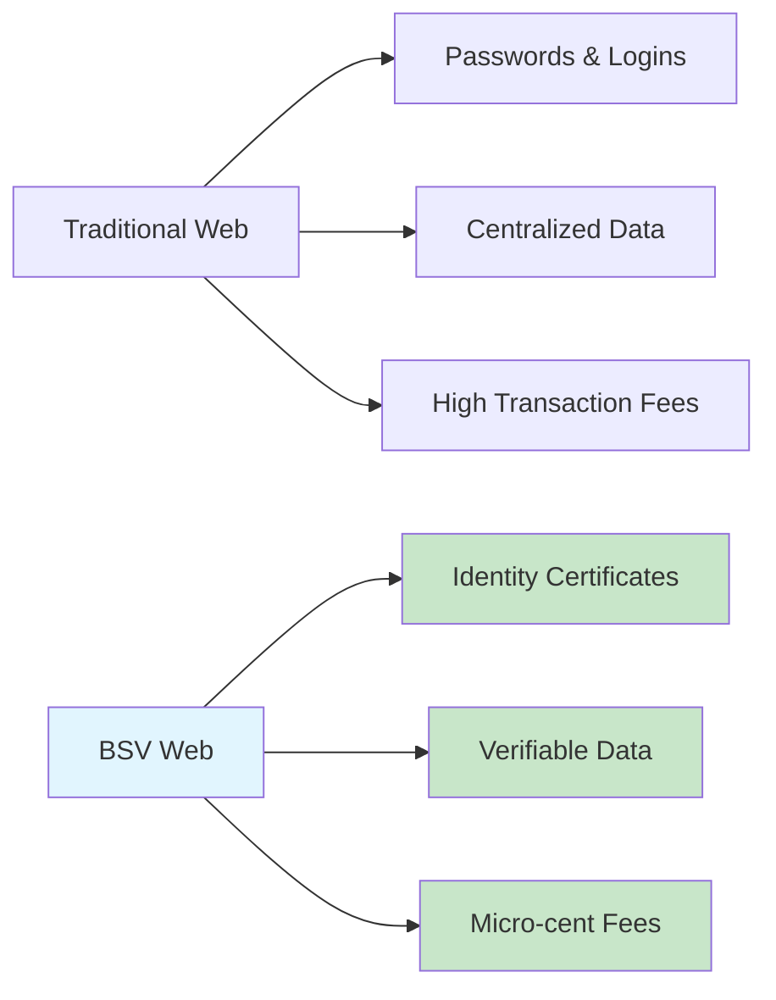

# Getting Started with BSV

Welcome to BSV - the blockchain that scales without limits while maintaining the original Bitcoin protocol. This guide will help you get up and running quickly, whether you're here for a wallet, to build applications, or to learn the technology.

## 🎯 Choose Your Starting Point

### 🔐 I want the Metanet Wallet
**Time needed: 5 minutes**

The Metanet Desktop Wallet is your gateway to the BSV ecosystem with built-in identity management and developer tools.

[**Download Metanet Desktop**](metanet-desktop.md) →

**What you'll get:**
- Complete BSV blockchain interaction
- Advanced identity and certificate management
- Developer-friendly features
- Secure key management

### 💻 I want to see BSV in action
**Time needed: 2 minutes**

See how easy it has become to build on BSV with this interactive demo:


Unlock the power of BSV


Notice how the code makes requests to the wallet, not the other way around. This approach offers significant benefits in terms of security, UI/UX, privacy and scalability.

[**Browse more examples**](examples.md) →

### 📚 I want to learn the technology
**Time needed: Choose your pace**

BSV offers four comprehensive learning paths based on your role and goals:

| Path | Best For | Time Investment |
|------|----------|-----------------|
| [**👨‍💻 Technical**](../02-pathways/technical/README.md) | Developers building applications | 8-12 weeks |
| [**💼 Business**](../02-pathways/business/README.md) | Leaders planning implementation | 6-8 weeks |
| [**🎓 Academic**](../02-pathways/academic/README.md) | Researchers and students | 10-16 weeks |
| [**🏢 Enterprise**](../02-pathways/enterprise/README.md) | Architects designing systems | 8-10 weeks |

## 💡 Why BSV is Different

BSV isn't just about cryptocurrency - it's about building a **verifiable data economy** where:

- **Every transaction costs fractions of a cent** (< $0.0001)
- **Transactions process in seconds**, not minutes or hours
- **The protocol is stable** - no surprise changes or forks
- **Identity is built-in** - no more password fatigue
- **Data integrity is guaranteed** - tamper-proof by design

## 🧭 Your First Steps

1. **Get the wallet** - [Download Metanet Desktop](metanet-desktop.md)
2. **Set up your identity** - Secure key management built-in
3. **Get some BSV** - Fund your wallet for transactions
4. **Try an example** - [Browse code examples](examples.md)
5. **Choose your path** - Pick a [learning pathway](../02-pathways/) for deeper exploration

## 🚀 Quick Access

| I need... | Go here |
|-----------|---------|
| **Wallet download** | [Metanet Desktop](metanet-desktop.md) |
| **Code examples** | [Examples gallery](examples.md) |
| **Documentation** | [Resources hub](../03-resources/README.md) |
| **Hackathon kit** | [Quick start guide](../05-hackathon-essentials/quick-start-guide.md) |
| **Complete overview** | [System guide](../00-system-overview/README.md) |

---

**Ready to dive deeper?** Choose your [learning pathway](../02-pathways/) based on your role and goals.
