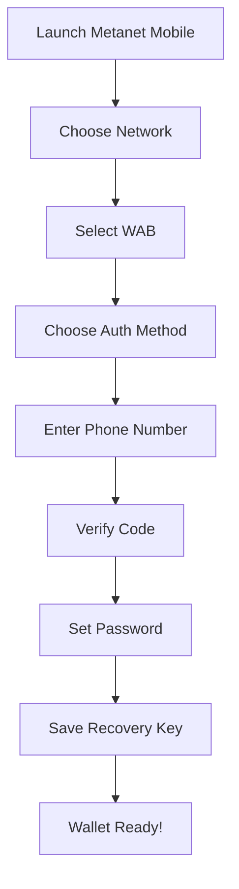
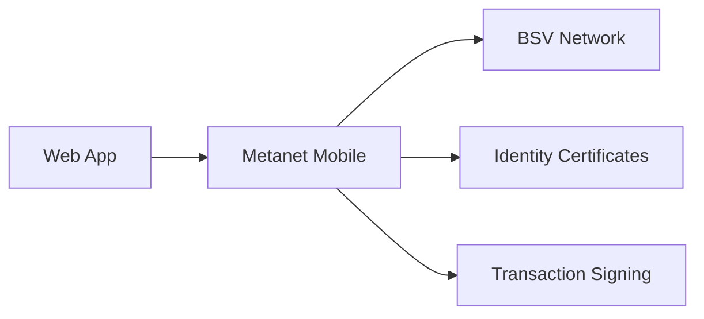

# Metanet Mobile Wallet

Metanet Mobile is a lightweight, ReactNative-based BSV wallet that brings the power of the BSV blockchain to your mobile device. It's designed as a BRC-100 compliant wallet that enables seamless interaction between web applications and your BSV identity.

## 📱 Quick Setup

**GitHub Repository:** [https://github.com/bitcoin-sv/metanet-mobile](https://github.com/bitcoin-sv/metanet-mobile)

## ✨ Key Features

### 🌐 Web App Integration
- **ReactNative substrate via WebView** for smooth app experiences
- **Seamless web app communication** - websites can talk directly to your wallet
- **BRC-100 compliance** for standardized wallet interactions
- **Cross-platform compatibility** (iOS and Android)

### 🔐 Secure Authentication
- **WAB (Wallet Authentication Backend) integration** for secure identity management
- **Multiple authentication methods** including Twiloo Phone verification
- **Granular permissions management** for app access control
- **Trust and identity management** with certificate support

### ⚡ BSV-Native Features
- **Instant transactions** with sub-cent fees
- **SPV verification** for lightweight operation
- **Identity certificate management** for passwordless authentication
- **Overlay service connectivity** for advanced applications

## 🚀 Installation Options

### Option 1: Download Pre-built App
*Coming soon - check the GitHub repository for latest releases*

### Option 2: Build from Source (Developers)

#### Prerequisites
- **Node.js** (v16 or higher)
- **Expo CLI** installed globally
- **Expo Go app** on your mobile device
- **Git** for cloning the repository

#### Setup Steps

```bash
# Clone the repository
git clone https://github.com/bitcoin-sv/metanet-mobile.git
cd metanet-mobile

# Install dependencies
npm install

# Start the development server
npm run start
```

## 🔧 Initial Configuration

### 1. Network Selection
When you first launch Metanet Mobile, you'll choose:
- **Mainnet** (recommended for production use)
- **Testnet** (for development and testing)

### 2. Authentication Setup
- **Choose your WAB** (Wallet Authentication Backend)
- **Select authentication method** (currently Twiloo Phone)
- **Complete phone verification** process
- **Set up your recovery credentials**

### 3. Storage Configuration
- **Pick your Storage URL** for wallet data
- **Configure backup preferences**
- **Set up automatic sync** options

## 📱 Getting Started Walkthrough

### First Launch Experience


### Your First Transaction

1. **Fund your wallet**
   - Tap **"Receive"** to get your BSV address
   - Share the QR code or copy the address
   - Receive BSV from an exchange or another wallet

2. **Send BSV**
   - Tap **"Send"** in the main interface
   - Scan recipient's QR code or enter address
   - Enter amount and optional memo
   - Confirm transaction - it processes in seconds!

## 🌐 Web App Integration

### How It Works
Metanet Mobile creates a bridge between web applications and your BSV wallet:



### Supported Interactions
- **Authentication requests** - Apps can verify your identity
- **Transaction signing** - Approve payments and data transactions
- **Certificate sharing** - Selective disclosure of identity attributes
- **Permission management** - Grant and revoke app access

### Example Use Cases
- **DeFi applications** requesting payment authorization
- **Social platforms** verifying identity without passwords
- **Gaming apps** managing in-game asset transactions
- **Business tools** accessing verified professional credentials

## 🔑 Identity & Permissions

### Certificate Management
- **View your certificates** in the identity section
- **Manage app permissions** for each certificate
- **Revoke access** when no longer needed
- **Issue new certificates** for different contexts

### Privacy Controls
- **Selective disclosure** - share only necessary information
- **Time-limited permissions** for temporary access
- **Audit trail** of all permission grants and usage
- **Zero-knowledge proofs** for attribute verification without revelation

## 🛡️ Security Features

### Built-in Security
- **Secure key storage** using device security features
- **Biometric authentication** (fingerprint/face unlock)
- **App sandboxing** to prevent unauthorized access
- **Automatic session timeouts** for inactive periods

### Best Practices
- **Enable device lock** with PIN/biometric
- **Regularly review** app permissions
- **Keep recovery key secure** and offline
- **Update the app** when new versions are available

## 🔧 Developer Integration

### For App Developers
If you're building web applications that integrate with Metanet Mobile:

```javascript
// Example: Request user authentication
const authResult = await window.bsv.requestAuth({
  requiredCertificates: ['identity', 'email'],
  purpose: 'Login to MyApp'
});

// Example: Request payment
const paymentResult = await window.bsv.requestPayment({
  amount: 1000, // satoshis
  recipient: 'your-bsv-address',
  description: 'Premium subscription'
});
```

### Integration Benefits
- **No password management** - users authenticate with certificates
- **Instant payments** - sub-cent transaction fees
- **Verified identity** - cryptographic proof of user attributes
- **Cross-platform** - works on any device with Metanet Mobile

## 🆘 Troubleshooting

### Common Issues

**App won't connect to web apps:**
- Check internet connection
- Verify app permissions in settings
- Try refreshing the web application

**Authentication failing:**
- Ensure certificates are valid and not expired
- Check if app has required permissions
- Verify WAB connectivity

**Transactions not processing:**
- Confirm sufficient BSV balance
- Check network connectivity
- Verify recipient address format

### Getting Help
- **GitHub Issues** for bug reports: [metanet-mobile/issues](https://github.com/bitcoin-sv/metanet-mobile/issues)
- **BSV Discord** for community support
- **Developer Documentation** at [docs.bsvblockchain.org](https://docs.bsvblockchain.org)

## 🎯 Next Steps

With Metanet Mobile set up, you're ready to:

1. **[Complete your first steps](first-steps.md)** - Basic wallet operations
2. **[Explore BSV web apps](../03-resources/community.md)** - Try apps that integrate with your wallet
3. **[Choose your learning pathway](../02-pathways/README.md)** - Dive deeper into BSV development

## 🔗 Related Resources

- **[Metanet Desktop Wallet](metanet-desktop.md)** - Full-featured desktop experience
- **[BSV Web Apps Directory](../03-resources/community.md)** - Apps that work with your mobile wallet
- **[Developer Tools](../03-resources/tools-reference.md)** - Build apps that integrate with Metanet Mobile

---

**Ready to explore?** Now that you have a BSV wallet, [**choose your learning pathway**](../02-pathways/README.md) to dive deeper into the BSV ecosystem.