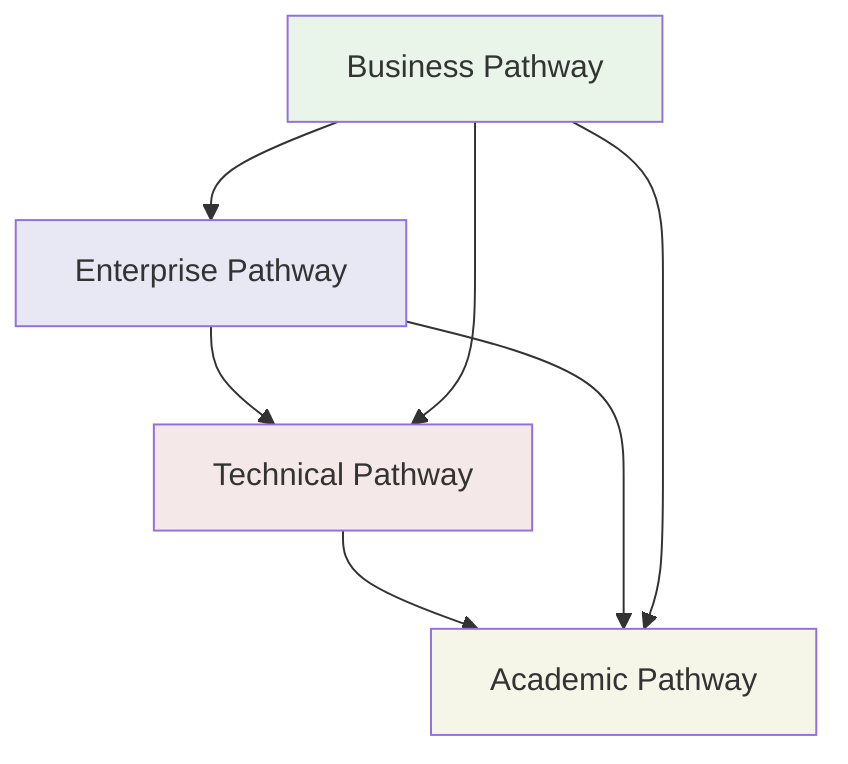

# Choose Your Learning Pathway

Now that you have your BSV wallet set up, it's time to choose the learning path that best matches your goals and background. Each pathway is designed to provide targeted, relevant content for different audiences and use cases.

## 🛤️ Available Pathways

### 👨‍💻 [Technical Pathway](technical/README.md)
**For developers who want to build applications on BSV**

**You should choose this if you are:**
- Software developer or engineer
- Technical architect or lead
- Blockchain developer (new to BSV)
- Building applications that need blockchain integration

**What you'll learn:**
- BSV Building Blocks (Metanet Wallets, TS-SDK, Wallet Toolbox)
- Smart contract development with sCrypt
- Overlay Services architecture
- Real-world implementation examples
- Advanced scaling patterns

**Time investment:** 4-8 hours for core concepts, 2-4 weeks for mastery

---

### 💼 [Business Pathway](business/README.md)
**For business leaders evaluating BSV for their organization**

**You should choose this if you are:**
- Business executive or decision maker
- Product manager or business analyst
- Evaluating blockchain solutions for your company
- Need to understand BSV's business value

**What you'll learn:**
- BSV infrastructure overview and capabilities
- Industry-specific value propositions
- ROI analysis and implementation strategies
- Real-world case studies and success stories
- Cost-benefit analysis frameworks

**Time investment:** 2-4 hours for overview, 1-2 weeks for deep evaluation

---

### 🏛️ [Enterprise Pathway](enterprise/README.md)
**For enterprise architects and compliance teams**

**You should choose this if you are:**
- Enterprise architect or IT director
- Compliance officer or risk manager
- Security architect or auditor
- Planning large-scale BSV deployment

**What you'll learn:**
- Regulatory compliance frameworks
- Enterprise integration patterns
- Security and audit requirements
- Governance and risk management
- Deployment strategies and best practices

**Time investment:** 3-6 hours for frameworks, 2-3 weeks for implementation planning

---

### 🎓 [Academic Pathway](academic/README.md)
**For researchers and students seeking deep theoretical knowledge**

**You should choose this if you are:**
- Academic researcher or student
- Interested in blockchain theory and cryptography
- Writing papers or conducting research on BSV
- Need comprehensive theoretical foundation

**What you'll find:**
- Redirect to the comprehensive [BSV Academy](https://docs.bsvblockchain.org/bsv-academy/getting-started)
- Peer-reviewed research and whitepapers
- Theoretical foundations and mathematical proofs
- Academic community and discussion forums

**Time investment:** Varies based on research depth and academic goals

## 🎯 Quick Pathway Selector

Not sure which pathway to choose? Answer these questions:

### What's your primary goal?
- **Build applications** → [Technical Pathway](technical/README.md)
- **Evaluate for business use** → [Business Pathway](business/README.md)
- **Plan enterprise deployment** → [Enterprise Pathway](enterprise/README.md)
- **Research and study** → [Academic Pathway](academic/README.md)

### What's your background?
- **Software development** → Technical or Enterprise
- **Business/Product management** → Business or Enterprise
- **IT/Architecture** → Enterprise or Technical
- **Academic/Research** → Academic or Technical

### What's your timeline?
- **Need quick overview** → Business Pathway
- **Planning implementation** → Enterprise Pathway
- **Ready to build** → Technical Pathway
- **Long-term research** → Academic Pathway

## 🔄 Pathway Interconnections

These pathways are designed to complement each other:

**Cross-pathway recommendations:**
- **Business → Technical:** Understand implementation after evaluating value
- **Enterprise → Technical:** Deep-dive into architecture after planning
- **Technical → Academic:** Explore theoretical foundations
- **Any → Academic:** For comprehensive research and theory

## 🚀 Getting Started

### 1. Choose Your Primary Pathway
Click on the pathway that best matches your immediate needs and goals.

### 2. Follow the Structured Learning
Each pathway provides:
- **Clear learning objectives**
- **Estimated time commitments**
- **Hands-on examples and exercises**
- **Additional resources and references**

### 3. Cross-Reference as Needed
Don't hesitate to explore other pathways for:
- **Different perspectives** on the same concepts
- **Complementary knowledge** for your role
- **Broader understanding** of the BSV ecosystem

### 4. Join the Community
Regardless of your pathway:
- **[BSV Discord](https://discord.gg/bsv)** - Real-time community support
- **[Developer Forums](https://github.com/bitcoin-sv/bsv/discussions)** - Technical discussions
- **[BSV Association](https://bitcoinassociation.net/)** - Official updates and news

## 📊 Pathway Comparison

| Aspect | Technical | Business | Enterprise | Academic |
|--------|-----------|----------|------------|----------|
| **Focus** | Building apps | Value evaluation | Large-scale deployment | Research & theory |
| **Depth** | Implementation | Strategic | Architectural | Theoretical |
| **Duration** | 2-4 weeks | 1-2 weeks | 2-3 weeks | Ongoing |
| **Prerequisites** | Programming knowledge | Business acumen | Enterprise experience | Academic background |
| **Outcome** | Working applications | Business case | Deployment plan | Research foundation |

## 🎯 Ready to Begin?

Select your pathway and start your BSV journey:

**[👨‍💻 Technical Pathway](technical/README.md)**
*Build applications on BSV*

**[💼 Business Pathway](business/README.md)**
*Evaluate BSV for your organization*

**[🏛️ Enterprise Pathway](enterprise/README.md)**
*Enterprise integration & compliance*

**[🎓 Academic Pathway](academic/README.md)**
*Deep theoretical knowledge*

---

**Need help choosing?** Join our [community Discord](https://discord.gg/bsv) and ask for guidance based on your specific situation and goals.