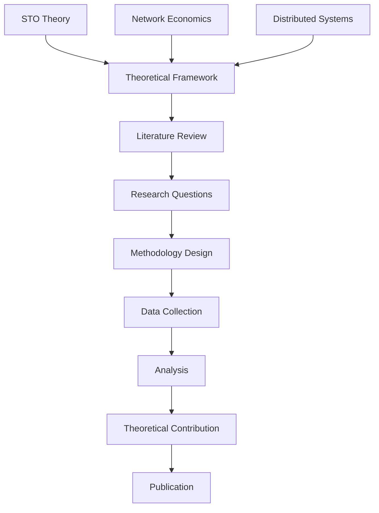

# Academic Pathway

Welcome to the Academic Pathway - your comprehensive journey from foundational STEM concepts to advanced blockchain theory and research. This pathway uses a rigorous academic approach to build understanding from first principles, progressing through data science, information communication technologies, and distributed systems to master BSV blockchain technology.

## 🎯 Pathway Overview

This academic pathway provides a structured progression from fundamental STEM concepts to advanced blockchain research. You'll build a solid theoretical foundation in data science and ICT, then apply these concepts to understand distributed systems and blockchain technology, culminating in advanced research capabilities and STO theoretical mastery.

**Key Features:**
- **STEM Foundation**: Start with fundamental concepts in data, information, and knowledge
- **Technical Progression**: Build through ICT, networking, and cryptographic foundations
- **Blockchain Application**: Apply concepts to understand distributed systems and blockchain
- **Research Integration**: Connect to deep-dive modules for comprehensive exploration
- **Academic Rigor**: Maintain scholarly standards throughout the learning journey

### Prerequisites
- **Required**: Completion of [BSV Foundations](../../01-foundations/README.md)
- **Recommended**: Graduate-level education or research experience
- **Helpful**: Background in computer science, economics, or related fields

## 📚 STEM Learning Modules

### Module 1: [Data, Information and Knowledge in the Digital Age](01-data-information-knowledge/README.md)
**Duration**: 3-4 weeks | **Level**: Foundation

Establish the fundamental concepts that underpin all digital systems:
- **Data** - Understanding raw information and its characteristics
- **Information** - How data becomes meaningful through processing
- **Knowledge** - Synthesis of information through analysis and experience
- **Digital Age** - Managing these concepts in modern digital systems

**Key Outcomes**: Master foundational concepts, understand data hierarchy, prepare for technical concepts

### Module 2: [Information Communication Technologies](02-information-communication-tech/README.md)
**Duration**: 4-5 weeks | **Level**: Intermediate

Build technical foundations in ICT and cryptographic concepts:
- **Data Fundamentals** - Binary systems, encoding, databases, and state management
- **Cryptographic Foundations** - Hashing, encryption, and digital signatures 📚 *[Hash Functions Deep Dive](../../skills-center/bsv-academy/hash-functions/README.md)*
- **Network Protocols** - Communication standards and scalability concepts
- **Blockchain Preparation** - Technical concepts that enable distributed systems

**Key Outcomes**: Understand ICT fundamentals, master cryptographic concepts, prepare for blockchain technology

### Module 3: [Distributed Systems](03-distributed-systems/README.md)
**Duration**: 4-5 weeks | **Level**: Intermediate

Explore how distributed systems work and their challenges:
- **System Architecture** - Understanding distributed system design and node coordination
- **Communication Protocols** - APIs and inter-node communication mechanisms
- **System Challenges** - CAP theorem, latency, and fault tolerance 📚 *[BSV Infrastructure Deep Dive](../../skills-center/bsv-academy/bsv-infrastructure/README.md)*
- **Blockchain Preparation** - How distributed systems enable blockchain technology

**Key Outcomes**: Understand distributed systems, analyze consensus mechanisms, prepare for blockchain concepts

### Module 4: [Blockchain Fundamentals](04-blockchain-fundamentals/README.md)
**Duration**: 4-5 weeks | **Level**: Advanced

Master the core concepts of blockchain technology:
- **Blockchain Architecture** - Transactions, blocks, and cryptographic security
- **Hash Functions** - SHA-256 and blockchain security 📚 *[Hash Functions Deep Dive](../../skills-center/bsv-academy/hash-functions/README.md)*
- **Merkle Trees** - Transaction organization and verification 📚 *[Merkle Trees Deep Dive](../../skills-center/bsv-academy/merkle-trees/README.md)*
- **Consensus and Properties** - How blockchain networks achieve agreement and immutability

**Key Outcomes**: Understand blockchain technology, analyze security models, evaluate consensus mechanisms

### Module 5: [System Overview](05-system-overview/README.md)
**Duration**: 4-5 weeks | **Level**: Advanced

Explore Bitcoin SV's specific implementation and innovations:
- **UTXO Architecture** - Transactions, spendable outputs, and payment channels
- **SPV and Verification** - Simplified payment verification and lightweight clients
- **Bitcoin Script** - Programmable money and smart contracts 📚 *[Bitcoin Script Deep Dive](../../skills-center/bsv-academy/introduction-to-bitcoin-script/README.md)*
- **Network Innovations** - Overlays, Mandala network, and IPv6 integration

**Key Outcomes**: Master BSV architecture, understand scaling solutions, analyze network innovations

### Module 6: [Blockchain in Action](06-blockchain-in-action/README.md)
**Duration**: 3-4 weeks | **Level**: Advanced

See blockchain technology applied to real-world problems:
- **Financial Applications** - Micropayments, programmable money, and tokenization
- **Identity & Security** - Digital identity and cybersecurity solutions 📚 *[Digital Signatures Deep Dive](../../skills-center/bsv-academy/digital-signatures/README.md)*
- **Data Management** - Access control and versioning systems 📚 *[Hash Functions Deep Dive](../../skills-center/bsv-academy/hash-functions/README.md)*
- **Emerging Technologies** - IoT integration and AI applications

**Key Outcomes**: Analyze real applications, understand industry impact, connect theory to practice

## 🎓 Advanced Research Track

### Module 7: [Advanced Academic STOs](05-advanced-academic-stos/table-of-contents/README.md)
**Duration**: 8-12 weeks | **Level**: Research Expert

Master the theoretical foundations and academic understanding of Spendable Transaction Outputs:

#### **Module 5.1**: [Introduction to BSV and STOs](05-advanced-academic-stos/table-of-contents/module-1-introduction-to-bsv-and-the-concept-of-spendable-transaction-outputs-stos/README.md)
- Theoretical foundations of BSV and STO concepts
- Academic framework for understanding blockchain primitives
- [Hands-on Academic Exercises](05-advanced-academic-stos/table-of-contents/module-1-introduction-to-bsv-and-the-concept-of-spendable-transaction-outputs-stos/module-1-hands-on-exercises.md)

#### **Module 5.2**: [SPV and Network Trust](05-advanced-academic-stos/table-of-contents/module-2-simplified-payment-verification-spv-and-network-trust/README.md)
- Theoretical analysis of SPV mechanisms
- Trust models in distributed systems
- [Academic Research Exercises](05-advanced-academic-stos/table-of-contents/module-2-simplified-payment-verification-spv-and-network-trust/module-2-hands-on-exercises.md)

#### **Module 5.3**: [STOs as Workflow Envelopes](05-advanced-academic-stos/table-of-contents/module-3-spendable-transaction-outputs-stos-as-workflow-envelopes/README.md)
- Theoretical framework for STO workflow modeling
- Academic analysis of digital envelope concepts
- [Research Methodology Exercises](05-advanced-academic-stos/table-of-contents/module-3-spendable-transaction-outputs-stos-as-workflow-envelopes/module-3-hands-on-exercises-building-on-the-digital-envelopes-and-ordered-mail-bag-analogy.md)

#### **Module 5.4**: [Transactions as Registered Mailboxes](05-advanced-academic-stos/table-of-contents/module-4-transactions-as-registered-mail-bags-and-stos-as-envelopes-in-digital-workflows.md)
- Academic framework for transaction modeling
- Theoretical analysis of digital workflow systems
- Research implications for distributed systems

#### **Module 5.5**: [Basic Locking and Unlocking Concepts](05-advanced-academic-stos/table-of-contents/module-5-basic-locking-and-unlocking-concepts-for-sto-security.md)
- Theoretical foundations of cryptographic security
- Academic analysis of locking mechanisms
- Security model development and validation

#### **Module 5.6**: [Practical Applications Research](05-advanced-academic-stos/table-of-contents/module-6-practical-applications-of-stos-and-payment-channels.md)
- Academic evaluation of STO applications
- Research methodologies for application analysis
- Empirical studies of payment channel systems

#### **Module 5.7**: [Overlay Services Research](05-advanced-academic-stos/table-of-contents/module-7-overlay-services-managing-stos-in-dedicated-business-environments.md)
- Theoretical framework for overlay service analysis
- Academic research on business environment applications
- Research methodologies for overlay service evaluation

#### **Module 5.8**: [Future Research Directions](05-advanced-academic-stos/table-of-contents/module-8-the-future-of-stos-in-distributed-systems-and-peer-to-peer-networks.md)
- Emerging research areas in STO technology
- Future directions for academic investigation
- Research agenda development for distributed systems

**Key Outcomes**: Master theoretical STO foundations, conduct original research, contribute to academic knowledge

## 🔬 Deep Dive Integration

This pathway integrates with comprehensive deep-dive modules from the BSV Academy Skills Center:

### Cryptographic Deep Dives
- **[Hash Functions](../../skills-center/bsv-academy/hash-functions/README.md)** - SHA-256, RIPEMD-160, and implementation details
- **[Digital Signatures](../../skills-center/bsv-academy/digital-signatures/README.md)** - ECDSA, signature verification, and Bitcoin applications
- **[Merkle Trees](../../skills-center/bsv-academy/merkle-trees/README.md)** - Tree structures, SPV proofs, and blockchain integration

### Technical Deep Dives
- **[Introduction to Bitcoin Script](../../skills-center/bsv-academy/introduction-to-bitcoin-script/README.md)** - Bitcoin's programming language
- **[BSV Infrastructure](../../skills-center/bsv-academy/bsv-infrastructure/README.md)** - Network architecture and protocol details

### Integration Approach
- **Embedded Links**: Quick references within STEM content where concepts are introduced
- **Deep Dive Sections**: Comprehensive exploration opportunities at module ends
- **Progressive Complexity**: From basic concepts to advanced implementations

## 🎓 Assessment & Certification

### Academic Assessment Format
- **Literature Review** (25%) - Comprehensive survey of existing research
- **Original Research** (35%) - Novel investigation and analysis
- **Theoretical Framework** (20%) - Development of academic models
- **Publication Quality Work** (20%) - Scholarly writing and presentation

### Research Requirements
- **Research Proposal** - Original investigation plan
- **Literature Review** - Comprehensive academic survey
- **Empirical Study** - Data collection and analysis
- **Theoretical Contribution** - Novel academic insights
- **Publication Preparation** - Scholarly article development

### Certification Levels
- **BSV Research Associate** - Modules 1-2 completion
- **BSV Academic Researcher** - Modules 1-4 completion
- **BSV Research Expert** - All modules + original research contribution

## 📊 Research Framework

### Theoretical Foundations

### Research Areas
- **Theoretical Computer Science** - Formal models and proofs
- **Network Economics** - Economic analysis and game theory
- **Distributed Systems** - Scalability and performance analysis
- **Cryptography** - Security models and protocols
- **Social Sciences** - Adoption patterns and community dynamics

### Methodological Approaches
- **Quantitative Analysis** - Statistical and mathematical modeling
- **Qualitative Research** - Case studies and ethnographic methods
- **Mixed Methods** - Combined quantitative and qualitative approaches
- **Experimental Design** - Controlled studies and hypothesis testing
- **Theoretical Modeling** - Formal frameworks and proofs

## 🔬 Research Applications

### Computer Science Research
**Areas**: Distributed systems, cryptography, network protocols
**Methods**: Formal verification, performance analysis, security proofs
**Outcomes**: Technical contributions to blockchain technology
**Advanced STOs**: Theoretical foundations and formal models

### Economics Research
**Areas**: Digital currencies, network economics, market analysis
**Methods**: Game theory, econometric analysis, behavioral studies
**Outcomes**: Economic understanding of blockchain systems
**Advanced STOs**: Economic models and incentive analysis

### Social Science Research
**Areas**: Technology adoption, community dynamics, policy analysis
**Methods**: Surveys, interviews, ethnographic studies
**Outcomes**: Social understanding of blockchain impact
**Advanced STOs**: Social implications and adoption patterns

### Interdisciplinary Research
**Areas**: Technology policy, digital governance, innovation studies
**Methods**: Mixed methods, comparative analysis, policy evaluation
**Outcomes**: Holistic understanding of blockchain technology
**Advanced STOs**: Interdisciplinary theoretical frameworks

## 📈 Research Metrics & Impact

### Academic Metrics
- **Publication Count** - Peer-reviewed articles and conference papers
- **Citation Impact** - Academic influence and recognition
- **Research Grants** - Funding acquisition for BSV research
- **Collaboration Index** - Academic partnerships and networks
- **Innovation Metrics** - Novel theoretical contributions

### Research Quality
- **Peer Review** - Academic validation and feedback
- **Methodological Rigor** - Research design and execution quality
- **Theoretical Contribution** - Novel insights and frameworks
- **Empirical Validation** - Data-driven evidence and analysis
- **Reproducibility** - Research transparency and replication

### Impact Assessment
- **Academic Impact** - Influence on scholarly discourse
- **Industry Impact** - Practical applications of research
- **Policy Impact** - Influence on regulation and governance
- **Educational Impact** - Contribution to curriculum and teaching
- **Social Impact** - Broader societal implications

## 🤝 Academic Community

### Research Collaboration
- **Academic Partnerships** - University and research institute collaboration
- **Industry Collaboration** - Applied research with BSV companies
- **International Networks** - Global research communities
- **Interdisciplinary Teams** - Cross-field research projects
- **Student Mentorship** - Graduate and undergraduate research supervision

### Publication Venues
- **Academic Journals** - Peer-reviewed scholarly publications
- **Conference Proceedings** - Research presentations and papers
- **Workshop Papers** - Work-in-progress and preliminary findings
- **Technical Reports** - Detailed research documentation
- **Book Chapters** - Comprehensive academic contributions

### Professional Development
- **Research Training** - Advanced methodology and skills development
- **Grant Writing** - Funding proposal development
- **Peer Review** - Academic service and community contribution
- **Editorial Boards** - Journal and conference leadership
- **Research Ethics** - Responsible conduct of research

## 🚀 Career Pathways

### Academic Careers
- **Research Scientist** - University or industry research positions
- **Professor** - Teaching and research in higher education
- **Postdoctoral Researcher** - Advanced research training
- **Research Director** - Leadership of research programs
- **Academic Administrator** - University leadership roles

### Industry Research
- **R&D Scientist** - Corporate research and development
- **Research Consultant** - Independent research services
- **Technology Analyst** - Market and technology analysis
- **Innovation Manager** - Corporate innovation leadership
- **Policy Advisor** - Government and regulatory advisory roles

### Entrepreneurship
- **Research-Based Startups** - Commercialization of research
- **Consulting Services** - Expert advisory and analysis
- **Educational Technology** - Academic tool and platform development
- **Think Tank Leadership** - Policy research and advocacy
- **Research Commercialization** - Technology transfer and licensing

## 📚 Resources & Support

### Research Resources
- **Academic Databases** - Scholarly literature and data sources
- **Research Tools** - Software and platforms for analysis
- **Data Sets** - BSV blockchain and network data
- **Computational Resources** - High-performance computing access
- **Library Services** - Academic research support

### Funding Opportunities
- **Research Grants** - Government and foundation funding
- **Fellowship Programs** - Individual researcher support
- **Conference Travel** - Presentation and networking support
- **Equipment Grants** - Research infrastructure funding
- **Collaboration Grants** - Multi-institutional project support

### Professional Development
- **Research Methods Training** - Advanced methodology courses
- **Writing Workshops** - Academic writing and publication skills
- **Presentation Skills** - Conference and seminar presentation
- **Grant Writing Training** - Funding proposal development
- **Research Ethics Training** - Responsible conduct of research

## 🎯 Getting Started

### Immediate Next Steps
1. **Complete Prerequisites** - Ensure foundational knowledge
2. **Identify Research Interests** - Choose specific focus areas
3. **Join Academic Community** - Connect with researchers and institutions
4. **Start Module 1** - Begin with [Research Foundations](research-foundations.md)

### Research Development Path
- **Literature Review** (4-6 weeks) - Comprehensive background research
- **Methodology Training** (3-4 weeks) - Research skills development
- **Pilot Study** (6-8 weeks) - Initial research investigation
- **Full Research Project** (12-24 weeks) - Comprehensive study
- **Advanced STO Research** (8-12 weeks) - Theoretical mastery and contribution

### Success Strategies
- **Read Extensively** - Stay current with academic literature
- **Collaborate Actively** - Engage with research community
- **Write Regularly** - Develop academic writing skills
- **Present Frequently** - Share research at conferences and seminars
- **Contribute Theoretically** - Advance academic understanding of STOs

---

**Ready to advance BSV research?** Start with [Research Foundations](research-foundations.md) and progress to cutting-edge STO theoretical contributions!

*This track provides the academic rigor and research skills needed to advance scholarly understanding of BSV technology, culminating in advanced theoretical mastery of STOs and their applications in distributed systems.*