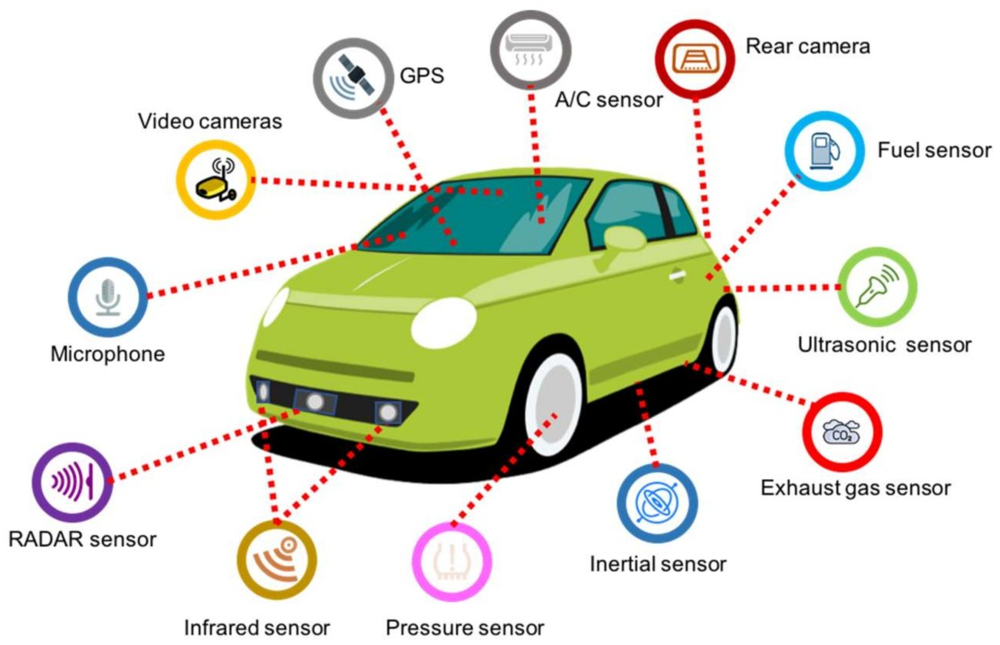

# What is data?

**Data** is composed of raw, unprocessed facts and figures that are collected from various sources. On its own, data lacks meaning until it is analyzed or used in a specific context to generate information. This analysis turns simple data into valuable insights that can guide decisions and strategies.

#### Examples of Different Types of Data

Understanding the various forms of data helps in recognizing how they can be used and analyzed. Below are some examples:

1.  **Numerical Data**

    This type of data is expressed in numbers and can be quantitatively measured. It is often used for statistical analysis and mathematical calculations.\

    | City         | Monday | Tuesday | Wednesday | Thursday | Friday | Saturday | Sunday |
    | ------------ | ------ | ------- | --------- | -------- | ------ | -------- | ------ |
    | London       | 14°C   | 15°C    | 16°C      | 14°C     | 13°C   | 14°C     | 15°C   |
    | Tokyo        | 19°C   | 20°C    | 21°C      | 18°C     | 17°C   | 19°C     | 20°C   |
    | Sydney       | 22°C   | 23°C    | 24°C      | 23°C     | 22°C   | 21°C     | 22°C   |
    | Paris        | 12°C   | 13°C    | 15°C      | 14°C     | 13°C   | 12°C     | 14°C   |
    | Dubai        | 33°C   | 34°C    | 35°C      | 36°C     | 34°C   | 33°C     | 32°C   |
    | Johannesburg | 17°C   | 18°C    | 19°C      | 18°C     | 16°C   | 15°C     | 17°C   |
    | São Paulo    | 25°C   | 26°C    | 27°C      | 25°C     | 24°C   | 23°C     | 24°C   |

2.  **Textual Data**

    Comprising words, sentences, or documents, textual data is qualitative and can be subjective. It's typically used in natural language processing and textual analysis.

    * **Customer 1 (Alice, New York)**: "I really loved the new design and the improved functionality. However, I think it could be more user-friendly for beginners."
    * **Customer 2 (Bob, London)**: "Not impressed with the battery life. Expected better performance based on the advertisements."
    * **Customer 3 (Chen, Beijing)**: "Excellent product! High quality and meets all my expectations. I will definitely recommend this to my friends."
    * **Customer 4 (Diana, Sydney)**: "The product is good, but it arrived two days late. Better shipping would make this perfect."
    * **Customer 5 (Erik, Johannesburg)**: "The customer service was helpful when I had issues with setup. Great support team!"
    * **Customer 6 (Fatima, Dubai)**: "I found the product quite pricey for the features offered. Looking for more value in future updates."
    * **Customer 7 (Giorgio, Rome)**: "Superb! A game-changer in its category. The performance is unmatched. Absolutely love it!"\

3.  **Multimedia Data**

    This data includes images, audio, and video files, providing rich content that can be used for a wide range of applications, from surveillance to entertainment.\
    \

    <figure><figcaption></figcaption></figure>
4.  **Sensor Data**

    Obtained from various sensors, this data tracks and records physical or environmental conditions, useful in fields such as meteorology, health monitoring, and industrial automation.

<figure><figcaption></figcaption></figure>

### Understanding Data Collection and Processing

To fully appreciate how raw data becomes meaningful information, it's crucial to understand the methods of data collection and the initial steps of data processing. Data collection can vary significantly based on the type of data and the intended use, ranging from automated sensor readings to manually entering survey responses.

<figure><figcaption>
<a href="https://www.iqsdirectory.com/articles/data-acquisition-system.html">https://www.iqsdirectory.com/articles/data-acquisition-system.html</a>
</figcaption></figure>

By familiarizing yourself with these concepts, you'll gain a better understanding of how data underpins various technologies and systems in our digital world.

\
