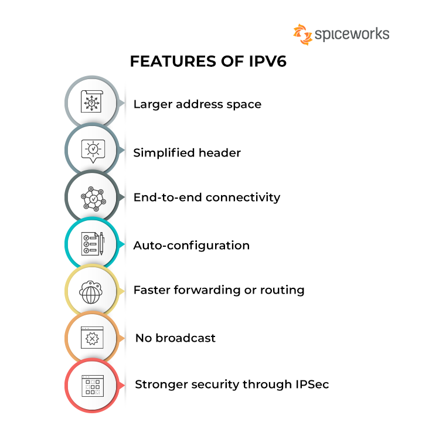

# IPv6



IPv6 stands as a critical advancement in internet protocol technology, particularly when integrated with blockchain innovations like Bitcoin keys. This fusion not only enhances privacy and security but also significantly broadens the utility and functionality of IoT devices across expansive networks.

## **IPv6 Overview**

<figure><figcaption>
<a href="https://www.spiceworks.com/tech/networking/articles/what-is-ipv6/">https://www.spiceworks.com/tech/networking/articles/what-is-ipv6/</a>
</figcaption></figure>

* **Vast Address Space:** IPv6 offers a nearly limitless number of unique IP addresses, addressing the shortage experienced with IPv4 and enabling every device, especially IoT devices, to have its own unique address without the need for network address translation (NAT).
* **Improved Privacy and Security:** IPv6 supports more robust encryption and privacy methods directly in the protocol, making it inherently more secure against certain types of attacks that are common with IPv4.

## **Integrating Bitcoin Keys with IPv6:**

* **Address Generation:** Utilizing Bitcoin keys to generate IPv6 addresses provides a secure method of address allocation that is decentralized and resistant to fraud. This method involves registering the keys along with a timestamp, leveraging cryptographic techniques similar to CGA++ but replacing the client-side Proof of Work (PoW) with transaction IDs (TXIDs) from blockchain transactions.
* **Cryptographic Security:** The integration allows for the use of elliptic curve Diffie-Hellman for key exchange, enhancing the security of communications between devices. This setup ensures that even if an IPv6 address is intercepted, the underlying communication remains secure due to the cryptographic strength of the keys.

## Advanced Networking Capabilities with IPv6



**IoT and Fog Networks:**

* **Definition of Fog Networks:** Fog networking, or fog computing, refers to a decentralized computing infrastructure in which data, compute, storage, and applications are located somewhere between the data source and the cloud. This concept is particularly useful for IoT environments where data from numerous devices needs to be processed locally rather than being sent to a distant cloud for analysis.
* **Application in IoT:** With IPv6, each IoT device can operate more autonomously with a unique global address, facilitating direct communication and control. Combined with SPV proofs, this setup enables low-powered edge devices in fog networks to efficiently verify transactions and interact with other devices without relying on centralized resources.

**Multicast Capabilities and Content Delivery**

<figure><figcaption>
<a href="https://link.springer.com/article/10.1007/s11227-020-03396-7">https://link.springer.com/article/10.1007/s11227-020-03396-7</a>
</figcaption></figure>

* **Enhanced Multicast Support:** IPv6 inherently supports multicast, a method for sending a single packet to multiple destinations in a single send operation. This feature is highly efficient for streaming media, broadcasting updates, and distributing large data blocks across networks.
* **Blockchain and Large-Scale Data Distribution:** Leveraging IPv6’s multicast capabilities, blockchain networks can efficiently distribute terabyte-sized blocks, essential for applications involving large-scale data like video streaming or complex scientific datasets.
* **Novel P2P Pub/Sub Models:** The combination of multicast with blockchain can foster new peer-to-peer (P2P) publish-subscribe models, facilitating open social protocols and decentralized content delivery systems. These systems can operate without traditional centralized control, enhancing freedom and scalability in content distribution.

#### Conclusion

The integration of IPv6 with blockchain technology, particularly through the innovative use of Bitcoin keys for IP address generation, presents transformative possibilities for the future of internet protocols and networked systems. This approach not only improves the security and efficiency of communications but also opens up new paradigms for device interconnectivity, content delivery, and decentralized application development. As more IoT devices come online and the demand for secure, scalable network interactions increases, IPv6’s expansive address space and robust multicast features combined with blockchain’s security and verifiability are set to play a pivotal role in shaping the next generation of digital infrastructure.
