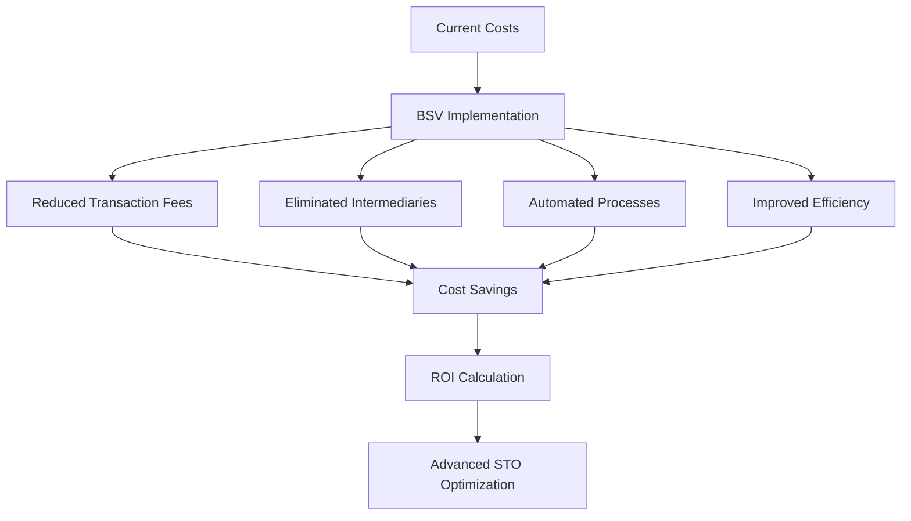

# Business Strategy Track

Welcome to the Business Strategy Track - your comprehensive pathway to understanding and implementing BSV solutions in commercial environments. This track is designed for business leaders, decision makers, and strategic planners who want to leverage BSV for competitive advantage, culminating in advanced STO business applications.

## 🎯 Track Overview

This business-focused track provides strategic insights, practical frameworks, and implementation guidance for leveraging BSV in commercial settings. You'll learn to identify opportunities, calculate ROI, develop successful BSV adoption strategies, and master advanced STO business applications.

### Prerequisites
- **Required**: Completion of [BSV Foundations](../../01-foundations/README.md)
- **Recommended**: Business or management experience
- **Helpful**: Understanding of digital transformation concepts

## 💼 Learning Modules

### Module 1: [Value Propositions](value-propositions/README.md)
**Duration**: 2-3 weeks | **Level**: Business Professional

Discover the core business value that BSV delivers:
- **Cost Reduction** - Operational efficiency and expense optimization
- **New Revenue Streams** - Innovative business models and monetization
- **Operational Efficiency** - Process automation and streamlining
- **Competitive Advantage** - Market differentiation and positioning

**Key Outcomes**: Identify BSV opportunities, quantify business value, develop value propositions

### Module 2: [Industry Use Cases](use-cases.md)
**Duration**: 2-3 weeks | **Level**: Sector-Specific

Explore BSV applications across industries:
- **Financial Services** - Payments, settlements, and compliance
- **Supply Chain** - Traceability, verification, and logistics
- **Healthcare** - Data integrity, privacy, and interoperability
- **Media & Entertainment** - Content monetization and rights management
- **Government** - Identity, records, and public services

**Key Outcomes**: Understand sector applications, identify implementation opportunities

### Module 3: [ROI Analysis](roi-analysis.md)
**Duration**: 2-3 weeks | **Level**: Financial Analysis

Master the financial modeling of BSV implementations:
- **Cost-Benefit Analysis** - Comprehensive financial evaluation
- **Risk Assessment** - Identifying and mitigating implementation risks
- **Business Case Development** - Compelling investment proposals
- **Performance Metrics** - Measuring success and optimization

**Key Outcomes**: Build financial models, create business cases, measure ROI

### Module 4: [Implementation Strategy](implementation-strategy.md)
**Duration**: 3-4 weeks | **Level**: Strategic Planning

Develop comprehensive deployment strategies:
- **Stakeholder Alignment** - Building organizational consensus
- **Phased Rollout** - Risk-managed implementation approaches
- **Change Management** - Organizational transformation strategies
- **Success Metrics** - KPIs and performance measurement

**Key Outcomes**: Create implementation roadmaps, manage organizational change

### Module 5: [Advanced Business STOs](05-advanced-business-stos/table-of-contents/README.md)
**Duration**: 6-8 weeks | **Level**: Business Expert

Master advanced business applications of Spendable Transaction Outputs:

#### **Module 5.1**: [BSV and STOs for Business](05-advanced-business-stos/table-of-contents/module-1-introduction-to-bitcoin-sv-spendable-transaction-outputs-stos-and-core-principles.md)
- Strategic understanding of BSV and STO business value
- Core principles for business implementation
- Enterprise-grade blockchain infrastructure

#### **Module 5.2**: [SPV and Business Trust](05-advanced-business-stos/table-of-contents/module-2-simplified-payment-verification-spv-and-trust-in-business-transactions.md)
- Building trust in business transactions with SPV
- Risk management and verification strategies
- Business-grade security implementations

#### **Module 5.3**: [STOs in Sectorial Contexts](05-advanced-business-stos/table-of-contents/module-3-stos-as-digital-workflow-containers-in-sectorial-contexts.md)
- Industry-specific STO applications
- Sectorial workflow optimization
- Regulatory compliance and industry standards

#### **Module 5.4**: [Business Workflow Management](05-advanced-business-stos/table-of-contents/module-4-transactions-as-registered-mailboxes-a-business-lens-on-digital-workflows.md)
- STOs as business workflow containers
- Digital process automation
- Business process reengineering with STOs

#### **Module 5.5**: [P2P Business Models](05-advanced-business-stos/table-of-contents/module-5-unlocking-the-potential-of-stos-in-peer-to-peer-business-models.md)
- Peer-to-peer business model innovation
- Disintermediation strategies
- Network effect optimization

#### **Module 5.6**: [Micropayments and Monetization](05-advanced-business-stos/table-of-contents/module-6-micropayments-and-digital-service-monetization.md)
- Advanced micropayment business models
- Digital service monetization strategies
- Revenue optimization techniques

#### **Module 5.7**: [Enterprise Overlay Services](05-advanced-business-stos/table-of-contents/module-7-overlay-services-tailoring-secure-and-scalable-bsv-payment-solutions-for-enterprises.md)
- Enterprise-grade overlay service implementation
- Scalable payment solution architecture
- Business-focused overlay service design

**Key Outcomes**: Master business applications of STOs, develop innovative business models, implement enterprise-grade solutions

## 🎓 Assessment & Certification

### Business Assessment Format
- **Strategic Analysis** (30%) - Case study evaluation and solution design
- **Financial Modeling** (25%) - ROI calculations and business case development
- **Implementation Planning** (25%) - Roadmap creation and risk assessment
- **Advanced STO Applications** (20%) - Business innovation with STOs

### Certification Levels
- **BSV Business Associate** - Modules 1-2 completion
- **BSV Business Strategist** - Modules 1-4 completion
- **BSV Business Expert** - All modules + advanced STO business mastery

## 📊 Business Value Framework

### Cost Reduction Opportunities

### Revenue Generation Models
- **Micropayments** - New monetization opportunities with STOs
- **Data Monetization** - Secure data sharing and sales
- **Platform Economics** - Multi-sided market creation with STOs
- **Service Innovation** - New business model development
- **P2P Business Models** - Disintermediation and network effects

### Operational Efficiency Gains
- **Process Automation** - STO-based workflow automation
- **Real-time Settlement** - Improved cash flow with STOs
- **Transparent Auditing** - Reduced compliance costs
- **Streamlined Reporting** - Automated data collection
- **Digital Workflow Containers** - Advanced business process management

## 🏢 Industry Applications

### Financial Services
**Use Cases**: Cross-border payments, trade finance, regulatory reporting
**Value Proposition**: Reduced settlement times, lower costs, improved compliance
**Implementation**: Pilot programs, regulatory engagement, partner integration
**Advanced STOs**: Complex financial instruments and automated compliance

### Supply Chain Management
**Use Cases**: Product traceability, authenticity verification, logistics optimization
**Value Proposition**: Reduced fraud, improved transparency, operational efficiency
**Implementation**: Supplier onboarding, data standardization, system integration
**Advanced STOs**: End-to-end supply chain automation and verification

### Healthcare
**Use Cases**: Patient data management, drug traceability, clinical trials
**Value Proposition**: Data integrity, privacy protection, interoperability
**Implementation**: Compliance frameworks, privacy protection, stakeholder alignment
**Advanced STOs**: Secure health data workflows and automated compliance

### Media & Entertainment
**Use Cases**: Content licensing, royalty distribution, fan engagement
**Value Proposition**: Transparent payments, reduced piracy, new revenue models
**Implementation**: Creator onboarding, platform integration, audience development
**Advanced STOs**: Complex rights management and automated royalty distribution

## 📈 Success Metrics & KPIs

### Financial Metrics
- **Cost Reduction** - Percentage decrease in operational expenses
- **Revenue Growth** - New income streams and market expansion
- **ROI Achievement** - Return on BSV implementation investment
- **Payback Period** - Time to recover implementation costs
- **STO Efficiency** - Advanced transaction cost optimization

### Operational Metrics
- **Process Efficiency** - Time and resource optimization with STOs
- **Error Reduction** - Decreased manual errors and rework
- **Compliance Improvement** - Enhanced regulatory adherence
- **Customer Satisfaction** - Improved user experience and engagement
- **Workflow Automation** - Advanced business process optimization

### Strategic Metrics
- **Market Position** - Competitive advantage and differentiation
- **Innovation Index** - New product and service development
- **Partnership Growth** - Ecosystem expansion and collaboration
- **Brand Value** - Reputation and market perception enhancement
- **Business Model Innovation** - Advanced STO-based business models

## 🤝 Stakeholder Management

### Internal Stakeholders
- **Executive Leadership** - Strategic vision and resource allocation
- **IT Department** - Technical implementation and integration
- **Finance Team** - Budget management and ROI tracking
- **Operations** - Process integration and workflow optimization
- **Innovation Teams** - Advanced STO business model development

### External Stakeholders
- **Customers** - Value delivery and experience enhancement
- **Partners** - Ecosystem collaboration and integration
- **Regulators** - Compliance and regulatory alignment
- **Investors** - Value creation and return demonstration
- **Industry Networks** - Advanced STO business model collaboration

## 🚀 Implementation Roadmap

### Phase 1: Discovery & Planning (4-6 weeks)
- **Opportunity Assessment** - Identify BSV and STO use cases
- **Stakeholder Alignment** - Build organizational consensus
- **Business Case Development** - Create investment proposal
- **Risk Assessment** - Identify and mitigate potential issues

### Phase 2: Pilot Implementation (8-12 weeks)
- **Pilot Project Selection** - Choose low-risk, high-value opportunity
- **Technical Implementation** - Deploy BSV solution
- **Performance Monitoring** - Track metrics and outcomes
- **Stakeholder Feedback** - Gather input and iterate

### Phase 3: Scale & Optimize (12-24 weeks)
- **Rollout Planning** - Expand successful pilots
- **Process Optimization** - Refine and improve operations
- **Performance Measurement** - Validate business case
- **Continuous Improvement** - Ongoing optimization
- **Advanced STO Integration** - Implement sophisticated business models

### Phase 4: Strategic Integration (Ongoing)
- **Ecosystem Development** - Build partner networks
- **Innovation Pipeline** - Develop new use cases
- **Market Leadership** - Establish competitive advantage
- **Knowledge Sharing** - Contribute to BSV community
- **Advanced Business Models** - Pioneer STO-based innovations

## 📚 Resources & Tools

### Business Analysis Tools
- **ROI Calculators** - Financial modeling templates
- **Risk Assessment Frameworks** - Systematic risk evaluation
- **Business Case Templates** - Structured proposal formats
- **Implementation Checklists** - Step-by-step guidance
- **STO Business Model Canvas** - Advanced business model design

### Industry Research
- **Market Reports** - BSV adoption trends and forecasts
- **Case Studies** - Real-world implementation examples
- **Best Practices** - Proven approaches and methodologies
- **Competitive Analysis** - Market positioning and differentiation
- **Advanced STO Applications** - Cutting-edge business implementations

### Professional Development
- **Executive Briefings** - Leadership education and awareness
- **Workshop Materials** - Team training and alignment
- **Presentation Templates** - Stakeholder communication tools
- **Certification Programs** - Professional credential development
- **Advanced STO Training** - Expert-level business applications

## 🎯 Career Outcomes

### Job Roles
- **BSV Business Strategist** - Strategic planning and implementation
- **Digital Transformation Manager** - Organizational change leadership
- **Business Development Manager** - Partnership and ecosystem development
- **Product Manager** - BSV-enabled product development
- **STO Business Architect** - Advanced business model design

### Professional Recognition
- **Industry Speaking** - Conference presentations and thought leadership
- **Advisory Positions** - Board and committee participation
- **Consulting Opportunities** - Expert advisory services
- **Executive Roles** - Senior leadership positions
- **Innovation Leadership** - Advanced STO business model pioneering

## 🤝 Community & Networking

### Business Community
- **BSV Business Leaders** - Executive networking and collaboration
- **Industry Forums** - Sector-specific discussion groups
- **Regional Chapters** - Local business community engagement
- **Mentorship Programs** - Peer guidance and support
- **STO Innovation Groups** - Advanced business model development

### Professional Development
- **Executive Education** - Advanced business strategy programs
- **Industry Conferences** - Networking and knowledge sharing
- **Research Collaboration** - Academic and industry partnerships
- **Thought Leadership** - Content creation and publication
- **Advanced STO Research** - Cutting-edge business model innovation

---

**Ready to transform your business with BSV?** Start with [Value Propositions](value-propositions/README.md) and progress to advanced STO business mastery!

*This track provides the business acumen and strategic frameworks needed to successfully implement BSV solutions in commercial environments, culminating in advanced STO business applications that drive innovation and competitive advantage.*