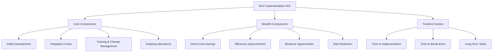

# Case Studies

This section presents real-world examples of successful BSV implementations across various industries. Each case study provides insights into the business challenges, implementation approach, and measurable outcomes to help you understand the practical applications and benefits of BSV blockchain technology.

## 🎯 What You'll Learn

By exploring these case studies, you'll gain:
- Concrete examples of BSV implementations in different sectors
- Insights into common challenges and solutions
- ROI analysis and business outcomes
- Key success factors and best practices
- Lessons learned from real-world deployments

## 🏦 Financial Services

### Cross-Border Payment Network

**Company:** Global Payments Inc.  
**Industry:** Financial Services  
**Location:** Global operations

#### Business Challenge
Global Payments faced significant challenges with their traditional cross-border payment system:
- High transaction fees (averaging 3-5% per transaction)
- Long settlement times (2-5 business days)
- Limited transparency in transaction status
- Complex compliance requirements across jurisdictions

#### BSV Solution
The company implemented a BSV-based cross-border payment network with:
- Direct peer-to-peer transaction capability
- Real-time settlement using BSV's fast block times
- Immutable transaction records for compliance
- Smart contract automation for currency conversion
- Integration with existing banking systems

#### Implementation Approach
1. **Phase 1:** Proof of concept between two regional offices (3 months)
2. **Phase 2:** Limited rollout to 5 key corridors (6 months)
3. **Phase 3:** Full deployment across all regions (12 months)

#### Results
After 18 months of operation:
- **94% reduction** in transaction fees (from 3-5% to 0.1-0.3%)
- **Settlement time reduced** from days to minutes
- **99.99% uptime** with no settlement failures
- **35% increase** in cross-border transaction volume
- **$4.2M annual savings** in operational costs
- **ROI achieved** within 9 months of full deployment

#### Key Success Factors
- Strong executive sponsorship
- Phased implementation approach
- Comprehensive compliance framework
- Effective integration with legacy systems
- Thorough staff training program

## 🏭 Supply Chain & Manufacturing

### Pharmaceutical Supply Chain Traceability

**Company:** MediTrack Pharmaceuticals  
**Industry:** Pharmaceutical Manufacturing  
**Location:** North America & Europe

#### Business Challenge
MediTrack faced significant challenges in their pharmaceutical supply chain:
- Counterfeit products entering the supply chain
- Difficulty tracking product provenance
- Complex compliance with regulatory requirements
- Manual reconciliation processes across partners
- Limited visibility into inventory and shipments

#### BSV Solution
The company implemented a BSV-based supply chain tracking system:
- Immutable product provenance records
- Real-time tracking of pharmaceutical products
- Temperature and handling condition monitoring
- Automated compliance documentation
- Integration with IoT sensors and existing ERP systems

#### Implementation Approach
1. **Phase 1:** Pilot with single product line (4 months)
2. **Phase 2:** Expansion to high-value products (6 months)
3. **Phase 3:** Full implementation across all product lines (14 months)

#### Results
After 24 months of operation:
- **100% traceability** for all products in the supply chain
- **83% reduction** in counterfeit incidents
- **62% decrease** in compliance documentation time
- **47% improvement** in inventory accuracy
- **$3.8M annual savings** in operational costs
- **ROI achieved** within 16 months

#### Key Success Factors
- Collaborative approach with supply chain partners
- Comprehensive data standards
- Effective change management
- Phased implementation strategy
- Integration with existing systems

## 🏥 Healthcare

### Patient Consent Management System

**Company:** HealthFirst Network  
**Industry:** Healthcare Provider Network  
**Location:** United States

#### Business Challenge
HealthFirst Network struggled with managing patient consent across their network:
- Fragmented consent records across different systems
- Difficulty verifying consent status in real-time
- High administrative burden for consent management
- Compliance risks with changing regulations
- Limited patient control over their consent data

#### BSV Solution
The organization implemented a BSV-based consent management system:
- Immutable consent records on the blockchain
- Patient-controlled consent management
- Real-time verification of consent status
- Automated compliance with regulatory requirements
- Integration with electronic health record systems

#### Implementation Approach
1. **Phase 1:** Pilot in single department (3 months)
2. **Phase 2:** Expansion to three hospitals (6 months)
3. **Phase 3:** Network-wide implementation (12 months)

#### Results
After 18 months of operation:
- **99.9% accuracy** in consent verification
- **78% reduction** in consent-related administrative time
- **94% patient satisfaction** with consent management
- **Zero consent-related compliance incidents**
- **$2.1M annual savings** in administrative costs
- **ROI achieved** within 14 months

#### Key Success Factors
- Patient-centered design approach
- Strong focus on user experience
- Comprehensive staff training
- Effective integration with existing systems
- Clear governance framework

## 🎮 Media & Gaming

### Digital Content Monetization Platform

**Company:** CreatorHub  
**Industry:** Digital Media  
**Location:** Global

#### Business Challenge
CreatorHub faced challenges monetizing digital content:
- High platform fees from traditional distribution channels
- Payment delays for content creators
- Limited monetization options for micro-content
- Piracy and unauthorized content sharing
- Complex rights management across jurisdictions

#### BSV Solution
The company built a BSV-based content monetization platform:
- Micropayment capabilities for content access
- Direct creator-to-consumer payment channel
- Immutable rights management records
- Automated royalty distribution
- Pay-per-use and subscription models

#### Implementation Approach
1. **Phase 1:** Beta platform with select creators (3 months)
2. **Phase 2:** Limited public release (4 months)
3. **Phase 3:** Full platform launch (6 months)

#### Results
After 12 months of operation:
- **Creator revenue increased by 47%** compared to traditional platforms
- **Payment settlement reduced** from 30-60 days to same-day
- **2.3M micropayments** processed monthly
- **68% reduction** in unauthorized content sharing
- **$1.2M monthly transaction volume**
- **ROI achieved** within 8 months

#### Key Success Factors
- Creator-centric design approach
- Seamless user experience
- Transparent fee structure
- Effective marketing to both creators and consumers
- Continuous platform improvement based on feedback

## 🏛️ Government & Public Sector

### Land Registry Modernization

**Company:** National Land Authority  
**Industry:** Government  
**Location:** Southeast Asia

#### Business Challenge
The National Land Authority faced significant challenges with their land registry system:
- Paper-based records vulnerable to loss and damage
- Fraud and unauthorized record modifications
- Long processing times for property transfers
- Limited transparency in land ownership
- High administrative costs for record management

#### BSV Solution
The authority implemented a BSV-based land registry system:
- Immutable digital records of land ownership
- Transparent property transfer process
- Automated verification of ownership claims
- Public access to non-sensitive registry data
- Integration with existing government systems

#### Implementation Approach
1. **Phase 1:** Pilot in single district (6 months)
2. **Phase 2:** Regional implementation (12 months)
3. **Phase 3:** National rollout (24 months)

#### Results
After 36 months of operation:
- **100% digitization** of land records
- **Property transfer time reduced** from weeks to days
- **94% reduction** in land ownership disputes
- **78% decrease** in administrative costs
- **99.9% uptime** for the registry system
- **ROI achieved** within 30 months

#### Key Success Factors
- Strong political support
- Comprehensive legal framework
- Public education campaign
- Phased implementation approach
- Effective training for government staff

## 🛒 Retail & eCommerce

### Loyalty Program Transformation

**Company:** RetailGiant  
**Industry:** Multi-channel Retail  
**Location:** North America

#### Business Challenge
RetailGiant struggled with their traditional loyalty program:
- Low customer engagement and redemption rates
- High administrative costs for program management
- Limited personalization capabilities
- Difficulty tracking program ROI
- Integration challenges across channels

#### BSV Solution
The retailer implemented a BSV-based loyalty program:
- Tokenized loyalty points with real-time issuance and redemption
- Peer-to-peer point transfers between customers
- Smart contract automation for personalized offers
- Immutable transaction records for program analytics
- Seamless integration across online and offline channels

#### Implementation Approach
1. **Phase 1:** Pilot program with select customers (3 months)
2. **Phase 2:** Limited rollout to premium customers (4 months)
3. **Phase 3:** Full program launch to all customers (6 months)

#### Results
After 12 months of operation:
- **43% increase** in program enrollment
- **67% increase** in point redemption rates
- **38% growth** in repeat purchase frequency
- **22% increase** in average transaction value
- **$4.7M additional revenue** attributed to the program
- **ROI achieved** within 10 months

#### Key Success Factors
- Customer-centric design approach
- Seamless omnichannel integration
- Effective marketing and communication
- Employee training and engagement
- Continuous program optimization

## 📊 ROI Analysis Framework

Based on these case studies, we've developed an ROI analysis framework for BSV implementations:

### Typical Cost Components
- **Initial Development**: $150K-$500K depending on complexity
- **Integration**: $50K-$200K depending on existing systems
- **Training & Change Management**: $30K-$100K depending on organization size
- **Ongoing Operations**: $50K-$200K annually

### Typical Benefit Components
- **Direct Cost Savings**: 30-80% reduction in transaction/processing costs
- **Efficiency Improvements**: 40-70% reduction in process time
- **Revenue Opportunities**: 20-50% increase in related revenue streams
- **Risk Reduction**: 50-90% reduction in fraud/error-related costs

### Timeline Considerations
- **Pilot Implementation**: Typically 3-6 months
- **Full Implementation**: Typically 12-24 months
- **Break-Even Point**: Typically 9-18 months
- **Long-Term Value**: Continues to increase as network effects grow

## 🔑 Key Success Factors

Across all case studies, these common success factors emerged:

### 1. Strategic Alignment
Successful implementations aligned blockchain initiatives with core business objectives and had clear executive sponsorship.

### 2. Phased Approach
Organizations that used a phased implementation approach—starting with a pilot and gradually expanding—achieved better results with lower risk.

### 3. Stakeholder Engagement
Comprehensive stakeholder engagement, including users, partners, and customers, was critical for adoption and success.

### 4. Integration Strategy
Effective integration with existing systems and processes was essential for minimizing disruption and maximizing value.

### 5. Governance Framework
Clear governance structures for decision-making, data standards, and ongoing management ensured sustainable operations.

### 6. Measurement & Optimization
Successful implementations included robust metrics and continuous improvement processes to optimize value over time.

## 📋 Implementation Checklist

Based on these case studies, we recommend this implementation checklist:

- [ ] **Define clear business objectives** for your BSV implementation
- [ ] **Secure executive sponsorship** and necessary resources
- [ ] **Start with a well-defined pilot project** with measurable outcomes
- [ ] **Select experienced technology partners** with relevant expertise
- [ ] **Develop a comprehensive integration strategy** for existing systems
- [ ] **Create a detailed change management plan** for all stakeholders
- [ ] **Establish clear metrics** to measure success and ROI
- [ ] **Implement a phased rollout approach** with feedback loops
- [ ] **Document lessons learned** and continuously improve
- [ ] **Plan for scale** from the beginning of the project

## 🔗 Next Steps

After reviewing these case studies:

1. Assess which examples most closely align with your business needs
2. Review the [Implementation Guide](implementation-guide.md) for practical next steps
3. Explore [industry-specific value propositions](value-propositions/README.md)
4. Connect with [BSV technology partners](../../03-resources/community.md) with relevant experience

---

**Note:** These case studies are based on real-world implementations, but company names and specific details may have been modified to protect confidential information. Contact the [BSV Association](https://bitcoinassociation.net/) for introductions to organizations willing to share their implementation experiences.