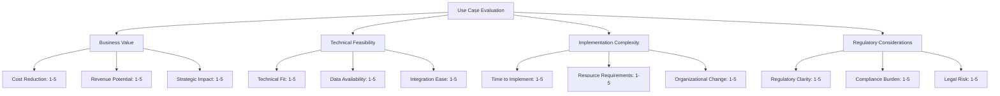
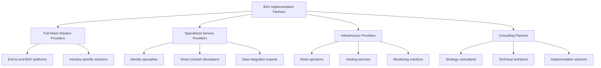

# Implementation Guide

This guide provides a practical framework for implementing BSV blockchain solutions in your organization. It covers assessment, planning, pilot projects, technology partner selection, and change management considerations.

## 🎯 What You'll Learn

By the end of this guide, you'll have:
- A framework for assessing BSV's fit for your organization
- Tools for identifying and planning pilot projects
- Criteria for selecting technology partners
- Change management strategies for blockchain adoption
- A roadmap for full-scale implementation

## 🔍 Assessment Framework

### Organizational Readiness Assessment

Before implementing BSV, assess your organization's readiness across these key dimensions:

| Dimension | Key Questions | Success Indicators |
|-----------|---------------|-------------------|
| **Strategic Alignment** | How does blockchain align with business goals? | Clear connection to strategic objectives |
| **Technical Capability** | Does your team have the necessary skills? | Existing technical expertise or learning plan |
| **Data Readiness** | Is your data structured for blockchain use? | Clean, standardized data structures |
| **Process Maturity** | Are processes documented and stable? | Well-defined processes with clear ownership |
| **Regulatory Compliance** | What regulations affect your blockchain use? | Compliance strategy and legal review |
| **Budget & Resources** | What resources can you commit? | Dedicated budget and team allocation |

### Use Case Evaluation Matrix

Evaluate potential use cases with this scoring matrix:



**Scoring Guide:**
- **Business Value**: Higher score = Greater value
- **Technical Feasibility**: Higher score = More feasible
- **Implementation Complexity**: Higher score = Less complex
- **Regulatory Considerations**: Higher score = Fewer concerns

### ROI Calculation Framework

Calculate potential ROI using this framework:

1. **Identify Cost Components**:
   - Implementation costs (development, integration, testing)
   - Operational costs (infrastructure, maintenance, support)
   - Training and change management costs

2. **Quantify Benefits**:
   - Direct cost savings (reduced transaction fees, eliminated intermediaries)
   - Efficiency gains (faster processes, reduced manual work)
   - Revenue opportunities (new business models, expanded markets)
   - Risk reduction (fraud prevention, compliance automation)

3. **Calculate ROI**:
   ```
   ROI = (Total Benefits - Total Costs) / Total Costs × 100%
   ```

4. **Consider Time Factors**:
   - Time to implementation
   - Time to break-even
   - 3-year and 5-year projections

## 🚀 Pilot Project Identification

### Pilot Selection Criteria

The ideal pilot project should:

1. **Deliver tangible value** within 3-6 months
2. **Involve a contained process** with clear boundaries
3. **Affect a manageable number of stakeholders**
4. **Address a real business pain point**
5. **Have executive sponsorship**
6. **Provide measurable outcomes**

### Pilot Project Canvas

Use this canvas to define your pilot project:

```
┌─────────────────────────────────────────────────────────────┐
│ PILOT PROJECT CANVAS                                        │
├─────────────────┬───────────────────┬─────────────────────┐
│ BUSINESS PROBLEM│ PROPOSED SOLUTION │ SUCCESS METRICS     │
│                 │                   │                     │
│                 │                   │                     │
├─────────────────┼───────────────────┼─────────────────────┤
│ STAKEHOLDERS    │ TECHNICAL SCOPE   │ TIMELINE            │
│                 │                   │                     │
│                 │                   │                     │
├─────────────────┼───────────────────┼─────────────────────┤
│ RESOURCES       │ RISKS & MITIGATIONS│ NEXT STEPS         │
│                 │                   │                     │
│                 │                   │                     │
└─────────────────┴───────────────────┴─────────────────────┘
```

### Sample Pilot Projects by Industry

| Industry | Pilot Project Idea | Typical Timeline | Key Success Metrics |
|----------|-------------------|-----------------|---------------------|
| **Financial Services** | Cross-border payment system | 3-4 months | Transaction cost reduction, settlement time |
| **Supply Chain** | Product provenance tracking | 4-6 months | Traceability completeness, verification time |
| **Healthcare** | Patient consent management | 3-5 months | Consent verification speed, compliance rate |
| **Media** | Micropayment content access | 2-3 months | Revenue per content piece, user adoption |
| **Retail** | Loyalty program on blockchain | 3-4 months | Program enrollment, transaction volume |
| **Government** | Document verification system | 5-7 months | Verification speed, fraud reduction |

## 🤝 Technology Partner Selection

### Partner Evaluation Framework

Evaluate potential BSV technology partners using these criteria:

1. **Technical Expertise**
   - BSV-specific experience
   - Relevant industry experience
   - Technical team qualifications
   - Development methodology

2. **Solution Capabilities**
   - Feature completeness
   - Scalability
   - Security practices
   - Integration capabilities
   - Compliance features

3. **Business Viability**
   - Company stability
   - Funding status
   - Client references
   - Growth trajectory
   - Support capabilities

4. **Partnership Approach**
   - Collaboration model
   - Knowledge transfer
   - Pricing structure
   - Intellectual property terms
   - Long-term roadmap alignment

### BSV Ecosystem Partners

The BSV ecosystem includes various types of partners:



### Partner Selection Process

Follow this process to select the right technology partner:

1. **Requirements Definition**
   - Document technical requirements
   - Define service level expectations
   - Clarify budget constraints
   - Establish timeline needs

2. **Market Research**
   - Identify potential partners
   - Review case studies and references
   - Evaluate technical capabilities
   - Assess industry experience

3. **Request for Proposal (RFP)**
   - Develop detailed RFP document
   - Distribute to qualified candidates
   - Provide clear evaluation criteria
   - Set response timeline

4. **Evaluation and Selection**
   - Score proposals against criteria
   - Conduct technical interviews
   - Request proof-of-concept demonstrations
   - Check client references

5. **Contracting and Onboarding**
   - Negotiate terms and pricing
   - Define success metrics
   - Establish governance structure
   - Create communication plan

## 🔄 Change Management Considerations

### Stakeholder Impact Analysis

Identify how blockchain implementation affects different stakeholders:

| Stakeholder Group | Impact Level | Key Concerns | Engagement Strategy |
|-------------------|-------------|--------------|---------------------|
| **Executive Leadership** | High | ROI, strategic alignment | Executive briefings, business case review |
| **IT Department** | High | Integration, security, maintenance | Technical workshops, training programs |
| **Operations Team** | High | Process changes, new workflows | Process mapping, hands-on training |
| **Finance Department** | Medium | Cost tracking, compliance | Financial models, compliance documentation |
| **End Users** | Medium | Usability, learning curve | User testing, intuitive interfaces, training |
| **Customers/Partners** | Low-Medium | Value proposition, data privacy | Clear communication, phased rollout |
| **Compliance/Legal** | Medium | Regulatory requirements, risk | Regulatory analysis, policy development |

### Change Readiness Assessment

Evaluate your organization's readiness for blockchain-driven change:

```
┌─────────────────────────────────────────────────────────────┐
│ CHANGE READINESS ASSESSMENT                                 │
├───────────────────────────┬─────────────────────────────────┤
│ DIMENSION                 │ READINESS LEVEL (1-5)           │
├───────────────────────────┼─────────────────────────────────┤
│ Leadership Support        │                                 │
├───────────────────────────┼─────────────────────────────────┤
│ Clear Vision & Strategy   │                                 │
├───────────────────────────┼─────────────────────────────────┤
│ Resource Availability     │                                 │
├───────────────────────────┼─────────────────────────────────┤
│ Technical Capability      │                                 │
├───────────────────────────┼─────────────────────────────────┤
│ Process Documentation     │                                 │
├───────────────────────────┼─────────────────────────────────┤
│ Change History            │                                 │
├───────────────────────────┼─────────────────────────────────┤
│ Organizational Culture    │                                 │
├───────────────────────────┼─────────────────────────────────┤
│ Training Infrastructure   │                                 │
└───────────────────────────┴─────────────────────────────────┘
```

### Change Management Strategy

Implement these change management strategies for successful adoption:

1. **Executive Sponsorship**
   - Identify and engage executive champions
   - Secure visible leadership support
   - Align blockchain initiatives with strategic priorities

2. **Communication Plan**
   - Develop targeted messaging for each stakeholder group
   - Create a communication timeline
   - Use multiple channels (presentations, workshops, documentation)
   - Address concerns proactively

3. **Training Program**
   - Assess skill gaps and training needs
   - Develop role-specific training materials
   - Provide hands-on learning opportunities
   - Create a knowledge repository

4. **Process Redesign**
   - Document current processes
   - Design future-state processes
   - Identify transition requirements
   - Develop process documentation and guides

5. **Feedback Mechanisms**
   - Establish regular feedback sessions
   - Create channels for continuous improvement suggestions
   - Monitor adoption metrics
   - Adjust implementation based on feedback

## 📋 Implementation Roadmap

### Phase 1: Foundation (1-3 months)
- Complete organizational assessment
- Identify and prioritize use cases
- Select initial pilot project
- Secure executive sponsorship
- Allocate initial resources

### Phase 2: Pilot Implementation (3-6 months)
- Select technology partner(s)
- Design pilot solution
- Develop and test pilot
- Train pilot team
- Deploy and monitor pilot
- Evaluate results and document learnings

### Phase 3: Expansion (6-12 months)
- Refine solution based on pilot learnings
- Develop scaling strategy
- Implement in additional business areas
- Enhance integration with existing systems
- Expand training program
- Develop governance framework

### Phase 4: Enterprise Integration (12-24 months)
- Full-scale deployment
- Deep integration with core systems
- Optimization for performance and cost
- Advanced analytics and reporting
- Continuous improvement process
- Knowledge sharing and best practices

## 🔍 Implementation Checklist

Use this checklist to track your implementation progress:

- [ ] **Assessment Phase**
  - [ ] Complete organizational readiness assessment
  - [ ] Evaluate and prioritize use cases
  - [ ] Calculate preliminary ROI
  - [ ] Secure executive sponsorship

- [ ] **Planning Phase**
  - [ ] Define pilot project scope
  - [ ] Develop technical requirements
  - [ ] Select technology partner(s)
  - [ ] Create implementation timeline
  - [ ] Develop change management plan

- [ ] **Pilot Phase**
  - [ ] Design pilot solution
  - [ ] Develop and test functionality
  - [ ] Train pilot users
  - [ ] Deploy pilot solution
  - [ ] Monitor and evaluate results

- [ ] **Expansion Phase**
  - [ ] Document pilot learnings
  - [ ] Refine solution architecture
  - [ ] Develop scaling strategy
  - [ ] Implement in additional areas
  - [ ] Enhance integration capabilities

- [ ] **Enterprise Phase**
  - [ ] Deploy enterprise-wide solution
  - [ ] Integrate with core systems
  - [ ] Optimize performance and cost
  - [ ] Implement governance framework
  - [ ] Establish continuous improvement process

## 🔗 Next Steps

After reviewing this implementation guide:

1. Complete the [Organizational Readiness Assessment](#organizational-readiness-assessment)
2. Review [industry-specific value propositions](value-propositions/README.md)
3. Explore [case studies](case-studies.md) for implementation insights
4. Connect with [BSV technology partners](../03-resources/community.md)

---

**Need more guidance?** The [BSV Association](https://bitcoinassociation.net/) offers implementation consulting and can connect you with qualified technology partners for your specific needs.