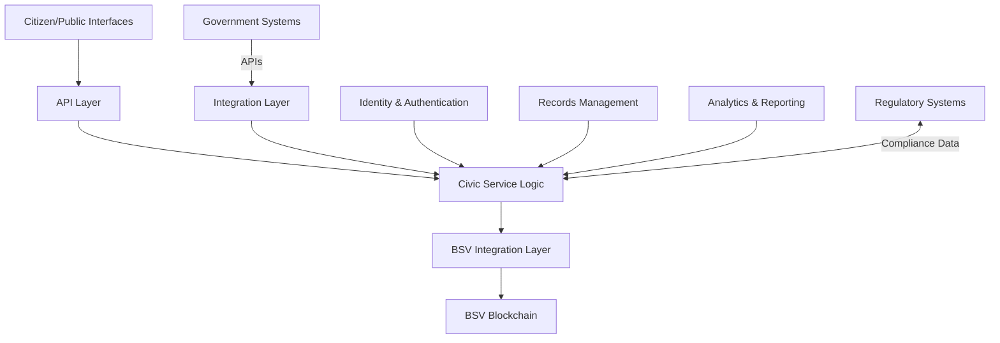

# Civics and Government

## Sector Overview

The civic sector faces several significant challenges:

* **Public trust in government institutions** at historically low levels
* **Transparency and accountability** in public processes
* **Citizen identity and service access** complexity
* **Public record integrity and accessibility**
* **Voting system security and verifiability**
* **Efficient public resource allocation**
* **Cross-agency data sharing** with privacy concerns

Government and civic organizations are seeking solutions that enhance transparency, ensure data integrity, streamline citizen services, and create more efficient, accountable public systems while maintaining privacy and regulatory compliance.

## BSV Value Proposition

BSV blockchain transforms civic operations by providing:

* **Transparent public records** with immutable audit trails
* **Secure citizen identity** with privacy-preserving verification
* **Verifiable voting systems** enhancing democratic processes
* **Efficient public service delivery** with reduced bureaucracy
* **Cross-agency data sharing** with appropriate access controls
* **Public resource tracking** with transparent allocation
* **Regulatory-compliant infrastructure** with built-in accountability

## Key Capabilities

| Capability               | Civic Application                       | Business Impact                    |
| ------------------------ | --------------------------------------- | ---------------------------------- |
| **Immutable ledger**     | Tamper-proof public records             | Enhanced transparency and trust    |
| **Digital identity**     | Citizen authentication and verification | Streamlined service access         |
| **Smart contracts**      | Automated public processes              | Reduced bureaucracy and costs      |
| **Selective disclosure** | Privacy-preserving verification         | Compliant information sharing      |
| **Timestamping**         | Verifiable document submission          | Legal certainty and accountability |
| **Audit trails**         | Comprehensive access logging            | Public accountability              |
| **Tokenization**         | Public resource allocation              | Efficient service delivery         |

## Use Cases

### Public Records Management

* **Land and property registries** with immutable ownership records
* **Business registrations** with transparent history
* **Vital records** (birth, marriage, death) with secure access
* **Licensing and permitting** with verifiable status

### Citizen Identity & Services

* **Self-sovereign citizen identity** with privacy controls
* **Single sign-on for government services**
* **Verifiable credentials** for entitlements and qualifications
* **Cross-border identity recognition**

### Democratic Processes

* **Secure and verifiable voting systems**
* **Transparent campaign finance tracking**
* **Public consultation mechanisms**
* **Accountable legislative processes**

### Public Resource Management

* **Transparent budget allocation and tracking**
* **Grant and subsidy distribution** with verification
* **Public asset management** with immutable records
* **Procurement transparency** and supplier verification

Solution Architecture

A typical civic implementation on BSV includes:

### Key Components:

1. **Citizen/Public Interfaces** - Web portals, mobile apps, and service kiosks
2. **Civic Service Logic** - Public service workflows and rules
3. **BSV Integration Layer** - Blockchain transaction creation and management
4. **Integration Layer** - Connecting to existing government systems
5. **Identity & Authentication** - Secure citizen verification
6. **Records Management** - Public document storage and retrieval
7. **Analytics & Reporting** - Transparency and performance metrics

## Proof of Concept Examples

### Land Registry System

A complete solution demonstrating:

* Immutable property ownership records
* Transparent transaction history
* Automated property transfer processes
* Public verification of ownership status

### Citizen Identity Platform

A working demonstration of:

* Self-sovereign identity for citizens
* Privacy-preserving credential verification
* Single sign-on for government services
* Audit trails for identity usage

### Public Procurement Transparency

A proof-of-concept showing:

* Transparent tender publication
* Verifiable bid submission
* Immutable evaluation records
* Automated contract execution

## Getting Started

### Assessment Questions

1. What public records require the highest levels of integrity and transparency?
2. How do citizens currently access government services and verify their identity?
3. What inefficiencies exist in your current public service delivery?
4. How do you ensure accountability in public resource allocation?
5. What privacy and regulatory requirements apply to your civic data?

### Implementation Roadmap

1. **Discovery Phase** (4-6 weeks)
   * Public service mapping
   * Data integrity and transparency assessment
   * Use case prioritization
2. **Proof of Concept** (8-12 weeks)
   * Limited service implementation
   * Integration with test systems
   * Privacy and security validation
3. **Pilot Deployment** (3-6 months)
   * Single department implementation
   * Limited citizen onboarding
   * Performance and compliance metrics collection
4. **Full Implementation** (6-24 months)
   * Phased rollout across government services
   * Comprehensive citizen education
   * Legacy system integration and optimization

### Resources

[← Back to Sector Overview](./)
