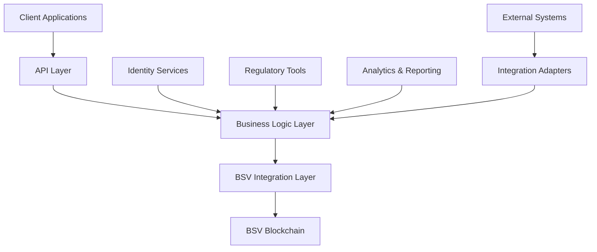

# Financial Services

## Sector Overview

The financial services industry faces significant challenges including:

* **High transaction costs** limiting access to financial services
* **Settlement delays** creating friction and capital inefficiency
* **Fragmented systems** requiring costly reconciliation
* **Regulatory compliance** demands increasing operational costs
* **Legacy infrastructure** limiting innovation and agility
* **Cross-border friction** hampering global operations
* **Cybersecurity threats** endangering customer trust

Financial institutions are seeking solutions that reduce costs, increase efficiency, enhance security, and enable new business models while maintaining regulatory compliance.

## BSV Value Proposition

BSV blockchain provides a transformative foundation for financial services by delivering:

* **Ultra-low transaction costs** (< $0.0001) enabling micropayments and financial inclusion
* **Instant settlement** eliminating counterparty risk and capital inefficiency
* **Immutable audit trails** simplifying compliance and reducing fraud
* **Programmable money** automating complex financial processes
* **Scalable infrastructure** handling millions of transactions per second
* **Legal compliance mechanisms** built into the protocol level
* **Borderless operations** with consistent global rules

## Key Capabilities

| Capability             | Financial Services Application            | Business Impact                               |
| ---------------------- | ----------------------------------------- | --------------------------------------------- |
| **Micropayments**      | Sub-cent transaction fees                 | New revenue streams, financial inclusion      |
| **Instant settlement** | Real-time clearing without intermediaries | Reduced counterparty risk, improved liquidity |
| **Tokenization**       | Digital representation of assets          | Fractional ownership, 24/7 markets            |
| **Smart contracts**    | Automated financial agreements            | Reduced operational costs, new products       |
| **Regulatory tools**   | Asset recovery, freeze mechanisms         | Compliance with legal requirements            |
| **Identity framework** | KYC/AML integration                       | Streamlined onboarding, reduced fraud         |
| **Scalable ledger**    | Enterprise-grade transaction volume       | Future-proof infrastructure                   |

## Use Cases

### Payments & Remittances

* **Micropayment channels** for content, services, and API access
* **Cross-border remittances** with near-zero fees
* **Real-time merchant settlements** without card network fees
* **Subscription and recurring payment automation**

### Capital Markets

* **Tokenized securities** with programmable compliance
* **Atomic swaps** for instant asset exchange
* **Automated dividend and interest payments**
* **Transparent shareholder voting systems**

### Banking Operations

* **Interbank settlement networks** with instant clearing
* **Automated loan origination and servicing**
* **Immutable audit trails** for regulatory reporting
* **Digital identity verification** with privacy preservation

### Central Bank Digital Currencies (CBDCs)

* **Scalable retail CBDC infrastructure**
* **Programmable monetary policy tools**
* **Two-tier distribution systems** preserving commercial banking
* **Cross-border CBDC interoperability**

## BSV Builders

Several companies are already building financial services solutions on BSV:

* **TAAL** - Enterprise blockchain infrastructure and transaction processing
* **HandCash** - Consumer and business payment solutions
* **Tokenized** - Regulated asset tokenization platform
* **Elas Digital** - Digital identity and token solutions
* **Vaionex** - Blockchain development and tokenization services
* **Centi** - Payment processing solutions for merchants

## Solution Architecture

A typical financial services implementation on BSV includes:

### Key Components:

1. **Client Applications** - Web, mobile, and API interfaces
2. **Business Logic Layer** - Financial rules, compliance, and process automation
3. **BSV Integration Layer** - Transaction creation, signing, and broadcasting
4. **Identity Services** - KYC/AML, authentication, and authorization
5. **Regulatory Tools** - Monitoring, reporting, and compliance
6. **Analytics & Reporting** - Business intelligence and audit support

## Proof of Concept Examples

### Merchant Payment System

A complete payment solution demonstrating:

* Sub-second transaction confirmation
* Fee-less merchant settlement
* Chargeback-free transactions
* Customer loyalty integration

### Tokenized Asset Exchange

A working demonstration of:

* Regulatory-compliant security token issuance
* Automated compliance checks for transfers
* Instant settlement of trades
* Dividend distribution automation

### Cross-Border Payment Network

A proof-of-concept showing:

* Multi-currency support
* Near-zero fee international transfers
* Compliance with international regulations
* Settlement time reduction from days to seconds

## Getting Started

### Assessment Questions

1. What are your current transaction processing costs?
2. How much capital is tied up in settlement processes?
3. What compliance costs could be reduced with better audit trails?
4. Which manual reconciliation processes could be automated?
5. What new products could you offer with micropayment capabilities?

### Implementation Roadmap

1. **Discovery Phase** (4-6 weeks)
   * Business case development
   * Use case prioritization
   * Technical architecture planning
2. **Proof of Concept** (8-12 weeks)
   * Limited-scope implementation
   * Integration with test systems
   * Performance and compliance validation
3. **Pilot Deployment** (3-6 months)
   * Controlled production implementation
   * Parallel running with existing systems
   * Metrics collection and analysis
4. **Full Implementation** (6-12 months)
   * Phased production rollout
   * Legacy system retirement
   * Continuous optimization

### Resources

* [BSV Financial Services Technical Documentation](../../technical/04-examples/financial-services.md)
* [Regulatory Compliance Framework](broken-reference)
* [Financial Services Integration Patterns](../../enterprise/integration-patterns.md)

[← Back to Sector Overview](./)
