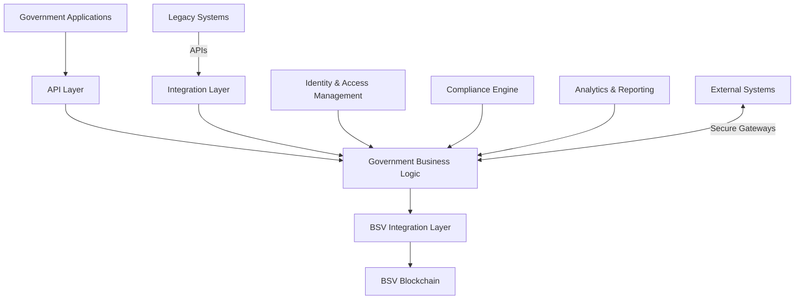

# Government

## Sector Overview

The government and public sector faces several critical challenges:

* **Legacy system modernization** with limited budgets
* **Regulatory compliance** and reporting burdens
* **Siloed agencies** with limited data sharing
* **Cybersecurity threats** to critical infrastructure
* **Operational efficiency** under resource constraints
* **Transparency and accountability** demands
* **Digital transformation** of citizen services

Government organizations are seeking solutions that modernize infrastructure, enhance security, improve operational efficiency, and enable digital transformation while maintaining strict regulatory compliance and public accountability.

## BSV Value Proposition

BSV blockchain transforms government operations by providing:

* **Secure, immutable records** for critical government data
* **Interoperable data infrastructure** connecting agencies
* **Transparent public accountability** with appropriate privacy
* **Efficient digital service delivery** reducing costs
* **Regulatory compliance by design** with built-in audit trails
* **Cybersecurity enhancement** through distributed architecture
* **Modernization pathway** for legacy systems

## Key Capabilities

| Capability               | Government Application                  | Business Impact                          |
| ------------------------ | --------------------------------------- | ---------------------------------------- |
| **Immutable ledger**     | Tamper-proof government records         | Enhanced data integrity and trust        |
| **Digital identity**     | Secure authentication framework         | Streamlined access and security          |
| **Smart contracts**      | Automated regulatory processes          | Reduced administrative burden            |
| **Selective disclosure** | Controlled information sharing          | Compliant inter-agency collaboration     |
| **Audit trails**         | Comprehensive activity logging          | Simplified compliance and accountability |
| **Tokenization**         | Digital representation of public assets | Improved resource management             |
| **Scalability**          | Enterprise-grade transaction volume     | Future-proof infrastructure              |

## Use Cases

### Government Records Management

* **Digital document authentication** with blockchain verification
* **Secure inter-agency record sharing** with access controls
* **Automated records retention** and compliance
* **Disaster-resistant backup** of critical information

### Regulatory Compliance & Reporting

* **Automated compliance monitoring** with immutable audit trails
* **Streamlined regulatory reporting** with verified data
* **Cross-jurisdiction information sharing**
* **Transparent enforcement actions**

### Public Finance & Procurement

* **Transparent budget execution** with real-time tracking
* **Secure procurement processes** with immutable bid records
* **Grant management** with automated disbursement
* **Public debt issuance and management**

### Digital Government Services

* **Secure citizen identity verification**
* **Streamlined service delivery** across agencies
* **Digital licensing and permitting**
* **Automated benefit distribution**

## BSV Builders

Several organizations are building government solutions on BSV:

* **Elas Digital** - Digital identity for government applications
* **VXPass** - Credential verification systems
* **Tokenized** - Regulatory contract automation
* **MetaStreme** - Large-scale government data anchoring
* **Predict Ecology** - Environmental compliance monitoring
* **UNISOT** - Supply chain transparency for government procurement

## Solution Architecture

A typical government implementation on BSV includes:

### Key Components:

1. **Government Applications** - Agency-specific interfaces and services
2. **Government Business Logic** - Regulatory workflows and rules
3. **BSV Integration Layer** - Blockchain transaction creation and management
4. **Integration Layer** - Connecting to legacy government systems
5. **Identity & Access Management** - Secure authentication and authorization
6. **Compliance Engine** - Automated regulatory monitoring and reporting
7. **Analytics & Reporting** - Performance metrics and public transparency

## Proof of Concept Examples

### Digital Identity for Government Services

A complete solution demonstrating:

* Secure citizen identity verification
* Cross-agency single sign-on
* Privacy-preserving credential verification
* Comprehensive audit trails for compliance

### Regulatory Compliance Platform

A working demonstration of:

* Automated compliance monitoring
* Real-time regulatory reporting
* Immutable audit trails for enforcement
* Cross-jurisdiction information sharing

### Government Procurement Transparency

A proof-of-concept showing:

* Transparent tender publication and bidding
* Secure supplier verification
* Immutable contract execution
* Automated payment processing

## Getting Started

### Assessment Questions

1. What government records require the highest levels of security and integrity?
2. How do your agencies currently share information while maintaining compliance?
3. What manual processes consume the most resources in your operations?
4. How do you currently ensure transparency and accountability to the public?
5. What legacy systems are most critical for modernization?

### Implementation Roadmap

1. **Discovery Phase** (4-6 weeks)
   * Government process mapping
   * Regulatory compliance assessment
   * Use case prioritization
2. **Proof of Concept** (8-12 weeks)
   * Limited department implementation
   * Integration with test systems
   * Security and compliance validation
3. **Pilot Deployment** (3-6 months)
   * Single agency implementation
   * Limited service transformation
   * Performance and compliance metrics collection
4. **Full Implementation** (6-24 months)
   * Phased rollout across agencies
   * Legacy system integration
   * Comprehensive digital transformation

### Resources

* [BSV Government Technical Documentation](../../technical/04-examples/government.md)
* [Public Sector Compliance Framework](broken-reference)
* [Government Integration Patterns](../../enterprise/integration-patterns.md)

[← Back to Sector Overview](./)
