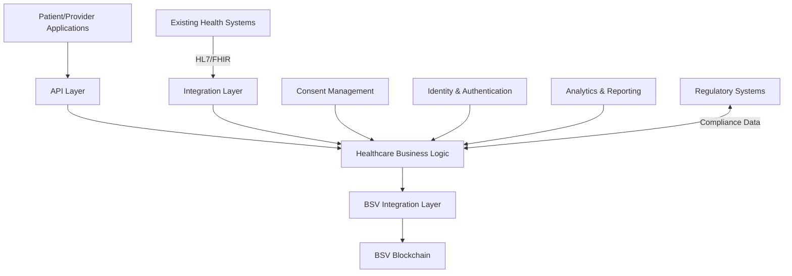

# Healthcare

## Sector Overview

The healthcare and life sciences industry faces significant challenges:

* **Fragmented patient data** across providers and systems
* **Privacy and security concerns** with sensitive health information
* **Complex consent management** for data sharing and research
* **Clinical trial integrity** and reproducibility issues
* **Counterfeit medications** threatening patient safety
* **Administrative inefficiencies** driving up healthcare costs
* **Interoperability barriers** between healthcare systems
* **Regulatory compliance** complexity across jurisdictions

Healthcare organizations are seeking solutions that improve data integrity, streamline consent management, enhance security, and create more efficient, patient-centered systems while maintaining strict regulatory compliance.

## BSV Value Proposition

BSV blockchain transforms healthcare operations by providing:

* **Patient-controlled data access** with verifiable consent trails
* **Immutable medical records** ensuring data integrity
* **Secure data sharing** with selective disclosure
* **Clinical trial transparency** with tamper-evident protocols
* **Pharmaceutical supply chain integrity** combating counterfeits
* **Automated claims processing** reducing administrative costs
* **Interoperable data standards** connecting disparate systems
* **Regulatory-compliant infrastructure** with built-in audit trails

## Key Capabilities

| Capability               | Healthcare Application                     | Business Impact                    |
| ------------------------ | ------------------------------------------ | ---------------------------------- |
| **Immutable ledger**     | Tamper-proof medical records               | Enhanced data integrity and trust  |
| **Selective disclosure** | Privacy-preserving data sharing            | Compliant information exchange     |
| **Smart contracts**      | Automated consent management               | Reduced administrative burden      |
| **Digital identity**     | Patient and provider authentication        | Secure, streamlined access control |
| **Tokenization**         | Representation of health assets and rights | Efficient resource allocation      |
| **Micropayments**        | Pay-per-use health services                | New care delivery models           |
| **Audit trails**         | Comprehensive access logging               | Simplified compliance reporting    |

## Use Cases

### Patient Data Management

* **Longitudinal health records** with patient-controlled access
* **Cross-provider data sharing** with verifiable consent
* **Wearable and IoT health data integration** with integrity verification
* **Privacy-preserving population health analytics**

### Clinical Research & Trials

* **Trial protocol registration** with immutable timestamps
* **Participant consent management** with verifiable trails
* **Raw data anchoring** for result verification
* **Automated incentives** for research participation

### Pharmaceutical Supply Chain

* **Medication provenance tracking** from manufacturer to patient
* **Cold chain verification** with IoT integration
* **Counterfeit detection** through authentication
* **Precision recall management** when necessary

### Healthcare Administration

* **Automated claims processing** with smart contracts
* **Provider credential verification** with digital identity
* **Value-based care agreements** with transparent metrics
* **Interoperable health information exchange**

## BSV Builders

Several companies are building healthcare solutions on BSV:

* **EHR Data** - Patient-controlled health records and data exchange
* **VXPass** - Vaccination and health credential verification
* **Elas Digital** - Digital identity for healthcare applications
* **MedRecords** - Electronic health record solutions
* **Predict Ecology** - Environmental health monitoring
* **Tokenized** - Healthcare contract and consent automation

## Solution Architecture

A typical healthcare implementation on BSV includes:

### Key Components:

1. **Patient/Provider Applications** - Mobile and web interfaces
2. **Healthcare Business Logic** - Clinical workflows and rules
3. **BSV Integration Layer** - Blockchain transaction management
4. **Integration Layer** - Connecting to existing health systems
5. **Consent Management** - Patient-controlled data permissions
6. **Identity & Authentication** - Secure access control
7. **Analytics & Reporting** - Clinical insights and compliance

## Proof of Concept Examples

### Patient-Controlled Health Record

A complete solution demonstrating:

* Patient ownership of medical data
* Granular consent management
* Cross-provider data sharing
* Immutable audit trails of access

### Clinical Trial Management System

A working demonstration of:

* Protocol registration and timestamping
* Participant enrollment with verifiable consent
* Blinded data collection with integrity verification
* Automated participant compensation

### Pharmaceutical Verification System

A proof-of-concept showing:

* Medication authentication at point of dispensing
* Temperature-controlled shipping verification
* Patient verification of medication authenticity
* Automated adverse event reporting

## Getting Started

### Assessment Questions

1. How do you currently manage patient consent for data sharing?
2. What are your current costs for healthcare data reconciliation?
3. How do you verify the integrity of clinical research data?
4. What challenges do you face with healthcare system interoperability?
5. How do you ensure the authenticity of pharmaceutical products?

### Implementation Roadmap

1. **Discovery Phase** (4-6 weeks)
   * Healthcare workflow mapping
   * Regulatory compliance assessment
   * Use case prioritization
2. **Proof of Concept** (8-12 weeks)
   * Limited-scope implementation
   * Integration with test systems
   * Privacy and security validation
3. **Pilot Deployment** (3-6 months)
   * Controlled production implementation
   * Limited patient/provider onboarding
   * Performance and compliance metrics collection
4. **Full Implementation** (6-18 months)
   * Phased rollout across healthcare systems
   * Expanded user onboarding
   * Legacy system integration and optimization

### Resources

* [BSV Healthcare Technical Documentation](../../technical/04-examples/healthcare.md)
* [Healthcare Data Privacy Framework](broken-reference)
* [Clinical Research Integration Patterns](../../enterprise/integration-patterns.md)

[← Back to Sector Overview](./)
