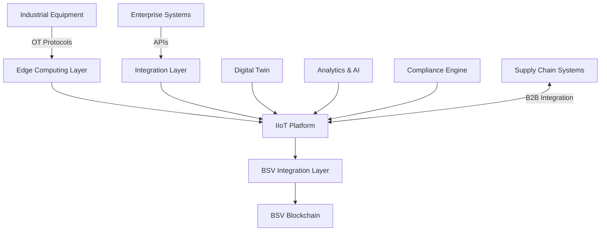

# Industrial IoT

## Sector Overview

The Industrial Internet of Things (IIoT) sector faces several critical challenges:

* **Manufacturing process integrity** and quality assurance
* **Supply chain integration** with real-time visibility
* **Equipment maintenance optimization** and downtime reduction
* **Industrial data security** and intellectual property protection
* **Regulatory compliance** for industrial operations
* **Cross-vendor system interoperability**
* **Complex multi-party workflows** requiring coordination

Industrial organizations are seeking solutions that ensure data integrity, automate complex workflows, optimize maintenance, and create secure, efficient connections between manufacturing systems, supply chains, and enterprise applications.

## BSV Value Proposition

BSV blockchain transforms industrial operations by providing:

* **Immutable production records** ensuring manufacturing integrity
* **Secure machine identity** for industrial equipment
* **Automated multi-party workflows** with smart contracts
* **Verifiable quality assurance** with tamper-evident data
* **Integrated supply chain visibility** across organizations
* **Predictive maintenance** based on verified equipment data
* **Regulatory-compliant audit trails** for industrial processes

## Key Capabilities

| Capability               | IIoT Application                     | Business Impact                        |
| ------------------------ | ------------------------------------ | -------------------------------------- |
| **Immutable ledger**     | Tamper-proof production records      | Quality assurance and compliance       |
| **Digital identity**     | Machine and equipment authentication | Secure industrial automation           |
| **Smart contracts**      | Automated industrial workflows       | Reduced manual intervention            |
| **IoT data anchoring**   | Verifiable sensor readings           | Trusted basis for automation           |
| **Micropayments**        | Machine-to-machine transactions      | New industrial service models          |
| **Selective disclosure** | Protected intellectual property      | Secure collaboration with verification |
| **Scalability**          | Millions of industrial data points   | Enterprise-grade performance           |

## Use Cases

### Smart Manufacturing

* **Digital twin verification** with blockchain-anchored data
* **Production quality assurance** with immutable process records
* **Supply chain integration** with real-time visibility
* **Automated quality certification** with verifiable testing

### Industrial Automation

* **Secure machine-to-machine communication**
* **Automated workflow orchestration** across equipment
* **Verifiable robotic process execution**
* **Equipment utilization optimization** with trusted data

### Predictive Maintenance

* **Equipment health monitoring** with tamper-evident sensors
* **Maintenance history verification** for compliance
* **Performance-based service contracts** with verified metrics
* **Spare parts authenticity** and supply chain integration

### Industrial Compliance

* **Environmental monitoring** with verifiable emissions data
* **Worker safety verification** with immutable records
* **Regulatory reporting automation** with built-in audit trails
* **Industrial certification** with transparent verification

## BSV Builders

Several companies are building IIoT solutions on BSV:

* **UNISOT** - Industrial supply chain integration
* **Elas Digital** - Industrial equipment identity and data integrity
* **Predict Ecology** - Environmental compliance monitoring
* **VXPass** - Industrial certification and verification
* **Tokenized** - Industrial contract automation
* **Natural Chain** - Carbon monitoring for industrial processes

## Solution Architecture

A typical IIoT implementation on BSV includes:

### Key Components:

1. **Industrial Equipment** - Manufacturing machinery, sensors, and control systems
2. **Edge Computing Layer** - Local processing and OT/IT bridging
3. **IIoT Platform** - Device management, data processing, and industrial logic
4. **BSV Integration Layer** - Blockchain transaction creation and management
5. **Enterprise Integration** - Connecting to ERP, MES, and other systems
6. **Digital Twin** - Virtual representation with blockchain-verified data
7. **Analytics & AI** - Insights and optimization from trusted data
8. **Compliance Engine** - Automated regulatory reporting and certification

## Proof of Concept Examples

### Smart Factory Quality Assurance

A complete solution demonstrating:

* Production process verification with immutable records
* Component traceability throughout assembly
* Automated quality certification with blockchain proof
* Customer verification of manufacturing integrity

### Industrial Equipment Maintenance

A working demonstration of:

* Equipment identity and authentication
* Performance monitoring with tamper-evident sensors
* Predictive maintenance based on verified data
* Automated service contract execution

### Industrial Supply Chain Integration

A proof-of-concept showing:

* Real-time production visibility for suppliers
* Just-in-time inventory management
* Quality verification across manufacturing stages
* Automated settlements based on verified deliveries

## Getting Started

### Assessment Questions

1. What manufacturing processes require the highest levels of quality assurance?
2. How do you currently verify the integrity of industrial sensor data?
3. What challenges do you face with equipment maintenance and downtime?
4. How integrated is your manufacturing with your supply chain?
5. What regulatory compliance requirements apply to your industrial operations?

### Implementation Roadmap

1. **Discovery Phase** (4-6 weeks)
   * Industrial process mapping
   * Data integrity and security assessment
   * Use case prioritization
2. **Proof of Concept** (8-12 weeks)
   * Limited equipment integration
   * BSV anchoring for critical processes
   * Integration with existing industrial systems
3. **Pilot Deployment** (3-6 months)
   * Production line implementation
   * Supply chain partner integration
   * Performance and compliance validation
4. **Full Implementation** (6-18 months)
   * Factory-wide deployment
   * Comprehensive supply chain integration
   * Optimization for efficiency and compliance

### Resources

* [BSV IIoT Technical Documentation](../../technical/04-examples/industrial-iot.md)
* [Industrial Integration Patterns](../../enterprise/integration-patterns.md)
* [Manufacturing Compliance Framework](broken-reference)

[← Back to Sector Overview](./)
