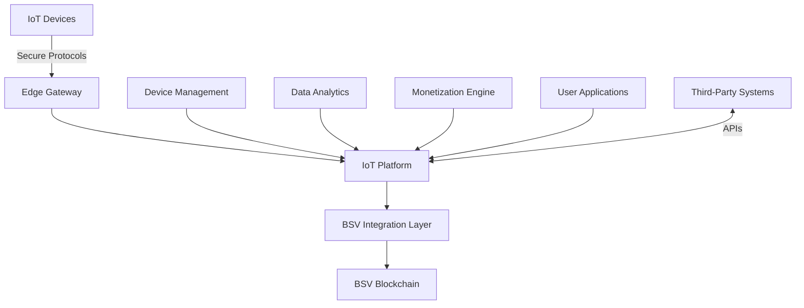

# Internet of Things

## Sector Overview

The Internet of Things (IoT) sector faces several significant challenges:

* **Device identity and authentication** at massive scale
* **Data integrity and security** for sensor information
* **Monetization models** for IoT-generated data
* **Interoperability** between different devices and platforms
* **Privacy concerns** with consumer data collection
* **Scalability limitations** for billions of connected devices
* **Trust in automated machine-to-machine transactions**

IoT solution providers are seeking infrastructure that can securely manage device identity, ensure data integrity, enable micropayments, and scale to accommodate billions of connected devices while maintaining privacy and regulatory compliance.

## BSV Value Proposition

BSV blockchain transforms IoT operations by providing:

* **Secure device identity** with cryptographic authentication
* **Immutable data anchoring** ensuring sensor data integrity
* **Micropayment channels** enabling machine-to-machine economics
* **Scalable transaction processing** for billions of devices
* **Selective data disclosure** preserving privacy
* **Interoperable data standards** connecting disparate systems
* **Regulatory-compliant infrastructure** with built-in audit capabilities

## Key Capabilities

| Capability           | IoT Application                        | Business Impact                             |
| -------------------- | -------------------------------------- | ------------------------------------------- |
| **Digital identity** | Device authentication and verification | Secure device onboarding and communication  |
| **Immutable ledger** | Tamper-proof sensor data records       | Trusted data for automation and analytics   |
| **Micropayments**    | Machine-to-machine transactions        | New data monetization models                |
| **Smart contracts**  | Automated device agreements            | Reduced human intervention in IoT workflows |
| **Scalability**      | Billions of transactions per day       | Future-proof infrastructure for IoT growth  |
| **Light clients**    | Resource-efficient verification        | Enables constrained device participation    |
| **Data anchoring**   | Verifiable sensor readings             | Audit-ready IoT data trails                 |

## Use Cases

### Smart Home & Consumer IoT

* **Device authentication** preventing unauthorized access
* **Usage-based service models** with micropayments
* **Data monetization** for consumer-generated information
* **Privacy-preserving analytics** with selective disclosure

### Smart Cities & Infrastructure

* **Sensor data integrity** for environmental monitoring
* **Automated service payments** based on verified usage
* **Secure citizen identity integration** for personalized services
* **Cross-department data sharing** with privacy controls

### Connected Vehicles & Transportation

* **Vehicle identity and history** with immutable records
* **Usage-based insurance** with verified telemetry
* **Automated toll and parking payments**
* **Secure vehicle-to-infrastructure communication**

### Energy & Utilities

* **Smart meter verification** for billing accuracy
* **Peer-to-peer energy trading** with automated settlements
* **Grid management** with secure device coordination
* **Usage-based pricing** with verifiable consumption data

## BSV Builders

Several companies are building IoT solutions on BSV:

* **Predict Ecology** - Environmental monitoring sensors and data integrity
* **WeatherSV** - Climate data recording and verification
* **Elas Digital** - IoT device identity and authentication
* **Tokenized** - IoT contract automation and compliance
* **VXPass** - Verifiable credential systems for devices
* **Natural Chain** - Environmental monitoring and carbon credit generation

## Solution Architecture

A typical IoT implementation on BSV includes:

### Key Components:

1. **IoT Devices** - Sensors, actuators, and smart devices
2. **Edge Gateway** - Local processing and security
3. **IoT Platform** - Device management, data processing, and business logic
4. **BSV Integration Layer** - Blockchain transaction creation and management
5. **Device Management** - Identity, authentication, and lifecycle
6. **Data Analytics** - Insights from verified IoT data
7. **Monetization Engine** - Micropayment channels and data marketplaces

## Proof of Concept Examples

### Smart Home Energy Management

A complete solution demonstrating:

* Secure smart meter identity and authentication
* Tamper-evident energy consumption recording
* Automated micropayments based on usage
* Consumer data monetization options

### Environmental Monitoring Network

A working demonstration of:

* Secure sensor deployment and authentication
* Immutable climate and pollution data recording
* Data marketplace for environmental insights
* Automated alerting based on verified thresholds

### Connected Vehicle Platform

A proof-of-concept showing:

* Vehicle identity and maintenance records
* Secure telematics data recording
* Usage-based service models
* Automated toll and parking payments

## Getting Started

### Assessment Questions

1. How do you currently ensure the identity and security of IoT devices?
2. What challenges do you face with IoT data integrity and trust?
3. How could micropayment capabilities create new business models?
4. What scale of IoT deployment are you planning for the future?
5. What privacy and regulatory requirements apply to your IoT data?

### Implementation Roadmap

1. **Discovery Phase** (4-6 weeks)
   * IoT use case identification
   * Device and data flow mapping
   * Security and privacy requirements analysis
2. **Proof of Concept** (8-12 weeks)
   * Limited device deployment
   * BSV integration for data anchoring
   * Micropayment channel testing
3. **Pilot Deployment** (3-6 months)
   * Expanded device deployment
   * Integration with existing IoT platforms
   * Performance and security validation
4. **Full Implementation** (6-18 months)
   * Full-scale device deployment
   * Comprehensive data monetization
   * Optimization for scale and efficiency

### Resources

* [BSV IoT Technical Documentation](../../technical/04-examples/iot-solutions.md)
* [Device Identity Framework](broken-reference)
* [IoT Data Monetization Patterns](../../enterprise/integration-patterns.md)

[← Back to Sector Overview](./)
