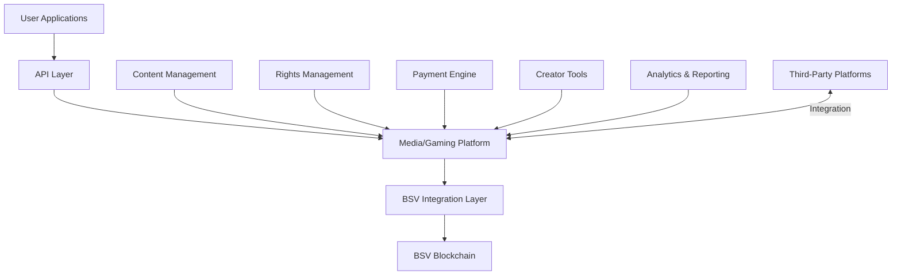

# Media & Gaming: BSV Blockchain Solutions

## Sector Overview

The media and gaming industry faces several significant challenges:

* **Content monetization** in an era of free expectations
* **Digital rights management** and piracy concerns
* **Creator compensation** with intermediary dominance
* **Audience engagement** and retention challenges
* **In-game economies** with limited real-world value
* **Content authenticity** in an age of deepfakes
* **Cross-platform digital asset ownership**

Media and gaming companies are seeking solutions that enable new monetization models, protect intellectual property, create direct creator-audience relationships, and establish verifiable digital ownership while enhancing user experiences.

## BSV Value Proposition

BSV blockchain transforms media and gaming by providing:

* **Micropayment channels** enabling pay-per-use content
* **Verifiable digital ownership** of assets and content
* **Direct creator compensation** without intermediaries
* **Immutable content provenance** combating misinformation
* **Cross-platform asset portability** for digital items
* **Transparent royalty distribution** with automated payments
* **Play-to-earn models** with real economic value

## Key Capabilities

| Capability | Media & Gaming Application | Business Impact |
|------------|----------------------------|-----------------|
| **Micropayments** | Pay-per-view/use content models | New revenue streams beyond advertising |
| **Tokenization** | Digital asset ownership | Verifiable scarcity and transferability |
| **Smart contracts** | Automated royalty distribution | Fair, transparent creator compensation |
| **Digital identity** | Creator and content authentication | Trust in content provenance |
| **Immutable ledger** | Verifiable ownership records | Reduced piracy and rights disputes |
| **Programmability** | In-game economies with real value | Enhanced player engagement |
| **Scalability** | Millions of microtransactions | Enterprise-grade performance |

## Use Cases

### Content Monetization
* **Pay-per-view/read/listen** with sub-cent transactions
* **Microtipping** for creators and content
* **Subscription management** with transparent metrics
* **Bundled content access** with automated distribution

### Digital Rights Management
* **Verifiable content licensing** with blockchain proof
* **Automated royalty distribution** to rights holders
* **Content usage tracking** with immutable records
* **Anti-piracy mechanisms** with ownership verification

### Gaming Economies
* **Verifiable in-game asset ownership**
* **Cross-game asset portability**
* **Play-to-earn models** with real economic value
* **Transparent tournament prize distribution**

### Creator Economy
* **Direct fan-to-creator support** without platforms
* **Collaborative content creation** with fair attribution
* **Decentralized content distribution**
* **Audience engagement through tokenized incentives**

## BSV Builders

Several companies are building media and gaming solutions on BSV:

* **Haste Arcade** - Play-to-earn gaming platform
* **NFTY Jigs** - Digital collectibles and assets
* **Jamify** - Music streaming with micropayments
* **Twetch** - Social media with creator compensation
* **Britevue** - Verified review platform
* **HandCash** - Wallet with content monetization features

## Solution Architecture

A typical media and gaming implementation on BSV includes:

### Key Components:
1. **User Applications** - Consumer-facing interfaces and experiences
2. **Media/Gaming Platform** - Content delivery and user engagement
3. **BSV Integration Layer** - Blockchain transaction creation and management
4. **Content Management** - Storage, delivery, and protection
5. **Rights Management** - Licensing, attribution, and royalties
6. **Payment Engine** - Micropayments and revenue distribution
7. **Creator Tools** - Content production and publishing
8. **Analytics & Reporting** - Usage metrics and performance

## Proof of Concept Examples

### Micropayment-Based Content Platform
A complete solution demonstrating:
* Pay-per-article news consumption
* Creator compensation based on actual usage
* Microtipping for quality content
* Subscription management with transparent metrics

### Gaming Asset Marketplace
A working demonstration of:
* Verifiable in-game item ownership
* Peer-to-peer asset trading
* Cross-game asset portability
* Real economic value for digital items

### Music Distribution Platform
A proof-of-concept showing:
* Per-stream artist compensation
* Transparent royalty distribution
* Fan-to-artist direct support
* Verifiable streaming metrics

## Getting Started

### Assessment Questions
1. What content monetization challenges does your organization face?
2. How do you currently manage digital rights and creator compensation?
3. What engagement and retention metrics could be improved with new models?
4. How could digital ownership enhance your user experience?
5. What new revenue streams could micropayments enable for your content?

### Implementation Roadmap
1. **Discovery Phase** (4-6 weeks)
   * Content and monetization assessment
   * User experience mapping
   * Use case prioritization
   
2. **Proof of Concept** (8-12 weeks)
   * Limited content implementation
   * Micropayment channel testing
   * User experience validation
   
3. **Pilot Deployment** (3-6 months)
   * Controlled content offering
   * Limited user base testing
   * Performance and engagement metrics collection
   
4. **Full Implementation** (6-12 months)
   * Comprehensive content integration
   * Full user base rollout
   * Optimization for engagement and revenue

### Resources
* [BSV Media Technical Documentation](../../technical/04-examples/media-gaming.md)
* [Micropayment Integration Patterns](../../technical/03-advanced-topics/micropayments.md)
* [Digital Asset Framework](../../enterprise/integration-patterns.md)

[← Back to Sector Overview](README.md)