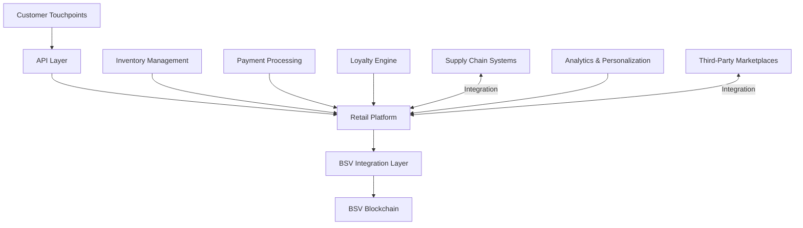

# Retail & eCommerce: BSV Blockchain Solutions

## Sector Overview

The retail and eCommerce industry faces several significant challenges:

* **Payment processing costs** eating into thin margins
* **Customer trust and loyalty** in a competitive landscape
* **Supply chain transparency** for ethical and sustainable products
* **Counterfeit products** damaging brand reputation
* **Review authenticity** and trust signals
* **Personalization** without privacy invasion
* **Omnichannel inventory management**

Retail and eCommerce businesses are seeking solutions that reduce transaction costs, build customer trust, ensure product authenticity, create new loyalty mechanisms, and provide transparent supply chains while enhancing the customer experience.

## BSV Value Proposition

BSV blockchain transforms retail operations by providing:

* **Low-cost payment processing** with sub-cent fees
* **Verifiable product provenance** ensuring authenticity
* **Tokenized loyalty programs** with real transferable value
* **Transparent customer reviews** with verified purchases
* **Supply chain visibility** from manufacturer to consumer
* **Privacy-preserving personalization** with customer control
* **Efficient inventory management** across channels

## Key Capabilities

| Capability | Retail Application | Business Impact |
|------------|-------------------|-----------------|
| **Micropayments** | Low-cost transaction processing | Higher margins on small purchases |
| **Tokenization** | Digital loyalty and rewards | Enhanced customer retention |
| **Immutable ledger** | Verifiable product history | Trust in product authenticity |
| **Digital identity** | Customer and merchant verification | Reduced fraud and chargebacks |
| **Smart contracts** | Automated promotions and rebates | Operational efficiency |
| **Supply chain tracking** | End-to-end product visibility | Brand protection and transparency |
| **Verified reviews** | Authentic customer feedback | Improved trust signals |

## Use Cases

### Payments & Transactions
* **Low-fee payment processing** for higher margins
* **Instant settlement** without intermediary delays
* **Subscription management** with transparent billing
* **Microtransactions** for digital goods and services

### Customer Loyalty & Engagement
* **Tokenized loyalty points** with real transferable value
* **Gamified shopping experiences** with blockchain rewards
* **Customer-to-customer point transfers** and marketplaces
* **Transparent promotion tracking** and redemption

### Product Authenticity & Provenance
* **Verifiable luxury goods authentication**
* **Farm-to-table food tracking** for transparency
* **Ethical sourcing verification** for conscious consumers
* **Anti-counterfeit mechanisms** for brand protection

### Reviews & Reputation
* **Verified purchase reviews** with blockchain proof
* **Transparent seller ratings** with immutable history
* **Review incentivization** with micropayments
* **Fraud-resistant reputation systems**

## BSV Builders

Several companies are building retail and eCommerce solutions on BSV:

* **HandCash** - Retail payment solutions
* **Centi** - Point-of-sale payment processing
* **Tokenized** - Loyalty program tokenization
* **UNISOT** - Retail supply chain tracking
* **Britevue** - Verified review platform
* **Elas Digital** - Digital identity for retail applications

## Solution Architecture

A typical retail implementation on BSV includes:

### Key Components:
1. **Customer Touchpoints** - Web, mobile, and in-store interfaces
2. **Retail Platform** - Core commerce and customer management
3. **BSV Integration Layer** - Blockchain transaction creation and management
4. **Inventory Management** - Stock tracking and availability
5. **Payment Processing** - Transaction handling and settlement
6. **Loyalty Engine** - Points issuance, tracking, and redemption
7. **Supply Chain Integration** - Product tracking and verification
8. **Analytics & Personalization** - Customer insights and targeting

## Proof of Concept Examples

### Next-Generation Loyalty Program
A complete solution demonstrating:
* Tokenized loyalty points with transferable value
* Transparent earning and redemption
* Cross-merchant loyalty networks
* Customer-to-customer point transfers

### Authentic Product Marketplace
A working demonstration of:
* Product authenticity verification
* Supply chain transparency
* Ethical sourcing certification
* Customer verification of product history

### Verified Review Platform
A proof-of-concept showing:
* Blockchain-verified purchase confirmation
* Review incentivization with micropayments
* Transparent seller reputation history
* Fraud-resistant feedback mechanisms

## Getting Started

### Assessment Questions
1. What are your current payment processing costs as a percentage of revenue?
2. How do you currently verify the authenticity of products in your supply chain?
3. What challenges do you face with customer loyalty and retention?
4. How do you ensure the authenticity of customer reviews?
5. What inventory management challenges exist across your sales channels?

### Implementation Roadmap
1. **Discovery Phase** (4-6 weeks)
   * Retail process mapping
   * Customer journey assessment
   * Use case prioritization
   
2. **Proof of Concept** (8-12 weeks)
   * Limited implementation (e.g., single product line)
   * Payment or loyalty system integration
   * Customer experience validation
   
3. **Pilot Deployment** (3-6 months)
   * Single store or product category implementation
   * Limited customer base testing
   * Performance and engagement metrics collection
   
4. **Full Implementation** (6-12 months)
   * Company-wide rollout
   * Supply chain partner integration
   * Optimization for customer experience and efficiency

### Resources
* [BSV Retail Technical Documentation](../../technical/04-examples/retail-ecommerce.md)
* [Payment Integration Patterns](../../technical/03-advanced-topics/payment-channels.md)
* [Loyalty Program Framework](../../enterprise/integration-patterns.md)

[← Back to Sector Overview](README.md)