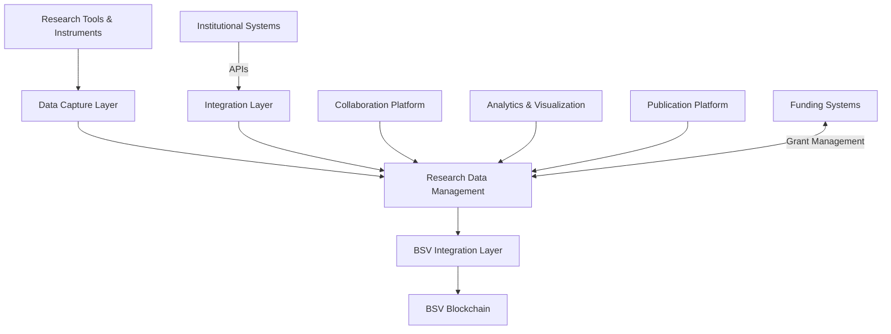

# Science and Research

## Sector Overview

The science and research sector faces several critical challenges:

* **Research reproducibility crisis** undermining scientific credibility
* **Data integrity and provenance** concerns throughout research lifecycle
* **Inefficient collaboration** across institutions and borders
* **Complex intellectual property management**
* **Research funding transparency and accountability**
* **Peer review process inefficiencies**
* **Limited access to scientific data and publications**

Scientific organizations are seeking solutions that ensure data integrity, streamline collaboration, create transparent funding mechanisms, and establish verifiable provenance for research outputs while protecting intellectual property.

## BSV Value Proposition

BSV blockchain transforms scientific research by providing:

* **Immutable research records** ensuring data integrity
* **Verifiable experiment protocols** enhancing reproducibility
* **Transparent collaboration frameworks** across institutions
* **Intellectual property protection** with selective disclosure
* **Efficient research funding** with programmable grants
* **Open access mechanisms** with fair compensation
* **Automated peer review workflows** with verifiable contributions

## Key Capabilities

| Capability               | Science Application                     | Business Impact                    |
| ------------------------ | --------------------------------------- | ---------------------------------- |
| **Immutable ledger**     | Tamper-proof research records           | Enhanced reproducibility and trust |
| **Timestamping**         | Verifiable discovery priority           | Intellectual property protection   |
| **Smart contracts**      | Automated research agreements           | Streamlined collaboration          |
| **Selective disclosure** | Protected IP with verification          | Secure sharing of sensitive data   |
| **Micropayments**        | Pay-per-access to research              | New open science models            |
| **Digital identity**     | Researcher and institution verification | Credible attribution               |
| **Data anchoring**       | Verifiable experimental data            | Trusted scientific foundations     |

## Use Cases

### Research Data Management

* **Experimental data integrity** with blockchain anchoring
* **Dataset provenance tracking** throughout research lifecycle
* **Secure multi-institution data sharing** with access control
* **Automated data citation and attribution**

### Scientific Collaboration

* **Cross-border research coordination** with transparent workflows
* **Intellectual property protection** with verifiable timestamps
* **Automated material transfer agreements**
* **Equitable attribution of contributions**

### Research Funding & Grants

* **Transparent grant distribution** with programmable milestones
* **Automated research fund disbursement**
* **Verifiable research output tracking**
* **Novel crowdfunding mechanisms** for science

### Scientific Publishing & Peer Review

* **Open access publishing** with micropayment models
* **Transparent peer review processes**
* **Verifiable citation metrics**
* **Automated reviewer compensation**

## BSV Builders

Several organizations are building science solutions on BSV:

* **Predict Ecology** - Environmental research data integrity
* **WeatherSV** - Climate data recording and verification
* **Elas Digital** - Research identity and attribution systems
* **VXPass** - Clinical research verification
* **Tokenized** - Research contract automation
* **MetaStreme** - Large-scale scientific data anchoring

## Solution Architecture

A typical science implementation on BSV includes:

### Key Components:

1. **Research Tools & Instruments** - Laboratory equipment, sensors, and data collection
2. **Data Capture Layer** - Secure data acquisition and preprocessing
3. **Research Data Management** - Storage, processing, and workflow management
4. **BSV Integration Layer** - Blockchain transaction creation and management
5. **Institutional Integration** - Connecting to existing research systems
6. **Collaboration Platform** - Secure multi-party research coordination
7. **Analytics & Visualization** - Insights from verified research data
8. **Publication Platform** - Open access with attribution and micropayments

## Proof of Concept Examples

### Reproducible Research Platform

A complete solution demonstrating:

* Protocol registration with immutable timestamps
* Experimental data anchoring with integrity verification
* Automated research notebook verification
* Transparent sharing with selective disclosure

### Open Science Funding System

A working demonstration of:

* Transparent grant proposal submission
* Community-based funding allocation
* Milestone-based fund disbursement
* Verifiable research output tracking

### Scientific Publishing Platform

A proof-of-concept showing:

* Open access publishing with micropayments
* Transparent peer review process
* Verifiable citation metrics
* Automated royalty distribution

## Getting Started

### Assessment Questions

1. What challenges do you face with research data integrity and reproducibility?
2. How do you currently manage intellectual property in collaborative research?
3. What inefficiencies exist in your research funding and grant management?
4. How do you ensure proper attribution in multi-party research projects?
5. What barriers do you face in sharing research data while protecting sensitive information?

### Implementation Roadmap

1. **Discovery Phase** (4-6 weeks)
   * Research workflow mapping
   * Data integrity assessment
   * Collaboration and sharing requirements
2. **Proof of Concept** (8-12 weeks)
   * Limited research project implementation
   * Data anchoring and verification testing
   * Collaboration framework development
3. **Pilot Deployment** (3-6 months)
   * Department-level implementation
   * Integration with existing research systems
   * Performance and compliance validation
4. **Full Implementation** (6-18 months)
   * Institution-wide deployment
   * External collaboration enablement
   * Optimization for research efficiency

### Resources

* [BSV Science Technical Documentation](../../technical/04-examples/scientific-research.md)
* [Research Data Integrity Framework](broken-reference)
* [Scientific Collaboration Patterns](../../enterprise/integration-patterns.md)

[← Back to Sector Overview](./)
