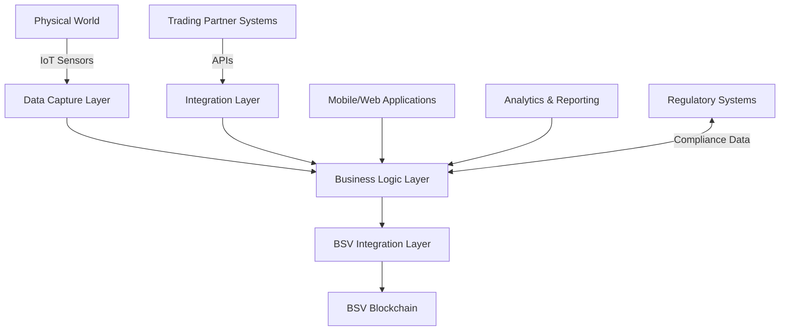

# Supply Chain & Logistics: BSV Blockchain Solutions

## Sector Overview

The supply chain and logistics industry faces numerous challenges:

* **Lack of transparency** across complex multi-party networks
* **Manual reconciliation** consuming resources and introducing errors
* **Counterfeit products** damaging brand reputation and consumer safety
* **Inefficient payment flows** creating cash flow challenges
* **Limited traceability** hampering recall effectiveness
* **Siloed data systems** preventing end-to-end visibility
* **Compliance complexity** across jurisdictions and regulations

Organizations are seeking solutions that increase visibility, automate processes, ensure product authenticity, and create more efficient payment mechanisms throughout the supply chain.

## BSV Value Proposition

BSV blockchain transforms supply chain operations by providing:

* **End-to-end visibility** with immutable, shared records
* **IoT integration** for automated, trusted data capture
* **Tokenized asset tracking** from raw materials to finished goods
* **Automated settlements** reducing payment friction
* **Verifiable provenance** combating counterfeits
* **Interoperable data standards** connecting disparate systems
* **Regulatory-ready infrastructure** simplifying compliance

## Key Capabilities

| Capability | Supply Chain Application | Business Impact |
|------------|--------------------------|-----------------|
| **Immutable ledger** | Tamper-proof record of events | Trusted single source of truth |
| **IoT data anchoring** | Secure sensor data integration | Automated verification without human error |
| **Smart contracts** | Automated business agreements | Reduced disputes and faster settlements |
| **Tokenization** | Digital representation of physical assets | Real-time inventory and ownership tracking |
| **Micropayments** | Machine-to-machine transactions | Automated micro-settlements across supply chain |
| **Selective disclosure** | Confidential information sharing | Competitive data protection with verification |
| **Digital identity** | Entity and product authentication | Counterfeit prevention and recall precision |

## Use Cases

### Product Provenance & Authentication
* **Farm-to-table tracking** for food safety and quality
* **Luxury goods authentication** preventing counterfeits
* **Pharmaceutical supply chain** ensuring drug authenticity
* **Raw material verification** for sustainability compliance

### Logistics & Transportation
* **Automated customs documentation** with verifiable records
* **Container tracking** with IoT integration
* **Carrier performance monitoring** with immutable metrics
* **Automated freight payments** based on verified delivery

### Inventory & Warehouse Management
* **Real-time inventory tokenization** for accurate tracking
* **Automated replenishment** triggered by verified stock levels
* **Cross-organization visibility** with privacy controls
* **Condition monitoring** with IoT-verified storage compliance

### Supplier Management & Procurement
* **Verifiable supplier credentials** and certifications
* **Smart contract-based procurement** with automated terms
* **Performance-based payments** using verified metrics
* **Transparent bidding processes** with immutable audit trails

## BSV Builders

Several companies are building supply chain solutions on BSV:

* **VXPass** - Verifiable credential systems for supply chain
* **Elas Digital** - Digital identity and tokenization for physical goods
* **Tokenized** - Supply chain contract automation
* **UNISOT** - Seafood supply chain tracking and sustainability
* **Predict Ecology** - Environmental monitoring and compliance
* **Natural Chain** - Carbon credit generation and verification

## Solution Architecture

A typical supply chain implementation on BSV includes:

### Key Components:
1. **Data Capture Layer** - IoT devices, scanners, and manual inputs
2. **Business Logic Layer** - Rules, workflows, and process automation
3. **BSV Integration Layer** - Transaction creation and blockchain interaction
4. **Integration Layer** - Connecting to partner and legacy systems
5. **Applications** - User interfaces for different supply chain participants
6. **Analytics & Reporting** - Business intelligence and compliance reporting

## Proof of Concept Examples

### Farm-to-Table Tracking System
A complete solution demonstrating:
* IoT sensor integration for growing conditions
* Harvest verification and processing tracking
* Transportation condition monitoring
* Retail authentication and consumer transparency

### International Shipping Documentation
A working demonstration of:
* Digital Bill of Lading on blockchain
* Automated customs documentation
* Real-time container tracking
* Smart contract-based payment release

### Pharmaceutical Supply Chain
A proof-of-concept showing:
* Drug authenticity verification
* Temperature-controlled shipping verification
* Automated compliance documentation
* Precision recall capabilities

## Getting Started

### Assessment Questions
1. Where do you currently lack visibility in your supply chain?
2. What reconciliation processes consume the most resources?
3. How do you currently verify the authenticity of products or materials?
4. What payment friction exists between supply chain partners?
5. How effectively can you trace products in the event of a recall?

### Implementation Roadmap
1. **Discovery Phase** (4-6 weeks)
   * Supply chain mapping and pain point identification
   * Use case prioritization
   * Partner ecosystem assessment
   
2. **Proof of Concept** (8-12 weeks)
   * Limited-scope implementation
   * IoT integration testing
   * Partner onboarding process development
   
3. **Pilot Deployment** (3-6 months)
   * Controlled production implementation
   * Limited partner ecosystem integration
   * Performance metrics collection
   
4. **Full Implementation** (6-18 months)
   * Phased rollout across supply chain
   * Expanded partner onboarding
   * Legacy system integration and optimization

### Resources
* [BSV Supply Chain Technical Documentation](../../technical/04-examples/supply-chain.md)
* [IoT Integration Patterns](../../technical/03-advanced-topics/iot-integration.md)
* [Multi-Party Workflow Examples](../../enterprise/integration-patterns.md)

[← Back to Sector Overview](README.md)