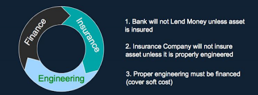

# All Risk is Good Risk

## Introductory Question and Answer with the Audience

* Hands up who has a Smartphone in the room.
* Hands up who can be 100% sure that the metals in their phone weren't mined with slave labor.
  * If anyone has a Fairphone congratulate them.
  * Anyone with a Google or Apple phone, ask them how they know. They don't.
  * Mostly consumers don't know, because most manufacturers are incentivised not to share and particularly information pertaining to slave labor, pertaining to liability in general.
* How many of you, as regulators and civil servants, have had to deal with businesses hiding or losing data pertaining to liabilities and risks in the past?
  * Joke if only a few people put their hand up 'what isn't that your job? did I turn up to the wrong workshop today?'
  * Joke if everyone/most puts their hand up 'Good, you're in the right place this morning'
* OK, so before we even talk about Bitcoin, let's talk about important data and why people have incentives not to share it, with you, even, Central Banks and Security's Regulators. Let's start by putting yourselves in the shoes of those who cause the most problems for you.

## Big Short Movie Clip

* This is what happens when nobody's looking at the risk, when the market is leaving it up to regulators, and regulators are leaving it up to the market: the 2008 Financial Crisis.



## Margin Call Movie Clip

* Risk for whom, and why? Is it better to be first in the market, or is it better to be smarter, or is it better to try to cheat? What would you prefer the market rewarded?



Today's moving day. Everything must go. Let's have a breakout session.

## Breakout Session 1: Data Pertaining to Liabilities and Risks

* For anyone who's watched the movie The Big Short, or the movie Margin Call, explain the risk that the protagonists saw that the regulators failed to see.
  * Explain the incentives of regulators, market participants and the central bank up until the 2008 market crash, either according to your own real world understanding, or just the movies.
  * Who was most to blame for the crisis and why? make a 5 minute presentation as a group detailing your findings.
  * Perhaps you think it was the result of systemic failings, detail such failings in a 5 minute presentation.

## OK, But So What?

* Where does all your data pertaining to generalised market risk currently reside?
* What systems ensure of the provenance and completeness of this data?
* What industries does this data currently exist across, and how much visibility of that risk data do you have relative to what would be ideal?
* Do employees, or anyone with data pertaining to material risks, have the right incentives in place for them to share that data for the benefit of the general market?
* What barriers did the characters in the movies The Big Short and Margin Call have to overcome in order to share salient material risk data? How did the profit motivate affect their willingness to share or withhold?
* How do those same incentives pertain the Louis Ranieri's original creation of the Mortage Backed Security, or Michael Milken's inception of the 'Junk Bond' market?
* What's the common thread, the common theme across all these things? YOU, as regulators and as the Central Bank, and the systems that give you visibility of all these things!

Here's the current best understanding from the Engineering profession. Engineers manage material facts pertaining to material risks as their job, day to day, their signatures, upon which they rely to earn a living, depend upon certifying material facts to insurable criteria every day. These insights for regulators are valuable.


Daniel Robles presentation to the National Society of Professional Engineers in July 2016


## Main Takeaway

In all senses of signing off documentation to verify that physical assets exist in a verified state, pertaining to insure-ability and therefore investment: all the infrastructure, the real estate, electricity and power stations, oil and gas, factories, bridges, roads, all the physical stuff underpinning financial markets and providing collateral, and therefore liquidity, it's the engineers' signature that instantiates that as an asset.

* Financial data, risk data and engineering data are currently silo-ed, but all of that data pertains to the value proposition of any asset
* The current way money and data work can unconsciously reify the existing data structure, where people serve data as opposed to data serving people
* There's no such thing as good and bad when it comes to asset data, there is just the asset value proposition. The clearer and more transparent the value proposition, in general, the more effective and efficient the market, the more liquidity will be attracted to it.
* Where competition meets information asymmetry there is hierarchy
* Information asymmetry and competition can create moral hazard, Bitcoin can change the dynamic of moral hazard into a dynamic of teaching (supply of data), learning (demand for data) and collaboration (production factor).
* The internet shows us that hierachies can and often will be replaced by networks
* Networks value scale according to Metcalfe and Reid's Laws (parabolic and exponential value scaling) and are more adaptable, Bitcoin allows for networks of information pertaining to the value of that information, particularly pertaining to material facts and risks

## Breakout Session 2

* What barriers currently exist between the state of assets and collateral from an engineers' perspective, vs the state of assets and collateral from a central bank or securities regulation perspective? How much direct visibility and statistical significance of that data is there?
* How is this data currently siloed, and what is the current hierarchy of that data?
* From inspection, what are your opinions with respect to this model of finance and investment

<figure><figcaption>
Dan Robles' Virtuous Circle of Investment
</figcaption></figure>

* For those familiar with the work of Robert Solow, how does the above relate to Solow's view of economic growth primarily coming as a result of technological improvement? Agree or disagree?

## Main Takeaway

A bad credit rating is better than no credit rating, accurate data about a dilapidated asset is better than no data about any asset. But people would rather often hide, lose or not share data that makes themselves or their own group look bad, or 'memory hole' data about mistakes in the past. This is in addition to structural ineffectiveness in terms of current prevailing data ontologies. Bitcoin can create new incentives to ensure that ensure that there's an logical economic reason to share more data, with no possibility for a 'memory hole' or at the very least proof that data was lost at a specific time, under the control of a specific identity. We'll explain a bit about this in the next session.
