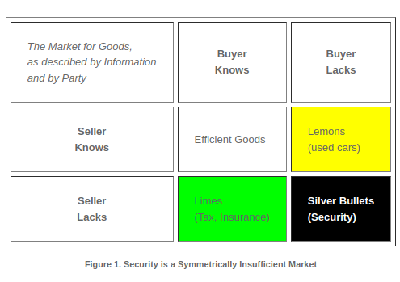

# Pricing in Securities and Finance

## Lemons, Limes and Silver Bullets

<figure><figcaption>
 If Markets Were Always Efficient, They Wouldn't Need Regulation, Credit - Ian Grigg
</figcaption></figure>

While you might not think that Lemon and Lime problems are specifically an important issue for the Central Bank and the SEC, that commonly accepted regulatory structures trim the distribution curve of knowledge asymmetry to a 'happy medium', I'd like to challenge you on that today, and let's treat this like a Silver Bullet security problem, where I don't have to trust you, and you don't have to trust me, let's just use a few examples and do some thought experiments together in some breakout sessions.



## Key Takeaways

* An anti-fragile investment can be like disruptive technological innovation, or take advantage of structural fragility is markets for risk and data pertaining to risk
* Nassim Taleb was controversial because of his ability to unpack many of the logical fallacies that caused the 2008 financial crisis
* For efficient and effective economies it is both good to attract the liquidity of investors like Nassim Taleb, because that liquidity self-regulates high consequence, low probability market risks, risks that do not exhibit a normal statistical distribution
* With a permission-less blockchain, it is also possible to create new definitions of supply of and demand for data about material facts and material risks, on a level playing field where there were none before, and measure the information, knowledge, innovation and wisdom gained through collaboration within the information network.

## Concentration of Informational Asymmetry&#x20;

* What do you know about concentration of information asymmetry, the sort of concentration that leads to 'Black Swan' event?
* How might Bitcoin, knowing what you know about it, help you to measure that better, measure the higher order economic effects that markets are currently not good at managing?
* Conceptualise how Bitcoin might be used to create these systems, facilitators will help you.

## Reference reading:

[The Market for Silver Bullets, Ian Grigg, 2017](https://www.iang.org/papers/market_for_silver_bullets.html)

[Insurance: Blockchain's Highest Use Case, National Association of Insurance Commissioners' Center for Insurance Policy and Research, 2016](https://bico.media/6338aa78e9439a31836a42eb6b73f565223bf761d6fee92665fd06bec2c075fb)

