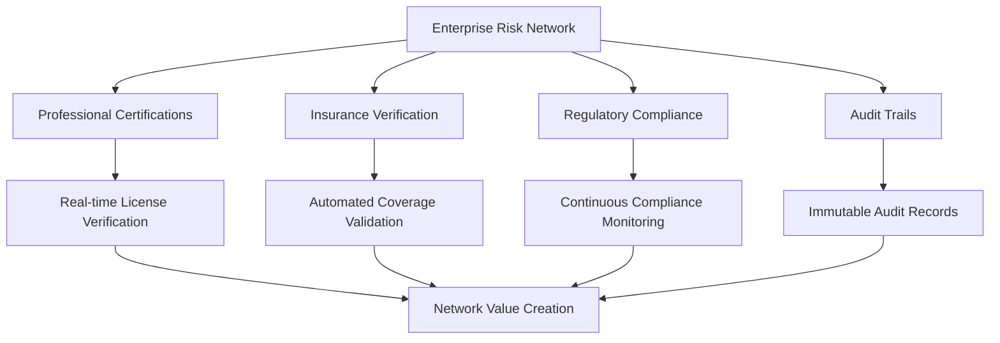
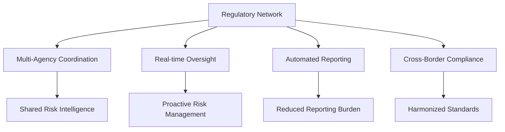
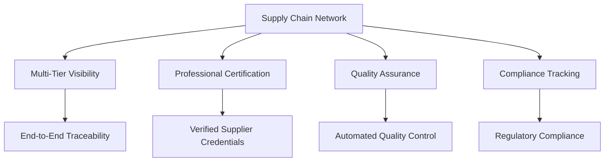

# Step 1: Enterprise Architecture

## The Enterprise Architecture Challenge

Modern enterprises face an unprecedented crisis in risk visibility and system integration. Critical business data exists in silos, hidden from decision makers when they need it most. Traditional blockchain solutions promise transparency but fail to deliver enterprise-grade scalability, regulatory compliance, and professional accountability.

**The fundamental question**: How can enterprise architecture enable rather than hinder business growth while managing systemic risks?

## Why BSV Blockchain Transforms Enterprise Architecture

### The Professional Risk Foundation

Every piece of infrastructure your enterprise depends on requires professional signatures certifying it's safe to insure. Yet these critical risk certifications exist in silos, invisible to enterprise architecture and regulatory oversight.

BSV blockchain provides the infrastructure to transform isolated risk certifications into collaborative networks that scale exponentially—connecting professional risk data across transportation, electricity, housing, finance, healthcare, and legal systems.

### Dan Robles' Virtuous Circle of Investment

Professional engineering certification → insurance → investment → economic growth

This isn't just theory—it's the foundation of all economic activity. BSV enables this virtuous circle at network scale:

* **Professional Certification**: Real-time verification of engineering licenses and professional liability
* **Insurance Enablement**: Transparent risk data enables accurate insurance pricing and coverage
* **Investment Facilitation**: Verified risk profiles enable confident capital allocation
* **Economic Growth**: Network effects create exponential value for all participants

### Network Effects for Enterprise Value

Unlike traditional enterprise systems that create value linearly, BSV risk networks create value exponentially through Metcalfe's Law—value increases with the square of network participants.

**Traditional Enterprise Architecture**: Each system integration creates isolated value**BSV Network Architecture**: Each participant increases value for all participants

## BSV's Enterprise Architecture Advantages

### 1. Unlimited Scalability by Design

**The Problem**: Traditional blockchains hit scalability walls that make enterprise adoption impossible.

**BSV Solution**:

* Unlimited block size enables enterprise-scale transaction volumes
* Linear scaling with hardware improvements
* No artificial throughput constraints
* Proven capability for millions of transactions per second

**Enterprise Impact**: Build for current needs while ensuring future scalability without architectural rewrites.

### 2. Regulatory Compliance by Design

**The Problem**: Most blockchains are designed to avoid regulation, creating compliance nightmares for enterprises.

**BSV Solution**:

* Protocol designed for regulatory compliance from day one
* Built-in identity and audit capabilities
* Legal-tech alignment for court-ordered asset recovery
* Network access rules for regulatory enforcement

**Enterprise Impact**: Reduce compliance costs while enhancing regulatory relationships.

### 3. Professional Liability Integration

**The Problem**: Enterprise systems lack integration with professional certification and liability frameworks.

**BSV Solution**:

* Real-time professional certification verification
* Integration with professional liability insurance
* Transparent risk assessment and management
* Professional accountability at network scale

**Enterprise Impact**: Transform compliance from cost center to competitive advantage.

### 4. Predictable Economics

**The Problem**: Volatile transaction fees make enterprise planning impossible.

**BSV Solution**:

* Stable, predictable transaction fees (fractions of a cent)
* No artificial scarcity driving up costs
* Economic model aligned with enterprise needs
* Transparent fee structure for budgeting

**Enterprise Impact**: Accurate cost modeling and budget planning for blockchain initiatives.

## Enterprise Architecture Patterns with BSV

### Pattern 1: Risk Transparency Networks

Transform isolated risk management into collaborative networks:

**Value Creation**: Each participant's risk transparency increases value for all participants.

### Pattern 2: Regulatory Coordination Networks

Enable cross-agency regulatory coordination:

**Value Creation**: Regulatory efficiency creates competitive advantages for compliant enterprises.

### Pattern 3: Supply Chain Transparency Networks

Transform supply chain risk management:

**Value Creation**: Shared verification reduces costs while improving quality and compliance.

## Implementation Considerations

### Technical Architecture

**Multi-Tier Design**: BSV integrates seamlessly with existing enterprise architecture patterns:

* **Client Tier**: Web and mobile applications with BSV integration
* **API Tier**: RESTful APIs with blockchain data access
* **Service Tier**: Business logic with BSV transaction processing
* **Data Tier**: Traditional databases with blockchain audit trails
* **Blockchain Tier**: BSV nodes and overlay services

### Integration Approaches

**API-Led Integration**: Layer BSV capabilities through existing API management**Event-Driven Integration**: Use BSV for immutable event sourcing and audit trails**Middleware Integration**: Integrate BSV through enterprise service bus platforms**Direct Integration**: Embed BSV SDKs directly into enterprise applications

### Scalability Planning

**Horizontal Scaling**: BSV scales linearly with hardware improvements**Performance Optimization**: Leverage BSV's unlimited throughput capabilities**Cost Management**: Predictable transaction fees enable accurate cost modeling**Future-Proofing**: No protocol limitations on enterprise growth

## Risk Management Benefits

### Systemic Risk Reduction

**Traditional Approach**: Risk management in silos creates systemic vulnerabilities**BSV Approach**: Network-wide risk visibility enables proactive management

### Professional Accountability

**Traditional Approach**: Professional certifications verified manually and infrequently**BSV Approach**: Real-time professional certification and liability verification

### Regulatory Compliance

**Traditional Approach**: Reactive compliance with manual reporting**BSV Approach**: Proactive compliance with automated reporting and real-time oversight

### Audit and Transparency

**Traditional Approach**: Periodic audits with limited scope**BSV Approach**: Continuous audit with comprehensive transparency

## Business Case for BSV Enterprise Architecture

### Cost Reduction

* **Compliance Costs**: 40-60% reduction through automated compliance and shared verification
* **Audit Costs**: 50-70% reduction through continuous audit and immutable records
* **Integration Costs**: 30-50% reduction through standardized blockchain interfaces
* **Risk Management Costs**: 20-40% reduction through network-wide risk visibility

### Revenue Enhancement

* **New Business Models**: Network effects enable new revenue streams
* **Competitive Advantage**: Early adoption creates sustainable competitive advantages
* **Market Access**: Regulatory compliance enables access to new markets
* **Innovation Acceleration**: BSV platform enables rapid innovation and deployment

### Risk Mitigation

* **Systemic Risk**: Network-wide visibility reduces systemic risk exposure
* **Regulatory Risk**: Built-in compliance reduces regulatory penalties
* **Operational Risk**: Automated processes reduce human error
* **Reputational Risk**: Transparency and accountability enhance reputation

## Getting Started with BSV Enterprise Architecture

### Assessment Phase

1. **Current State Analysis**: Evaluate existing architecture and risk management
2. **Use Case Identification**: Identify high-value BSV applications
3. **Stakeholder Alignment**: Align technical and business stakeholders
4. **Regulatory Mapping**: Understand regulatory requirements and opportunities

### Planning Phase

1. **Architecture Design**: Design BSV integration with existing systems
2. **Implementation Roadmap**: Plan phased implementation approach
3. **Resource Planning**: Identify technical and business resources needed
4. **Risk Assessment**: Evaluate implementation risks and mitigation strategies

### Pilot Phase

1. **Proof of Concept**: Implement limited-scope BSV integration
2. **Value Demonstration**: Measure and document value creation
3. **Stakeholder Feedback**: Gather feedback from technical and business users
4. **Optimization**: Refine approach based on pilot learnings

## Next Steps

### Immediate Actions

1. **Complete Enterprise Assessment**: Use our [Risk Assessment Framework](resources/tools-templates.md#risk-assessment) to evaluate your current state
2. **Identify Priority Use Cases**: Focus on high-value, low-risk applications for initial implementation
3. **Engage Stakeholders**: Build consensus among technical and business stakeholders
4. **Plan Pilot Implementation**: Design a limited-scope pilot to demonstrate value

### Continue Your Learning Journey

Ready to dive deeper into BSV enterprise adoption? Continue with:

* [**Deployment Strategies**](deployment-strategies.md): Learn how to deploy BSV in enterprise environments
* [**Integration Patterns**](integration-patterns.md): Explore technical integration approaches
* [**Regulatory Compliance**](regulatory-compliance.md): Understand compliance benefits and requirements
* [**Governance & Risk**](governance-risk.md): Implement governance frameworks for BSV adoption
* [**Security & Audit**](security-audit.md): Ensure security and audit compliance

### Comprehensive Learning Path

For a complete understanding of BSV enterprise adoption, explore our full curriculum:

* [**Module 1: Risk Visibility Crisis**](01-risk-visibility-crisis/): Understand the fundamental problem BSV solves
* [**Module 2: Network Effect Solution**](02-network-effect-solution/): Learn how network effects create exponential value
* [**Module 3: BSV Risk Infrastructure**](03-bsv-risk-infrastructure/): Explore BSV's technical capabilities
* [**Module 4: Implementation Strategy**](04-implementation-strategy/): Develop implementation strategies
* [**Module 5: Case Studies**](05-case-studies/): Learn from forward-looking implementation scenarios

## Key Takeaways

* **BSV transforms enterprise architecture** by enabling risk transparency networks that create exponential value
* **Professional certification integration** provides the trust foundation for enterprise risk management
* **Regulatory compliance by design** reduces costs while enhancing regulatory relationships
* **Unlimited scalability** ensures your architecture can grow with your business
* **Network effects** create competitive advantages that compound over time

BSV blockchain isn't just another technology—it's the infrastructure for transforming enterprise risk management from isolated silos into collaborative networks that serve enterprise, regulatory, and societal needs.

***

_Ready to explore how BSV can transform your enterprise architecture? Continue to_ [_Deployment Strategies_](deployment-strategies.md) _to learn about implementation approaches._
