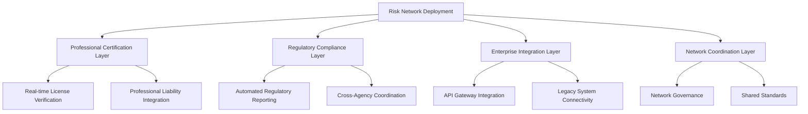
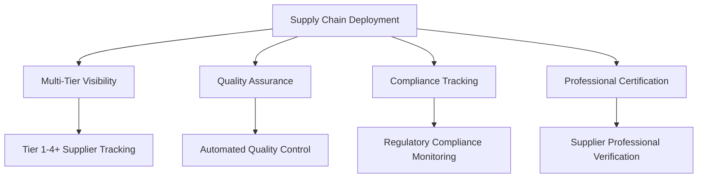
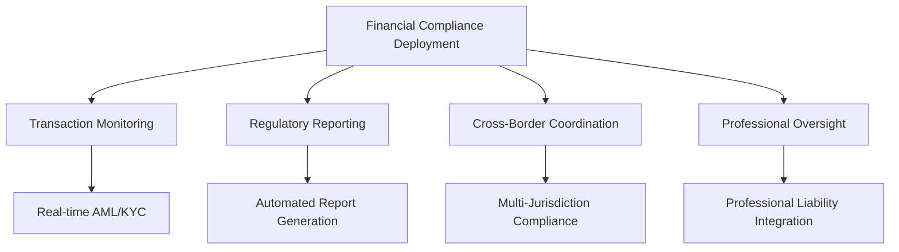

# Step 2: Deployment Strategies

## The Enterprise Deployment Challenge

Traditional blockchain deployments face impossible trade-offs: scalability vs. decentralization, compliance vs. innovation, cost vs. performance. Enterprise teams struggle with unpredictable fees, limited throughput, and regulatory uncertainty that make production deployment a nightmare.

**The critical question**: How can enterprises deploy blockchain solutions that actually work at scale while meeting regulatory and operational requirements?

## Why BSV Transforms Enterprise Deployment

### Predictable, Enterprise-Grade Performance

Unlike other blockchains that hit scalability walls, BSV is designed for enterprise deployment from day one:

* **Unlimited Scalability**: No artificial limits on transaction throughput
* **Predictable Costs**: Transaction fees measured in fractions of cents, not dollars
* **Linear Scaling**: Performance scales predictably with hardware improvements
* **Enterprise SLAs**: Capable of meeting enterprise service level agreements

### Regulatory Deployment Confidence

BSV's compliance-by-design approach eliminates deployment uncertainty:

* **Legal Certainty**: Protocol stability provides long-term legal planning confidence
* **Regulatory Integration**: Built-in features for regulatory oversight and compliance
* **Professional Accountability**: Integration with professional certification and liability frameworks
* **Audit Readiness**: Immutable audit trails and transparent operations

### Network Effect Deployment Strategy

BSV deployments create exponential value through network effects:

* **Shared Infrastructure**: Participants benefit from shared network infrastructure
* **Collective Intelligence**: Network-wide risk intelligence and early warning systems
* **Standardized Interfaces**: Common APIs and data formats across the network
* **Collaborative Value**: Each participant increases value for all participants

## BSV Deployment Models for Enterprise

### 1. Risk Transparency Network Deployment

Deploy BSV to create industry-wide risk transparency networks:

**Deployment Benefits**:

* Shared verification reduces individual compliance costs
* Network effects create competitive advantages
* Regulatory relationships improve through transparency
* Professional accountability enhances trust and reduces risk

### 2. Supply Chain Transparency Deployment

Deploy BSV for end-to-end supply chain visibility:

**Deployment Benefits**:

* End-to-end traceability without performance bottlenecks
* Shared supplier verification reduces due diligence costs
* Real-time compliance monitoring prevents violations
* Professional certification integration ensures quality

### 3. Financial Services Compliance Deployment

Deploy BSV for comprehensive financial compliance:

**Deployment Benefits**:

* Automated compliance reduces manual overhead
* Real-time monitoring prevents violations
* Cross-border coordination simplifies international operations
* Professional oversight enhances regulatory relationships

## Deployment Architecture Patterns

### Pattern 1: Hybrid Enterprise Deployment

Combine on-premises control with cloud scalability:

**On-Premises Components**:

* Critical BSV nodes for data sovereignty
* Sensitive data processing and storage
* Core business logic and integration
* Professional certification verification

**Cloud Components**:

* Scalable API services and web applications
* Analytics and reporting systems
* Backup and disaster recovery
* Development and testing environments

**Benefits**:

* Data sovereignty for sensitive information
* Cloud scalability for variable workloads
* Cost optimization through hybrid resource allocation
* Regulatory compliance through controlled deployment

### Pattern 2: Multi-Cloud BSV Deployment

Leverage multiple cloud providers for resilience and optimization:

**Provider Specialization**:

* **Provider A**: Primary BSV node infrastructure and core services
* **Provider B**: Analytics and machine learning capabilities
* **Provider C**: Geographic distribution and edge computing
* **Provider D**: Backup and disaster recovery services

**Benefits**:

* Vendor diversification reduces risk
* Best-of-breed services for different capabilities
* Geographic resilience and performance optimization
* Negotiation leverage and cost optimization

### Pattern 3: Network Consortium Deployment

Deploy as part of industry consortium for maximum network effects:

**Consortium Infrastructure**:

* Shared BSV node infrastructure
* Common API standards and interfaces
* Unified governance and standards
* Collective security and monitoring

**Individual Enterprise Components**:

* Private business logic and data processing
* Custom integrations and user interfaces
* Proprietary analytics and reporting
* Internal governance and controls

**Benefits**:

* Shared infrastructure costs
* Network effects from day one
* Industry-standard interfaces and protocols
* Collective bargaining power with vendors

## BSV Deployment Advantages

### 1. Simplified Infrastructure Requirements

**Traditional Blockchain Challenges**:

* Complex consensus mechanisms requiring specialized infrastructure
* Unpredictable resource requirements due to network congestion
* Expensive hardware requirements for mining or staking
* Complex networking and security configurations

**BSV Advantages**:

* Simple node deployment with standard server hardware
* Predictable resource requirements based on transaction volume
* No mining infrastructure required for enterprise nodes
* Standard networking and security practices apply

### 2. Predictable Performance and Costs

**Traditional Blockchain Challenges**:

* Unpredictable transaction fees make budgeting impossible
* Network congestion causes performance degradation
* Scaling requires complex layer-2 solutions
* Performance varies unpredictably with network conditions

**BSV Advantages**:

* Stable transaction fees (fractions of cents) enable accurate budgeting
* Linear performance scaling with hardware improvements
* No layer-2 complexity required for enterprise scale
* Consistent performance regardless of network conditions

### 3. Enterprise Integration Simplicity

**Traditional Blockchain Challenges**:

* Complex integration with existing enterprise systems
* Limited API capabilities and data access patterns
* Incompatible with enterprise security and compliance requirements
* Difficult to integrate with professional certification systems

**BSV Advantages**:

* Standard REST APIs and integration patterns
* Rich data capabilities and flexible access patterns
* Built-in compliance and audit capabilities
* Native integration with professional certification frameworks

### 4. Operational Excellence

**Traditional Blockchain Challenges**:

* Complex operational procedures and monitoring
* Limited tooling for enterprise operations
* Difficult troubleshooting and performance optimization
* Unclear upgrade and maintenance procedures

**BSV Advantages**:

* Standard operational procedures and monitoring tools
* Enterprise-grade tooling and management capabilities
* Clear troubleshooting and optimization procedures
* Predictable upgrade and maintenance processes

## Deployment Planning Framework

### Phase 1: Assessment and Planning (1-2 months)

**Infrastructure Assessment**:

* Current infrastructure capabilities and constraints
* Network and security requirements
* Integration points with existing systems
* Regulatory and compliance requirements

**Use Case Prioritization**:

* High-value, low-risk use cases for initial deployment
* Network effect opportunities and partnership potential
* Regulatory benefits and compliance improvements
* Cost-benefit analysis and ROI projections

**Deployment Strategy Selection**:

* On-premises vs. cloud vs. hybrid deployment models
* Single-cloud vs. multi-cloud strategies
* Individual vs. consortium deployment approaches
* Phased deployment timeline and milestones

### Phase 2: Architecture and Design (2-3 months)

**Technical Architecture**:

* BSV node deployment architecture and configuration
* Integration architecture with existing systems
* API design and data flow patterns
* Security architecture and access controls

**Network Design**:

* Network topology and connectivity requirements
* Load balancing and high availability design
* Disaster recovery and business continuity planning
* Monitoring and observability architecture

**Compliance Design**:

* Regulatory compliance architecture and controls
* Audit trail design and implementation
* Professional certification integration
* Data governance and privacy controls

### Phase 3: Implementation and Testing (3-6 months)

**Infrastructure Deployment**:

* BSV node deployment and configuration
* Network infrastructure and security implementation
* Integration development and testing
* Monitoring and management system deployment

**Testing and Validation**:

* Functional testing of BSV integration
* Performance testing and optimization
* Security testing and vulnerability assessment
* Compliance testing and audit preparation

**Pilot Deployment**:

* Limited-scope pilot with selected use cases
* User acceptance testing and feedback collection
* Performance monitoring and optimization
* Issue resolution and process refinement

### Phase 4: Production Deployment (1-2 months)

**Production Rollout**:

* Phased production deployment
* User training and change management
* Performance monitoring and optimization
* Issue resolution and support processes

**Network Integration**:

* Integration with industry networks and consortiums
* Professional certification verification setup
* Regulatory reporting and compliance activation
* Network effect realization and measurement

## Risk Management in BSV Deployment

### Technical Risk Mitigation

**Infrastructure Resilience**:

* Redundant BSV node deployment across multiple availability zones
* Automated backup and disaster recovery procedures
* Load balancing and failover capabilities
* Comprehensive monitoring and alerting systems

**Security Controls**:

* Defense-in-depth security architecture
* Regular security assessments and penetration testing
* Incident response and recovery procedures
* Professional certification and access controls

### Operational Risk Mitigation

**Change Management**:

* Structured change management processes
* Comprehensive testing and validation procedures
* Rollback capabilities and contingency planning
* User training and support processes

**Performance Management**:

* Capacity planning and performance monitoring
* Automated scaling and optimization
* Performance testing and validation
* Service level agreement monitoring

### Regulatory Risk Mitigation

**Compliance Assurance**:

* Built-in compliance controls and monitoring
* Regular compliance assessments and audits
* Regulatory relationship management
* Professional certification integration

**Legal Risk Management**:

* Clear legal framework and documentation
* Intellectual property protection
* Contract and service level agreement management
* Dispute resolution procedures

## Measuring Deployment Success

### Technical Metrics

* **Performance**: Transaction throughput, response times, system availability
* **Scalability**: Linear scaling validation, capacity utilization
* **Reliability**: System uptime, error rates, recovery times
* **Security**: Security incident frequency, vulnerability remediation times

### Business Metrics

* **Cost Reduction**: Infrastructure costs, operational costs, compliance costs
* **Revenue Enhancement**: New business opportunities, competitive advantages
* **Risk Mitigation**: Risk reduction, compliance improvements, audit efficiency
* **Network Effects**: Network participation growth, shared value creation

### Network Effect Metrics

* **Participation Growth**: Number of network participants and transaction volume
* **Value Creation**: Shared verification savings, collective intelligence benefits
* **Standards Adoption**: Common interface usage, interoperability improvements
* **Ecosystem Development**: New services and capabilities enabled by the network

## Next Steps for BSV Deployment

### Immediate Actions

1. **Complete Deployment Assessment**: Evaluate your current infrastructure and deployment requirements
2. **Identify Deployment Model**: Choose the deployment approach that best fits your needs
3. **Plan Pilot Implementation**: Design a limited-scope pilot to validate your deployment strategy
4. **Engage Network Partners**: Identify potential consortium partners for network effect realization

### Continue Your Learning Journey

Ready to explore specific implementation approaches? Continue with:

* [**Integration Patterns**](integration-patterns.md): Learn technical integration strategies
* [**Regulatory Compliance**](regulatory-compliance.md): Understand compliance deployment requirements
* [**Governance & Risk**](governance-risk.md): Implement governance for deployment success
* [**Security & Audit**](security-audit.md): Ensure secure deployment practices

### Comprehensive Learning Path

For complete BSV enterprise deployment knowledge, explore our full curriculum:

* [**Module 1: Risk Visibility Crisis**](01-risk-visibility-crisis/): Understand the deployment problem BSV solves
* [**Module 2: Network Effect Solution**](02-network-effect-solution/): Learn how network deployment creates value
* [**Module 3: BSV Risk Infrastructure**](03-bsv-risk-infrastructure/): Explore BSV's deployment capabilities
* [**Module 4: Implementation Strategy**](04-implementation-strategy/): Develop comprehensive deployment strategies
* [**Module 5: Case Studies**](05-case-studies/): Learn from deployment scenarios

## Key Takeaways

* **BSV eliminates traditional blockchain deployment challenges** through unlimited scalability and predictable costs
* **Network effect deployment strategies** create exponential value through shared infrastructure and standards
* **Regulatory compliance by design** reduces deployment risk and enhances regulatory relationships
* **Enterprise-grade operational capabilities** enable production deployment with confidence
* **Phased deployment approaches** minimize risk while maximizing learning and value realization

BSV deployment isn't just about technology—it's about creating network effects that transform entire industries through shared risk transparency and professional accountability.

***

_Ready to explore technical integration approaches? Continue to_ [_Integration Patterns_](integration-patterns.md) _to learn about connecting BSV with your existing systems._
