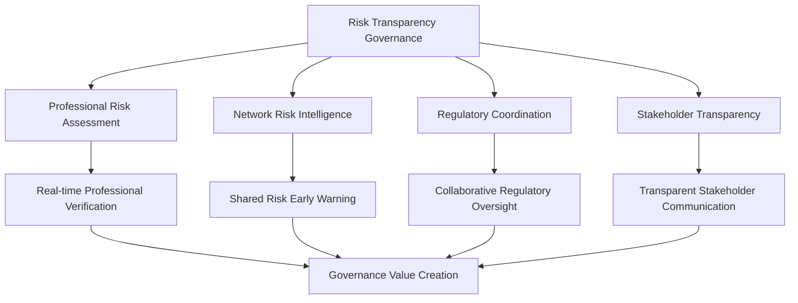
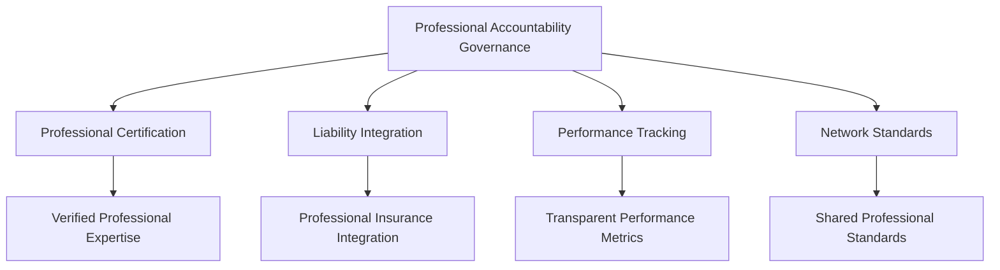
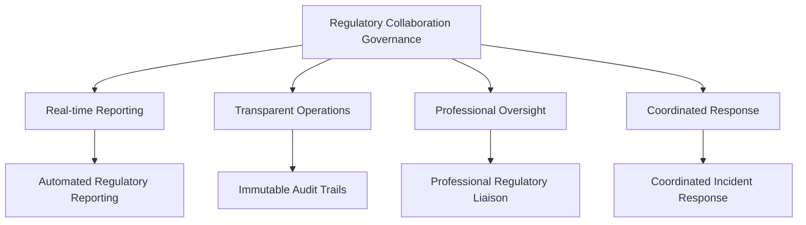

# Governance & Risk Management for BSV Enterprise

## The Enterprise Governance Challenge

Traditional enterprise governance struggles with information asymmetry—critical risk data hidden in silos when decision makers need it most. Risk management becomes reactive rather than proactive, compliance becomes a cost center rather than competitive advantage, and professional accountability becomes bureaucratic overhead rather than value creation.

**The governance question**: How can enterprise governance transform from defensive cost management to proactive value creation?

## Why BSV Transforms Enterprise Governance

### Professional Risk Certification as Governance Foundation

Every piece of infrastructure your enterprise depends on requires professional signatures certifying it's safe to insure. BSV transforms these isolated professional certifications into the foundation of enterprise governance:

- **Real-time Professional Verification**: Instant verification of professional licenses and certifications
- **Professional Liability Integration**: Direct connection to professional insurance and liability coverage
- **Transparent Risk Assessment**: Professional risk assessments visible to all stakeholders
- **Network-wide Accountability**: Professional accountability that scales across enterprise networks

### Dan Robles' Virtuous Circle Applied to Governance

Professional certification → insurance → investment → economic growth

BSV enables this virtuous circle at enterprise governance scale:

- **Professional Governance**: Governance decisions backed by verified professional expertise
- **Risk-Based Insurance**: Transparent risk data enables accurate insurance and coverage
- **Confident Investment**: Verified governance enables confident capital allocation and strategic decisions
- **Sustainable Growth**: Network effects create sustainable competitive advantages

### Network Effects for Governance Value

Traditional governance creates value linearly—each control adds incremental protection. BSV governance networks create value exponentially through Metcalfe's Law:

**Traditional Governance**: Each control protects only your organization
**BSV Network Governance**: Each participant's governance improvements benefit all participants

## BSV Governance Advantages

### 1. Proactive Risk Management

**Traditional Challenge**: Risk management is reactive, responding to problems after they occur.

**BSV Solution**:
- Real-time risk visibility across professional networks
- Early warning systems based on network-wide risk intelligence
- Predictive risk models using shared professional assessments
- Coordinated risk response across network participants

**Enterprise Impact**: Transform from reactive crisis management to proactive risk prevention.

### 2. Professional Accountability at Scale

**Traditional Challenge**: Professional accountability is limited to individual relationships and contracts.

**BSV Solution**:
- Network-wide professional certification verification
- Real-time professional liability insurance validation
- Transparent professional performance tracking
- Shared professional risk assessments

**Enterprise Impact**: Professional accountability becomes a competitive advantage rather than compliance burden.

### 3. Regulatory Relationship Enhancement

**Traditional Challenge**: Adversarial relationships with regulators based on information asymmetry.

**BSV Solution**:
- Transparent operations and immutable audit trails
- Real-time regulatory reporting and compliance monitoring
- Professional certification integration for regulatory confidence
- Collaborative approach to regulatory oversight

**Enterprise Impact**: Transform regulatory relationships from adversarial to collaborative partnerships.

### 4. Governance Cost Optimization

**Traditional Challenge**: Governance costs scale linearly with business complexity and regulatory requirements.

**BSV Solution**:
- Shared verification reduces individual governance costs
- Automated compliance monitoring and reporting
- Network-wide risk intelligence and early warning systems
- Collaborative governance frameworks

**Enterprise Impact**: Governance becomes a profit center through network effects and efficiency gains.

## Governance Patterns with BSV

### Pattern 1: Risk Transparency Governance

Create governance frameworks based on transparent risk assessment:

**Governance Benefits**:
- Professional expertise backing all governance decisions
- Network-wide risk intelligence for better decision-making
- Enhanced regulatory relationships through transparency
- Stakeholder confidence through verifiable governance

### Pattern 2: Professional Accountability Governance

Build governance on professional certification and liability:

**Governance Benefits**:
- Governance decisions backed by verified professional expertise
- Professional liability insurance provides additional risk protection
- Performance tracking enables continuous improvement
- Network standards create consistency and efficiency

### Pattern 3: Regulatory Collaboration Governance

Enable collaborative governance with regulatory authorities:

**Governance Benefits**:
- Enhanced regulatory relationships through transparency
- Reduced regulatory burden through automated reporting
- Professional oversight provides regulatory confidence
- Coordinated response improves regulatory outcomes

## Risk Management Transformation

### From Reactive to Proactive

**Traditional Risk Management**:
- Wait for problems to occur
- Respond to crises after they happen
- Limited visibility into emerging risks
- Isolated risk assessment and response

**BSV Risk Management**:
- Predict and prevent problems before they occur
- Proactive risk mitigation based on network intelligence
- Real-time visibility into emerging risks across the network
- Coordinated risk assessment and response

### From Cost Center to Value Creator

**Traditional Risk Management**:
- Risk management seen as necessary cost
- Compliance burden without business value
- Defensive approach focused on avoiding problems
- Limited stakeholder value creation

**BSV Risk Management**:
- Risk management creates competitive advantages
- Compliance becomes a business differentiator
- Proactive approach focused on creating value
- Network effects create stakeholder value

### From Individual to Collaborative

**Traditional Risk Management**:
- Each organization manages risk independently
- Limited sharing of risk intelligence
- Duplicated risk assessment efforts
- Competitive disadvantage from information asymmetry

**BSV Risk Management**:
- Collaborative risk management across networks
- Shared risk intelligence and early warning systems
- Collective risk assessment and mitigation
- Competitive advantage from network participation

## Governance Implementation Framework

### Phase 1: Governance Assessment (1-2 months)

**Current State Analysis**:
- Existing governance frameworks and processes
- Risk management capabilities and limitations
- Professional certification and accountability systems
- Regulatory relationships and compliance status

**BSV Governance Opportunities**:
- Professional certification integration opportunities
- Network effect potential and partnership possibilities
- Regulatory relationship enhancement opportunities
- Risk management transformation potential

### Phase 2: Governance Design (2-3 months)

**Professional Integration Design**:
- Professional certification verification systems
- Professional liability insurance integration
- Professional performance tracking and accountability
- Professional standards and network coordination

**Risk Management Design**:
- Real-time risk monitoring and early warning systems
- Network-wide risk intelligence and sharing
- Coordinated risk response and mitigation
- Predictive risk modeling and prevention

### Phase 3: Governance Implementation (3-6 months)

**System Implementation**:
- BSV blockchain integration for governance
- Professional certification verification systems
- Risk monitoring and intelligence systems
- Regulatory reporting and compliance automation

**Process Implementation**:
- Governance decision-making processes
- Risk assessment and mitigation procedures
- Professional accountability and performance management
- Regulatory coordination and collaboration

### Phase 4: Network Integration (1-2 months)

**Network Participation**:
- Integration with industry governance networks
- Professional certification network participation
- Regulatory coordination network engagement
- Risk intelligence sharing and collaboration

**Value Realization**:
- Governance cost reduction measurement
- Risk management improvement tracking
- Regulatory relationship enhancement
- Network effect value creation

## Measuring Governance Success

### Governance Effectiveness Metrics

- **Decision Quality**: Improvement in governance decision outcomes
- **Risk Prevention**: Reduction in risk incidents and their impact
- **Professional Accountability**: Professional performance and liability metrics
- **Regulatory Relationships**: Regulatory satisfaction and collaboration metrics

### Cost and Efficiency Metrics

- **Governance Costs**: Reduction in governance and compliance costs
- **Risk Management Efficiency**: Improvement in risk management processes
- **Professional Verification**: Efficiency gains from shared professional verification
- **Regulatory Compliance**: Reduction in compliance burden and costs

### Network Effect Metrics

- **Shared Value Creation**: Value created through network participation
- **Risk Intelligence**: Benefits from shared risk intelligence and early warning
- **Professional Standards**: Improvement from shared professional standards
- **Regulatory Coordination**: Benefits from coordinated regulatory relationships

## Business Case for BSV Governance

### Cost Reduction

- **Governance Costs**: 30-50% reduction through shared verification and automation
- **Risk Management**: 40-60% reduction through network intelligence and prevention
- **Compliance Costs**: 50-70% reduction through automated reporting and coordination
- **Professional Verification**: 60-80% reduction through shared certification systems

### Value Creation

- **Competitive Advantage**: Governance becomes a differentiator rather than cost
- **Regulatory Relationships**: Enhanced relationships create business opportunities
- **Professional Networks**: Access to professional expertise and accountability
- **Risk Intelligence**: Network-wide intelligence improves decision-making

### Risk Mitigation

- **Proactive Prevention**: Prevent problems before they occur
- **Network Intelligence**: Early warning systems reduce risk exposure
- **Professional Accountability**: Professional liability provides additional protection
- **Regulatory Compliance**: Automated compliance reduces regulatory risk

## Next Steps for BSV Governance

### Immediate Actions

1. **Complete Governance Assessment**: Evaluate your current governance and risk management
2. **Identify Professional Integration**: Map professional certification integration opportunities
3. **Plan Network Participation**: Identify governance network participation opportunities
4. **Engage Stakeholders**: Build consensus among governance and risk stakeholders

### Continue Your Learning Journey

Ready to explore regulatory compliance advantages? Continue with:

- **[Regulatory Compliance](regulatory-compliance.md)**: Understand BSV's compliance-by-design approach
- **[Security & Audit](security-audit.md)**: Learn about BSV security and audit advantages
- **[Enterprise Architecture](architecture.md)**: Review architectural considerations for governance

### Comprehensive Learning Path

For complete BSV enterprise governance knowledge, explore our full curriculum:

- **[Module 1: Risk Visibility Crisis](01-risk-visibility-crisis/README.md)**: Understand the governance problem BSV solves
- **[Module 2: Network Effect Solution](02-network-effect-solution/README.md)**: Learn how governance creates network effects
- **[Module 3: BSV Risk Infrastructure](03-bsv-risk-infrastructure/README.md)**: Explore BSV's governance capabilities
- **[Module 4: Implementation Strategy](04-implementation-strategy/README.md)**: Develop governance implementation strategies
- **[Module 5: Case Studies](05-case-studies/README.md)**: Learn from governance scenarios

## Key Takeaways

- **BSV transforms governance** from defensive cost management to proactive value creation
- **Professional certification integration** provides the trust foundation for effective governance
- **Network effects** create exponential value through shared risk intelligence and coordination
- **Regulatory relationships** improve through transparency and professional accountability
- **Governance becomes competitive advantage** rather than compliance burden

BSV governance isn't just about managing risk—it's about creating network effects that transform entire industries through shared professional accountability and transparent risk management.

---

*Ready to explore regulatory compliance advantages? Continue to [Regulatory Compliance](regulatory-compliance.md) to learn about BSV's compliance-by-design approach.*