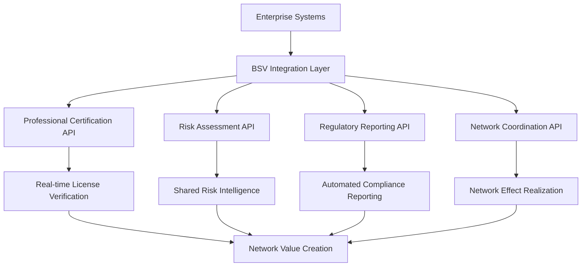
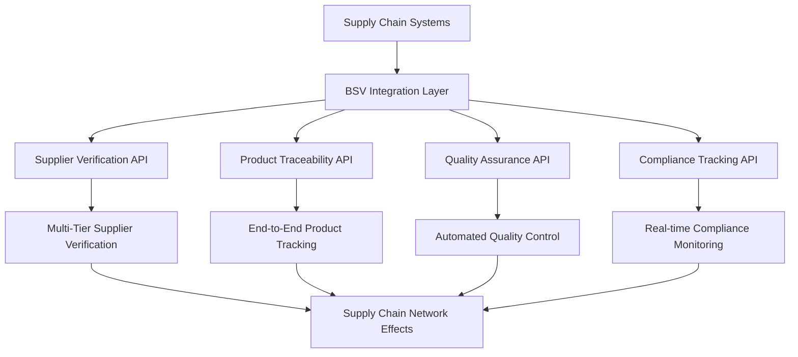
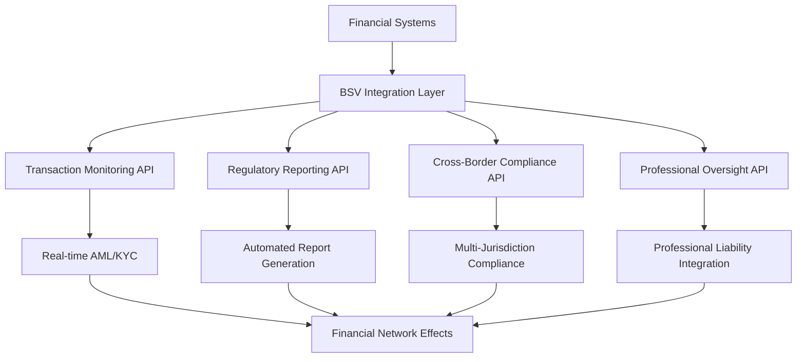

# Integration Patterns for BSV Enterprise Solutions

## The Enterprise Integration Challenge

Modern enterprises struggle with integration complexity that grows exponentially with each new system. Traditional blockchain integration adds layers of complexity—unpredictable performance, limited data capabilities, and incompatible APIs that make enterprise integration a nightmare.

**The integration question**: How can blockchain integration actually simplify rather than complicate enterprise architecture?

## Why BSV Transforms Enterprise Integration

### Rich Data and API Capabilities

Unlike other blockchains limited to simple token transfers, BSV provides enterprise-grade data capabilities:

- **Rich Transaction Data**: Store complex business data directly on-chain
- **Flexible Data Structures**: Support for any data format or business logic
- **Standard APIs**: RESTful APIs that integrate seamlessly with existing systems
- **Real-time Access**: Immediate access to transaction data and blockchain state

### Professional Certification Integration

BSV's unique capability to integrate with professional certification systems transforms enterprise integration:

- **Real-time License Verification**: Instant verification of professional certifications
- **Professional Liability Integration**: Direct integration with professional insurance systems
- **Audit Trail Automation**: Automatic generation of professional audit trails
- **Regulatory Compliance**: Built-in compliance with professional standards

### Network Effect Integration Patterns

BSV integration creates network effects that benefit all participants:

- **Shared Verification**: One verification benefits all network participants
- **Collective Intelligence**: Shared risk insights and early warning systems
- **Standardized Interfaces**: Common APIs and data formats across the network
- **Collaborative Value Creation**: Each integration increases value for all participants

## BSV Integration Advantages

### 1. Simplified API Integration

**Traditional Blockchain Challenges**:
- Complex, non-standard APIs that don't follow REST conventions
- Limited data access patterns and query capabilities
- Unpredictable performance and response times
- Incompatible with existing API management infrastructure

**BSV Advantages**:
- Standard RESTful APIs that follow enterprise conventions
- Rich query capabilities and flexible data access patterns
- Predictable performance and response times
- Compatible with existing API gateways and management tools

### 2. Enterprise Data Patterns

**Traditional Blockchain Challenges**:
- Limited to simple token transfers and basic smart contracts
- Expensive data storage makes complex business logic impractical
- Immutable data conflicts with enterprise data management requirements
- Limited support for complex business workflows

**BSV Advantages**:
- Support for complex business data and workflows
- Cost-effective data storage enables rich business logic
- Selective disclosure capabilities for enterprise privacy requirements
- Native support for complex business processes and state management

### 3. Real-time Integration Capabilities

**Traditional Blockchain Challenges**:
- Slow confirmation times make real-time integration impossible
- Network congestion causes unpredictable delays
- Limited event notification and streaming capabilities
- Difficult to integrate with real-time business processes

**BSV Advantages**:
- Near-instant transaction confirmation for real-time integration
- Consistent performance regardless of network conditions
- Rich event streaming and notification capabilities
- Seamless integration with real-time business processes

### 4. Professional System Integration

**Traditional Blockchain Challenges**:
- No integration with professional certification systems
- Limited support for professional liability and insurance
- Incompatible with regulatory oversight and audit requirements
- No connection to professional accountability frameworks

**BSV Advantages**:
- Native integration with professional certification systems
- Built-in support for professional liability and insurance verification
- Designed for regulatory oversight and audit requirements
- Direct connection to professional accountability frameworks

## Integration Patterns for Network Effects

### Pattern 1: Risk Transparency Network Integration

Integrate BSV to create industry-wide risk transparency:



**Integration Benefits**:
- Shared professional verification reduces individual verification costs
- Network-wide risk intelligence improves decision-making
- Automated compliance reduces manual reporting overhead
- Network effects create competitive advantages

### Pattern 2: Supply Chain Network Integration

Integrate BSV for end-to-end supply chain transparency:



**Integration Benefits**:
- Multi-tier supplier verification without individual due diligence
- End-to-end traceability with real-time updates
- Automated quality control and compliance monitoring
- Shared supplier intelligence across the network

### Pattern 3: Financial Services Network Integration

Integrate BSV for comprehensive financial compliance:



**Integration Benefits**:
- Real-time transaction monitoring and compliance
- Automated regulatory reporting across jurisdictions
- Cross-border compliance coordination
- Professional oversight and accountability

## API-Led Integration with BSV

### System API Layer

Connect directly to BSV blockchain with enterprise-grade APIs:

```typescript
// BSV System API for enterprise integration
interface BSVSystemAPI {
  // Transaction management
  submitTransaction(txData: TransactionData): Promise<TransactionResult>;
  queryTransaction(txid: string): Promise<TransactionDetails>;
  getTransactionHistory(address: string, filters?: QueryFilters): Promise<Transaction[]>;
  
  // Professional certification integration
  verifyProfessionalCertification(licenseId: string): Promise<CertificationStatus>;
  getProfessionalLiability(professionalId: string): Promise<LiabilityInfo>;
  
  // Risk management
  submitRiskAssessment(assessment: RiskAssessment): Promise<string>;
  queryRiskData(filters: RiskFilters): Promise<RiskData[]>;
  
  // Regulatory compliance
  generateComplianceReport(params: ReportParams): Promise<ComplianceReport>;
  submitRegulatoryData(data: RegulatoryData): Promise<string>;
}
```

### Process API Layer

Orchestrate business processes with BSV integration:

```typescript
// Process API for supply chain risk management
class SupplyChainProcessAPI {
  private bsvAPI: BSVSystemAPI;
  private inventoryAPI: InventorySystemAPI;
  private qualityAPI: QualitySystemAPI;
  
  async recordProductMovement(
    product: Product, 
    from: Location, 
    to: Location,
    certifyingProfessional: Professional
  ): Promise<MovementResult> {
    // Verify professional certification
    const certStatus = await this.bsvAPI.verifyProfessionalCertification(
      certifyingProfessional.licenseId
    );
    
    if (!certStatus.valid) {
      throw new Error('Invalid professional certification');
    }
    
    // Create movement record with professional certification
    const movementRecord = {
      productId: product.id,
      fromLocation: from.id,
      toLocation: to.id,
      certifyingProfessional: certifyingProfessional.id,
      certificationStatus: certStatus,
      timestamp: new Date(),
      qualityChecks: await this.qualityAPI.getQualityChecks(product.id)
    };
    
    // Record on BSV blockchain
    const txid = await this.bsvAPI.submitTransaction({
      type: 'PRODUCT_MOVEMENT',
      data: movementRecord
    });
    
    // Update inventory system
    await this.inventoryAPI.updateProductLocation(product.id, to.id);
    
    return {
      txid,
      movementRecord,
      networkEffects: await this.calculateNetworkEffects(movementRecord)
    };
  }
  
  private async calculateNetworkEffects(record: MovementRecord): Promise<NetworkEffects> {
    // Calculate value created for network participants
    return {
      sharedVerificationSavings: await this.calculateSharedSavings(record),
      riskIntelligenceValue: await this.calculateRiskValue(record),
      complianceEfficiencyGains: await this.calculateComplianceGains(record)
    };
  }
}
```

### Experience API Layer

Provide optimized interfaces for different consumption channels:

```typescript
// Experience API for mobile supply chain app
class MobileSupplyChainAPI {
  private processAPI: SupplyChainProcessAPI;
  
  async scanAndMoveProduct(
    productQRCode: string, 
    toLocationQRCode: string,
    professionalCredentials: ProfessionalCredentials
  ): Promise<MobileResponse> {
    // Parse QR codes and validate professional
    const product = await this.parseProductQRCode(productQRCode);
    const toLocation = await this.parseLocationQRCode(toLocationQRCode);
    const professional = await this.validateProfessional(professionalCredentials);
    
    // Get current location
    const fromLocation = await this.getCurrentLocation(product.id);
    
    // Record movement with professional certification
    const result = await this.processAPI.recordProductMovement(
      product, 
      fromLocation, 
      toLocation, 
      professional
    );
    
    // Return mobile-optimized response
    return {
      success: true,
      productName: product.name,
      newLocation: toLocation.name,
      professionalName: professional.name,
      certificationValid: true,
      confirmationCode: result.txid.substring(0, 8),
      networkValue: this.formatNetworkValue(result.networkEffects),
      timestamp: new Date().toISOString()
    };
  }
  
  private formatNetworkValue(effects: NetworkEffects): string {
    const totalValue = effects.sharedVerificationSavings + 
                     effects.riskIntelligenceValue + 
                     effects.complianceEfficiencyGains;
    return `$${totalValue.toFixed(2)} network value created`;
  }
}
```

## Event-Driven Integration with BSV

### BSV Event Streaming

Leverage BSV's rich event capabilities for real-time integration:

```typescript
// BSV Event Stream Integration
class BSVEventStreamService {
  private eventBus: EventBus;
  private bsvAPI: BSVSystemAPI;
  
  constructor(eventBus: EventBus, bsvAPI: BSVSystemAPI) {
    this.eventBus = eventBus;
    this.bsvAPI = bsvAPI;
    
    // Subscribe to BSV blockchain events
    this.subscribeToBlockchainEvents();
  }
  
  private subscribeToBlockchainEvents(): void {
    // Subscribe to professional certification events
    this.bsvAPI.subscribeToEvents('PROFESSIONAL_CERTIFICATION', (event) => {
      this.handleProfessionalCertificationEvent(event);
    });
    
    // Subscribe to risk assessment events
    this.bsvAPI.subscribeToEvents('RISK_ASSESSMENT', (event) => {
      this.handleRiskAssessmentEvent(event);
    });
    
    // Subscribe to compliance events
    this.bsvAPI.subscribeToEvents('COMPLIANCE_REPORT', (event) => {
      this.handleComplianceEvent(event);
    });
  }
  
  private async handleProfessionalCertificationEvent(event: CertificationEvent): Promise<void> {
    // Process professional certification update
    const certificationUpdate = {
      professionalId: event.professionalId,
      licenseId: event.licenseId,
      status: event.status,
      expirationDate: event.expirationDate,
      liabilityInsurance: event.liabilityInsurance,
      timestamp: event.timestamp
    };
    
    // Publish to enterprise event bus
    await this.eventBus.publish('professional.certification.updated', certificationUpdate);
    
    // Calculate network effects
    const networkEffects = await this.calculateCertificationNetworkEffects(event);
    await this.eventBus.publish('network.effects.certification', networkEffects);
  }
  
  private async handleRiskAssessmentEvent(event: RiskAssessmentEvent): Promise<void> {
    // Process risk assessment update
    const riskUpdate = {
      assessmentId: event.assessmentId,
      entityId: event.entityId,
      riskLevel: event.riskLevel,
      riskFactors: event.riskFactors,
      assessingProfessional: event.assessingProfessional,
      timestamp: event.timestamp
    };
    
    // Publish to enterprise event bus
    await this.eventBus.publish('risk.assessment.updated', riskUpdate);
    
    // Share risk intelligence with network
    const riskIntelligence = await this.generateRiskIntelligence(event);
    await this.eventBus.publish('network.risk.intelligence', riskIntelligence);
  }
}
```

## Integration with Professional Systems

### Professional Certification Integration

```typescript
// Professional certification system integration
class ProfessionalCertificationIntegration {
  private bsvAPI: BSVSystemAPI;
  private certificationRegistry: CertificationRegistry;
  
  async verifyAndRecordCertification(
    professionalId: string,
    licenseId: string,
    certificationBody: string
  ): Promise<CertificationResult> {
    // Verify with certification body
    const verification = await this.certificationRegistry.verify(
      licenseId,
      certificationBody
    );
    
    if (!verification.valid) {
      throw new Error('Invalid certification');
    }
    
    // Record verification on BSV blockchain
    const certificationRecord = {
      professionalId,
      licenseId,
      certificationBody,
      verificationDate: new Date(),
      expirationDate: verification.expirationDate,
      specializations: verification.specializations,
      liabilityInsurance: verification.liabilityInsurance,
      verificationHash: verification.hash
    };
    
    const txid = await this.bsvAPI.submitTransaction({
      type: 'PROFESSIONAL_CERTIFICATION',
      data: certificationRecord
    });
    
    // Calculate network value created
    const networkValue = await this.calculateNetworkValue(certificationRecord);
    
    return {
      txid,
      certificationRecord,
      networkValue,
      sharedBenefits: await this.calculateSharedBenefits(certificationRecord)
    };
  }
  
  private async calculateNetworkValue(record: CertificationRecord): Promise<NetworkValue> {
    // Calculate value created for all network participants
    const participantCount = await this.getNetworkParticipantCount();
    const verificationCost = 500; // Cost of individual verification
    const sharedSavings = verificationCost * (participantCount - 1);
    
    return {
      sharedVerificationSavings: sharedSavings,
      riskReductionValue: await this.calculateRiskReduction(record),
      complianceEfficiencyGains: await this.calculateComplianceGains(record),
      totalNetworkValue: sharedSavings + await this.calculateRiskReduction(record)
    };
  }
}
```

## Measuring Integration Success

### Technical Integration Metrics

- **API Performance**: Response times, throughput, error rates
- **Data Quality**: Accuracy, completeness, consistency of blockchain data
- **System Reliability**: Uptime, availability, fault tolerance
- **Integration Efficiency**: Development time, maintenance overhead

### Business Integration Metrics

- **Cost Reduction**: Integration costs, operational efficiency gains
- **Process Improvement**: Automation levels, manual process reduction
- **Data Value**: Data accessibility, decision-making improvement
- **Compliance Enhancement**: Regulatory compliance improvement, audit efficiency

### Network Effect Metrics

- **Shared Verification Savings**: Cost savings from shared professional verification
- **Risk Intelligence Value**: Value from shared risk insights and early warnings
- **Compliance Efficiency**: Efficiency gains from automated compliance processes
- **Network Growth**: Participant growth, transaction volume, value creation

## Integration Planning Framework

### Phase 1: Integration Assessment (1-2 months)

**Current State Analysis**:
- Existing integration architecture and patterns
- API management and governance capabilities
- Data integration and quality requirements
- Professional system integration needs

**BSV Integration Opportunities**:
- High-value integration use cases
- Network effect opportunities
- Professional certification integration potential
- Regulatory compliance integration benefits

### Phase 2: Integration Design (2-3 months)

**API Architecture Design**:
- System, process, and experience API layers
- BSV blockchain integration patterns
- Professional certification integration
- Event-driven architecture design

**Data Integration Design**:
- Data models and schemas
- Data flow and transformation patterns
- Real-time vs. batch integration approaches
- Data quality and governance controls

### Phase 3: Integration Implementation (3-6 months)

**API Development**:
- BSV system API implementation
- Business process API development
- Experience API creation for different channels
- Professional system integration

**Testing and Validation**:
- Integration testing and validation
- Performance testing and optimization
- Security testing and compliance validation
- Network effect measurement and validation

## Next Steps for BSV Integration

### Immediate Actions

1. **Complete Integration Assessment**: Evaluate your current integration architecture and BSV opportunities
2. **Identify High-Value Use Cases**: Focus on integrations that create network effects
3. **Design API Strategy**: Plan your API-led integration approach with BSV
4. **Engage Professional Systems**: Identify professional certification integration opportunities

### Continue Your Learning Journey

Ready to explore governance and risk management? Continue with:

- **[Governance & Risk](governance-risk.md)**: Implement governance frameworks for integration success
- **[Regulatory Compliance](regulatory-compliance.md)**: Understand compliance integration requirements
- **[Security & Audit](security-audit.md)**: Ensure secure integration practices

### Comprehensive Learning Path

For complete BSV enterprise integration knowledge, explore our full curriculum:

- **[Module 1: Risk Visibility Crisis](01-risk-visibility-crisis/README.md)**: Understand the integration problem BSV solves
- **[Module 2: Network Effect Solution](02-network-effect-solution/README.md)**: Learn how integration creates network effects
- **[Module 3: BSV Risk Infrastructure](03-bsv-risk-infrastructure/README.md)**: Explore BSV's integration capabilities
- **[Module 4: Implementation Strategy](04-implementation-strategy/README.md)**: Develop comprehensive integration strategies
- **[Module 5: Case Studies](05-case-studies/README.md)**: Learn from integration scenarios

## Key Takeaways

- **BSV simplifies enterprise integration** through standard APIs and rich data capabilities
- **Professional certification integration** creates unique value and competitive advantages
- **Network effect integration patterns** create exponential value for all participants
- **API-led and event-driven architectures** leverage BSV's real-time capabilities
- **Shared verification and risk intelligence** reduce costs while improving decision-making

BSV integration isn't just about connecting systems—it's about creating network effects that transform entire industries through shared professional accountability and risk transparency.

---

*Ready to explore governance and risk management frameworks? Continue to [Governance & Risk](governance-risk.md) to learn about managing BSV enterprise implementations.*