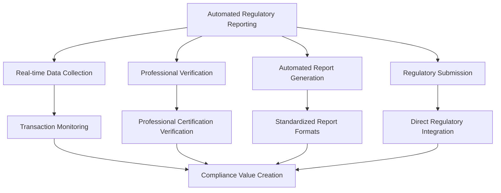
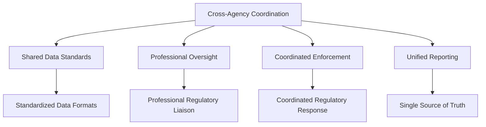
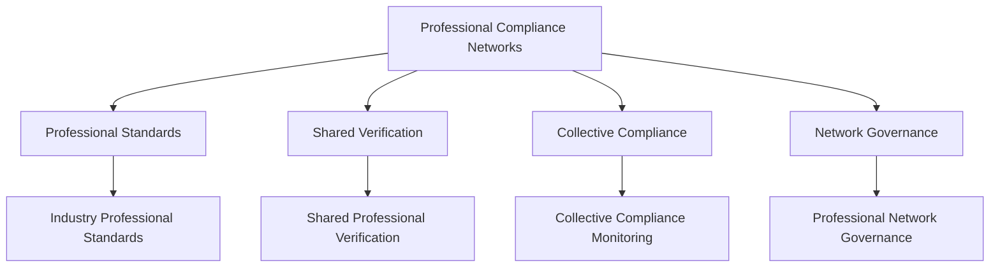

# Regulatory Compliance for BSV Enterprise

## The Enterprise Compliance Challenge

Traditional blockchain compliance is an oxymoron—most blockchains are designed to avoid regulation, creating compliance nightmares for enterprises. Regulatory uncertainty, unpredictable costs, and adversarial relationships with regulators make blockchain adoption a legal minefield.

**The compliance question**: How can blockchain technology enhance rather than complicate regulatory compliance?

## Why BSV Transforms Regulatory Compliance

### Compliance by Design, Not Afterthought

Unlike other blockchains that treat regulation as an obstacle, BSV is designed for regulatory compliance from the protocol level:

- **Legal-Tech Alignment**: Protocol designed to work with legal systems, not against them
- **Regulatory Integration**: Built-in features for regulatory oversight and coordination
- **Professional Accountability**: Integration with professional certification and liability frameworks
- **Transparent Operations**: Immutable audit trails and transparent risk management

### Professional Certification as Compliance Foundation

BSV's unique integration with professional certification systems transforms compliance from bureaucratic overhead to competitive advantage:

- **Real-time Professional Verification**: Instant verification of professional licenses and certifications
- **Professional Liability Integration**: Direct connection to professional insurance and accountability
- **Regulatory Relationship Enhancement**: Professional accountability improves regulatory relationships
- **Network-wide Compliance**: Shared compliance verification reduces individual compliance costs

### Network Effects for Regulatory Value

Traditional compliance creates costs that scale linearly with business growth. BSV compliance networks create value that scales exponentially:

**Traditional Compliance**: Each organization bears full compliance costs independently
**BSV Network Compliance**: Shared compliance verification benefits all network participants

## BSV Compliance Advantages

### 1. Regulatory Compliance by Design

**Traditional Blockchain Challenge**: Most blockchains are designed to circumvent regulation, creating fundamental compliance conflicts.

**BSV Solution**:
- Protocol stability provides legal certainty for long-term planning
- Network access rules enable regulatory enforcement at the protocol level
- Alert system allows network-wide coordination for regulatory requirements
- Digital asset recovery mechanisms comply with court orders and legal requirements

**Enterprise Impact**: Reduce regulatory risk while enhancing regulatory relationships.

### 2. Professional Accountability Integration

**Traditional Blockchain Challenge**: No integration with professional certification and liability systems that regulators trust.

**BSV Solution**:
- Real-time professional certification verification
- Professional liability insurance integration
- Transparent professional performance tracking
- Professional standards enforcement at network scale

**Enterprise Impact**: Transform compliance from cost center to competitive advantage through professional accountability.

### 3. Immutable Audit Trails

**Traditional Blockchain Challenge**: Limited audit capabilities and regulatory reporting functionality.

**BSV Solution**:
- Comprehensive immutable audit trails for all transactions and activities
- Rich metadata support for regulatory reporting requirements
- Real-time compliance monitoring and automated reporting
- Tamper-evident documentation for regulatory submissions

**Enterprise Impact**: Reduce audit costs while improving audit quality and regulatory confidence.

### 4. Cross-Border Regulatory Coordination

**Traditional Blockchain Challenge**: Inconsistent regulatory treatment across jurisdictions creates compliance complexity.

**BSV Solution**:
- Standardized compliance framework across jurisdictions
- Professional certification recognition across borders
- Coordinated regulatory oversight and information sharing
- Harmonized compliance standards and reporting

**Enterprise Impact**: Simplify international operations while maintaining regulatory compliance.

## Compliance Patterns with BSV

### Pattern 1: Automated Regulatory Reporting

Transform manual compliance reporting into automated, real-time processes:

**Compliance Benefits**:
- Real-time compliance monitoring reduces violation risk
- Professional verification enhances regulatory confidence
- Automated reporting reduces manual overhead and errors
- Direct regulatory integration improves relationships

### Pattern 2: Cross-Agency Coordination

Enable seamless coordination between multiple regulatory agencies:

**Compliance Benefits**:
- Reduced regulatory burden through coordinated oversight
- Professional oversight provides regulatory confidence
- Coordinated enforcement improves regulatory effectiveness
- Unified reporting reduces compliance complexity

### Pattern 3: Professional Compliance Networks

Create industry-wide compliance networks based on professional accountability:

**Compliance Benefits**:
- Professional standards provide compliance foundation
- Shared verification reduces individual compliance costs
- Collective compliance monitoring improves industry standards
- Professional governance enhances regulatory relationships

## BSV's Built-in Compliance Features

### 1. Protocol Stability for Legal Certainty

**Legal Challenge**: Unpredictable protocol changes create legal uncertainty.

**BSV Solution**:
- Fixed protocol rules provide long-term legal certainty
- No unexpected changes that could affect compliance status
- Predictable legal framework for enterprise planning
- Stable foundation for regulatory relationships

### 2. Network Access Rules for Regulatory Enforcement

**Legal Challenge**: Decentralized networks resist regulatory enforcement.

**BSV Solution**:
- Permissioned node operation for regulatory compliance
- Network access rules enable regulatory enforcement
- Accountability mechanisms for network participants
- Regulatory oversight capabilities at the network level

### 3. Alert System for Regulatory Coordination

**Legal Challenge**: Lack of coordination mechanisms for regulatory requirements.

**BSV Solution**:
- Network-wide alert system for regulatory notifications
- Coordinated response capabilities for compliance issues
- Communication channels for regulatory requirements
- Emergency response mechanisms for regulatory crises

### 4. Digital Asset Recovery for Legal Compliance

**Legal Challenge**: Immutable blockchains conflict with legal asset recovery requirements.

**BSV Solution**:
- Technical mechanisms for court-ordered asset recovery
- Compliance with legal freezing and seizure orders
- Balance between immutability and legal requirements
- Professional oversight for asset recovery processes

## Regulatory Relationship Transformation

### From Adversarial to Collaborative

**Traditional Blockchain Approach**:
- Designed to circumvent regulatory oversight
- Adversarial relationship with regulatory authorities
- Compliance seen as external constraint
- Limited cooperation with regulatory requirements

**BSV Approach**:
- Designed for regulatory collaboration and oversight
- Collaborative relationship with regulatory authorities
- Compliance integrated into business value creation
- Proactive cooperation with regulatory development

### From Reactive to Proactive

**Traditional Compliance**:
- React to regulatory requirements after they're imposed
- Defensive approach focused on avoiding violations
- Limited engagement with regulatory development
- Compliance seen as necessary burden

**BSV Compliance**:
- Proactively engage with regulatory development
- Collaborative approach focused on creating value
- Active participation in regulatory standard development
- Compliance seen as competitive advantage

### From Individual to Collective

**Traditional Compliance**:
- Each organization manages compliance independently
- Limited sharing of compliance intelligence
- Duplicated compliance efforts across industry
- Competitive disadvantage from compliance costs

**BSV Compliance**:
- Collective compliance management across networks
- Shared compliance intelligence and best practices
- Collaborative compliance efforts reduce individual costs
- Competitive advantage from network compliance effects

## Compliance Implementation Framework

### Phase 1: Regulatory Mapping (1-2 months)

**Regulatory Landscape Analysis**:
- Identify all applicable regulations and regulatory authorities
- Map specific compliance requirements and obligations
- Assess current compliance status and gaps
- Identify regulatory relationship opportunities

**BSV Compliance Opportunities**:
- Professional certification integration opportunities
- Automated reporting and monitoring possibilities
- Regulatory relationship enhancement potential
- Network compliance participation benefits

### Phase 2: Compliance Design (2-3 months)

**Compliance Architecture**:
- Design BSV integration for compliance requirements
- Professional certification verification systems
- Automated monitoring and reporting capabilities
- Regulatory coordination and communication systems

**Legal Framework Development**:
- Legal documentation and policy development
- Professional liability and insurance integration
- Regulatory engagement and relationship strategies
- Compliance governance and oversight frameworks

### Phase 3: Compliance Implementation (3-6 months)

**System Implementation**:
- BSV blockchain integration for compliance
- Professional certification verification systems
- Automated compliance monitoring and reporting
- Regulatory coordination and communication systems

**Process Implementation**:
- Compliance monitoring and management processes
- Professional accountability and oversight procedures
- Regulatory reporting and communication protocols
- Incident response and remediation procedures

### Phase 4: Regulatory Integration (1-2 months)

**Regulatory Engagement**:
- Formal engagement with regulatory authorities
- Professional certification network participation
- Industry compliance network integration
- Regulatory sandbox or pilot program participation

**Value Realization**:
- Compliance cost reduction measurement
- Regulatory relationship improvement tracking
- Professional accountability enhancement
- Network compliance effect realization

## Measuring Compliance Success

### Compliance Effectiveness Metrics

- **Regulatory Violations**: Reduction in compliance violations and penalties
- **Audit Results**: Improvement in audit findings and regulatory assessments
- **Regulatory Relationships**: Enhancement in regulatory authority relationships
- **Professional Standards**: Improvement in professional accountability and standards

### Cost and Efficiency Metrics

- **Compliance Costs**: Reduction in compliance personnel and system costs
- **Reporting Efficiency**: Improvement in regulatory reporting speed and accuracy
- **Professional Verification**: Efficiency gains from shared professional verification
- **Audit Preparation**: Reduction in audit preparation time and costs

### Network Effect Metrics

- **Shared Compliance**: Value from shared compliance verification and monitoring
- **Professional Networks**: Benefits from professional certification networks
- **Regulatory Coordination**: Value from coordinated regulatory relationships
- **Industry Standards**: Improvement from shared industry compliance standards

## Business Case for BSV Compliance

### Cost Reduction

- **Compliance Personnel**: 40-60% reduction through automation and shared verification
- **Regulatory Reporting**: 70-80% reduction through automated reporting systems
- **Audit Costs**: 50-70% reduction through continuous audit and immutable records
- **Professional Verification**: 60-80% reduction through shared certification systems

### Value Creation

- **Regulatory Relationships**: Enhanced relationships create business opportunities
- **Competitive Advantage**: Compliance becomes differentiator rather than cost
- **Market Access**: Compliance enables access to regulated markets
- **Professional Networks**: Access to professional expertise and accountability

### Risk Mitigation

- **Regulatory Risk**: Proactive compliance reduces regulatory penalties and violations
- **Professional Liability**: Professional accountability provides additional protection
- **Audit Risk**: Continuous audit and immutable records reduce audit risk
- **Reputational Risk**: Transparent compliance enhances reputation and trust

## Global Regulatory Landscape

### United States

**Regulatory Approach**: Sector-specific regulation with multiple agencies
**BSV Advantages**: 
- Professional certification integration aligns with US professional standards
- Immutable audit trails support SEC and FINRA requirements
- Real-time monitoring enables FinCEN AML/KYC compliance
- Professional liability integration supports regulatory confidence

### European Union

**Regulatory Approach**: Comprehensive framework with MiCA and GDPR
**BSV Advantages**:
- Compliance-by-design aligns with EU regulatory philosophy
- Professional accountability supports consumer protection requirements
- Selective disclosure capabilities address GDPR privacy requirements
- Cross-border coordination supports EU single market objectives

### Asia-Pacific

**Regulatory Approach**: Varied approaches with regulatory sandboxes
**BSV Advantages**:
- Professional certification recognition supports cross-border operations
- Regulatory sandbox participation demonstrates compliance commitment
- Professional oversight supports regulatory confidence building
- Network effects create regional compliance coordination

## Next Steps for BSV Compliance

### Immediate Actions

1. **Complete Regulatory Mapping**: Identify all applicable regulations and requirements
2. **Assess Professional Integration**: Map professional certification integration opportunities
3. **Plan Regulatory Engagement**: Develop strategy for regulatory authority engagement
4. **Design Compliance Architecture**: Plan BSV integration for compliance requirements

### Continue Your Learning Journey

Ready to explore security and audit advantages? Continue with:

- **[Security & Audit](security-audit.md)**: Learn about BSV security and audit advantages
- **[Enterprise Architecture](architecture.md)**: Review architectural considerations for compliance
- **[Governance & Risk](governance-risk.md)**: Understand governance frameworks for compliance

### Comprehensive Learning Path

For complete BSV enterprise compliance knowledge, explore our full curriculum:

- **[Module 1: Risk Visibility Crisis](01-risk-visibility-crisis/README.md)**: Understand the compliance problem BSV solves
- **[Module 2: Network Effect Solution](02-network-effect-solution/README.md)**: Learn how compliance creates network effects
- **[Module 3: BSV Risk Infrastructure](03-bsv-risk-infrastructure/README.md)**: Explore BSV's compliance capabilities
- **[Module 4: Implementation Strategy](04-implementation-strategy/README.md)**: Develop compliance implementation strategies
- **[Module 5: Case Studies](05-case-studies/README.md)**: Learn from compliance scenarios

## Key Takeaways

- **BSV enables compliance by design** rather than treating regulation as an afterthought
- **Professional certification integration** provides the trust foundation regulators require
- **Network effects** create exponential value through shared compliance verification
- **Regulatory relationships** transform from adversarial to collaborative partnerships
- **Compliance becomes competitive advantage** rather than cost burden

BSV compliance isn't just about meeting regulatory requirements—it's about creating network effects that transform entire industries through shared professional accountability and transparent regulatory coordination.

---

*Ready to explore security and audit advantages? Continue to [Security & Audit](security-audit.md) to learn about BSV's security and audit capabilities.*