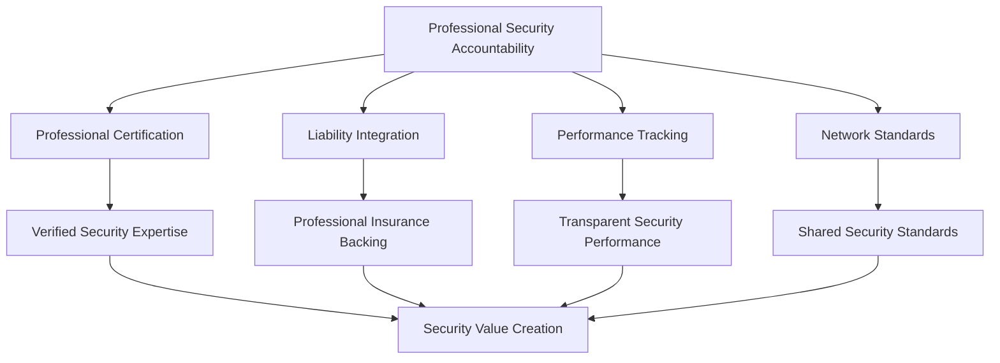
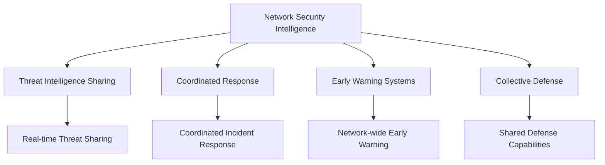
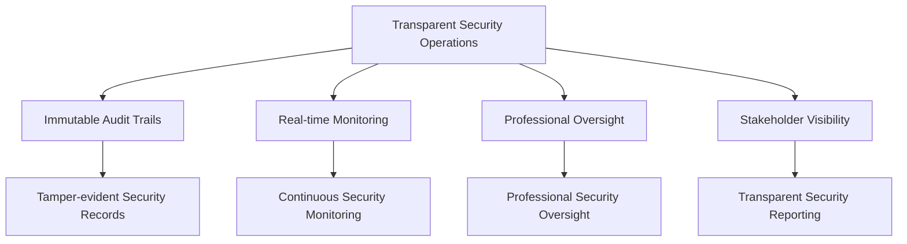

# Security & Audit for BSV Enterprise

## The Enterprise Security Challenge

Traditional enterprise security relies on perimeter defense and information hiding—security through obscurity. But hidden information creates moral hazard, enabling bad actors to hide risks while preventing good actors from making informed decisions. Audit becomes expensive, periodic, and reactive rather than continuous and proactive.

**The security question**: How can transparency enhance rather than compromise enterprise security?

## Why BSV Transforms Enterprise Security

### Security Through Transparency, Not Obscurity

BSV fundamentally transforms enterprise security by making professional accountability transparent rather than hidden:

- **Professional Liability Transparency**: Real-time visibility into professional insurance and liability coverage
- **Immutable Audit Trails**: Tamper-evident records of all professional decisions and actions
- **Network-wide Security Intelligence**: Shared security insights and threat intelligence
- **Professional Accountability at Scale**: Professional responsibility that scales across enterprise networks

### Professional Certification as Security Foundation

BSV's integration with professional certification systems creates a security foundation based on professional accountability:

- **Verified Professional Expertise**: Real-time verification of security professional certifications
- **Professional Liability Integration**: Professional insurance backing security decisions
- **Transparent Security Performance**: Professional security performance visible to stakeholders
- **Network Security Standards**: Shared professional security standards across networks

### Network Effects for Security Value

Traditional security creates costs that scale linearly with threats and complexity. BSV security networks create value that scales exponentially:

**Traditional Security**: Each organization defends independently against all threats
**BSV Network Security**: Shared threat intelligence and coordinated defense benefit all participants

## BSV Security Advantages

### 1. Professional Accountability for Security

**Traditional Security Challenge**: Security decisions lack professional accountability and liability backing.

**BSV Solution**:
- Security professionals stake their licenses on security assessments
- Professional liability insurance backs security decisions
- Real-time verification of security professional certifications
- Transparent security performance tracking and accountability

**Enterprise Impact**: Transform security from technical implementation to professional accountability.

### 2. Immutable Audit Trails

**Traditional Security Challenge**: Audit trails can be tampered with or deleted, compromising forensic investigations.

**BSV Solution**:
- Immutable audit trails that cannot be altered or deleted
- Cryptographic proof of audit trail integrity
- Real-time audit capabilities rather than periodic audits
- Comprehensive audit coverage of all professional decisions

**Enterprise Impact**: Reduce audit costs while improving audit quality and forensic capabilities.

### 3. Network Security Intelligence

**Traditional Security Challenge**: Security threats and intelligence are not shared effectively across organizations.

**BSV Solution**:
- Real-time sharing of security threat intelligence across networks
- Coordinated security response and incident management
- Shared security standards and best practices
- Collective security monitoring and early warning systems

**Enterprise Impact**: Improve security effectiveness through shared intelligence and coordinated response.

### 4. Transparent Security Operations

**Traditional Security Challenge**: Security operations lack transparency, making it difficult to verify effectiveness.

**BSV Solution**:
- Transparent security operations with immutable records
- Real-time security monitoring and reporting
- Professional oversight of security operations
- Stakeholder visibility into security performance

**Enterprise Impact**: Enhance stakeholder confidence through transparent, accountable security operations.

## Security Patterns with BSV

### Pattern 1: Professional Security Accountability

Create security frameworks based on professional accountability:

**Security Benefits**:
- Professional expertise backing all security decisions
- Professional liability insurance provides additional protection
- Performance tracking enables continuous security improvement
- Network standards create consistency and effectiveness

### Pattern 2: Network Security Intelligence

Enable shared security intelligence and coordinated response:

**Security Benefits**:
- Real-time threat intelligence improves security effectiveness
- Coordinated response reduces incident impact
- Early warning systems prevent security incidents
- Collective defense provides network-wide protection

### Pattern 3: Transparent Security Operations

Create transparent, auditable security operations:

**Security Benefits**:
- Immutable audit trails provide forensic capabilities
- Real-time monitoring enables proactive security management
- Professional oversight ensures security accountability
- Stakeholder visibility builds confidence and trust

## Audit Transformation with BSV

### From Periodic to Continuous

**Traditional Audit**:
- Periodic audits with limited scope and coverage
- Point-in-time snapshots of security and compliance
- Expensive, disruptive audit processes
- Limited forensic capabilities and evidence preservation

**BSV Audit**:
- Continuous audit with comprehensive coverage
- Real-time audit capabilities and monitoring
- Automated audit processes with reduced disruption
- Comprehensive forensic capabilities with immutable evidence

### From Reactive to Proactive

**Traditional Audit**:
- Reactive audit focused on finding problems after they occur
- Limited ability to prevent audit findings
- Audit findings often discovered too late for effective remediation
- Audit seen as compliance burden rather than value creator

**BSV Audit**:
- Proactive audit focused on preventing problems before they occur
- Real-time monitoring enables immediate issue identification
- Early warning systems prevent audit findings
- Audit becomes value creator through continuous improvement

### From Individual to Collaborative

**Traditional Audit**:
- Each organization conducts audits independently
- Limited sharing of audit intelligence and best practices
- Duplicated audit efforts across industry
- Competitive disadvantage from audit costs

**BSV Audit**:
- Collaborative audit across networks with shared standards
- Shared audit intelligence and best practices
- Collective audit efforts reduce individual costs
- Competitive advantage from network audit effects

## BSV Security Architecture

### Defense in Depth with Professional Accountability

**Layer 1: Professional Certification**
- Verified security professional certifications
- Professional liability insurance backing
- Real-time certification status monitoring
- Professional performance tracking

**Layer 2: Network Security Intelligence**
- Shared threat intelligence and early warning
- Coordinated incident response and management
- Collective security monitoring and analysis
- Network-wide security standards and practices

**Layer 3: Immutable Audit Trails**
- Tamper-evident security event recording
- Cryptographic proof of audit trail integrity
- Real-time audit capabilities and monitoring
- Comprehensive forensic evidence preservation

**Layer 4: Transparent Operations**
- Transparent security operations and reporting
- Stakeholder visibility into security performance
- Professional oversight and accountability
- Continuous security improvement and optimization

### Identity and Access Management

**Professional Identity Management**:
- Cryptographic identity tied to professional certifications
- Real-time professional credential verification
- Professional liability insurance integration
- Multi-factor authentication with professional accountability

**Network Access Control**:
- Role-based access control with professional verification
- Attribute-based access control with professional attributes
- Professional liability-based access decisions
- Network-wide access coordination and management

### Key Management with Professional Oversight

**Professional Key Management**:
- Professional oversight of key generation and management
- Professional liability backing key management decisions
- Multi-signature schemes with professional accountability
- Professional key recovery and escrow services

**Network Key Coordination**:
- Shared key management standards across networks
- Professional key management service providers
- Coordinated key rotation and lifecycle management
- Network-wide key compromise response

## Security Implementation Framework

### Phase 1: Security Assessment (1-2 months)

**Current Security Analysis**:
- Existing security architecture and controls
- Security professional certification status
- Audit capabilities and limitations
- Security threat landscape and intelligence

**BSV Security Opportunities**:
- Professional accountability integration opportunities
- Network security intelligence participation potential
- Immutable audit trail implementation benefits
- Transparent security operation advantages

### Phase 2: Security Design (2-3 months)

**Professional Security Integration**:
- Security professional certification verification systems
- Professional liability insurance integration
- Professional security performance tracking
- Network security standards and coordination

**Security Architecture Design**:
- BSV blockchain integration for security
- Immutable audit trail implementation
- Network security intelligence systems
- Transparent security operation frameworks

### Phase 3: Security Implementation (3-6 months)

**System Implementation**:
- BSV blockchain security integration
- Professional certification verification systems
- Immutable audit trail systems
- Network security intelligence platforms

**Process Implementation**:
- Professional security accountability processes
- Network security coordination procedures
- Continuous audit and monitoring processes
- Transparent security reporting and communication

### Phase 4: Network Integration (1-2 months)

**Security Network Participation**:
- Industry security network participation
- Professional security certification network integration
- Security intelligence sharing and coordination
- Collaborative security response and management

**Value Realization**:
- Security cost reduction measurement
- Security effectiveness improvement tracking
- Professional accountability enhancement
- Network security effect realization

## Measuring Security Success

### Security Effectiveness Metrics

- **Incident Prevention**: Reduction in security incidents through proactive measures
- **Response Time**: Improvement in security incident detection and response times
- **Professional Performance**: Security professional performance and accountability metrics
- **Network Intelligence**: Value from shared security intelligence and coordination

### Cost and Efficiency Metrics

- **Security Costs**: Reduction in security personnel and system costs
- **Audit Efficiency**: Improvement in audit speed, coverage, and effectiveness
- **Professional Verification**: Efficiency gains from shared professional verification
- **Incident Response**: Reduction in incident response time and costs

### Network Effect Metrics

- **Shared Intelligence**: Value from shared security threat intelligence
- **Coordinated Response**: Benefits from coordinated security incident response
- **Professional Networks**: Value from professional security certification networks
- **Collective Defense**: Benefits from network-wide security coordination

## Business Case for BSV Security

### Cost Reduction

- **Security Personnel**: 30-50% reduction through shared intelligence and coordination
- **Audit Costs**: 60-80% reduction through continuous audit and immutable records
- **Incident Response**: 40-60% reduction through coordinated response and early warning
- **Professional Verification**: 70-80% reduction through shared certification systems

### Value Creation

- **Security Effectiveness**: Improved security through professional accountability and network intelligence
- **Stakeholder Confidence**: Enhanced confidence through transparent, accountable security
- **Competitive Advantage**: Security becomes differentiator rather than cost
- **Professional Networks**: Access to security expertise and accountability

### Risk Mitigation

- **Security Incidents**: Proactive prevention reduces security incident frequency and impact
- **Professional Liability**: Professional accountability provides additional protection
- **Audit Risk**: Continuous audit and immutable records reduce audit risk
- **Reputational Risk**: Transparent security enhances reputation and trust

## Next Steps for BSV Security

### Immediate Actions

1. **Complete Security Assessment**: Evaluate your current security and audit capabilities
2. **Identify Professional Integration**: Map security professional certification opportunities
3. **Plan Network Participation**: Identify security network participation opportunities
4. **Design Security Architecture**: Plan BSV integration for security and audit

### Continue Your Learning Journey

You've completed the BSV enterprise primer sequence! Ready to dive deeper? Explore:

- **[Enterprise Pathway Overview](README.md)**: Review the complete enterprise learning journey
- **[Module 1: Risk Visibility Crisis](01-risk-visibility-crisis/README.md)**: Begin the comprehensive curriculum
- **[Resources](resources/README.md)**: Access tools, templates, and implementation guides

### Comprehensive Learning Path

For complete BSV enterprise security knowledge, explore our full curriculum:

- **[Module 1: Risk Visibility Crisis](01-risk-visibility-crisis/README.md)**: Understand the security problem BSV solves
- **[Module 2: Network Effect Solution](02-network-effect-solution/README.md)**: Learn how security creates network effects
- **[Module 3: BSV Risk Infrastructure](03-bsv-risk-infrastructure/README.md)**: Explore BSV's security capabilities
- **[Module 4: Implementation Strategy](04-implementation-strategy/README.md)**: Develop security implementation strategies
- **[Module 5: Case Studies](05-case-studies/README.md)**: Learn from security scenarios

## Key Takeaways

- **BSV enhances security through transparency** rather than compromising it through exposure
- **Professional accountability** provides the trust foundation for effective enterprise security
- **Network effects** create exponential security value through shared intelligence and coordination
- **Immutable audit trails** reduce audit costs while improving audit quality and forensic capabilities
- **Security becomes competitive advantage** rather than cost burden through professional accountability

BSV security isn't just about protecting systems—it's about creating network effects that transform entire industries through shared professional accountability and transparent security operations.

---

*Congratulations! You've completed the BSV enterprise primer sequence. Ready to dive deeper? Return to the [Enterprise Pathway Overview](README.md) to explore the comprehensive curriculum.*