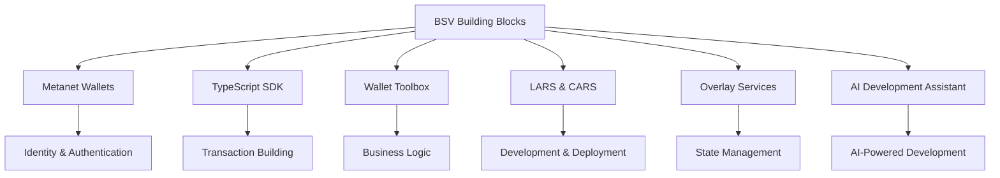

# BSV Building Blocks

Welcome to the BSV Building Blocks section - your foundation for developing applications on Bitcoin SV. This section introduces the core tools and libraries that form the backbone of BSV development.

## 🎯 What You'll Learn

By completing this section, you'll have:
- ✅ **Mastered Metanet Wallets** for identity and authentication
- ✅ **Explored the TypeScript SDK** for transaction building
- ✅ **Utilized Wallet Toolbox** for business logic implementation
- ✅ **Set up LARS/CARS** for development and deployment
- ✅ **Implemented Overlay Services** for state management

## 🏗️ Core Components Overview

## 📚 Learning Modules

### 1. [Metanet Wallets as Identity Tools](metanet-wallets.md) ⏱️ 1 hour
**Core identity and authentication tools**
- Understanding wallets as identity providers
- BRC-100 wallet interface and capabilities
- Integration patterns for web applications
- Certificate management and selective disclosure

### 2. [TypeScript SDK Deep Dive](ts-sdk.md) ⏱️ 1.5 hours
**Transaction building and blockchain interaction**
- Transaction building and signing
- SPV proof generation and verification
- Identity client and certificate management
- Storage and retrieval operations

### 3. [Wallet Toolbox for Business](wallet-toolbox.md) ⏱️ 1.5 hours
**Backend blockchain components**
- Business logic implementation
- Enterprise integration patterns
- Logistics and supply chain applications
- Data integrity and verification

### 4. [LARS & CARS Development Tools](lars-cars.md) ⏱️ 1 hour
**Development and deployment environment**
- Local development environment setup
- Hot-reload and debugging capabilities
- Cloud deployment and scaling
- DevOps best practices

### 5. [Overlay Services Architecture](overlay-services.md) ⏱️ 1 hour
**Scalable application architecture**
- Topic managers and lookup services
- State management patterns
- Real-time data synchronization
- Scalable application design

### 6. [AI Development Assistant](ai-development-assistant.md) ⏱️ 1 hour
**AI-powered BSV development**
- BSV MCP server setup and configuration
- Intelligent code search and documentation lookup
- AI-assisted learning and development workflows
- Integration with existing development tools

## 🚀 Getting Started

Choose your starting point based on your immediate needs:

| **Frontend Focus** | **Backend Focus** | **Full Stack** |
|-------------------|-------------------|----------------|
| [Metanet Wallets](metanet-wallets.md) | [Wallet Toolbox](wallet-toolbox.md) | Start from the beginning |
| [TS-SDK Basics](ts-sdk.md) | [Overlay Services](overlay-services.md) | Follow the complete path |

## 🔗 Prerequisites

- Basic TypeScript knowledge
- Node.js installed (v16+)
- Understanding of web development concepts
- Familiarity with blockchain basics (helpful but not required)

---

**Next:** Start with [Metanet Wallets as Identity Tools](metanet-wallets.md) to understand the foundation of BSV application development.