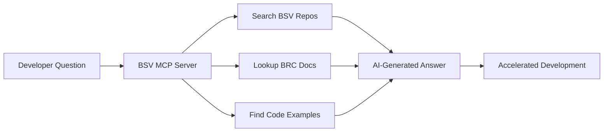

# AI Development Assistant

Welcome to AI-powered BSV development! This module introduces the BSV MCP (Model Context Protocol) server - your intelligent development companion that provides instant access to BSV documentation, code examples, and expert guidance.

## 🎯 Learning Objectives

By completing this module, you'll be able to:
- ✅ **Set up the BSV MCP server** for AI-assisted development
- ✅ **Use AI tools** to search BSV repositories and documentation
- ✅ **Generate code examples** with AI assistance
- ✅ **Accelerate learning** with intelligent BSV guidance
- ✅ **Integrate AI workflows** into your development process

## 🤖 What is the BSV MCP Server?

The BSV MCP server is an AI development assistant that provides:

### Core Capabilities
- **BRC Lookup**: Instant access to Bitcoin Request for Comment documents
- **Code Search**: Intelligent search across all BSV repositories
- **Function Discovery**: Find API methods and their usage patterns
- **Contextual Prompts**: Pre-built prompts for common BSV development tasks

### AI-Powered Workflows


## 🚀 Quick Setup (5 Minutes)

### Prerequisites
- Node.js v16+ installed
- Git for repository cloning
- MCP-compatible client (Windsurf, Claude Desktop, or Continue)

### Step 1: Clone BSV Repositories

Create a local copy of all BSV repositories for the MCP server to search:

```bash
# Create BSV development directory
mkdir -p ~/bsv-development/repositories
cd ~/bsv-development/repositories

# Clone core BSV repositories
git clone --depth 1 https://github.com/bitcoin-sv/ts-sdk.git
git clone --depth 1 https://github.com/bitcoin-sv/wallet-toolbox.git
git clone --depth 1 https://github.com/bitcoin-sv/BRCs.git
git clone --depth 1 https://github.com/bitcoin-sv/metanet-desktop.git
git clone --depth 1 https://github.com/bitcoin-sv/wallet-toolbox-examples.git
```

### Step 2: Configure Your MCP Client

#### For Windsurf Editor
Add this configuration to your Windsurf MCP settings:

```json
{
  "mcpServers": {
    "bsv-filesystem-context": {
      "command": "npx",
      "args": [
        "-y",
        "@modelcontextprotocol/server-filesystem",
        "/path/to/your/bsv-development/repositories"
      ]
    },
    "@bsv/mcp": {
      "command": "npx",
      "args": ["-y", "@bsv/mcp"],
      "env": {
        "BSV_REPOS_DIR": "/path/to/your/bsv-development/repositories"
      }
    }
  }
}
```

#### For Claude Desktop
Edit `~/Library/Application Support/Claude/claude_desktop_config.json` (macOS) with the same configuration.

### Step 3: Test Your Setup

Restart your MCP client and test with these commands:

```
/summarize_brc 0100
Search for "createTransaction" in ts-sdk
Find definition of "signTransaction"
```

## 🛠️ Available AI Tools

### 1. BRC Lookup Tool
**Purpose**: Retrieve Bitcoin Request for Comment documents

**Usage Examples**:
```
/summarize_brc 0100    # Wallet standards
/summarize_brc 62      # Payment protocols
Find BRC about tokens  # Search by keyword
```

**When to Use**:
- Understanding BSV standards and specifications
- Learning about protocol features
- Researching implementation requirements

### 2. Code Search Tool
**Purpose**: Search for code patterns across BSV repositories

**Usage Examples**:
```
Search for "wallet integration" in wallet-toolbox-examples
Find "transaction building" examples in ts-sdk
Look for "overlay service" implementations
Search for "BRC-100" across all repositories
```

**When to Use**:
- Finding implementation examples
- Learning coding patterns
- Discovering API usage
- Researching best practices

### 3. Function Definition Finder
**Purpose**: Locate specific function or method definitions

**Usage Examples**:
```
Find definition of "createTransaction"
Locate "broadcastTransaction" method
Search for "signTransaction" function
Find "getBalance" implementation
```

**When to Use**:
- Understanding API methods
- Learning function signatures
- Finding implementation details
- Exploring available functionality

## 🎯 AI-Powered Development Workflows

### Workflow 1: Learning New Concepts

**Scenario**: You want to understand BSV wallet integration

```
Step 1: /summarize_brc 0100
Step 2: Search for "wallet integration" in wallet-toolbox-examples
Step 3: Find definition of "createWallet"
Step 4: /generate_usage_example "basic wallet setup"
```

**Result**: Comprehensive understanding from standards to implementation

### Workflow 2: Implementing Features

**Scenario**: You need to implement transaction signing

```
Step 1: Find definition of "signTransaction" in ts-sdk
Step 2: Search for "transaction signing" examples
Step 3: /explain_code with specific file paths
Step 4: /generate_usage_example "transaction signing with private key"
```

**Result**: Working code with proper implementation patterns

### Workflow 3: Debugging Issues

**Scenario**: Your transaction broadcast is failing

```
Step 1: Find definition of "broadcastTransaction"
Step 2: Search for "error handling" in transaction examples
Step 3: /find_related_code "transaction validation"
Step 4: Search for "broadcast" error patterns
```

**Result**: Understanding of common issues and solutions

### Workflow 4: Exploring APIs

**Scenario**: You want to discover available wallet methods

```
Step 1: Search for "wallet" in ts-sdk
Step 2: Find definition of "Wallet" class
Step 3: /find_related_code "wallet methods"
Step 4: Search for "wallet" examples in wallet-toolbox-examples
```

**Result**: Complete API discovery with usage examples

## 🎓 Practical Exercises

### Exercise 1: BRC Research (15 minutes)
1. Use `/summarize_brc 0100` to understand wallet standards
2. Search for "BRC-100" implementations in repositories
3. Find examples of BRC-100 compliant wallet code
4. Generate a usage example for BRC-100 integration

### Exercise 2: Transaction Building (20 minutes)
1. Find definition of "createTransaction" in ts-sdk
2. Search for transaction building examples
3. Use `/explain_code` on a transaction example
4. Generate your own transaction building code

### Exercise 3: Overlay Services Discovery (25 minutes)
1. Search for "overlay" across all repositories
2. Find overlay service implementations
3. Use `/find_related_code "overlay services"`
4. Generate an overlay service integration example

### Exercise 4: Complete Feature Implementation (30 minutes)
1. Choose a BSV feature (payments, identity, data storage)
2. Research the feature using BRC lookup
3. Find implementation examples using code search
4. Generate a complete working example
5. Verify your understanding with function definitions

## 🔧 Advanced AI Techniques

### Combining Multiple Tools

**Research Pattern**:
```
1. /summarize_brc [relevant_brc]     # Understand standards
2. Search for [concept] in [repo]    # Find implementations
3. Find definition of [function]     # Understand APIs
4. /generate_usage_example [feature] # Create working code
```

**Debugging Pattern**:
```
1. Search for [error_message]        # Find similar issues
2. /find_related_code [error_type]   # Understand context
3. Find definition of [failing_function] # Check API usage
4. Search for [working_examples]     # Find correct patterns
```

### Effective Prompting

**Be Specific**:
- ❌ "Search for wallet"
- ✅ "Search for 'wallet integration' in wallet-toolbox-examples"

**Use Repository Names**:
- ❌ "Find transaction code"
- ✅ "Find definition of 'createTransaction' in ts-sdk"

**Combine Searches**:
- ❌ Single broad search
- ✅ Multiple targeted searches with different keywords

### Context Building

**Start Broad, Get Specific**:
```
1. /summarize_brc 0100              # Broad understanding
2. Search for "wallet" in ts-sdk    # General implementations
3. Find definition of "createWallet" # Specific API
4. Search for "wallet examples"     # Usage patterns
```

## 🚀 Integration with Other Building Blocks

### With Metanet Wallets
- Use AI to understand BRC-100 wallet standards
- Find wallet integration examples
- Generate wallet connection code
- Debug wallet communication issues

### With TypeScript SDK
- Discover SDK APIs using function definition finder
- Find usage examples for SDK methods
- Generate SDK integration code
- Research SDK best practices

### With Wallet Toolbox
- Explore business logic implementations
- Find enterprise integration patterns
- Generate toolbox usage examples
- Research scaling patterns

### With Overlay Services
- Understand overlay service architecture
- Find implementation examples
- Generate overlay service code
- Research state management patterns

## 📊 Performance Tips

### Optimize Your Searches
- Use specific keywords for better results
- Include repository names when relevant
- Try multiple search terms for comprehensive coverage
- Use function names for precise API discovery

### Build Context Incrementally
- Start with standards (BRC lookup)
- Move to implementations (code search)
- Focus on specifics (function definitions)
- Generate examples (usage examples)

### Leverage AI Memory
- Reference previous searches in follow-up questions
- Build on discovered code examples
- Connect related concepts across searches
- Use context from multiple tools together

## 🔍 Troubleshooting

### Common Issues

**MCP Server Not Loading**:
- Verify Node.js installation: `node --version`
- Check repository path exists
- Restart MCP client after configuration

**No Search Results**:
- Verify repositories were cloned successfully
- Check BSV_REPOS_DIR environment variable
- Try different search keywords
- Install ripgrep for better performance: `brew install ripgrep`

**BRC Lookup Fails**:
- Check internet connection
- Verify BRC identifier format (e.g., "0100", not "BRC-0100")
- Try with different BRC numbers

### Getting Help

1. **Check Configuration**: Verify MCP client settings match examples
2. **Test Manually**: Try running `npx @bsv/mcp` directly
3. **Community Support**: Ask in BSV Developer Discord/Telegram
4. **Documentation**: Refer to [BSV MCP Comprehensive Guide](../../../03-resources/bsv-mcp-comprehensive-guide.md)

## 🎯 Next Steps

### Immediate Actions
1. Complete the setup process
2. Work through the practical exercises
3. Integrate AI assistance into your development workflow
4. Explore advanced AI techniques

### Integration with Learning Path
- **Previous Module**: [LARS & CARS Development Tools](lars-cars.md)
- **Next Module**: [Overlay Services Architecture](overlay-services.md)
- **Related Resources**: [BSV MCP Comprehensive Guide](../../../03-resources/bsv-mcp-comprehensive-guide.md)

### Advanced Learning
- Experiment with custom prompts for your specific use cases
- Contribute to community AI workflows and best practices
- Explore integration with other development tools
- Share your AI-assisted development experiences

## 📚 Additional Resources

### Documentation
- [BSV MCP Server Repository](https://github.com/bitcoin-sv/bsv-mcp)
- [Model Context Protocol Specification](https://modelcontextprotocol.io/)
- [BSV Developer Documentation](https://docs.bitcoinsv.io/)

### Community
- BSV Developer Discord - AI Development Channel
- BSV Developer Telegram - @BSVDevelopers
- Stack Overflow - #bitcoin-sv tag
- GitHub Discussions - BSV repositories

### Tools
- [Windsurf Editor](https://codeium.com/windsurf) - AI-powered IDE
- [Claude Desktop](https://claude.ai/desktop) - AI assistant
- [Continue](https://continue.dev/) - VS Code AI extension

---

**Congratulations!** You now have AI-powered assistance for BSV development. Use these tools to accelerate your learning and build better BSV applications faster.

**Next:** Continue to [Overlay Services Architecture](overlay-services.md) to learn about scalable BSV application patterns, now with AI assistance to help you understand the concepts and find implementation examples.