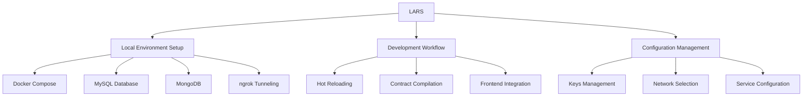
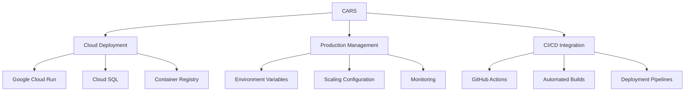

# LARS & CARS Development Tools

LARS (Local Automated Runtime System) and CARS (Cloud Automated Runtime System) are powerful tools for BSV application development and deployment. This module explores how these tools simplify the process of setting up development environments and deploying applications to production.

## 🎯 Learning Objectives

By the end of this module, you'll understand:
- How LARS automates local development environment setup
- How CARS handles cloud deployment of BSV applications
- The deployment-info.json configuration format
- Integration with Docker, databases, and frontend frameworks
- Best practices for moving from development to production

## 🧰 LARS: Local Automated Runtime System

LARS is a command-line interface and development tool that simplifies running and managing your BSV Overlay Services locally. It automates the creation and configuration of a local development environment, leveraging `@bsv/overlay-express` behind the scenes, along with Docker, MySQL, MongoDB, and ngrok.



### Key Features

- **Interactive Menus**: Running `lars` with no arguments launches interactive menus for configuring global keys, project configs, deployment info, or starting your local environment.
- **Separation of Keys by Network**: Maintain distinct keys (server private keys, TAAL API keys) for mainnet and testnet, both globally and at the project level.
- **Automatic Environment Setup**: LARS creates a local Docker-based environment for your backend, including overlay-express, MySQL, and MongoDB.
- **Frontend Integration**: If configured, LARS can also run your frontend (e.g., React). It automatically installs missing dependencies and starts the frontend.
- **ngrok Integration**: Securely expose your local environment to the internet for testing or external integration.
- **Hot Reloading & Real-Time Feedback**: Watches code changes, recompiles sCrypt contracts, and provides immediate feedback in the terminal.

### Installation and Setup

```bash
# Install LARS as a development dependency
npm install --save-dev @bsv/lars

# Run LARS interactively
npx lars
```

### Configuration with deployment-info.json

LARS uses a `deployment-info.json` file to understand your application structure:

```json
{
  "schema": "bsv-app",
  "schemaVersion": "1.0",
  "topicManagers": {
    "tm_meter": "./backend/src/topic-managers/MeterTopicManager.ts"
  },
  "lookupServices": {
    "ls_meter": {
      "serviceFactory": "./backend/src/lookup-services/MeterLookupServiceFactory.ts",
      "hydrateWith": "mongo"
    }
  },
  "frontend": {
    "language": "react",
    "sourceDirectory": "./frontend"
  },
  "contracts": {
    "language": "sCrypt",
    "baseDirectory": "./backend"
  },
  "configs": [
    {
      "name": "Local LARS",
      "network": "testnet",
      "provider": "LARS",
      "run": ["backend", "frontend"]
    }
  ]
}
```

### Running Your Application Locally

```bash
# Start LARS interactively
npx lars

# Or start directly
npx lars start
```

When running, LARS will:

1. Check system dependencies (Docker, Compose, ngrok)
2. Start an ngrok tunnel to expose your local OverlayExpress instance
3. Generate Docker Compose files and an environment tailored to your configuration
4. Launch Docker containers for OverlayExpress, MySQL, and MongoDB if backend is included
5. Start your frontend application if configured
6. Watch for code changes and reload services as needed

### Advanced Configuration

LARS supports advanced engine configuration for `@bsv/overlay-express`:

```json
{
  "configs": [
    {
      "name": "Local LARS",
      "network": "testnet",
      "provider": "LARS",
      "run": ["backend", "frontend"],
      "engineConfig": {
        "adminToken": "your-admin-token",
        "throwOnBroadcastFailure": false,
        "logTime": true,
        "logPrefix": "my-app",
        "syncConfiguration": {
          "tm_meter": "SHIP",
          "ls_meter": false
        }
      }
    }
  ]
}
```

### Admin Tools

LARS provides admin tools for managing your local environment:

- **Sync Advertisements**: Ensures local advertisements match your configured topics and services
- **Start GASP Sync**: Triggers a manual GASP synchronization
- **Manage Keys**: Configure server private keys and TAAL API keys

## 🚀 CARS: Cloud Automated Runtime System

CARS is the production-focused counterpart to LARS, enabling smooth deployment of BSV applications to cloud environments.



### Key Features

- **Cloud Deployment**: Deploy your application to cloud platforms like Google Cloud Run
- **Database Integration**: Connect to managed database services like Cloud SQL
- **Container Management**: Build and push Docker images to container registries
- **CI/CD Integration**: Automate deployments with GitHub Actions
- **Environment Management**: Configure environment variables for production

### Deployment Process

```bash
# Install CARS CLI
npm install -g @bsv/cars-cli

# Login to CARS
cars login

# Deploy your application
cars deploy
```

### Google Cloud Deployment

CARS simplifies deployment to Google Cloud:

1. Create a MySQL database on Cloud SQL (or use your own DB)
2. Build and push the Docker image to Google Container Registry
3. Deploy to Cloud Run with environment variables
4. Set up CI/CD with GitHub Actions (optional)

### Configuration

CARS uses the same `deployment-info.json` file as LARS, with additional cloud-specific configuration:

```json
{
  "configs": [
    {
      "name": "Production",
      "network": "mainnet",
      "provider": "CARS",
      "projectId": "your-gcp-project-id",
      "region": "us-central1",
      "databaseInstance": "your-db-instance",
      "databaseName": "your-db-name",
      "serviceAccount": "your-service-account@gcp.iam.gserviceaccount.com"
    }
  ]
}
```

## 🔄 Development to Production Workflow

### Local Development with LARS

1. Configure your application with `deployment-info.json`
2. Set up keys and network settings
3. Run locally with `npx lars start`
4. Develop and test your application with hot reloading

### Production Deployment with CARS

1. Update your `deployment-info.json` with production configuration
2. Build and test your application locally
3. Deploy to production with `cars deploy`
4. Monitor and manage your production environment

### Best Practices

- **Environment Separation**: Use different configurations for development and production
- **Key Management**: Keep separate keys for mainnet and testnet
- **Testing**: Test thoroughly in the local environment before deploying to production
- **CI/CD**: Set up automated testing and deployment pipelines
- **Monitoring**: Implement logging and monitoring for production environments

## 💻 Example Project Structure

```
my-bsv-app/
├── deployment-info.json
├── package.json
├── local-data/           # Generated by LARS
├── frontend/
│   ├── package.json
│   ├── src/
│   └── public/
└── backend/
    ├── package.json
    ├── tsconfig.json
    ├── src/
    │   ├── topic-managers/
    │   ├── lookup-services/
    │   └── contracts/
    └── artifacts/        # Compiled contracts
```

## 🔧 Troubleshooting

### Common LARS Issues

- **Port Conflicts**: LARS uses ports 8080 (app), 3306 (MySQL), and 27017 (MongoDB). Ensure these aren't in use.
- **Docker Issues**: Make sure Docker and Docker Compose are properly installed and running.
- **ngrok Errors**: Ensure ngrok is installed and authenticated with your auth token.
- **Missing Dependencies**: If frontend dependencies are missing, LARS will attempt to install them automatically.

### Common CARS Issues

- **Authentication Errors**: Make sure you're logged in with `cars login`.
- **Deployment Failures**: Check your cloud provider permissions and quotas.
- **Database Connection Issues**: Verify your database connection string and credentials.
- **Environment Variables**: Ensure all required environment variables are set.

## 🔗 Next Steps

Now that you understand LARS and CARS, you're ready to explore:

- [Overlay Services Architecture](overlay-services.md) - Learn about topic managers and lookup services
- [Wallet Toolbox for Business](wallet-toolbox.md) - Explore backend blockchain components
- [BSV Ecosystem Components](../../BSV_ECOSYSTEM_COMPONENTS.md) - Understand how everything fits together

---

**Next:** [Overlay Services Architecture](overlay-services.md)