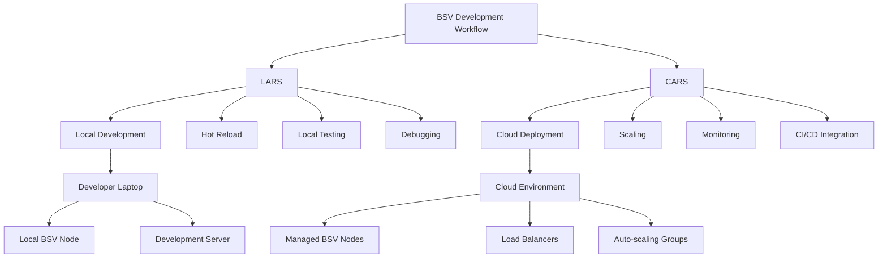
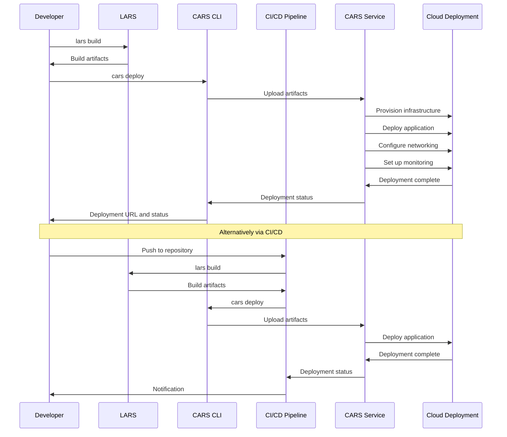

# LARS & CARS Development Tools

LARS (Local Automated Runtime System) and CARS (Cloud Automated Runtime System) provide a comprehensive development and deployment environment for BSV applications. This module explores how to set up your local development environment, implement hot-reload capabilities, deploy to the cloud, and follow DevOps best practices.

## 🎯 Learning Objectives

By the end of this module, you'll understand:
- How to set up a local development environment with LARS
- Hot-reload and debugging capabilities for rapid development
- Cloud deployment and scaling with CARS
- DevOps best practices for BSV applications
- Continuous integration and deployment workflows

## 🏗️ LARS & CARS Architecture



## 📦 Installation and Setup

### Installing LARS

```bash
# Install LARS globally
npm install -g @bsv/lars

# Verify installation
lars --version
```

### Installing CARS CLI

```bash
# Install CARS CLI globally
npm install -g @bsv/cars-cli

# Verify installation
cars --version

# Login to CARS
cars login
```

## 🛠️ Local Development with LARS

### Project Initialization

```bash
# Create a new BSV project
lars init my-bsv-app

# Navigate to project directory
cd my-bsv-app

# Install dependencies
npm install
```

### Project Structure

A typical LARS project structure:

```
my-bsv-app/
├── src/
│   ├── components/
│   ├── services/
│   ├── models/
│   ├── utils/
│   └── index.ts
├── public/
│   ├── index.html
│   └── assets/
├── tests/
│   ├── unit/
│   └── integration/
├── lars.config.js
├── package.json
├── tsconfig.json
└── README.md
```

### Configuration

The `lars.config.js` file controls your local development environment:

```javascript
// lars.config.js
module.exports = {
  // Server configuration
  server: {
    port: 3000,
    host: 'localhost',
    cors: true,
  },
  
  // BSV node configuration
  bsvNode: {
    type: 'local', // 'local' or 'remote'
    url: 'http://localhost:18332', // For remote nodes
    username: 'user',
    password: 'password',
    network: 'testnet', // 'mainnet', 'testnet', or 'regtest'
  },
  
  // Hot reload configuration
  hotReload: {
    enabled: true,
    watchDirs: ['src', 'public'],
    ignorePatterns: ['**/*.test.ts', '**/*.spec.ts'],
  },
  
  // Build configuration
  build: {
    outDir: 'dist',
    sourceMaps: true,
    minify: false, // Set to true for production builds
    target: 'es2020',
  },
  
  // Testing configuration
  testing: {
    framework: 'jest',
    coverage: true,
  },
  
  // Plugins
  plugins: [
    '@bsv/lars-plugin-typescript',
    '@bsv/lars-plugin-wallet-integration',
  ],
};
```

### Starting the Development Server

```bash
# Start LARS development server
lars dev

# Start with specific configuration
lars dev --config custom-lars.config.js

# Start with specific port
lars dev --port 8080
```

## 🔄 Hot Reload and Debugging

### Hot Reload Configuration

LARS provides hot reload capabilities out of the box. You can customize the behavior in your configuration:

```javascript
// lars.config.js
module.exports = {
  // ...other config
  
  hotReload: {
    enabled: true,
    watchDirs: ['src', 'public'],
    ignorePatterns: ['**/*.test.ts', '**/*.spec.ts'],
    debounceMs: 300,
    overlay: true, // Show errors as overlay in browser
    notifications: true, // Show desktop notifications
  },
};
```

### Debugging Setup

LARS integrates with standard debugging tools:

#### VS Code Debugging

Create a `.vscode/launch.json` file:

```json
{
  "version": "0.2.0",
  "configurations": [
    {
      "type": "node",
      "request": "launch",
      "name": "Debug LARS Application",
      "program": "${workspaceFolder}/node_modules/@bsv/lars/bin/lars.js",
      "args": ["dev"],
      "cwd": "${workspaceFolder}",
      "console": "integratedTerminal",
      "sourceMaps": true,
      "outFiles": ["${workspaceFolder}/dist/**/*.js"]
    }
  ]
}
```

#### Browser Debugging

LARS automatically generates source maps for browser debugging. Open your browser's developer tools to debug client-side code.

### Live Reloading Example

```typescript
// src/services/counter.ts
export class CounterService {
  private count = 0;
  
  increment(): number {
    return ++this.count;
  }
  
  decrement(): number {
    return --this.count;
  }
  
  getCount(): number {
    return this.count;
  }
}
```

When you modify this file, LARS will automatically:
1. Detect the change
2. Recompile the affected modules
3. Update the running application
4. Preserve application state where possible

## ☁️ Cloud Deployment with CARS

### Project Configuration for CARS

Create a `cars.config.js` file:

```javascript
// cars.config.js
module.exports = {
  // Application information
  app: {
    name: 'my-bsv-app',
    description: 'My BSV Application',
    version: '1.0.0',
  },
  
  // Deployment configuration
  deployment: {
    region: 'us-east-1',
    environment: 'production', // 'development', 'staging', 'production'
    instances: {
      min: 2,
      max: 10,
      type: 't3.medium',
    },
    scaling: {
      cpu: {
        target: 70, // Scale when CPU reaches 70%
      },
      memory: {
        target: 80, // Scale when memory reaches 80%
      },
    },
  },
  
  // Network configuration
  network: {
    domain: 'app.example.com',
    ssl: true,
    cdn: true,
  },
  
  // Database configuration
  database: {
    type: 'mongodb',
    connection: {
      uri: process.env.MONGODB_URI,
    },
    backup: {
      enabled: true,
      frequency: 'daily',
      retention: 30, // days
    },
  },
  
  // BSV node configuration
  bsvNode: {
    type: 'managed', // 'managed' or 'external'
    network: 'mainnet',
    replicas: 3,
  },
  
  // Monitoring and logging
  monitoring: {
    enabled: true,
    metrics: ['cpu', 'memory', 'network', 'transactions'],
    alerts: [
      {
        metric: 'cpu',
        threshold: 90,
        duration: '5m',
        action: 'email',
      },
    ],
  },
  
  // CI/CD integration
  cicd: {
    provider: 'github-actions',
    buildCommand: 'npm run build',
    testCommand: 'npm test',
  },
};
```

### Building for Production

```bash
# Build the application for production
lars build

# Build with specific configuration
lars build --config custom-lars.config.js
```

### Deploying with CARS

```bash
# Deploy to CARS
cars deploy

# Deploy with specific configuration
cars deploy --config custom-cars.config.js

# Deploy to specific environment
cars deploy --env staging
```

### Deployment Workflow



## 🔄 DevOps Best Practices

### Continuous Integration

Set up continuous integration with GitHub Actions:

```yaml
# .github/workflows/ci.yml
name: CI

on:
  push:
    branches: [ main, develop ]
  pull_request:
    branches: [ main, develop ]

jobs:
  build:
    runs-on: ubuntu-latest
    
    steps:
    - uses: actions/checkout@v2
    
    - name: Set up Node.js
      uses: actions/setup-node@v2
      with:
        node-version: '16'
        
    - name: Install dependencies
      run: npm ci
      
    - name: Lint
      run: npm run lint
      
    - name: Test
      run: npm test
      
    - name: Build
      run: npx lars build
```

### Continuous Deployment

Set up continuous deployment with GitHub Actions:

```yaml
# .github/workflows/cd.yml
name: CD

on:
  push:
    branches: [ main ]

jobs:
  deploy:
    runs-on: ubuntu-latest
    
    steps:
    - uses: actions/checkout@v2
    
    - name: Set up Node.js
      uses: actions/setup-node@v2
      with:
        node-version: '16'
        
    - name: Install dependencies
      run: npm ci
      
    - name: Build
      run: npx lars build
      
    - name: Deploy to CARS
      run: |
        npm install -g @bsv/cars-cli
        cars login --token ${{ secrets.CARS_TOKEN }}
        cars deploy --env production
```

### Environment Management

CARS supports multiple environments:

```bash
# Create a new environment
cars env create staging

# List environments
cars env list

# Set environment variables
cars env set staging BSV_API_KEY=your-api-key

# Deploy to specific environment
cars deploy --env staging
```

### Monitoring and Logging

CARS provides built-in monitoring and logging:

```bash
# View application logs
cars logs --env production

# View real-time logs
cars logs --env production --follow

# View specific instance logs
cars logs --env production --instance i-1234abcd

# View monitoring dashboard
cars monitoring --env production
```

## 🚀 Scaling and Performance

### Auto-scaling Configuration

```javascript
// cars.config.js
module.exports = {
  // ...other config
  
  deployment: {
    // ...other deployment config
    
    scaling: {
      enabled: true,
      metrics: {
        cpu: {
          target: 70,
          scaleUpThreshold: 80,
          scaleDownThreshold: 60,
        },
        memory: {
          target: 80,
          scaleUpThreshold: 85,
          scaleDownThreshold: 70,
        },
        customMetrics: [
          {
            name: 'TransactionsPerSecond',
            target: 1000,
            scaleUpThreshold: 1200,
            scaleDownThreshold: 800,
          },
        ],
      },
      cooldown: {
        scaleUp: 300, // seconds
        scaleDown: 600, // seconds
      },
      schedule: [
        {
          schedule: 'cron(0 8 * * ? *)', // 8:00 AM every day
          minSize: 5,
          maxSize: 15,
          desiredCapacity: 10,
        },
        {
          schedule: 'cron(0 20 * * ? *)', // 8:00 PM every day
          minSize: 2,
          maxSize: 5,
          desiredCapacity: 3,
        },
      ],
    },
  },
};
```

### Performance Optimization

```javascript
// lars.config.js
module.exports = {
  // ...other config
  
  performance: {
    optimization: {
      splitChunks: true,
      treeShaking: true,
      minify: true,
    },
    caching: {
      enabled: true,
      strategy: 'memory',
      ttl: 3600, // seconds
    },
    compression: {
      enabled: true,
      level: 6, // 1-9, where 9 is maximum compression
    },
  },
};
```

## 🔗 Next Steps

Now that you understand LARS & CARS development tools, you're ready to explore:

- [Overlay Services Architecture](overlay-services.md) - Learn about state management patterns
- [Smart Contracts](../02-smart-contracts/README.md) - Explore on-chain logic and automation
- [Example Projects](../04-examples/README.md) - See complete implementations

---

**Next:** [Overlay Services Architecture](overlay-services.md)