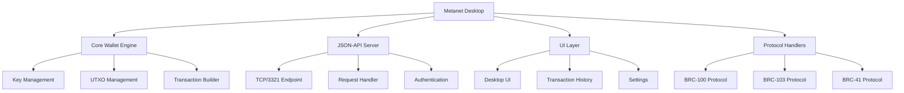

# Metanet Desktop: BRC-100 Wallet Implementation

Metanet Desktop is a reference implementation of the BRC-100 wallet interface standard, providing a complete wallet solution for BSV applications. This module explores how Metanet Desktop works, its architecture, and how to integrate it with your applications.

## 🎯 Learning Objectives

By the end of this module, you'll understand:
- The architecture and components of Metanet Desktop
- How Metanet Desktop implements the BRC-100 standard
- How to integrate your applications with Metanet Desktop
- Security considerations and best practices
- Advanced features and customization options

## 🏗️ Metanet Desktop Architecture

Metanet Desktop follows a modular architecture:



## 📚 Understanding Metanet Desktop

### BRC-100 Compliance

Metanet Desktop fully implements the BRC-100 wallet interface standard, which defines:

1. **Connection Protocol**: How applications connect to the wallet
2. **Authentication**: How applications authenticate with the wallet
3. **Transaction Handling**: How applications request and receive transactions
4. **Identity Management**: How applications access and use identity information

### JSON-API over TCP/3321

Metanet Desktop exposes its functionality through a JSON-API over TCP port 3321:

- Applications connect to `tcp://localhost:3321`
- Requests and responses are formatted as JSON
- Authentication is handled through BRC-103
- All communication is encrypted

### Key Features

Metanet Desktop provides several key features:

- **UTXO Management**: Efficient handling of unspent transaction outputs
- **HD Wallet Support**: Hierarchical deterministic wallet implementation
- **Multi-Account**: Support for multiple accounts within a single wallet
- **Transaction History**: Comprehensive transaction tracking and history
- **Identity Management**: Self-sovereign identity implementation
- **Protocol Support**: Support for BRC-100, BRC-103, BRC-41, and other protocols

## 🛠️ Integrating with Metanet Desktop

### Connecting to Metanet Desktop

Connecting to Metanet Desktop from a web application:

```typescript
import { MetanetDesktopClient } from '@bsv/metanet-desktop-client';

async function connectToWallet() {
  // Initialize the client
  const client = new MetanetDesktopClient({
    appName: 'Example App',
    appId: 'com.example.app',
  });
  
  try {
    // Connect to Metanet Desktop
    await client.connect();
    
    console.log('Connected to Metanet Desktop');
    console.log('Wallet version:', client.version);
    console.log('Supported protocols:', client.supportedProtocols);
    
    return client;
  } catch (error) {
    console.error('Failed to connect to Metanet Desktop:', error);
    
    // Check if Metanet Desktop is installed
    if (error.code === 'ECONNREFUSED') {
      console.error('Metanet Desktop is not running or not installed');
      // Prompt the user to install Metanet Desktop
      promptInstallMetanetDesktop();
    }
    
    throw error;
  }
}

function promptInstallMetanetDesktop() {
  if (confirm('Metanet Desktop is required for this application. Would you like to install it now?')) {
    window.open('https://metanet.io/desktop/download', '_blank');
  }
}
```

### Authenticating with Metanet Desktop

Authenticating with Metanet Desktop using BRC-103:

```typescript
import { MetanetDesktopClient } from '@bsv/metanet-desktop-client';
import { BRC103Client } from '@bsv/brc103';

async function authenticateWithWallet() {
  // Initialize the client
  const client = new MetanetDesktopClient({
    appName: 'Example App',
    appId: 'com.example.app',
  });
  
  // Connect to Metanet Desktop
  await client.connect();
  
  // Initialize the BRC-103 client
  const brc103Client = new BRC103Client({
    appName: 'Example App',
    appId: 'com.example.app',
    certificatePath: './app-certificate.json',
    privateKeyPath: './app-private-key.pem',
  });
  
  try {
    // Authenticate with the wallet
    const authResult = await brc103Client.authenticateWithWallet(client);
    
    if (authResult.authenticated) {
      console.log('Authentication successful');
      console.log('User ID:', authResult.userIdentity.id);
      console.log('User Name:', authResult.userIdentity.name);
      
      // Store the session for future requests
      localStorage.setItem('wallet-session', JSON.stringify(authResult.session));
      
      return authResult;
    } else {
      console.error('Authentication failed:', authResult.reason);
      throw new Error(`Authentication failed: ${authResult.reason}`);
    }
  } catch (error) {
    console.error('Authentication error:', error);
    throw error;
  }
}
```

### Creating and Sending Transactions

Creating and sending a transaction:

```typescript
import { MetanetDesktopClient } from '@bsv/metanet-desktop-client';

async function sendTransaction(client, recipientAddress, amount) {
  try {
    // Get the session from local storage
    const session = JSON.parse(localStorage.getItem('wallet-session'));
    
    if (!session) {
      throw new Error('No active session, please authenticate first');
    }
    
    // Create a transaction
    const transaction = {
      outputs: [
        {
          address: recipientAddress,
          amount, // in satoshis
        },
      ],
    };
    
    // Send the transaction
    const result = await client.sendTransaction({
      transaction,
      session,
    });
    
    console.log('Transaction sent successfully');
    console.log('Transaction ID:', result.txid);
    
    return result;
  } catch (error) {
    console.error('Failed to send transaction:', error);
    throw error;
  }
}
```

### Processing Payments

Processing a payment using BRC-41:

```typescript
import { MetanetDesktopClient } from '@bsv/metanet-desktop-client';

async function processPayment(client, paymentRequest) {
  try {
    // Get the session from local storage
    const session = JSON.parse(localStorage.getItem('wallet-session'));
    
    if (!session) {
      throw new Error('No active session, please authenticate first');
    }
    
    // Display payment information to the user
    const userConfirmed = await confirmPayment(paymentRequest);
    
    if (!userConfirmed) {
      throw new Error('Payment cancelled by user');
    }
    
    // Process the payment
    const result = await client.processPayment({
      paymentRequest,
      session,
    });
    
    if (result.status === 'success') {
      console.log('Payment processed successfully');
      console.log('Transaction ID:', result.transactionId);
      
      return result;
    } else {
      throw new Error(`Payment failed: ${result.reason}`);
    }
  } catch (error) {
    console.error('Failed to process payment:', error);
    throw error;
  }
}

function confirmPayment(paymentRequest) {
  return new Promise((resolve) => {
    const message = `
      Pay ${paymentRequest.amount} satoshis to ${paymentRequest.merchantName}
      For: ${paymentRequest.description}
    `;
    
    if (confirm(message)) {
      resolve(true);
    } else {
      resolve(false);
    }
  });
}
```

### Accessing Identity Information

Accessing identity information:

```typescript
import { MetanetDesktopClient } from '@bsv/metanet-desktop-client';

async function getIdentityInfo(client) {
  try {
    // Get the session from local storage
    const session = JSON.parse(localStorage.getItem('wallet-session'));
    
    if (!session) {
      throw new Error('No active session, please authenticate first');
    }
    
    // Get identity information
    const identity = await client.getIdentity({
      session,
    });
    
    console.log('Identity information retrieved');
    console.log('ID:', identity.id);
    console.log('Name:', identity.name);
    console.log('Public Key:', identity.publicKey);
    
    // Get identity attributes
    if (identity.attributes) {
      console.log('Attributes:');
      for (const [key, value] of Object.entries(identity.attributes)) {
        console.log(`  ${key}: ${value}`);
      }
    }
    
    return identity;
  } catch (error) {
    console.error('Failed to get identity information:', error);
    throw error;
  }
}
```

## 🔒 Security Considerations

### Secure Communication

Metanet Desktop ensures secure communication:

1. **Local Communication**: All communication is local (localhost), preventing remote access
2. **Encryption**: All communication is encrypted
3. **Authentication**: Applications must authenticate using BRC-103
4. **Permission System**: Users must approve all sensitive operations
5. **Session Management**: Sessions expire after a period of inactivity

### Permission System

Metanet Desktop implements a comprehensive permission system:

```typescript
import { MetanetDesktopClient } from '@bsv/metanet-desktop-client';

async function requestPermissions(client) {
  try {
    // Get the session from local storage
    const session = JSON.parse(localStorage.getItem('wallet-session'));
    
    if (!session) {
      throw new Error('No active session, please authenticate first');
    }
    
    // Request permissions
    const permissions = await client.requestPermissions({
      session,
      permissions: [
        'basic_info',      // Basic wallet information
        'transaction_history', // Access to transaction history
        'create_transaction',  // Ability to create transactions
        'identity_basic',      // Basic identity information
        'identity_attributes', // Access to identity attributes
      ],
      reason: 'Required for full application functionality',
    });
    
    console.log('Permissions granted:', permissions.granted);
    console.log('Permissions denied:', permissions.denied);
    
    return permissions;
  } catch (error) {
    console.error('Failed to request permissions:', error);
    throw error;
  }
}
```

### User Approval

All sensitive operations require explicit user approval:

```typescript
import { MetanetDesktopClient } from '@bsv/metanet-desktop-client';

async function sendTransactionWithApproval(client, recipientAddress, amount) {
  try {
    // Get the session from local storage
    const session = JSON.parse(localStorage.getItem('wallet-session'));
    
    if (!session) {
      throw new Error('No active session, please authenticate first');
    }
    
    // Create a transaction
    const transaction = {
      outputs: [
        {
          address: recipientAddress,
          amount, // in satoshis
        },
      ],
      requireApproval: true, // Explicitly require user approval
    };
    
    // Send the transaction
    const result = await client.sendTransaction({
      transaction,
      session,
    });
    
    // The result will only be returned if the user approves the transaction
    console.log('Transaction approved and sent successfully');
    console.log('Transaction ID:', result.txid);
    
    return result;
  } catch (error) {
    if (error.code === 'USER_REJECTED') {
      console.log('Transaction rejected by user');
    } else {
      console.error('Failed to send transaction:', error);
    }
    
    throw error;
  }
}
```

## 🔄 Advanced Features

### Custom Protocol Handlers

Implementing custom protocol handlers:

```typescript
import { MetanetDesktopClient } from '@bsv/metanet-desktop-client';

async function registerCustomProtocol(client) {
  try {
    // Get the session from local storage
    const session = JSON.parse(localStorage.getItem('wallet-session'));
    
    if (!session) {
      throw new Error('No active session, please authenticate first');
    }
    
    // Register a custom protocol handler
    const result = await client.registerProtocolHandler({
      session,
      protocol: 'custom-protocol',
      handler: {
        name: 'Custom Protocol Handler',
        description: 'Handles custom protocol requests',
        version: '1.0.0',
        methods: [
          {
            name: 'customMethod',
            description: 'A custom method',
            parameters: [
              {
                name: 'param1',
                type: 'string',
                required: true,
              },
              {
                name: 'param2',
                type: 'number',
                required: false,
              },
            ],
          },
        ],
      },
    });
    
    console.log('Custom protocol handler registered:', result.success);
    
    return result;
  } catch (error) {
    console.error('Failed to register custom protocol handler:', error);
    throw error;
  }
}
```

### Wallet Events

Subscribing to wallet events:

```typescript
import { MetanetDesktopClient } from '@bsv/metanet-desktop-client';

async function subscribeToEvents(client) {
  try {
    // Get the session from local storage
    const session = JSON.parse(localStorage.getItem('wallet-session'));
    
    if (!session) {
      throw new Error('No active session, please authenticate first');
    }
    
    // Subscribe to wallet events
    await client.subscribeToEvents({
      session,
      events: [
        'transaction.new',      // New transaction
        'transaction.confirmed', // Transaction confirmed
        'balance.changed',      // Balance changed
        'connection.closed',    // Connection closed
      ],
    });
    
    // Set up event handlers
    client.on('transaction.new', (event) => {
      console.log('New transaction:', event.txid);
      console.log('Amount:', event.amount);
      console.log('Type:', event.type);
    });
    
    client.on('transaction.confirmed', (event) => {
      console.log('Transaction confirmed:', event.txid);
      console.log('Confirmations:', event.confirmations);
    });
    
    client.on('balance.changed', (event) => {
      console.log('Balance changed');
      console.log('New balance:', event.balance);
      console.log('Change:', event.change);
    });
    
    client.on('connection.closed', (event) => {
      console.log('Connection closed:', event.reason);
      // Reconnect if necessary
      if (event.reason === 'timeout') {
        client.connect().catch(console.error);
      }
    });
    
    console.log('Subscribed to wallet events');
  } catch (error) {
    console.error('Failed to subscribe to wallet events:', error);
    throw error;
  }
}
```

### Multi-Signature Support

Creating multi-signature transactions:

```typescript
import { MetanetDesktopClient } from '@bsv/metanet-desktop-client';

async function createMultiSigTransaction(client, recipientAddress, amount, cosigners) {
  try {
    // Get the session from local storage
    const session = JSON.parse(localStorage.getItem('wallet-session'));
    
    if (!session) {
      throw new Error('No active session, please authenticate first');
    }
    
    // Create a multi-signature transaction
    const transaction = {
      outputs: [
        {
          address: recipientAddress,
          amount, // in satoshis
        },
      ],
      multiSig: {
        requiredSignatures: 2, // M of N
        cosigners, // Array of cosigner public keys
      },
    };
    
    // Create the transaction
    const result = await client.createTransaction({
      transaction,
      session,
    });
    
    console.log('Multi-signature transaction created');
    console.log('Transaction ID:', result.txid);
    console.log('Raw transaction:', result.rawTx);
    
    // The transaction needs to be signed by the required number of cosigners
    // before it can be broadcast
    
    return result;
  } catch (error) {
    console.error('Failed to create multi-signature transaction:', error);
    throw error;
  }
}

async function signMultiSigTransaction(client, rawTx) {
  try {
    // Get the session from local storage
    const session = JSON.parse(localStorage.getItem('wallet-session'));
    
    if (!session) {
      throw new Error('No active session, please authenticate first');
    }
    
    // Sign the transaction
    const result = await client.signTransaction({
      rawTx,
      session,
    });
    
    console.log('Transaction signed');
    console.log('Signatures:', result.signatures);
    
    return result;
  } catch (error) {
    console.error('Failed to sign transaction:', error);
    throw error;
  }
}

async function broadcastMultiSigTransaction(client, rawTx, signatures) {
  try {
    // Get the session from local storage
    const session = JSON.parse(localStorage.getItem('wallet-session'));
    
    if (!session) {
      throw new Error('No active session, please authenticate first');
    }
    
    // Broadcast the transaction
    const result = await client.broadcastTransaction({
      rawTx,
      signatures,
      session,
    });
    
    console.log('Transaction broadcast successfully');
    console.log('Transaction ID:', result.txid);
    
    return result;
  } catch (error) {
    console.error('Failed to broadcast transaction:', error);
    throw error;
  }
}
```

## 📊 Example Use Cases

### E-Commerce Integration

Integrating Metanet Desktop with an e-commerce platform:

```typescript
import { MetanetDesktopClient } from '@bsv/metanet-desktop-client';

class ECommercePaymentProcessor {
  private client: MetanetDesktopClient;
  private session: any;
  
  constructor() {
    this.client = new MetanetDesktopClient({
      appName: 'E-Commerce Store',
      appId: 'com.example.ecommerce',
    });
  }
  
  async initialize() {
    // Connect to Metanet Desktop
    await this.client.connect();
    
    // Authenticate
    const authResult = await this.authenticateWithWallet();
    this.session = authResult.session;
    
    return this;
  }
  
  async authenticateWithWallet() {
    // Implementation omitted for brevity
    // See the authenticateWithWallet function above
  }
  
  async processPayment(order) {
    try {
      // Create a payment request
      const paymentRequest = {
        merchantName: 'E-Commerce Store',
        merchantId: 'com.example.ecommerce',
        amount: order.total,
        currency: 'satoshis',
        description: `Payment for order #${order.id}`,
        metadata: {
          orderId: order.id,
          items: order.items.map(item => item.id),
          customer: order.customer.id,
        },
      };
      
      // Process the payment
      const result = await this.client.processPayment({
        paymentRequest,
        session: this.session,
      });
      
      if (result.status === 'success') {
        // Update the order status
        await this.updateOrderStatus(order.id, 'paid', result.transactionId);
        
        return {
          success: true,
          transactionId: result.transactionId,
          message: 'Payment processed successfully',
        };
      } else {
        throw new Error(`Payment failed: ${result.reason}`);
      }
    } catch (error) {
      console.error('Failed to process payment:', error);
      
      // Update the order status
      await this.updateOrderStatus(order.id, 'payment_failed', null);
      
      return {
        success: false,
        message: error.message,
      };
    }
  }
  
  async updateOrderStatus(orderId, status, transactionId) {
    // Update the order status in the database
    // Implementation depends on your e-commerce platform
  }
}

// Usage
async function checkoutProcess(order) {
  const paymentProcessor = await new ECommercePaymentProcessor().initialize();
  const result = await paymentProcessor.processPayment(order);
  
  if (result.success) {
    // Redirect to order confirmation page
    window.location.href = `/order/confirmation/${order.id}`;
  } else {
    // Show error message
    showErrorMessage(result.message);
  }
}
```

### Identity Verification

Using Metanet Desktop for identity verification:

```typescript
import { MetanetDesktopClient } from '@bsv/metanet-desktop-client';
import { BRC103Client } from '@bsv/brc103';

class IdentityVerifier {
  private client: MetanetDesktopClient;
  private brc103Client: BRC103Client;
  private session: any;
  
  constructor() {
    this.client = new MetanetDesktopClient({
      appName: 'Identity Verifier',
      appId: 'com.example.identity',
    });
    
    this.brc103Client = new BRC103Client({
      appName: 'Identity Verifier',
      appId: 'com.example.identity',
      certificatePath: './app-certificate.json',
      privateKeyPath: './app-private-key.pem',
    });
  }
  
  async initialize() {
    // Connect to Metanet Desktop
    await this.client.connect();
    
    // Authenticate
    const authResult = await this.brc103Client.authenticateWithWallet(this.client);
    
    if (!authResult.authenticated) {
      throw new Error(`Authentication failed: ${authResult.reason}`);
    }
    
    this.session = authResult.session;
    
    return this;
  }
  
  async verifyIdentity(requiredAttributes = []) {
    try {
      // Get identity information
      const identity = await this.client.getIdentity({
        session: this.session,
        includeAttributes: true,
      });
      
      // Check if all required attributes are present
      const missingAttributes = requiredAttributes.filter(attr => 
        !identity.attributes || !identity.attributes[attr]
      );
      
      if (missingAttributes.length > 0) {
        return {
          verified: false,
          missingAttributes,
          message: `Missing required attributes: ${missingAttributes.join(', ')}`,
        };
      }
      
      // Verify the identity certificate
      const certificateVerification = await this.brc103Client.verifyCertificate(identity.certificate);
      
      if (!certificateVerification.valid) {
        return {
          verified: false,
          message: `Invalid identity certificate: ${certificateVerification.reason}`,
        };
      }
      
      // Create a verification record
      const verificationRecord = {
        userId: identity.id,
        verifiedAt: new Date().toISOString(),
        attributes: requiredAttributes.reduce((obj, attr) => {
          obj[attr] = identity.attributes[attr];
          return obj;
        }, {}),
      };
      
      // Store the verification record
      await this.storeVerificationRecord(verificationRecord);
      
      return {
        verified: true,
        identity: {
          id: identity.id,
          name: identity.name,
          attributes: verificationRecord.attributes,
        },
        message: 'Identity verified successfully',
      };
    } catch (error) {
      console.error('Identity verification failed:', error);
      
      return {
        verified: false,
        message: error.message,
      };
    }
  }
  
  async storeVerificationRecord(record) {
    // Store the verification record in the database
    // Implementation depends on your storage solution
  }
}

// Usage
async function verifyUserIdentity() {
  const verifier = await new IdentityVerifier().initialize();
  
  const result = await verifier.verifyIdentity([
    'email',
    'fullName',
    'dateOfBirth',
    'address',
  ]);
  
  if (result.verified) {
    // Grant access to the protected resource
    grantAccess(result.identity);
  } else {
    // Show error message
    showErrorMessage(result.message);
  }
}
```

## 🔗 Next Steps

Now that you understand Metanet Desktop, you're ready to explore:

- [TypeScript SDK](ts-sdk-updated.md) - Learn how to interact with the blockchain
- [Wallet Infrastructure](wallet-infrastructure.md) - Understand the server-side components
- [BRC-103 Authentication](../03-advanced-topics/brc103-authentication.md) - Explore peer-to-peer authentication
- [Payment Requirements](../03-advanced-topics/payment-requirements.md) - Learn about HTTP payment mechanisms
- [BSV Ecosystem Components](../../BSV_ECOSYSTEM_COMPONENTS.md) - See how everything fits together

---

**Next:** [TypeScript SDK](ts-sdk-updated.md)