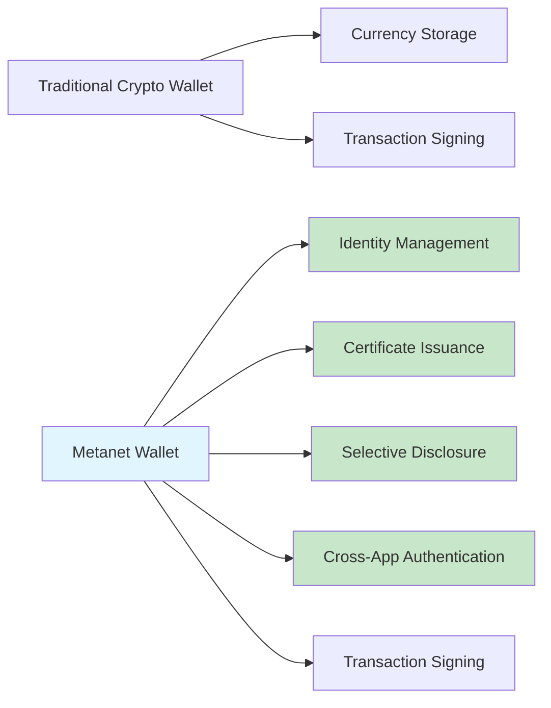
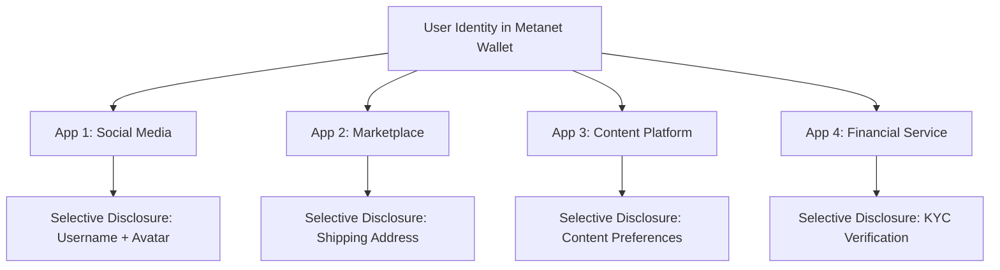
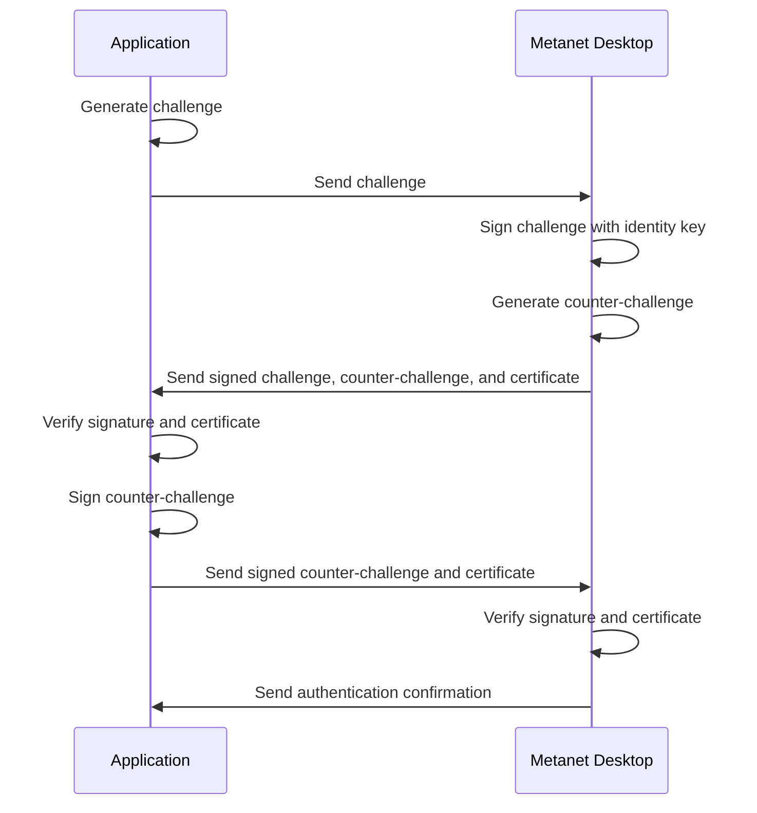

# Metanet Wallets as Identity Tools

Metanet wallets serve as the foundation for identity and authentication in the BSV ecosystem. Unlike traditional wallets that merely store funds, Metanet wallets provide a comprehensive identity framework that eliminates password fatigue and enables secure, verifiable interactions.

## 🎯 Learning Objectives

By the end of this module, you'll understand:
- How Metanet wallets function as identity providers
- The BRC-100 wallet interface standard
- Integration patterns for web applications
- Certificate management and selective disclosure
- Practical implementation approaches
- How BRC-103 authentication works with Metanet wallets

## 🔑 Key Concepts

### Identity vs. Currency Focus



### BRC-100 Wallet Interface

The BRC-100 standard defines a consistent interface for wallet interactions:

| Function | Purpose | Usage |
|----------|---------|-------|
| `requestIdentity()` | Request user identity | Initial authentication |
| `signTransaction()` | Sign a transaction | Payment or data operations |
| `issueCertificate()` | Create verifiable credential | Attestations and claims |
| `verifyMessage()` | Verify signed message | Message authentication |
| `selectiveDisclose()` | Share specific attributes | Privacy-preserving verification |

### Metanet Desktop Implementation

Metanet Desktop is a reference implementation of the BRC-100 wallet interface standard, providing:

- **JSON-API over TCP/3321**: Applications connect to `tcp://localhost:3321`
- **BRC-103 Authentication**: Secure mutual authentication between applications and the wallet
- **UTXO Management**: Efficient handling of unspent transaction outputs
- **HD Wallet Support**: Hierarchical deterministic wallet implementation
- **Multi-Account**: Support for multiple accounts within a single wallet
- **Identity Management**: Self-sovereign identity implementation

## 💻 Integration Patterns

### Web Application Integration

```javascript
// Example: Integrating Metanet wallet in a web application
import { MetanetDesktopClient } from '@bsv/metanet-desktop-client';

async function authenticateUser() {
  try {
    // Initialize the client
    const client = new MetanetDesktopClient({
      appName: 'My BSV App',
      appId: 'com.example.app',
    });
    
    // Connect to Metanet Desktop
    await client.connect();
    
    // Authenticate with BRC-103
    const authResult = await client.authenticate();
    
    if (authResult.authenticated) {
      // User is now authenticated
      console.log('Authenticated user:', authResult.identity.name);
      console.log('Public key:', authResult.identity.publicKey);
      
      // Store identity for later use
      sessionStorage.setItem('userIdentity', JSON.stringify(authResult.identity));
      
      return authResult.identity;
    } else {
      console.error('Authentication failed:', authResult.reason);
    }
  } catch (error) {
    console.error('Authentication failed:', error);
    
    // Check if Metanet Desktop is installed
    if (error.code === 'ECONNREFUSED') {
      // Prompt user to install Metanet Desktop
      promptInstallMetanetDesktop();
    }
  }
}

function promptInstallMetanetDesktop() {
  if (confirm('Metanet Desktop is required for this application. Would you like to install it now?')) {
    window.open('https://metanet.io/desktop/download', '_blank');
  }
}
```

### Certificate Management

```javascript
// Example: Requesting and verifying a certificate
async function requestAgeCertificate(client) {
  try {
    // Request age verification certificate
    const certificate = await client.issueCertificate({
      type: 'AgeVerification',
      claims: ['isOver18', 'isOver21'],
      issuer: 'self' // Self-attested
    });
    
    // Verify the certificate
    const isValid = await client.verifyCertificate(certificate);
    
    if (isValid) {
      // Use the certificate for age-gated content
      allowAccessToAgeRestrictedContent(certificate.claims);
    }
  } catch (error) {
    console.error('Certificate operation failed:', error);
  }
}
```

### BRC-103 Authentication

BRC-103 provides secure mutual authentication between applications and wallets:

```javascript
import { MetanetDesktopClient } from '@bsv/metanet-desktop-client';
import { BRC103Client } from '@bsv/brc103';

async function authenticateWithBRC103() {
  // Initialize the client
  const client = new MetanetDesktopClient({
    appName: 'Example App',
    appId: 'com.example.app',
  });
  
  // Connect to Metanet Desktop
  await client.connect();
  
  // Initialize the BRC-103 client
  const brc103Client = new BRC103Client({
    appName: 'Example App',
    appId: 'com.example.app',
    certificatePath: './app-certificate.json',
    privateKeyPath: './app-private-key.pem',
  });
  
  try {
    // Authenticate with the wallet
    const authResult = await brc103Client.authenticateWithWallet(client);
    
    if (authResult.authenticated) {
      console.log('Authentication successful');
      console.log('User ID:', authResult.userIdentity.id);
      console.log('User Name:', authResult.userIdentity.name);
      
      return authResult;
    } else {
      console.error('Authentication failed:', authResult.reason);
    }
  } catch (error) {
    console.error('Authentication error:', error);
  }
}
```

## 🛠️ Implementation Guide

### 1. Wallet Detection

First, detect if a compatible wallet is installed:

```javascript
import { MetanetDesktopClient } from '@bsv/metanet-desktop-client';

async function checkWalletAvailability() {
  try {
    // Initialize the client
    const client = new MetanetDesktopClient({
      appName: 'Example App',
      appId: 'com.example.app',
    });
    
    // Attempt to connect
    await client.connect();
    
    // Get wallet info
    const walletInfo = await client.getInfo();
    console.log(`Wallet detected: ${walletInfo.name} v${walletInfo.version}`);
    
    return {
      available: true,
      client,
      info: walletInfo
    };
  } catch (error) {
    console.log('No Metanet wallet detected:', error.message);
    
    return {
      available: false,
      error
    };
  }
}
```

### 2. Authentication Flow

Implement a complete authentication flow:

```javascript
async function implementAuthFlow() {
  // 1. Check wallet availability
  const walletCheck = await checkWalletAvailability();
  
  if (!walletCheck.available) {
    showWalletInstallPrompt();
    return;
  }
  
  const client = walletCheck.client;
  
  // 2. Initialize BRC-103 client
  const brc103Client = new BRC103Client({
    appName: 'Example App',
    appId: 'com.example.app',
    certificatePath: './app-certificate.json',
    privateKeyPath: './app-private-key.pem',
  });
  
  try {
    // 3. Authenticate with the wallet
    const authResult = await brc103Client.authenticateWithWallet(client);
    
    if (authResult.authenticated) {
      // 4. Complete authentication
      setAuthenticatedUser(authResult.userIdentity);
      redirectToDashboard();
      
      return authResult;
    } else {
      showAuthenticationError('Authentication failed: ' + authResult.reason);
    }
  } catch (error) {
    handleAuthError(error);
  }
}
```

### 3. Selective Disclosure

Implement privacy-preserving verification:

```javascript
async function verifyAgeWithoutRevealingBirthdate(client) {
  try {
    // Request selective disclosure of age verification
    const disclosure = await client.selectiveDisclose({
      request: 'age_verification',
      predicate: 'age >= 18',
      revealAge: false
    });
    
    if (disclosure.verified) {
      // User has proven they are 18+ without revealing actual age
      allowAccessToContent();
    } else {
      denyAccessToContent('Age verification failed');
    }
  } catch (error) {
    console.error('Selective disclosure failed:', error);
  }
}
```

## 🔄 Cross-Application Identity

One of the most powerful features of Metanet wallets is the ability to use the same identity across multiple applications:



### BRC-103 Authentication Flow

The BRC-103 protocol enables secure mutual authentication between applications and wallets:



## 🚀 Getting Started

### Desktop Wallet Setup

1. Download [Metanet Desktop](metanet-desktop.md) - A BRC-100 compliant wallet implementation
2. Create a new identity or import existing keys
3. Configure your identity attributes
4. Enable developer mode for testing

### Mobile Wallet Setup

1. Install the Metanet Mobile Wallet
2. Complete the identity setup process
3. Enable web application connections
4. Scan QR codes to connect to applications

## 🔗 Next Steps

Now that you understand Metanet wallets as identity tools, you're ready to explore:

- [Metanet Desktop](metanet-desktop.md) - Learn about the BRC-100 compliant wallet implementation
- [TypeScript SDK Deep Dive](ts-sdk-updated.md) - Learn how to build transactions and interact with the blockchain
- [Wallet Toolbox for Business](wallet-toolbox-updated.md) - Explore backend components for business logic
- [BRC-103 Authentication](../03-advanced-topics/brc103-authentication.md) - Dive deeper into peer-to-peer mutual authentication

---

**Next:** [Metanet Desktop](metanet-desktop.md)