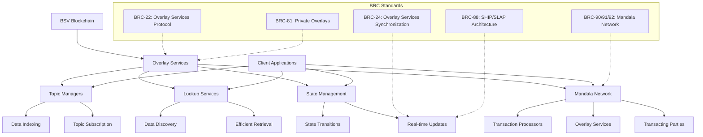

# Overlay Services Architecture

Overlay Services provide a powerful architecture for state management, real-time data synchronization, and scalable application design in BSV applications. This module explores how to implement topic managers, lookup services, and state management patterns to build robust, scalable applications, with a focus on the underlying BRC standards that define the Overlay Services ecosystem.

## 🎯 Learning Objectives

By the end of this module, you'll understand:
- The Overlay Services architecture and its components
- The BRC standards that define Overlay Services (BRC-22, BRC-24, BRC-88, BRC-81)
- The Mandala Network architecture (BRC-90/91/92)
- How to implement topic managers and lookup services
- State management patterns for BSV applications
- Real-time data synchronization techniques using SHIP/SLAP protocols
- Scalable application design principles

## 🏗️ Overlay Services Architecture Overview



## 📋 BRC Standards for Overlay Services

### BRC-22: Overlay Services Protocol

BRC-22 defines the core protocol for Overlay Services, establishing the fundamental architecture for building distributed applications on BSV. It specifies:

- The relationship between on-chain data and off-chain state
- Standard interfaces for overlay service providers
- Data indexing and retrieval mechanisms
- Consistency and availability guarantees

```typescript
// Example of BRC-22 compliant service initialization
import { OverlayServices, BRC22Compliance } from '@bsv/overlay-services';

const overlayService = new OverlayServices({
  network: 'mainnet',
  apiKey: 'your-api-key',
  compliance: {
    brc22: {
      version: '1.0.0',
      features: ['indexing', 'stateManagement', 'realTimeSync'],
    },
  },
});

// Verify BRC-22 compliance
const complianceChecker = new BRC22Compliance();
const complianceResult = await complianceChecker.verify(overlayService);
console.log(`BRC-22 Compliance: ${complianceResult.compliant}`);
```

### BRC-24: Overlay Services Synchronization

BRC-24 defines the synchronization mechanisms between overlay services, enabling consistent state across distributed systems:

- State propagation protocols
- Conflict resolution strategies
- Eventual consistency guarantees
- Synchronization optimization techniques

```typescript
// Example of BRC-24 synchronization setup
import { SyncManager, BRC24Protocol } from '@bsv/overlay-services';


const syncManager = new SyncManager({
  protocol: BRC24Protocol.STANDARD,
  syncInterval: 1000, // 1 second
  conflictResolution: 'last-write-wins',
  optimizations: {
    deltaUpdates: true,
    compressionEnabled: true,
  },
});

// Start synchronization
await syncManager.start();
```

### BRC-88: Overlay Services Synchronization Architecture (SHIP/SLAP)

BRC-88 defines the SHIP (Synchronization Hierarchy for Information Propagation) and SLAP (State Layer Application Protocol) standards for efficient state synchronization:

- SHIP: Hierarchical propagation of state changes
- SLAP: Application-level protocol for state updates
- Efficient delta-based synchronization
- Bandwidth optimization techniques

```typescript
// Example of BRC-88 SHIP/SLAP implementation
import { SHIPNode, SLAPProtocol } from '@bsv/overlay-services';

// Initialize a SHIP node
const shipNode = new SHIPNode({
  role: 'aggregator', // 'leaf', 'aggregator', or 'root'
  parentNodes: ['https://ship-parent1.example.com', 'https://ship-parent2.example.com'],
  childNodes: ['https://ship-child1.example.com', 'https://ship-child2.example.com'],
});

// Configure SLAP protocol
const slapProtocol = new SLAPProtocol({
  compressionLevel: 'high',
  batchingEnabled: true,
  maxBatchSize: 100,
  prioritization: {
    highPriority: ['user-actions', 'financial-transactions'],
    mediumPriority: ['status-updates', 'inventory-changes'],
    lowPriority: ['analytics', 'logs'],
  },
});

// Connect SHIP node with SLAP protocol
shipNode.setProtocol(slapProtocol);
await shipNode.start();
```

### BRC-81: Private Overlays with P2PKH Transactions

BRC-81 defines how to implement private overlay services using P2PKH transactions:

- Access control mechanisms for overlay data
- Encryption standards for private data
- Authentication protocols for service access
- Permissioned overlay networks

```typescript
// Example of BRC-81 private overlay setup
import { PrivateOverlay, P2PKHAccessControl } from '@bsv/overlay-services';

const privateOverlay = new PrivateOverlay({
  name: 'confidential-business-data',
  accessControl: new P2PKHAccessControl({
    authorizedKeys: ['public-key-1', 'public-key-2'],
    authorizationServer: 'https://auth.example.com',
  }),
  encryption: {
    algorithm: 'aes-256-gcm',
    keyRotationInterval: '7days',
  },
});

// Register private topic
await privateOverlay.registerTopic({
  name: 'financial-records',
  schema: financialRecordSchema,
  accessLevel: 'restricted',
});
```

### BRC-90/91/92: Mandala Network Architecture

The Mandala Network, defined by BRC-90, BRC-91, and BRC-92, establishes a three-layer architecture for BSV applications:

- BRC-90: Transaction Processors (miners and transaction processing services)
- BRC-91: Overlay Services (state management and data services)
- BRC-92: Transacting Parties (end-users and applications)

```typescript
// Example of Mandala Network integration
import { MandalaNetwork, TransactionProcessor, OverlayService, TransactingParty } from '@bsv/mandala';

// Initialize Mandala Network components
const transactionProcessor = new TransactionProcessor({
  type: 'miner-api',
  endpoint: 'https://miner-api.example.com',
  capabilities: ['standard-transactions', 'data-transactions'],
});

const overlayService = new OverlayService({
  type: 'state-manager',
  capabilities: ['indexing', 'state-management', 'real-time-sync'],
});

const transactingParty = new TransactingParty({
  type: 'business-application',
  identity: {
    name: 'Supply Chain Manager',
    publicKey: 'your-public-key',
  },
});

// Connect components in Mandala Network
const mandalaNetwork = new MandalaNetwork();
mandalaNetwork.registerTransactionProcessor(transactionProcessor);
mandalaNetwork.registerOverlayService(overlayService);
mandalaNetwork.registerTransactingParty(transactingParty);

// Start the network
await mandalaNetwork.start();
```

## 📦 Installation and Setup

```bash
# Install Overlay Services packages
npm install @bsv/overlay-services @bsv/topic-manager @bsv/lookup-service

# Install additional utilities
npm install @bsv/state-management @bsv/real-time-sync @bsv/mandala
```

Basic setup in a TypeScript project:

```typescript
// Import Overlay Services components
import { OverlayServices } from '@bsv/overlay-services';
import { TopicManager } from '@bsv/topic-manager';
import { LookupService } from '@bsv/lookup-service';
import { StateManager } from '@bsv/state-management';
import { MandalaNetwork } from '@bsv/mandala';

// Initialize Overlay Services
const overlayServices = new OverlayServices({
  network: 'mainnet', // or 'testnet'
  apiKey: 'your-api-key',
  brcCompliance: ['brc-22', 'brc-24', 'brc-88', 'brc-81'],
});

// Initialize components
const topicManager = new TopicManager({ overlayServices });
const lookupService = new LookupService({ overlayServices });
const stateManager = new StateManager({ overlayServices });
const mandalaNetwork = new MandalaNetwork({ overlayServices });
```

## 🔄 Topic Managers

Topic Managers provide a way to organize, index, and subscribe to blockchain data based on specific topics or categories.

### Creating a Topic Manager

```typescript
import { TopicManager, TopicDefinition } from '@bsv/topic-manager';

async function createTopicManager() {
  // Initialize Topic Manager
  const topicManager = new TopicManager({
    name: 'product-tracking',
    description: 'Product tracking and supply chain management',
    version: '1.0.0',
  });
  
  // Define a topic for product events
  const productTopic: TopicDefinition = {
    name: 'product-events',
    description: 'Events related to product lifecycle',
    schema: {
      type: 'object',
      properties: {
        productId: { type: 'string' },
        eventType: { 
          type: 'string',
          enum: ['created', 'shipped', 'received', 'sold']
        },
        timestamp: { type: 'number' },
        location: { type: 'string' },
        data: { type: 'object' },
      },
      required: ['productId', 'eventType', 'timestamp'],
    },
    indexes: [
      { fields: ['productId'] },
      { fields: ['eventType'] },
      { fields: ['timestamp'] },
      { fields: ['productId', 'eventType'] },
    ],
  };
  
  // Register the topic
  await topicManager.registerTopic(productTopic);
  
  return topicManager;
}
```

### Publishing to a Topic

```typescript
async function publishToTopic(topicManager, data) {
  try {
    // Publish data to the product-events topic
    const result = await topicManager.publish('product-events', data);
    
    console.log(`Published to topic with transaction ID: ${result.txid}`);
    return result;
  } catch (error) {
    console.error('Failed to publish to topic:', error);
    throw error;
  }
}

// Example usage
const productEvent = {
  productId: 'PROD-12345',
  eventType: 'shipped',
  timestamp: Date.now(),
  location: 'Warehouse A',
  data: {
    destination: 'Store B',
    carrier: 'Express Shipping',
    trackingNumber: 'SHP-67890',
  },
};

await publishToTopic(topicManager, productEvent);
```

### Subscribing to a Topic

```typescript
async function subscribeToTopic(topicManager) {
  // Subscribe to the product-events topic
  const subscription = await topicManager.subscribe('product-events', {
    onData: (data) => {
      console.log('Received product event:', data);
      // Process the event
      processProductEvent(data);
    },
    onError: (error) => {
      console.error('Subscription error:', error);
    },
    filter: {
      // Optional filter to receive only specific events
      eventType: 'shipped',
    },
  });
  
  // Return the subscription for later management
  return subscription;
}

// Manage subscription
function manageSubscription(subscription) {
  // Pause subscription
  subscription.pause();
  
  // Resume subscription
  subscription.resume();
  
  // Unsubscribe
  subscription.unsubscribe();
}
```

### Querying Topic Data

```typescript
async function queryTopicData(topicManager) {
  // Query product events
  const results = await topicManager.query('product-events', {
    filter: {
      productId: 'PROD-12345',
      eventType: 'shipped',
      timestamp: { $gte: Date.now() - 86400000 }, // Last 24 hours
    },
    sort: { timestamp: -1 }, // Newest first
    limit: 10,
    skip: 0,
  });
  
  console.log(`Found ${results.length} events`);
  return results;
}
```

## 🔍 Lookup Services

Lookup Services provide efficient data discovery and retrieval mechanisms for blockchain data.

### Creating a Lookup Service

```typescript
import { LookupService, LookupDefinition } from '@bsv/lookup-service';

async function createLookupService() {
  // Initialize Lookup Service
  const lookupService = new LookupService({
    name: 'product-lookup',
    description: 'Product information lookup service',
    version: '1.0.0',
  });
  
  // Define a lookup for products
  const productLookup: LookupDefinition = {
    name: 'product-info',
    description: 'Lookup for product information',
    keyPattern: 'product:{productId}',
    valueSchema: {
      type: 'object',
      properties: {
        productId: { type: 'string' },
        name: { type: 'string' },
        description: { type: 'string' },
        manufacturer: { type: 'string' },
        category: { type: 'string' },
        price: { type: 'number' },
        attributes: { type: 'object' },
      },
      required: ['productId', 'name', 'manufacturer'],
    },
    caching: {
      enabled: true,
      ttl: 3600, // 1 hour in seconds
    },
  };
  
  // Register the lookup
  await lookupService.registerLookup(productLookup);
  
  return lookupService;
}
```

### Setting Lookup Values

```typescript
async function setLookupValue(lookupService, productId, productData) {
  try {
    // Set product information in the lookup service
    const key = `product:${productId}`;
    await lookupService.set('product-info', key, productData);
    
    console.log(`Set product information for ${productId}`);
    return true;
  } catch (error) {
    console.error('Failed to set lookup value:', error);
    throw error;
  }
}

// Example usage
const productData = {
  productId: 'PROD-12345',
  name: 'Premium Widget',
  description: 'High-quality widget for industrial use',
  manufacturer: 'Widget Corp',
  category: 'Industrial',
  price: 129.99,
  attributes: {
    color: 'Silver',
    weight: '2.5kg',
    dimensions: '10x15x5cm',
  },
};

await setLookupValue(lookupService, 'PROD-12345', productData);
```

### Getting Lookup Values

```typescript
async function getLookupValue(lookupService, productId) {
  try {
    // Get product information from the lookup service
    const key = `product:${productId}`;
    const productData = await lookupService.get('product-info', key);
    
    if (productData) {
      console.log(`Retrieved product information for ${productId}`);
      return productData;
    } else {
      console.log(`No product information found for ${productId}`);
      return null;
    }
  } catch (error) {
    console.error('Failed to get lookup value:', error);
    throw error;
  }
}

// Example usage
const product = await getLookupValue(lookupService, 'PROD-12345');
```

## 🔄 State Management with BRC-88 (SHIP/SLAP)

State Management in Overlay Services provides a way to manage application state with blockchain-backed integrity, leveraging the BRC-88 SHIP/SLAP architecture for efficient synchronization.

### Creating a State Manager with SHIP/SLAP Support

```typescript
import { StateManager, StateDefinition, SHIPNode, SLAPProtocol } from '@bsv/state-management';

async function createStateManager() {
  // Initialize SHIP/SLAP components (BRC-88)
  const shipNode = new SHIPNode({
    role: 'aggregator',
    syncInterval: 1000, // 1 second
  });
  
  const slapProtocol = new SLAPProtocol({
    compressionEnabled: true,
    deltaUpdates: true,
  });
  
  // Initialize State Manager with BRC-88 support
  const stateManager = new StateManager({
    name: 'inventory-state',
    description: 'Inventory state management',
    version: '1.0.0',
    synchronization: {
      protocol: 'ship-slap', // BRC-88
      shipNode,
      slapProtocol,
    },
  });
  
  // Define a state for inventory
  const inventoryState: StateDefinition = {
    name: 'inventory',
    description: 'Inventory levels and status',
    schema: {
      type: 'object',
      properties: {
        productId: { type: 'string' },
        quantity: { type: 'number' },
        location: { type: 'string' },
        status: { 
          type: 'string',
          enum: ['in-stock', 'low-stock', 'out-of-stock', 'reserved']
        },
        lastUpdated: { type: 'number' },
      },
      required: ['productId', 'quantity', 'location', 'status'],
    },
    keyPattern: 'inventory:{productId}:{location}',
    versioning: {
      enabled: true,
      maxVersions: 10,
    },
    blockchain: {
      anchoring: {
        enabled: true,
        frequency: 'hourly',
      },
    },
  };
  
  // Register the state
  await stateManager.registerState(inventoryState);
  
  return stateManager;
}
```

### State Transitions

```typescript
async function updateInventoryState(stateManager, productId, location, quantity, status) {
  const key = `inventory:${productId}:${location}`;
  
  try {
    // Get current state
    const currentState = await stateManager.getState('inventory', key);
    
    // Prepare new state
    const newState = {
      productId,
      location,
      quantity,
      status,
      lastUpdated: Date.now(),
    };
    
    // Update state with transition
    const result = await stateManager.transition('inventory', key, newState, {
      transitionType: 'inventory-update',
      metadata: {
        previousQuantity: currentState?.quantity || 0,
        changeAmount: quantity - (currentState?.quantity || 0),
        reason: 'regular-update',
      },
    });
    
    console.log(`Updated inventory state for ${productId} at ${location}`);
    return result;
  } catch (error) {
    console.error('State transition failed:', error);
    throw error;
  }
}

// Example usage
await updateInventoryState('PROD-12345', 'Warehouse A', 42, 'in-stock');
```

## 🔄 Real-time Data Synchronization with BRC-24

Overlay Services provide mechanisms for real-time data synchronization across clients using the BRC-24 standard.

### Setting Up Real-time Sync with BRC-24

```typescript
import { RealTimeSync, BRC24Protocol } from '@bsv/real-time-sync';

async function setupRealTimeSync(stateManager) {
  // Initialize Real-time Sync with BRC-24 protocol
  const realTimeSync = new RealTimeSync({
    stateManager,
    protocol: new BRC24Protocol({
      version: '1.0.0',
      features: ['delta-updates', 'conflict-resolution', 'compression'],
    }),
    syncInterval: 1000, // 1 second
    reconnectStrategy: {
      initialDelay: 1000,
      maxDelay: 30000,
      factor: 1.5,
    },
  });
  
  // Start real-time synchronization
  await realTimeSync.start();
  
  return realTimeSync;
}
```

### Subscribing to State Changes

```typescript
function subscribeToStateChanges(realTimeSync, productId, location) {
  const key = `inventory:${productId}:${location}`;
  
  // Subscribe to state changes
  const subscription = realTimeSync.subscribe('inventory', key, {
    onUpdate: (newState, oldState) => {
      console.log(`State updated for ${productId} at ${location}`);
      console.log(`Previous quantity: ${oldState?.quantity || 0}`);
      console.log(`New quantity: ${newState.quantity}`);
      
      // Update UI or trigger business logic
      updateInventoryDisplay(newState);
    },
    onError: (error) => {
      console.error('Subscription error:', error);
    },
  });
  
  return subscription;
}
```

## 🏗️ Mandala Network Implementation (BRC-90/91/92)

The Mandala Network, defined by BRC-90, BRC-91, and BRC-92, establishes a three-layer architecture for BSV applications.

### Setting Up Mandala Network Components

```typescript
import { MandalaNetwork, TransactionProcessor, OverlayService, TransactingParty } from '@bsv/mandala';

async function setupMandalaNetwork() {
  // Initialize Mandala Network
  const mandalaNetwork = new MandalaNetwork({
    name: 'supply-chain-network',
    description: 'Supply chain management network',
  });
  
  // Set up Transaction Processor (BRC-90)
  const transactionProcessor = new TransactionProcessor({
    type: 'miner-api',
    endpoint: 'https://miner-api.example.com',
    capabilities: ['standard-transactions', 'data-transactions'],
  });
  
  // Set up Overlay Service (BRC-91)
  const overlayService = new OverlayService({
    type: 'state-manager',
    capabilities: ['indexing', 'state-management', 'real-time-sync'],
  });
  
  // Set up Transacting Party (BRC-92)
  const transactingParty = new TransactingParty({
    type: 'business-application',
    identity: {
      name: 'Supply Chain Manager',
      publicKey: 'your-public-key',
    },
  });
  
  // Register components with Mandala Network
  mandalaNetwork.registerTransactionProcessor(transactionProcessor);
  mandalaNetwork.registerOverlayService(overlayService);
  mandalaNetwork.registerTransactingParty(transactingParty);
  
  // Start the network
  await mandalaNetwork.start();
  
  return mandalaNetwork;
}
```

### Implementing Mandala Network Interactions

```typescript
async function performMandalaNetworkOperation(mandalaNetwork, operation) {
  // Get network components
  const transactionProcessor = mandalaNetwork.getTransactionProcessor();
  const overlayService = mandalaNetwork.getOverlayService();
  const transactingParty = mandalaNetwork.getTransactingParty();
  
  // Perform operation using the three-layer architecture
  const result = await transactingParty.initiateOperation({
    type: operation.type,
    data: operation.data,
    processor: transactionProcessor,
    overlay: overlayService,
  });
  
  return result;
}

// Example usage
const operationResult = await performMandalaNetworkOperation(mandalaNetwork, {
  type: 'product-shipment',
  data: {
    productId: 'PROD-12345',
    quantity: 10,
    origin: 'Warehouse A',
    destination: 'Store B',
    timestamp: Date.now(),
  },
});
```

## 🏗️ Scalable Application Architecture

### Layered Architecture Pattern

```typescript
// Application layers
import { OverlayServices } from '@bsv/overlay-services';
import { TopicManager } from '@bsv/topic-manager';
import { LookupService } from '@bsv/lookup-service';
import { StateManager } from '@bsv/state-management';
import { MandalaNetwork } from '@bsv/mandala';

// Data layer
class DataLayer {
  private overlayServices: OverlayServices;
  private topicManager: TopicManager;
  private lookupService: LookupService;
  
  constructor() {
    this.overlayServices = new OverlayServices({
      network: 'mainnet',
      apiKey: process.env.BSV_API_KEY,
      brcCompliance: ['brc-22', 'brc-24', 'brc-88', 'brc-81'],
    });
    
    this.topicManager = new TopicManager({ overlayServices: this.overlayServices });
    this.lookupService = new LookupService({ overlayServices: this.overlayServices });
  }
  
  async initialize() {
    // Initialize topics and lookups
    await this.initializeTopics();
    await this.initializeLookups();
  }
  
  private async initializeTopics() {
    // Register topics
  }
  
  private async initializeLookups() {
    // Register lookups
  }
  
  // Data access methods
}

// Business logic layer
class BusinessLayer {
  private dataLayer: DataLayer;
  private stateManager: StateManager;
  private mandalaNetwork: MandalaNetwork;
  
  constructor(dataLayer: DataLayer) {
    this.dataLayer = dataLayer;
    this.stateManager = new StateManager({
      overlayServices: this.dataLayer.getOverlayServices(),
      synchronization: {
        protocol: 'ship-slap', // BRC-88
      },
    });
    
    this.mandalaNetwork = new MandalaNetwork({
      overlayServices: this.dataLayer.getOverlayServices(),
    });
  }
  
  async initialize() {
    // Initialize state definitions and Mandala Network
    await this.initializeStates();
    await this.initializeMandalaNetwork();
  }
  
  private async initializeStates() {
    // Register states
  }
  
  private async initializeMandalaNetwork() {
    // Set up Mandala Network components
  }
  
  // Business logic methods
}

// API layer
class APILayer {
  private businessLayer: BusinessLayer;
  
  constructor(businessLayer: BusinessLayer) {
    this.businessLayer = businessLayer;
  }
  
  // API endpoints
}

// Application initialization
async function initializeApplication() {
  const dataLayer = new DataLayer();
  await dataLayer.initialize();
  
  const businessLayer = new BusinessLayer(dataLayer);
  await businessLayer.initialize();
  
  const apiLayer = new APILayer(businessLayer);
  
  return {
    dataLayer,
    businessLayer,
    apiLayer,
  };
}
```

## 🚀 Best Practices

### Performance Optimization

```typescript
// Optimize topic queries
const optimizedQuery = await topicManager.query('product-events', {
  filter: {
    productId: 'PROD-12345',
  },
  projection: { productId: 1, eventType: 1, timestamp: 1 }, // Select only needed fields
  useIndex: 'productId_eventType', // Specify index to use
  explain: false, // Set to true to get query execution plan
});

// Use batch operations for lookups
const batchResults = await lookupService.bulkGet('product-info', [
  'product:PROD-12345',
  'product:PROD-12346',
  'product:PROD-12347',
]);

// Implement caching
const cache = new Cache({
  maxSize: 1000,
  ttl: 3600, // 1 hour in seconds
});

async function getCachedProductInfo(productId) {
  const cacheKey = `product-info:${productId}`;
  
  // Check cache first
  const cachedData = cache.get(cacheKey);
  if (cachedData) {
    return cachedData;
  }
  
  // Fetch from lookup service
  const productData = await lookupService.get('product-info', `product:${productId}`);
  
  // Cache the result
  if (productData) {
    cache.set(cacheKey, productData);
  }
  
  return productData;
}
```

### Error Handling and Resilience

```typescript
// Implement retry logic
async function resilientOperation(operation, maxRetries = 3) {
  let retries = 0;
  
  while (retries < maxRetries) {
    try {
      return await operation();
    } catch (error) {
      retries++;
      
      if (retries >= maxRetries) {
        console.error(`Operation failed after ${maxRetries} retries:`, error);
        throw error;
      }
      
      const delay = Math.pow(2, retries) * 1000; // Exponential backoff
      console.warn(`Retry ${retries}/${maxRetries} after ${delay}ms`);
      await new Promise(resolve => setTimeout(resolve, delay));
    }
  }
}

// Example usage
const result = await resilientOperation(async () => {
  return await lookupService.get('product-info', `product:${productId}`);
});
```

## 🔗 Next Steps

Now that you understand Overlay Services Architecture and the BRC standards that define it, you're ready to explore:

- [Wallet Toolbox for Business](wallet-toolbox.md) - Learn about Express-