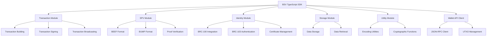

# TypeScript SDK Deep Dive

The BSV TypeScript SDK provides a comprehensive set of tools for interacting with the Bitcoin SV blockchain. This module explores the core capabilities of the SDK, from transaction building to identity management and data operations, with a focus on how it integrates with the Wallet JSON API.

## 🎯 Learning Objectives

By the end of this module, you'll understand:
- How to build, sign, and broadcast transactions
- SPV proof generation and verification using BEEF and BUMP formats
- Identity client and certificate management with BRC-100/103
- Storage and retrieval operations
- Advanced SDK patterns and best practices
- Integration with the Wallet JSON API

## 🧰 SDK Architecture Overview



## 📦 Installation and Setup

```bash
# Install the BSV TypeScript SDK
npm install @bsv/sdk

# Install additional utilities
npm install @bsv/sdk-transaction @bsv/sdk-spv @bsv/sdk-identity
```

Basic setup in a TypeScript project:

```typescript
// Import core SDK components
import { BSV } from '@bsv/sdk';
import { Transaction } from '@bsv/sdk-transaction';
import { SPV } from '@bsv/sdk-spv';
import { Identity } from '@bsv/sdk-identity';
import { WalletClient } from '@bsv/sdk-wallet';

// Initialize the SDK
const bsv = new BSV({
  network: 'mainnet', // or 'testnet'
  apiKey: 'your-api-key', // if using hosted services
});

// Initialize the Wallet API client
const walletClient = new WalletClient({
  url: 'http://localhost:3000', // Default Express server endpoint
  apiKey: 'your-wallet-api-key',
});

// Now you can use the SDK components
const tx = new Transaction();
const spv = new SPV();
const identity = new Identity();
```

## 🔄 Transaction Building

### Basic Transaction Creation

```typescript
import { Transaction, Output, Input } from '@bsv/sdk-transaction';

async function createSimpleTransaction() {
  // Create a new transaction
  const tx = new Transaction();
  
  // Add inputs (assuming you have UTXOs from a previous query)
  const utxo = {
    txid: '1234abcd...',
    vout: 0,
    satoshis: 10000,
    scriptPubKey: '76a914...'
  };
  
  tx.addInput(new Input({
    prevTxId: utxo.txid,
    outputIndex: utxo.vout,
    script: utxo.scriptPubKey,
    satoshis: utxo.satoshis
  }));
  
  // Add outputs
  tx.addOutput(new Output({
    to: 'recipient-address',
    satoshis: 5000
  }));
  
  // Add change output
  tx.addOutput(new Output({
    to: 'change-address',
    satoshis: 4900 // 10000 - 5000 - 100 (fee)
  }));
  
  return tx;
}
```

### Transaction Signing

```typescript
import { Signer } from '@bsv/sdk-transaction';

async function signTransaction(tx, privateKey) {
  const signer = new Signer();
  
  // Sign all inputs with the provided private key
  const signedTx = await signer.sign(tx, privateKey);
  
  return signedTx;
}
```

### Transaction Broadcasting

```typescript
import { Broadcaster } from '@bsv/sdk-transaction';

async function broadcastTransaction(signedTx) {
  const broadcaster = new Broadcaster({
    network: 'mainnet',
    apiKey: 'your-api-key'
  });
  
  try {
    const txid = await broadcaster.broadcast(signedTx);
    console.log(`Transaction broadcast successfully: ${txid}`);
    return txid;
  } catch (error) {
    console.error('Broadcasting failed:', error);
    throw error;
  }
}
```

## 🔍 SPV Proof Generation and Verification

### Working with BEEF Format

```typescript
import { BEEFGenerator } from '@bsv/sdk-spv';

async function generateBEEF(txid) {
  const generator = new BEEFGenerator();
  
  try {
    // Generate a BEEF (Background Evaluation Extended Format) for the transaction
    const beef = await generator.generateBEEF(txid);
    
    console.log('BEEF generated:', beef);
    return beef;
  } catch (error) {
    console.error('BEEF generation failed:', error);
    throw error;
  }
}

async function verifyBEEF(beef) {
  const verifier = new BEEFVerifier();
  
  try {
    // Verify the BEEF
    const isValid = await verifier.verifyBEEF(beef);
    
    if (isValid) {
      console.log('BEEF is valid');
    } else {
      console.log('BEEF is invalid');
    }
    
    return isValid;
  } catch (error) {
    console.error('BEEF verification failed:', error);
    throw error;
  }
}
```

### Working with BUMP Format

```typescript
import { BUMPGenerator } from '@bsv/sdk-spv';

async function generateBUMP(txids) {
  const generator = new BUMPGenerator();
  
  try {
    // Generate a BUMP (BSV Unified Merkle Path) for multiple transactions in the same block
    const bump = await generator.generateBUMP(txids);
    
    console.log('BUMP generated:', bump);
    return bump;
  } catch (error) {
    console.error('BUMP generation failed:', error);
    throw error;
  }
}

async function verifyBUMP(bump) {
  const verifier = new BUMPVerifier();
  
  try {
    // Verify the BUMP
    const isValid = await verifier.verifyBUMP(bump);
    
    if (isValid) {
      console.log('BUMP is valid');
    } else {
      console.log('BUMP is invalid');
    }
    
    return isValid;
  } catch (error) {
    console.error('BUMP verification failed:', error);
    throw error;
  }
}
```

## 🔐 Identity Client and Certificate Management

### BRC-100 Wallet Integration

```typescript
import { BRC100Client } from '@bsv/sdk-identity';

async function connectToBRC100Wallet() {
  const client = new BRC100Client({
    walletUrl: 'tcp://localhost:3321', // Default Metanet Desktop endpoint
  });
  
  try {
    // Connect to the wallet
    await client.connect();
    
    // Request user identity
    const identity = await client.requestIdentity({
      name: 'My BSV App',
      permissions: ['basic_identity']
    });
    
    console.log('Connected to wallet:', client.walletInfo);
    console.log('User identity:', identity);
    
    return client;
  } catch (error) {
    console.error('Failed to connect to wallet:', error);
    throw error;
  }
}
```

### BRC-103 Authentication

```typescript
import { BRC103Client } from '@bsv/sdk-identity';

async function authenticateWithBRC103(brc100Client) {
  const brc103Client = new BRC103Client({
    appName: 'Example App',
    appId: 'com.example.app',
    certificatePath: './app-certificate.json',
    privateKeyPath: './app-private-key.pem',
  });
  
  try {
    // Authenticate with the wallet using BRC-103
    const authResult = await brc103Client.authenticateWithWallet(brc100Client);
    
    if (authResult.authenticated) {
      console.log('Authentication successful');
      console.log('User ID:', authResult.userIdentity.id);
      console.log('User Name:', authResult.userIdentity.name);
      
      return authResult;
    } else {
      console.error('Authentication failed:', authResult.reason);
      throw new Error(`Authentication failed: ${authResult.reason}`);
    }
  } catch (error) {
    console.error('Authentication error:', error);
    throw error;
  }
}
```

### Certificate Management

```typescript
import { CertificateManager } from '@bsv/sdk-identity';

async function manageCertificates(identityClient) {
  const certManager = new CertificateManager({
    identityClient,
  });
  
  // Issue a certificate
  const certificate = await certManager.issueCertificate({
    subject: 'user-public-key',
    claims: {
      name: 'John Doe',
      isVerified: true,
      memberSince: '2023-01-01'
    },
    expiresAt: new Date('2024-01-01')
  });
  
  // Verify a certificate
  const isValid = await certManager.verifyCertificate(certificate);
  
  return { certificate, isValid };
}
```

## 💾 Storage and Retrieval Operations

### Data Storage

```typescript
import { DataStorage } from '@bsv/sdk-storage';

async function storeData(data, identityClient) {
  const storage = new DataStorage({
    identityClient,
  });
  
  try {
    // Store data on the blockchain
    const txid = await storage.store({
      data: data,
      encoding: 'utf8',
      contentType: 'application/json'
    });
    
    console.log(`Data stored successfully: ${txid}`);
    return txid;
  } catch (error) {
    console.error('Data storage failed:', error);
    throw error;
  }
}
```

### Data Retrieval

```typescript
import { DataRetrieval } from '@bsv/sdk-storage';

async function retrieveData(txid) {
  const retrieval = new DataRetrieval();
  
  try {
    // Retrieve data from the blockchain
    const result = await retrieval.retrieve(txid);
    
    console.log('Retrieved data:', result.data);
    console.log('Content type:', result.contentType);
    
    return result;
  } catch (error) {
    console.error('Data retrieval failed:', error);
    throw error;
  }
}
```

## 🔄 Wallet JSON API Integration

### UTXO Management

```typescript
import { WalletClient } from '@bsv/sdk-wallet';

async function manageUTXOs() {
  const walletClient = new WalletClient({
    url: 'http://localhost:3000', // Express server endpoint
    apiKey: 'your-wallet-api-key',
  });
  
  // Get available UTXOs
  const utxos = await walletClient.getUTXOs();
  
  // Get specific UTXO
  const utxo = await walletClient.getUTXO('txid', 0);
  
  // Lock UTXOs for spending
  const lockedUtxos = await walletClient.lockUTXOs([
    { txid: 'txid1', vout: 0 },
    { txid: 'txid2', vout: 1 },
  ]);
  
  // Release locked UTXOs
  await walletClient.releaseUTXOs([
    { txid: 'txid1', vout: 0 },
    { txid: 'txid2', vout: 1 },
  ]);
  
  return { utxos, lockedUtxos };
}
```

### Transaction Management

```typescript
import { WalletClient } from '@bsv/sdk-wallet';
import { Transaction } from '@bsv/sdk-transaction';

async function createAndSendTransaction() {
  const walletClient = new WalletClient({
    url: 'http://localhost:3000',
    apiKey: 'your-wallet-api-key',
  });
  
  // Create a transaction
  const tx = new Transaction();
  
  // Add outputs
  tx.addOutput({
    to: 'recipient-address',
    satoshis: 5000,
  });
  
  // Let the wallet handle input selection, signing, and broadcasting
  const result = await walletClient.sendTransaction({
    transaction: tx,
    feeRate: 1, // satoshis per byte
  });
  
  console.log(`Transaction sent: ${result.txid}`);
  return result;
}
```

## 🔄 Advanced SDK Patterns

### Chained Transactions

```typescript
import { Transaction, Output, Input } from '@bsv/sdk-transaction';
import { Signer, Broadcaster } from '@bsv/sdk-transaction';

async function createChainedTransactions(privateKey) {
  const signer = new Signer();
  const broadcaster = new Broadcaster();
  
  // Create first transaction
  const tx1 = new Transaction();
  // ... add inputs and outputs
  
  // Sign and broadcast first transaction
  const signedTx1 = await signer.sign(tx1, privateKey);
  const txid1 = await broadcaster.broadcast(signedTx1);
  
  // Create second transaction that spends from the first
  const tx2 = new Transaction();
  
  // Add input from first transaction
  tx2.addInput(new Input({
    prevTxId: txid1,
    outputIndex: 0, // Assuming we're spending the first output
    script: signedTx1.outputs[0].script,
    satoshis: signedTx1.outputs[0].satoshis
  }));
  
  // ... add outputs
  
  // Sign and broadcast second transaction
  const signedTx2 = await signer.sign(tx2, privateKey);
  const txid2 = await broadcaster.broadcast(signedTx2);
  
  return { txid1, txid2 };
}
```

### Atomic BEEF Transactions

```typescript
import { AtomicBEEFGenerator } from '@bsv/sdk-spv';

async function generateAtomicBEEF(txid) {
  const generator = new AtomicBEEFGenerator();
  
  try {
    // Generate an Atomic BEEF for the transaction
    const atomicBeef = await generator.generateAtomicBEEF(txid);
    
    console.log('Atomic BEEF generated:', atomicBeef);
    return atomicBeef;
  } catch (error) {
    console.error('Atomic BEEF generation failed:', error);
    throw error;
  }
}
```

## 🚀 Best Practices

### Error Handling

```typescript
async function robustTransactionCreation() {
  try {
    // Create and sign transaction
    const tx = await createSimpleTransaction();
    const signedTx = await signTransaction(tx, privateKey);
    
    // Broadcast with retry logic
    let attempts = 0;
    const maxAttempts = 3;
    
    while (attempts < maxAttempts) {
      try {
        const txid = await broadcastTransaction(signedTx);
        return txid;
      } catch (error) {
        attempts++;
        if (attempts >= maxAttempts) {
          throw error;
        }
        
        console.log(`Retry attempt ${attempts}/${maxAttempts}`);
        await new Promise(resolve => setTimeout(resolve, 2000)); // Wait 2 seconds
      }
    }
  } catch (error) {
    console.error('Transaction failed:', error);
    // Handle specific error types
    if (error.code === 'INSUFFICIENT_FUNDS') {
      // Handle insufficient funds
    } else if (error.code === 'NETWORK_ERROR') {
      // Handle network issues
    }
    throw error;
  }
}
```

### Performance Optimization

```typescript
// Use connection pooling
const connectionPool = new ConnectionPool({
  maxConnections: 10,
  idleTimeoutMillis: 30000
});

// Use batch processing for multiple operations
async function optimizedBatchProcessing(items) {
  // Process in chunks of 50
  const chunkSize = 50;
  const results = [];
  
  for (let i = 0; i < items.length; i += chunkSize) {
    const chunk = items.slice(i, i + chunkSize);
    const chunkResults = await Promise.all(
      chunk.map(item => processItem(item))
    );
    results.push(...chunkResults);
  }
  
  return results;
}
```

## 🔗 Next Steps

Now that you understand the BSV TypeScript SDK and its integration with the Wallet JSON API, you're ready to explore:

- [Wallet Infrastructure](wallet-infrastructure.md) - Learn about the Express-based server with JSON-RPC endpoint
- [Wallet Toolbox for Business](wallet-toolbox-updated.md) - Learn about backend blockchain components
- [Overlay Services Architecture](overlay-services-updated.md) - Understand state management patterns with BRC-22/24/88
- [Metanet Desktop](metanet-desktop.md) - Explore the BRC-100 compliant wallet implementation

---

**Next:** [Wallet Infrastructure](wallet-infrastructure.md)