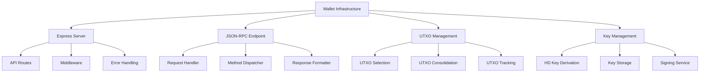

# Wallet Infrastructure

The BSV wallet infrastructure provides the foundation for managing Bitcoin transactions, UTXOs, and keys. This module explores the server-side components of the BSV wallet infrastructure and how they enable scalable and secure wallet services.

## 🎯 Learning Objectives

By the end of this module, you'll understand:
- The architecture of BSV wallet infrastructure
- How to implement an Express-based wallet server
- The JSON-RPC API for UTXO management
- Security considerations for wallet servers
- Best practices for production deployments

## 🏗️ Wallet Infrastructure Architecture

The BSV wallet infrastructure follows a modular architecture:



## 📚 Understanding Wallet Infrastructure

### Express-Based Server

The BSV wallet infrastructure is built on Express.js, a popular Node.js web framework:

- **Lightweight**: Express provides a minimal, flexible framework
- **Middleware**: Express middleware enables modular functionality
- **Routing**: Express routing simplifies API endpoint management
- **Error Handling**: Express error handling ensures robust operation

### JSON-RPC Endpoint

The wallet infrastructure exposes its functionality through a JSON-RPC endpoint:

- **Standard Protocol**: JSON-RPC is a standardized protocol for remote procedure calls
- **Method-Based**: Operations are defined as methods with parameters
- **Stateless**: Each request is independent and contains all necessary information
- **Batch Processing**: Multiple operations can be batched into a single request

### UTXO Management

The wallet infrastructure provides comprehensive UTXO management:

- **UTXO Selection**: Efficient algorithms for selecting UTXOs for transactions
- **UTXO Consolidation**: Automatic consolidation of small UTXOs
- **UTXO Tracking**: Real-time tracking of UTXO status
- **UTXO Indexing**: Fast lookup of UTXOs by address, script, or other criteria

## 🛠️ Implementing Wallet Infrastructure

### Basic Express Server Setup

Setting up a basic Express-based wallet server:

```typescript
import express from 'express';
import bodyParser from 'body-parser';
import cors from 'cors';
import { createJsonRpcServer } from '@bsv/wallet-rpc';
import { UTXOManager } from '@bsv/wallet-utxo';
import { KeyManager } from '@bsv/wallet-keys';

// Initialize Express app
const app = express();

// Configure middleware
app.use(cors());
app.use(bodyParser.json());

// Initialize components
const keyManager = new KeyManager({
  hdSeed: process.env.HD_SEED,
  network: 'mainnet',
  storageProvider: 'encrypted-file',
  storagePath: './keys.enc',
  encryptionKey: process.env.ENCRYPTION_KEY,
});

const utxoManager = new UTXOManager({
  dbProvider: 'mongodb',
  dbUrl: process.env.MONGODB_URL,
  network: 'mainnet',
});

// Create JSON-RPC server
const rpcServer = createJsonRpcServer({
  keyManager,
  utxoManager,
});

// Register RPC methods
rpcServer.registerMethod('getBalance', async (params) => {
  const { address } = params;
  return await utxoManager.getBalance(address);
});

rpcServer.registerMethod('getUTXOs', async (params) => {
  const { address, minValue, maxValue } = params;
  return await utxoManager.getUTXOs(address, { minValue, maxValue });
});

rpcServer.registerMethod('createTransaction', async (params) => {
  const { inputs, outputs, feeRate } = params;
  return await utxoManager.createTransaction({ inputs, outputs, feeRate });
});

rpcServer.registerMethod('signTransaction', async (params) => {
  const { transaction, keyPath } = params;
  return await keyManager.signTransaction(transaction, keyPath);
});

rpcServer.registerMethod('broadcastTransaction', async (params) => {
  const { transaction } = params;
  return await utxoManager.broadcastTransaction(transaction);
});

// Mount JSON-RPC endpoint
app.post('/rpc', (req, res) => {
  rpcServer.handleRequest(req.body)
    .then(response => res.json(response))
    .catch(error => {
      console.error('RPC Error:', error);
      res.status(500).json({
        jsonrpc: '2.0',
        error: {
          code: -32603,
          message: 'Internal error',
        },
        id: req.body.id || null,
      });
    });
});

// Start the server
const PORT = process.env.PORT || 3000;
app.listen(PORT, () => {
  console.log(`Wallet server running on port ${PORT}`);
});
```

### UTXO Management Implementation

The UTXO Manager handles all aspects of UTXO management, including:

- Getting balances for addresses
- Retrieving UTXOs with filtering options
- Creating transactions with optimal UTXO selection
- Broadcasting transactions to the network
- Tracking and updating UTXOs
- Consolidating small UTXOs

Key features include multiple UTXO selection strategies:
- Default strategy: Select UTXOs in ascending order of value
- Minimize inputs strategy: Select largest UTXOs first to minimize input count
- Minimize change strategy: Try to find UTXOs that minimize change output

### JSON-RPC API Implementation

The JSON-RPC API provides a standardized interface for wallet operations:

```typescript
// Example JSON-RPC methods
{
  // Get balance
  "getBalance": {
    "params": { "address": "1ExampleAddressBSV123456789ABCDEF" },
    "result": { "address": "1ExampleAddressBSV123456789ABCDEF", "balance": 1000000 }
  },
  
  // Get UTXOs
  "getUTXOs": {
    "params": { 
      "address": "1ExampleAddressBSV123456789ABCDEF",
      "minValue": 1000,
      "maxValue": 100000
    },
    "result": { 
      "address": "1ExampleAddressBSV123456789ABCDEF",
      "utxos": [
        { "txid": "abc123...", "vout": 0, "value": 5000 },
        { "txid": "def456...", "vout": 1, "value": 10000 }
      ]
    }
  },
  
  // Create transaction
  "createTransaction": {
    "params": {
      "outputs": [
        { "address": "1RecipientAddressBSV123456789ABCDEF", "amount": 50000 }
      ],
      "feeRate": 0.5
    },
    "result": {
      "transaction": "01000000...",
      "txid": "abc123...",
      "fee": 165
    }
  },
  
  // Sign transaction
  "signTransaction": {
    "params": {
      "transaction": "01000000...",
      "keyPath": "m/44'/0'/0'/0/0"
    },
    "result": {
      "transaction": "01000000...",
      "txid": "abc123...",
      "complete": true
    }
  },
  
  // Broadcast transaction
  "broadcastTransaction": {
    "params": {
      "transaction": "01000000..."
    },
    "result": {
      "txid": "abc123...",
      "success": true
    }
  }
}
```

## 🔒 Security Considerations

### Key Management

Secure key management is critical for wallet infrastructure:

- **HD Key Derivation**: Use hierarchical deterministic (HD) key derivation
- **Encryption**: Encrypt all private keys at rest
- **Secure Storage**: Use secure storage for keys and seeds
- **Access Control**: Implement strict access control for key operations
- **Key Rotation**: Regularly rotate encryption keys

### API Security

Securing the wallet API:

- **Authentication**: Implement strong authentication for API access
- **Rate Limiting**: Apply rate limiting to prevent abuse
- **Input Validation**: Validate all input parameters
- **HTTPS**: Use HTTPS for all API communication
- **CORS**: Configure proper CORS headers
- **Error Handling**: Implement secure error handling
- **Logging**: Log all API access for audit purposes

## 🔄 Production Deployment

### Scaling Considerations

Scaling wallet infrastructure for production:

- **Horizontal Scaling**: Deploy multiple instances behind a load balancer
- **Clustering**: Use Node.js clustering to utilize multiple CPU cores
- **Database Scaling**: Scale the database for high transaction volumes
- **Caching**: Implement caching for frequently accessed data
- **Connection Pooling**: Use connection pooling for database connections

### Monitoring and Logging

Setting up comprehensive monitoring and logging:

- **Structured Logging**: Use structured logging for easier analysis
- **Centralized Logging**: Implement centralized log collection
- **Metrics Collection**: Collect performance metrics
- **Alerting**: Set up alerts for critical issues
- **Dashboards**: Create dashboards for monitoring system health
- **Tracing**: Implement distributed tracing for request flows

Example logging setup:

```typescript
import { createLogger, format, transports } from 'winston';

// Create logger
const logger = createLogger({
  level: process.env.LOG_LEVEL || 'info',
  format: format.combine(
    format.timestamp(),
    format.json()
  ),
  defaultMeta: { service: 'wallet-infrastructure' },
  transports: [
    new transports.Console(),
    new transports.File({ filename: 'error.log', level: 'error' }),
    new transports.File({ filename: 'combined.log' })
  ]
});

// Log examples
logger.info('Server started', { port: 3000 });
logger.warn('High UTXO fragmentation detected', { address, utxoCount: 1000 });
logger.error('Transaction broadcast failed', { txid, error: error.message });
```

### High Availability Setup

Implementing high availability:

- **Load Balancing**: Distribute traffic across multiple instances
- **Redundancy**: Deploy redundant instances in different availability zones
- **Failover**: Implement automatic failover mechanisms
- **Health Checks**: Use health checks to detect and replace unhealthy instances
- **Backup and Recovery**: Implement regular backups and recovery procedures

## 📊 Example Use Cases

### Wallet Service Provider

Implementing a wallet service provider:

- **Multi-Tenant**: Support multiple users/organizations
- **API Access**: Provide API access for applications
- **White-Label**: Offer white-label wallet solutions
- **Fee Structure**: Implement fee structures for service usage
- **Reporting**: Provide reporting and analytics

### Payment Processor

Implementing a payment processor:

- **Merchant Integration**: Easy integration for merchants
- **Payment Flows**: Support various payment flows
- **Callbacks**: Implement callback mechanisms for payment notifications
- **Reporting**: Provide payment reporting and analytics
- **Reconciliation**: Support reconciliation processes

### Exchange Integration

Integrating with exchanges:

- **Deposit Processing**: Process deposits from exchanges
- **Withdrawal Processing**: Process withdrawals to exchanges
- **Address Management**: Manage deposit addresses
- **Compliance**: Implement compliance requirements
- **Reporting**: Provide reporting for exchange operations

## 🔗 Next Steps

Now that you understand BSV wallet infrastructure, you're ready to explore:

- [TypeScript SDK](ts-sdk-updated.md) - Learn how to interact with the blockchain
- [Wallet Toolbox](wallet-toolbox-updated.md) - Explore business logic implementation
- [Metanet Desktop](metanet-desktop.md) - Learn about a BRC-100 compliant wallet
- [BRC-103 Authentication](../03-advanced-topics/brc103-authentication.md) - Explore peer-to-peer authentication
- [BSV Ecosystem Components](../../BSV_ECOSYSTEM_COMPONENTS.md) - See how everything fits together

---

**Next:** [TypeScript SDK](ts-sdk-updated.md)