# Wallet Toolbox for Business

The Wallet Toolbox provides a comprehensive set of backend blockchain components designed specifically for business applications. This module explores how to implement business logic, integrate with enterprise systems, and build robust blockchain-powered solutions using the Express-based wallet infrastructure with JSON-RPC endpoints for UTXO management.

## 🎯 Learning Objectives

By the end of this module, you'll understand:
- How to implement business logic using the Express-based Wallet Toolbox
- The JSON-RPC API for UTXO management
- Enterprise integration patterns for blockchain applications
- Logistics and supply chain application development
- Data integrity and verification mechanisms
- Best practices for production deployments

## 🏗️ Wallet Toolbox Architecture



```mermaid
graph TD
    A[Wallet Toolbox] --> B[Transaction Manager]
    A --> C[Business Logic Engine]
    A --> D[Integration Adapters]
    A --> E[Data Verification]
    A --> F[Monitoring & Analytics]
    A --> G[Express Server]
    
    B --> B1[UTXO Management]
    B --> B2[Fee Optimization]
    B --> B3[Transaction Batching]
    
    C --> C1[Smart Contract Integration]
    C --> C2[Business Rules]
    C --> C3[Workflow Automation]
    
    D --> D1[ERP Connectors]
    D --> D2[API Gateways]
    D --> D3[Legacy System Adapters]
    
    E --> E1[Data Integrity Checks]
    E --> E2[Proof Verification]
    E --> E3[Audit Trails]
    
    F --> F1[Performance Metrics]
    F --> F2[Cost Analysis]
    F --> F3[Usage Reporting]
    
    G --> G1[JSON-RPC Endpoint]
    G --> G2[REST API]
    G --> G3[WebSocket Server]
```

## 📦 Installation and Setup

```bash
# Install the Wallet Toolbox
npm install @bsv/wallet-toolbox

# Install additional business components
npm install @bsv/business-logic @bsv/enterprise-connectors

# Install Express and JSON-RPC dependencies
npm install express express-json-rpc-middleware
```

Basic setup in a Node.js application:

```javascript
// Import Wallet Toolbox components
const { WalletToolbox } = require('@bsv/wallet-toolbox');
const { BusinessLogic } = require('@bsv/business-logic');
const { EnterpriseConnectors } = require('@bsv/enterprise-connectors');
const express = require('express');
const jsonRpcMiddleware = require('express-json-rpc-middleware');

// Initialize the Express server
const app = express();
const port = process.env.PORT || 3000;

// Initialize the Wallet Toolbox
const walletToolbox = new WalletToolbox({
  network: 'mainnet', // or 'testnet'
  apiKey: 'your-api-key',
  privateKey: process.env.BSV_PRIVATE_KEY, // Securely stored
});

// Initialize business logic engine
const businessLogic = new BusinessLogic({
  walletToolbox,
  rules: './business-rules.json',
});

// Initialize enterprise connectors
const connectors = new EnterpriseConnectors({
  walletToolbox,
  adapters: ['sap', 'salesforce', 'oracle'],
});

// Set up JSON-RPC middleware for UTXO management
app.use('/api/json-rpc', jsonRpcMiddleware({
  methods: {
    // UTXO management methods
    getUtxos: walletToolbox.getUtxos.bind(walletToolbox),
    lockUtxos: walletToolbox.lockUtxos.bind(walletToolbox),
    releaseUtxos: walletToolbox.releaseUtxos.bind(walletToolbox),
    // Transaction methods
    createTransaction: walletToolbox.createTransaction.bind(walletToolbox),
    signTransaction: walletToolbox.signTransaction.bind(walletToolbox),
    broadcastTransaction: walletToolbox.broadcastTransaction.bind(walletToolbox),
  }
}));

// Start the Express server
app.listen(port, () => {
  console.log(`Wallet Toolbox server running on port ${port}`);
});
```

## 💼 Express-based Wallet Infrastructure

### Setting Up the Express Server

```javascript
const express = require('express');
const bodyParser = require('body-parser');
const cors = require('cors');
const helmet = require('helmet');
const rateLimit = require('express-rate-limit');

function setupExpressServer() {
  const app = express();
  
  // Apply middleware
  app.use(helmet()); // Security headers
  app.use(cors()); // Cross-origin resource sharing
  app.use(bodyParser.json()); // Parse JSON request bodies
  
  // Apply rate limiting
  const apiLimiter = rateLimit({
    windowMs: 15 * 60 * 1000, // 15 minutes
    max: 100, // limit each IP to 100 requests per windowMs
    message: 'Too many requests from this IP, please try again later'
  });
  app.use('/api', apiLimiter);
  
  // Define routes
  app.use('/api/wallet', walletRoutes);
  app.use('/api/business', businessRoutes);
  app.use('/api/integration', integrationRoutes);
  
  // Error handling middleware
  app.use((err, req, res, next) => {
    console.error(err.stack);
    res.status(500).json({
      error: 'Internal Server Error',
      message: process.env.NODE_ENV === 'production' ? 'An error occurred' : err.message
    });
  });
  
  return app;
}
```

### JSON-RPC Endpoint for UTXO Management

```javascript
const { JsonRpcServer } = require('json-rpc-2.0');
const { UTXOManager } = require('@bsv/wallet-toolbox');

function setupJsonRpcEndpoint(app) {
  const jsonRpcServer = new JsonRpcServer();
  const utxoManager = new UTXOManager();
  
  // Register UTXO management methods
  jsonRpcServer.addMethod('getUtxos', async (params) => {
    const { address, minConfirmations = 1, maxUtxos = 100 } = params;
    return await utxoManager.getUtxos(address, minConfirmations, maxUtxos);
  });
  
  jsonRpcServer.addMethod('lockUtxos', async (params) => {
    const { utxos, lockDuration = 300 } = params; // Lock for 5 minutes by default
    return await utxoManager.lockUtxos(utxos, lockDuration);
  });
  
  jsonRpcServer.addMethod('releaseUtxos', async (params) => {
    const { utxos } = params;
    return await utxoManager.releaseUtxos(utxos);
  });
  
  jsonRpcServer.addMethod('getUtxoStatus', async (params) => {
    const { txid, vout } = params;
    return await utxoManager.getUtxoStatus(txid, vout);
  });
  
  // Mount JSON-RPC endpoint
  app.post('/api/json-rpc', async (req, res) => {
    const jsonRpcRequest = req.body;
    const jsonRpcResponse = await jsonRpcServer.receive(jsonRpcRequest);
    
    if (jsonRpcResponse) {
      res.json(jsonRpcResponse);
    } else {
      res.status(204).end(); // No content for notifications
    }
  });
  
  return jsonRpcServer;
}
```

### Example JSON-RPC Requests

```javascript
// Example: Get UTXOs for an address
const getUtxosRequest = {
  jsonrpc: '2.0',
  id: 1,
  method: 'getUtxos',
  params: {
    address: '1ExampleAddress',
    minConfirmations: 1,
    maxUtxos: 50
  }
};

// Example: Lock UTXOs for spending
const lockUtxosRequest = {
  jsonrpc: '2.0',
  id: 2,
  method: 'lockUtxos',
  params: {
    utxos: [
      { txid: '1234abcd...', vout: 0 },
      { txid: '5678efgh...', vout: 1 }
    ],
    lockDuration: 600 // 10 minutes
  }
};

// Example: Release locked UTXOs
const releaseUtxosRequest = {
  jsonrpc: '2.0',
  id: 3,
  method: 'releaseUtxos',
  params: {
    utxos: [
      { txid: '1234abcd...', vout: 0 },
      { txid: '5678efgh...', vout: 1 }
    ]
  }
};
```

## 💼 Business Logic Implementation

### Transaction Manager

The Transaction Manager handles all aspects of transaction creation, signing, and broadcasting with business-specific optimizations:

```javascript
const { TransactionManager } = require('@bsv/wallet-toolbox');

async function setupTransactionManager() {
  const txManager = new TransactionManager({
    feeStrategy: 'optimal', // 'optimal', 'economic', or 'priority'
    batchingEnabled: true,
    batchSize: 100,
    batchInterval: 60000, // 1 minute
    utxoManagement: 'auto',
  });
  
  // Register transaction hooks
  txManager.registerHook('preTx', async (tx) => {
    // Pre-transaction logic (e.g., compliance checks)
    await performComplianceCheck(tx);
    return tx;
  });
  
  txManager.registerHook('postTx', async (txid) => {
    // Post-transaction logic (e.g., record keeping)
    await recordTransaction(txid);
  });
  
  return txManager;
}
```

### Business Rules Engine

The Business Rules Engine allows you to define and enforce business logic:

```javascript
const { BusinessRulesEngine } = require('@bsv/business-logic');

async function setupBusinessRules() {
  const rulesEngine = new BusinessRulesEngine();
  
  // Define business rules
  rulesEngine.defineRule('paymentApproval', {
    condition: (payment) => payment.amount <= 1000,
    action: (payment) => approvePayment(payment),
    fallback: (payment) => requestManagerApproval(payment),
  });
  
  rulesEngine.defineRule('inventoryCheck', {
    condition: (order) => checkInventoryLevel(order.items),
    action: (order) => processOrder(order),
    fallback: (order) => backorderItems(order),
  });
  
  // Load rules from configuration
  await rulesEngine.loadRules('./business-rules.json');
  
  return rulesEngine;
}
```

### Workflow Automation

Implement complex business workflows with the Workflow Engine:

```javascript
const { WorkflowEngine } = require('@bsv/business-logic');

async function setupWorkflows() {
  const workflowEngine = new WorkflowEngine();
  
  // Define a supply chain workflow
  const supplyChainWorkflow = workflowEngine.createWorkflow('supplyChain');
  
  supplyChainWorkflow
    .addStep('orderReceived', {
      handler: processOrder,
      next: 'inventoryCheck',
    })
    .addStep('inventoryCheck', {
      handler: checkInventory,
      next: (result) => result.inStock ? 'fulfillment' : 'procurement',
    })
    .addStep('procurement', {
      handler: orderFromSupplier,
      next: 'awaitingDelivery',
    })
    .addStep('awaitingDelivery', {
      handler: trackSupplierDelivery,
      next: 'fulfillment',
      timeout: 86400000, // 24 hours
      onTimeout: escalateDeliveryDelay,
    })
    .addStep('fulfillment', {
      handler: fulfillOrder,
      next: 'shipping',
    })
    .addStep('shipping', {
      handler: shipOrder,
      next: 'delivered',
    })
    .addStep('delivered', {
      handler: confirmDelivery,
      next: null, // End of workflow
    });
  
  return workflowEngine;
}
```

## 🔄 Enterprise Integration Patterns

### ERP System Integration

Connect your blockchain application with enterprise resource planning systems:

```javascript
const { ERPConnector } = require('@bsv/enterprise-connectors');

async function integrateWithERP() {
  // Create ERP connector
  const erpConnector = new ERPConnector({
    system: 'sap', // 'sap', 'oracle', 'microsoft'
    endpoint: 'https://erp-api.example.com',
    credentials: {
      clientId: process.env.ERP_CLIENT_ID,
      clientSecret: process.env.ERP_CLIENT_SECRET,
    },
  });
  
  // Synchronize inventory data
  await erpConnector.synchronize('inventory', {
    direction: 'bidirectional',
    interval: 3600000, // 1 hour
    conflictResolution: 'erp-priority',
  });
  
  // Listen for ERP events
  erpConnector.on('purchaseOrder.created', async (po) => {
    // Record purchase order on blockchain
    await recordPurchaseOrder(po);
  });
  
  return erpConnector;
}
```

### API Gateway Integration

Expose blockchain functionality through standardized APIs:

```javascript
const { APIGateway } = require('@bsv/enterprise-connectors');

function setupAPIGateway() {
  const apiGateway = new APIGateway({
    port: 3000,
    auth: {
      type: 'oauth2',
      provider: './auth-config.json',
    },
    rateLimit: {
      windowMs: 15 * 60 * 1000, // 15 minutes
      max: 100, // limit each IP to 100 requests per windowMs
    },
  });
  
  // Define API endpoints
  apiGateway.defineEndpoint('POST', '/transactions', createTransaction);
  apiGateway.defineEndpoint('GET', '/transactions/:txid', getTransaction);
  apiGateway.defineEndpoint('POST', '/verify', verifyData);
  
  // Start the API gateway
  apiGateway.start();
  
  return apiGateway;
}
```

## 📦 Logistics and Supply Chain Applications

### Product Tracking System

Implement a blockchain-based product tracking system:

```javascript
const { SupplyChainTracker } = require('@bsv/business-logic');

async function setupProductTracking() {
  const tracker = new SupplyChainTracker({
    productIdFormat: 'GS1', // 'GS1', 'UPC', 'custom'
    geoTracking: true,
    temperatureTracking: true,
    customAttributes: ['humidity', 'lightExposure'],
  });
  
  // Define tracking events
  tracker.defineEvent('manufactured', {
    requiredFields: ['productId', 'facility', 'timestamp'],
    validators: [validateProductId, validateFacility],
  });
  
  tracker.defineEvent('shipped', {
    requiredFields: ['productId', 'origin', 'destination', 'carrier', 'timestamp'],
    validators: [validateProductId, validateCarrier],
  });
  
  tracker.defineEvent('received', {
    requiredFields: ['productId', 'location', 'condition', 'timestamp'],
    validators: [validateProductId, validateCondition],
  });
  
  // Set up event handlers
  tracker.on('manufactured', recordManufacturing);
  tracker.on('shipped', updateShippingStatus);
  tracker.on('received', updateInventory);
  
  return tracker;
}
```

### Provenance Verification

Implement a system for verifying product provenance:

```javascript
const { ProvenanceVerifier } = require('@bsv/business-logic');

async function setupProvenanceSystem() {
  const provenance = new ProvenanceVerifier();
  
  // Register verification methods
  provenance.registerMethod('qrCode', {
    generator: generateProvenanceQR,
    validator: validateProvenanceQR,
  });
  
  provenance.registerMethod('nfc', {
    generator: generateProvenanceNFC,
    validator: validateProvenanceNFC,
  });
  
  // Create verification API
  const verificationApi = provenance.createAPI({
    endpoint: '/verify',
    responseFormat: 'json',
  });
  
  return {
    provenance,
    verificationApi,
  };
}
```

## 🔒 Data Integrity and Verification

### Document Verification

Implement a system for verifying document authenticity:

```javascript
const { DocumentVerifier } = require('@bsv/wallet-toolbox');

async function setupDocumentVerification() {
  const docVerifier = new DocumentVerifier();
  
  // Register document types
  docVerifier.registerDocumentType('invoice', {
    requiredFields: ['invoiceNumber', 'date', 'amount', 'vendor', 'customer'],
    hashAlgorithm: 'sha256',
    storageStrategy: 'contentHash',
  });
  
  docVerifier.registerDocumentType('certificate', {
    requiredFields: ['certificateId', 'issuer', 'subject', 'issuanceDate', 'expiryDate'],
    hashAlgorithm: 'sha256',
    storageStrategy: 'fullContent',
  });
  
  // Create verification methods
  const verifyInvoice = async (invoice, proof) => {
    return docVerifier.verify(invoice, proof, 'invoice');
  };
  
  const verifyCertificate = async (certificate, proof) => {
    return docVerifier.verify(certificate, proof, 'certificate');
  };
  
  return {
    docVerifier,
    verifyInvoice,
    verifyCertificate,
  };
}
```

### Audit Trail Generation

Create immutable audit trails for business processes:

```javascript
const { AuditTrail } = require('@bsv/wallet-toolbox');

async function setupAuditTrail() {
  const auditTrail = new AuditTrail({
    storageStrategy: 'blockchain',
    compressionEnabled: true,
    encryptionEnabled: true,
    retentionPeriod: '7years',
  });
  
  // Define audit event types
  auditTrail.defineEventType('userAction', {
    requiredFields: ['userId', 'action', 'resource', 'timestamp'],
    sensitivity: 'medium',
  });
  
  auditTrail.defineEventType('systemChange', {
    requiredFields: ['component', 'change', 'reason', 'timestamp'],
    sensitivity: 'high',
  });
  
  auditTrail.defineEventType('dataAccess', {
    requiredFields: ['userId', 'dataType', 'recordId', 'accessType', 'timestamp'],
    sensitivity: 'high',
  });
  
  // Create audit logging methods
  const logUserAction = async (event) => {
    return auditTrail.record(event, 'userAction');
  };
  
  const logSystemChange = async (event) => {
    return auditTrail.record(event, 'systemChange');
  };
  
  const logDataAccess = async (event) => {
    return auditTrail.record(event, 'dataAccess');
  };
  
  return {
    auditTrail,
    logUserAction,
    logSystemChange,
    logDataAccess,
  };
}
```

## 📊 Monitoring and Analytics

### Performance Monitoring

Set up comprehensive monitoring for your blockchain application:

```javascript
const { PerformanceMonitor } = require('@bsv/wallet-toolbox');

async function setupMonitoring() {
  const monitor = new PerformanceMonitor({
    metrics: ['tps', 'latency', 'cost', 'errorRate'],
    alertThresholds: {
      tps: { min: 100 },
      latency: { max: 2000 }, // ms
      errorRate: { max: 0.01 }, // 1%
    },
    reporting: {
      interval: 60000, // 1 minute
      destinations: ['console', 'prometheus', 'cloudwatch'],
    },
  });
  
  // Start monitoring
  await monitor.start();
  
  // Register custom metrics
  monitor.registerMetric('businessTransactions', {
    type: 'counter',
    description: 'Number of business transactions processed',
  });
  
  monitor.registerMetric('averageOrderValue', {
    type: 'gauge',
    description: 'Average value of orders processed',
  });
  
  return monitor;
}
```

### Cost Analysis

Track and analyze blockchain transaction costs:

```javascript
const { CostAnalyzer } = require('@bsv/wallet-toolbox');

async function setupCostAnalysis() {
  const costAnalyzer = new CostAnalyzer({
    granularity: 'hourly', // 'hourly', 'daily', 'weekly', 'monthly'
    categories: {
      'data-storage': ['document-storage', 'audit-logs'],
      'payments': ['customer-payments', 'vendor-payments'],
      'certificates': ['identity-certs', 'product-certs'],
    },
    reporting: {
      format: 'csv',
      schedule: '0 0 * * *', // Daily at midnight (cron format)
      destination: 's3://cost-reports/bsv/',
    },
  });
  
  // Start cost analysis
  await costAnalyzer.start();
  
  // Get cost reports
  const getDailyCostReport = async (date) => {
    return costAnalyzer.getReport({
      date,
      granularity: 'daily',
      format: 'json',
    });
  };
  
  const getMonthlyCostReport = async (year, month) => {
    return costAnalyzer.getReport({
      year,
      month,
      granularity: 'monthly',
      format: 'pdf',
    });
  };
  
  return {
    costAnalyzer,
    getDailyCostReport,
    getMonthlyCostReport,
  };
}
```

## 🚀 Best Practices

### Express Server Configuration

```javascript
// Load environment variables
require('dotenv').config();

// Import required modules
const express = require('express');
const helmet = require('helmet');
const compression = require('compression');
const morgan = require('morgan');
const fs = require('fs');
const path = require('path');

function configureExpressServer() {
  const app = express();
  
  // Security middleware
  app.use(helmet());
  
  // Compression middleware
  app.use(compression());
  
  // Logging middleware
  const accessLogStream = fs.createWriteStream(
    path.join(__dirname, 'access.log'),
    { flags: 'a' }
  );
  app.use(morgan('combined', { stream: accessLogStream }));
  
  // JSON body parser
  app.use(express.json({ limit: '1mb' }));
  
  // URL-encoded body parser
  app.use(express.urlencoded({ extended: true, limit: '1mb' }));
  
  // CORS middleware
  app.use((req, res, next) => {
    res.header('Access-Control-Allow-Origin', process.env.ALLOWED_ORIGINS || '*');
    res.header('Access-Control-Allow-Methods', 'GET, POST, PUT, DELETE, OPTIONS');
    res.header('Access-Control-Allow-Headers', 'Origin, X-Requested-With, Content-Type, Accept, Authorization');
    if (req.method === 'OPTIONS') {
      return res.sendStatus(200);
    }
    next();
  });
  
  return app;
}
```

### High Availability Setup

```javascript
const { HighAvailabilityManager } = require('@bsv/wallet-toolbox');

async function setupHighAvailability() {
  const haManager = new HighAvailabilityManager({
    mode: 'active-active',
    nodes: [
      { url: 'https://node1.example.com', region: 'us-east' },
      { url: 'https://node2.example.com', region: 'us-west' },
      { url: 'https://node3.example.com', region: 'eu-central' },
    ],
    healthCheck: {
      interval: 30000, // 30 seconds
      timeout: 5000, // 5 seconds
      unhealthyThreshold: 3,
    },
    failover: {
      strategy: 'auto',
      maxRetries: 3,
      retryInterval: 1000, // 1 second
    },
  });
  
  // Start high availability management
  await haManager.start();
  
  return haManager;
}
```

### Security Best Practices

```javascript
const { SecurityManager } = require('@bsv/wallet-toolbox');

async function setupSecurity() {
  const securityManager = new SecurityManager({
    privateKeyStorage: 'hardware-security-module',
    hsmConfig: {
      provider: 'aws-cloudhsm',
      credentials: './hsm-credentials.json',
    },
    accessControl: {
      rbacEnabled: true,
      rolesConfig: './roles-config.json',
    },
    encryption: {
      algorithm: 'aes-256-gcm',
      keyRotation: {
        enabled: true,
        interval: '90days',
      },
    },
  });
  
  // Initialize security manager
  await securityManager.initialize();
  
  return securityManager;
}
```

## 🔗 Next Steps

Now that you understand the Express-based Wallet Toolbox for Business with JSON-RPC endpoints for UTXO management, you're ready to explore:

- [Overlay Services Architecture](overlay-services-updated.md) - Understand state management patterns with BRC-22/24/88
- [LARS & CARS Development Tools](lars-cars.md) - Set up your development and deployment environment
- [Smart Contracts](../02-smart-contracts/README.md) - Learn about on-chain logic and automation

---

**Next:** [Overlay Services Architecture](overlay-services-updated.md)