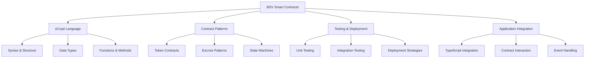

# Smart Contracts

Welcome to the Smart Contracts section of the BSV Technical Pathway. This module explores on-chain logic and automation using sCrypt, BSV's powerful smart contract language.

## 🎯 What You'll Learn

By completing this section, you'll have:
- ✅ **Mastered sCrypt fundamentals** for smart contract development
- ✅ **Explored contract examples** for common use cases
- ✅ **Understood integration patterns** with TypeScript applications
- ✅ **Implemented testing strategies** for contract validation
- ✅ **Deployed contracts** to the BSV blockchain

## 🏗️ Smart Contracts Overview



## 📚 Learning Modules

### 1. [sCrypt Fundamentals](scrypt-basics.md) ⏱️ 2 hours
**Core language concepts and development workflow**
- sCrypt language overview and syntax
- Contract development workflow
- Testing and debugging strategies
- Integration with TypeScript applications

### 2. [Contract Examples](contract-examples.md) ⏱️ 2 hours
**Practical implementations for common use cases**
- Token contracts and asset management
- Escrow and multi-signature patterns
- State machine implementations
- Advanced contract patterns

## 🔄 Smart Contracts vs. Traditional Code

| Aspect | Traditional Code | Smart Contracts |
|--------|-----------------|-----------------|
| **Execution** | Server or client | On-chain validation |
| **Immutability** | Mutable | Immutable once deployed |
| **State** | Maintained in database | Maintained in UTXO set |
| **Security** | Application-level | Protocol-level |
| **Costs** | Server resources | Transaction fees |
| **Transparency** | Private by default | Public by default |
| **Verification** | Trust-based | Trustless |

## 🛠️ Development Environment

To get started with sCrypt development, you'll need:

1. **Node.js** (v16 or higher)
2. **sCrypt IDE** extension for VS Code
3. **sCrypt CLI** tools

```bash
# Install sCrypt development tools
npm install -g scrypt-cli

# Create a new sCrypt project
scrypt create my-contract-project

# Navigate to project directory
cd my-contract-project

# Install dependencies
npm install
```

## 🚀 Quick Start

### Simple sCrypt Contract

```typescript
// A simple counter contract
contract Counter {
    // State variable
    int count;
    
    // Constructor
    public function constructor(int initialCount) {
        this.count = initialCount;
    }
    
    // Increment function
    public function increment(int amount, SigHashPreimage txPreimage) {
        // Verify amount is positive
        require(amount > 0);
        
        // Update state
        this.count += amount;
        
        // Ensure proper state transition
        bytes outputScript = this.getStateScript();
        require(Tx.checkOutputP2PKH(txPreimage, 0, outputScript, this.amount));
    }
    
    // Get current count
    public function getCount(): int {
        return this.count;
    }
}
```

### Compiling and Testing

```bash
# Compile contract
scrypt compile

# Run tests
npm test
```

## 🔗 Next Steps

Choose your starting point based on your experience:

| **New to Smart Contracts** | **Experienced Developer** |
|----------------------------|---------------------------|
| [sCrypt Fundamentals](scrypt-basics.md) | [Contract Examples](contract-examples.md) |
| Start with language basics | Jump to practical examples |

---

**Next:** [sCrypt Fundamentals](scrypt-basics.md)