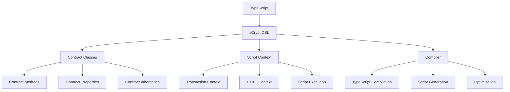

# sCrypt: An Embedded DSL for Bitcoin Smart Contracts

sCrypt is an embedded Domain-Specific Language (DSL) within TypeScript for writing Bitcoin smart contracts. This module explores how sCrypt enables developers to create powerful and secure smart contracts on the BSV blockchain.

## 🎯 Learning Objectives

By the end of this module, you'll understand:
- The nature of sCrypt as an embedded DSL within TypeScript
- How to write smart contracts using sCrypt
- How script context handling works in sCrypt
- How to compile, deploy, and interact with sCrypt contracts
- Best practices for sCrypt contract development

## 📚 Understanding sCrypt

### Embedded DSL Architecture

sCrypt is an embedded DSL within TypeScript, not a standalone language:



### Key Concepts

sCrypt introduces several key concepts:

1. **Contract Classes**: Smart contracts are defined as TypeScript classes
2. **Script Context**: Contracts have access to their execution context
3. **Type Safety**: TypeScript's type system ensures contract correctness
4. **Compilation**: Contracts are compiled to Bitcoin Script
5. **Integration**: Seamless integration with the TypeScript ecosystem

## 🛠️ Writing sCrypt Contracts

### Basic Contract Structure

A basic sCrypt contract:

```typescript
import {
  method,
  prop,
  SmartContract,
  hash256,
  assert,
  ByteString,
  toByteString,
  Sha256,
  Sig,
  PubKey,
} from 'scrypt-ts';

// Define a simple contract
export class HashLock extends SmartContract {
  // Contract properties
  @prop()
  readonly hashValue: Sha256;
  
  // Constructor
  constructor(hashValue: Sha256) {
    super(...arguments);
    this.hashValue = hashValue;
  }
  
  // Contract method
  @method()
  public unlock(preimage: ByteString) {
    // Verify that the hash of the preimage matches the stored hash value
    assert(hash256(preimage) === this.hashValue, 'Invalid preimage');
  }
}
```

### Script Context Handling

sCrypt contracts have access to their execution context:

```typescript
import {
  method,
  prop,
  SmartContract,
  assert,
  ByteString,
  Sig,
  PubKey,
  hash160,
  ScriptContext,
  Utils,
} from 'scrypt-ts';

// Define a contract that uses script context
export class ContextAwareContract extends SmartContract {
  // Contract properties
  @prop()
  readonly ownerPubKey: PubKey;
  
  // Constructor
  constructor(ownerPubKey: PubKey) {
    super(...arguments);
    this.ownerPubKey = ownerPubKey;
  }
  
  // Contract method that uses script context
  @method()
  public spend(sig: Sig, amount: bigint, ctx: ScriptContext) {
    // Verify signature
    assert(this.checkSig(sig, this.ownerPubKey), 'Invalid signature');
    
    // Access the current transaction from the context
    const currentTx = ctx.tx;
    
    // Access the current transaction input index
    const inputIndex = ctx.inputIndex;
    
    // Access the current UTXO being spent
    const currentUtxo = ctx.utxo;
    
    // Verify that the amount being spent matches the expected amount
    assert(currentUtxo.value === amount, 'Incorrect amount');
    
    // Verify that the transaction has at least one output
    assert(currentTx.outputs.length > 0, 'No outputs');
    
    // Verify that the first output sends to the owner
    const firstOutput = currentTx.outputs[0];
    const expectedLockingScript = Utils.buildPublicKeyHashScript(hash160(this.ownerPubKey));
    assert(firstOutput.script === expectedLockingScript, 'Output not to owner');
  }
}
```

### State Management

Managing contract state:

```typescript
import {
  method,
  prop,
  SmartContract,
  assert,
  Sig,
  PubKey,
  ScriptContext,
  StatefulContract,
} from 'scrypt-ts';

// Define a stateful contract
export class Counter extends StatefulContract {
  // State property
  @prop(true)
  count: bigint;
  
  // Contract properties
  @prop()
  readonly ownerPubKey: PubKey;
  
  // Constructor
  constructor(count: bigint, ownerPubKey: PubKey) {
    super(...arguments);
    this.count = count;
    this.ownerPubKey = ownerPubKey;
  }
  
  // Contract method to increment the counter
  @method()
  public increment(sig: Sig, ctx: ScriptContext) {
    // Verify signature
    assert(this.checkSig(sig, this.ownerPubKey), 'Invalid signature');
    
    // Increment the counter
    this.count++;
    
    // Ensure the state is properly propagated to the next instance
    const output = ctx.tx.outputs[0];
    const amount = output.value;
    
    // Verify that the output contains the updated state
    const nextInstance = this.next();
    assert(output.script === nextInstance.lockingScript, 'Invalid next state');
    
    // Verify that the amount is preserved
    assert(amount === ctx.utxo.value, 'Amount not preserved');
  }
}
```

## 🔍 Script Context in Depth

### Understanding Script Context

The `ScriptContext` object provides access to the execution context of a contract:

```typescript
interface ScriptContext {
  // The transaction that is being validated
  tx: Tx;
  
  // The index of the input being validated
  inputIndex: number;
  
  // The UTXO being spent
  utxo: UTXO;
}

interface Tx {
  // Transaction version
  version: number;
  
  // Transaction inputs
  inputs: TxInput[];
  
  // Transaction outputs
  outputs: TxOutput[];
  
  // Transaction locktime
  locktime: number;
}

interface TxInput {
  // Previous transaction ID
  prevTxid: ByteString;
  
  // Previous output index
  outputIndex: number;
  
  // Unlocking script
  script: ByteString;
  
  // Sequence number
  sequence: number;
}

interface TxOutput {
  // Output value in satoshis
  value: bigint;
  
  // Locking script
  script: ByteString;
}

interface UTXO {
  // Transaction ID
  txid: ByteString;
  
  // Output index
  outputIndex: number;
  
  // Output value in satoshis
  value: bigint;
  
  // Locking script
  script: ByteString;
}
```

### Using Script Context for Advanced Validation

Using script context for advanced validation:

```typescript
import {
  method,
  prop,
  SmartContract,
  assert,
  ByteString,
  Sig,
  PubKey,
  hash160,
  ScriptContext,
  Utils,
} from 'scrypt-ts';

// Define a contract that validates transaction structure
export class TransactionValidator extends SmartContract {
  // Contract properties
  @prop()
  readonly ownerPubKey: PubKey;
  
  @prop()
  readonly recipientPubKeyHash: ByteString;
  
  @prop()
  readonly minOutputValue: bigint;
  
  // Constructor
  constructor(ownerPubKey: PubKey, recipientPubKeyHash: ByteString, minOutputValue: bigint) {
    super(...arguments);
    this.ownerPubKey = ownerPubKey;
    this.recipientPubKeyHash = recipientPubKeyHash;
    this.minOutputValue = minOutputValue;
  }
  
  // Contract method that validates transaction structure
  @method()
  public validateAndSpend(sig: Sig, ctx: ScriptContext) {
    // Verify signature
    assert(this.checkSig(sig, this.ownerPubKey), 'Invalid signature');
    
    // Access the current transaction
    const tx = ctx.tx;
    
    // Verify that the transaction has exactly two outputs
    assert(tx.outputs.length === 2, 'Transaction must have exactly two outputs');
    
    // Verify that the first output sends to the recipient
    const firstOutput = tx.outputs[0];
    const expectedLockingScript = Utils.buildPublicKeyHashScript(this.recipientPubKeyHash);
    assert(firstOutput.script === expectedLockingScript, 'First output not to recipient');
    
    // Verify that the first output meets the minimum value requirement
    assert(firstOutput.value >= this.minOutputValue, 'First output below minimum value');
    
    // Verify that the second output is a change output to the owner
    const secondOutput = tx.outputs[1];
    const expectedChangeLockingScript = Utils.buildPublicKeyHashScript(hash160(this.ownerPubKey));
    assert(secondOutput.script === expectedChangeLockingScript, 'Second output not to owner');
    
    // Verify that the total output value is less than the input value (fee is paid)
    const totalOutputValue = firstOutput.value + secondOutput.value;
    assert(totalOutputValue < ctx.utxo.value, 'No fee paid');
  }
}
```

## 🔄 Compiling and Deploying Contracts

### Compilation Process

Compiling an sCrypt contract:

```typescript
import { HashLock } from './contracts/HashLock';
import { toByteString, sha256 } from 'scrypt-ts';

async function compileContract() {
  // Load the contract class
  await HashLock.loadArtifact();
  
  // Create a preimage and its hash
  const preimage = toByteString('hello world', 'utf8');
  const hashValue = sha256(preimage);
  
  // Instantiate the contract
  const hashLock = new HashLock(hashValue);
  
  // Connect to a signer
  await hashLock.connect(signer);
  
  // Contract is compiled during deployment
  const deployTx = await hashLock.deploy(1000n); // 1000 satoshis
  
  console.log('Contract deployed: ', deployTx.id);
  
  return {
    contract: hashLock,
    deployTx,
    preimage,
  };
}
```

### Interacting with Deployed Contracts

Calling methods on a deployed contract:

```typescript
import { HashLock } from './contracts/HashLock';
import { toByteString } from 'scrypt-ts';

async function callContract(contractId: string, preimage: string) {
  // Load the contract class
  await HashLock.loadArtifact();
  
  // Load the deployed contract instance
  const hashLock = await HashLock.fromTx(contractId, 0);
  
  // Connect to a signer
  await hashLock.connect(signer);
  
  // Call the contract method
  const callTx = await hashLock.methods.unlock(
    toByteString(preimage, 'utf8'),
    {
      // Call options
      changeAddress: 'your-change-address',
    }
  );
  
  console.log('Contract called: ', callTx.id);
  
  return callTx;
}
```

## 🔒 Security Considerations

### Common Vulnerabilities

Common vulnerabilities in sCrypt contracts:

1. **Signature Verification**: Always verify signatures before performing sensitive operations
2. **Integer Overflow/Underflow**: Be careful with arithmetic operations
3. **Reentrancy**: Be aware of potential reentrancy attacks
4. **Script Size Limits**: Keep contracts small to avoid hitting script size limits
5. **Gas Limits**: Be mindful of computational complexity

### Best Practices

Best practices for sCrypt contract development:

```typescript
import {
  method,
  prop,
  SmartContract,
  assert,
  Sig,
  PubKey,
  ScriptContext,
} from 'scrypt-ts';

// Define a contract with security best practices
export class SecureContract extends SmartContract {
  // Contract properties
  @prop()
  readonly ownerPubKey: PubKey;
  
  @prop()
  readonly timeoutHeight: bigint;
  
  // Constructor
  constructor(ownerPubKey: PubKey, timeoutHeight: bigint) {
    super(...arguments);
    this.ownerPubKey = ownerPubKey;
    this.timeoutHeight = timeoutHeight;
  }
  
  // Contract method with security best practices
  @method()
  public spend(sig: Sig, ctx: ScriptContext) {
    // 1. Always verify signatures first
    assert(this.checkSig(sig, this.ownerPubKey), 'Invalid signature');
    
    // 2. Check for timeouts
    assert(ctx.tx.locktime < this.timeoutHeight, 'Contract has expired');
    
    // 3. Validate transaction structure
    assert(ctx.tx.outputs.length > 0, 'No outputs');
    
    // 4. Use safe arithmetic
    let totalOutputValue = 0n;
    for (let i = 0; i < ctx.tx.outputs.length; i++) {
      const outputValue = ctx.tx.outputs[i].value;
      // Check for overflow
      assert(totalOutputValue + outputValue >= totalOutputValue, 'Integer overflow');
      totalOutputValue += outputValue;
    }
    
    // 5. Validate input/output relationship
    assert(totalOutputValue <= ctx.utxo.value, 'Outputs exceed input value');
    
    // 6. Validate fee
    const fee = ctx.utxo.value - totalOutputValue;
    assert(fee >= 1n, 'Fee too low');
  }
}
```

## 📊 Example Use Cases

### Token Contract

sCrypt can be used to implement token contracts with features like:

- Token transfers between addresses
- Balance tracking
- Minting new tokens
- Access control for administrative functions

### Escrow Contract

sCrypt can implement escrow contracts with features like:

- Multi-signature release (buyer and seller must agree)
- Arbiter resolution for disputes
- Timeout-based refunds
- Conditional payments based on external events

### Atomic Swaps

sCrypt enables atomic swaps between different assets:

- Hash time-locked contracts (HTLCs)
- Cross-chain atomic swaps
- Trustless trading of digital assets

### Oracle-Based Contracts

sCrypt can create contracts that depend on external data:

- Weather-based insurance contracts
- Price-dependent options contracts
- Sports betting contracts
- Prediction markets

## 🔗 Next Steps

Now that you understand sCrypt as an embedded DSL within TypeScript, you're ready to explore:

- [Contract Examples](contract-examples.md) - See more examples of sCrypt contracts
- [TypeScript SDK](../01-building-blocks/ts-sdk.md) - Learn how to interact with the blockchain
- [Wallet Infrastructure](../01-building-blocks/wallet-infrastructure.md) - Understand the server-side components
- [BRC-103 Authentication](../03-advanced-topics/brc103-authentication.md) - Explore peer-to-peer authentication
- [BSV Ecosystem Components](../../BSV_ECOSYSTEM_COMPONENTS.md) - See how everything fits together

---

**Next:** [Contract Examples](contract-examples.md)