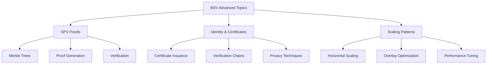

# Advanced Topics

Welcome to the Advanced Topics section of the BSV Technical Pathway. This module explores deeper technical concepts and patterns that are essential for building sophisticated, scalable applications on Bitcoin SV.

## 🎯 What You'll Learn

By completing this section, you'll have:
- ✅ **Mastered SPV proofs** for lightweight verification
- ✅ **Implemented identity and certificate systems**
- ✅ **Applied scaling patterns** for high-throughput applications
- ✅ **Understood advanced security considerations**
- ✅ **Optimized application performance**

## 🏗️ Advanced Topics Overview

## 📚 Learning Modules

### 1. [SPV Proofs & Verification](spv-proofs.md) ⏱️ 1.5 hours
**Lightweight verification of blockchain data**
- Simplified Payment Verification principles
- Merkle proof generation and validation
- Lightweight client implementation
- Security considerations and best practices

### 2. [Identity & Certificates](identity-certificates.md) ⏱️ 1.5 hours
**Cryptographic identity management**
- Certificate issuance and verification
- Privacy-preserving authentication
- Cross-application identity protocols
- Selective disclosure techniques

### 3. [Scaling Patterns](scaling-patterns.md) ⏱️ 1 hour
**Techniques for high-throughput applications**
- Horizontal scaling strategies
- Overlay network optimization
- Performance monitoring and tuning
- Load balancing and failover

## 🔄 Why Advanced Topics Matter

Building production-ready BSV applications requires more than just basic knowledge. Advanced topics provide the tools and techniques needed to:

1. **Enhance Security**: Implement robust verification and authentication
2. **Improve Performance**: Scale to handle millions of transactions
3. **Optimize Costs**: Reduce resource usage and transaction fees
4. **Ensure Privacy**: Protect sensitive user data
5. **Build Trust**: Create verifiable systems with cryptographic guarantees

## 🛠️ Prerequisites

Before diving into advanced topics, you should have:

- Completed the [BSV Building Blocks](../01-building-blocks/README.md) section
- Familiarity with [Smart Contracts](../02-smart-contracts/README.md)
- Working knowledge of cryptography fundamentals
- Experience with distributed systems concepts

## 🚀 Quick Start

Choose your starting point based on your immediate needs:

| **Verification Focus** | **Identity Focus** | **Scaling Focus** |
|------------------------|--------------------|--------------------|
| [SPV Proofs](spv-proofs.md) | [Identity & Certificates](identity-certificates.md) | [Scaling Patterns](scaling-patterns.md) |
| Lightweight verification | Authentication systems | High-throughput applications |

---

**Next:** [SPV Proofs & Verification](spv-proofs.md)