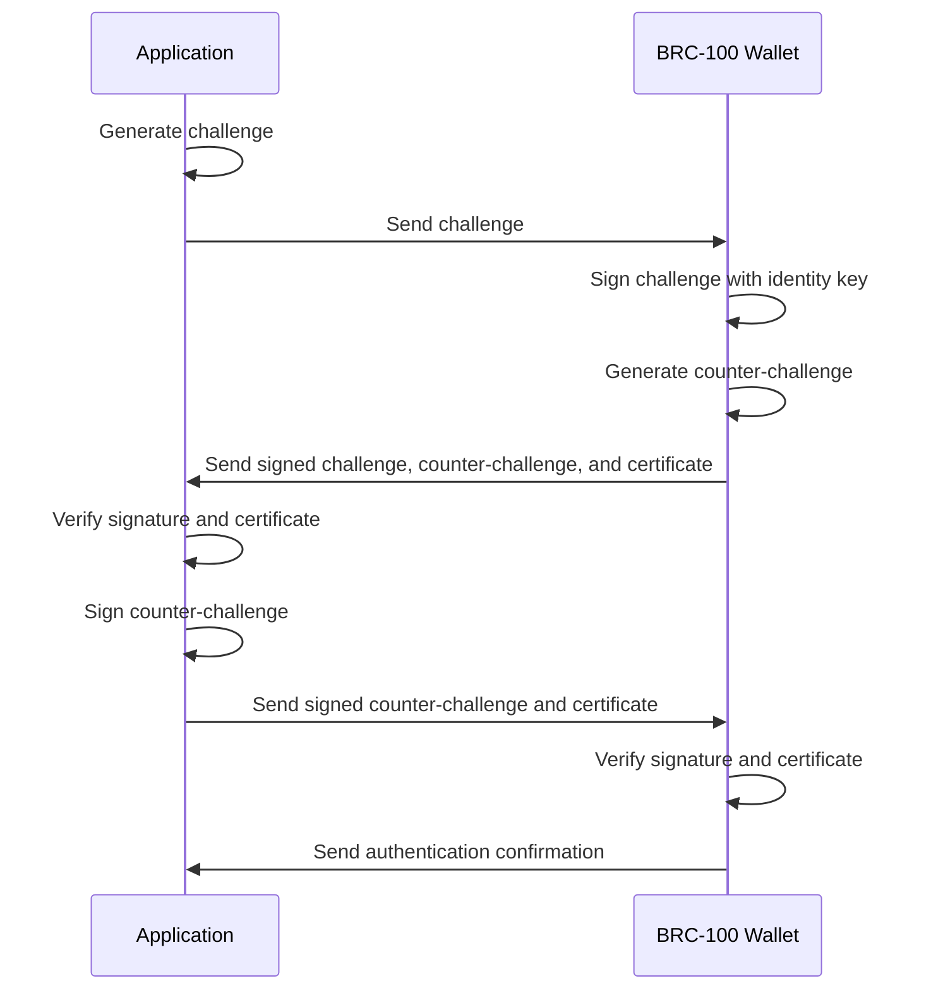

# BRC-103: Peer-to-Peer Mutual Authentication Protocol

BRC-103 is a peer-to-peer mutual authentication and certificate exchange protocol designed specifically for the BSV ecosystem. This module explores how BRC-103 enables secure authentication between applications and wallets without relying on centralized identity providers.

## 🎯 Learning Objectives

By the end of this module, you'll understand:
- The fundamental principles of BRC-103 authentication
- How to implement BRC-103 in your applications
- The certificate exchange process
- Security considerations and best practices
- Integration with BRC-100 wallets

## 🏗️ BRC-103 Architecture

BRC-103 enables secure mutual authentication between peers:



## 📚 Understanding BRC-103

### Core Concepts

BRC-103 is built on several key concepts:

1. **Mutual Authentication**: Both parties authenticate each other, eliminating man-in-the-middle attacks.
2. **Challenge-Response**: Uses cryptographic challenges to prove identity without revealing private keys.
3. **Certificate Exchange**: Enables identity verification through cryptographic certificates.
4. **Zero Trust**: Assumes no inherent trust between parties until proven through cryptographic verification.
5. **Decentralized Identity**: Leverages blockchain-based identities rather than centralized providers.

### Certificate Structure

BRC-103 certificates follow a standardized structure:

```json
{
  "version": "1.0",
  "type": "identity",
  "subject": {
    "id": "bsv:identity:123456789abcdef",
    "publicKey": "02a1b2c3d4e5f6...",
    "name": "Example User",
    "attributes": {
      "email": "user@example.com",
      "avatar": "https://example.com/avatar.jpg"
    }
  },
  "issuer": {
    "id": "bsv:identity:issuer123456789",
    "publicKey": "03f6e5d4c3b2a1...",
    "name": "Certificate Authority"
  },
  "validFrom": "2023-01-01T00:00:00Z",
  "validUntil": "2024-01-01T00:00:00Z",
  "permissions": ["authenticate", "sign", "encrypt"],
  "metadata": {
    "registrationDate": "2023-01-01T00:00:00Z",
    "deviceId": "device-123456"
  },
  "signature": "3045022100..."
}
```

### Authentication Flow

The BRC-103 authentication flow consists of the following steps:

1. **Challenge Generation**: The application generates a random challenge.
2. **Challenge Transmission**: The application sends the challenge to the wallet.
3. **Challenge Signing**: The wallet signs the challenge with its identity key.
4. **Counter-Challenge Generation**: The wallet generates a random counter-challenge.
5. **Response Transmission**: The wallet sends the signed challenge, counter-challenge, and its certificate to the application.
6. **Verification**: The application verifies the signature and certificate.
7. **Counter-Challenge Signing**: The application signs the counter-challenge with its identity key.
8. **Certificate Exchange**: The application sends its signed counter-challenge and certificate to the wallet.
9. **Wallet Verification**: The wallet verifies the application's signature and certificate.
10. **Confirmation**: The wallet sends an authentication confirmation to the application.

## 🛠️ Implementing BRC-103

### Client-Side Implementation

Implementing BRC-103 in a web application:

```typescript
import { BRC103Client } from '@bsv/brc103';
import { BRC100Wallet } from '@bsv/brc100';

async function authenticateWithWallet() {
  // Initialize the BRC-103 client
  const brc103Client = new BRC103Client({
    appName: 'Example App',
    appId: 'com.example.app',
    certificatePath: './app-certificate.json',
    privateKeyPath: './app-private-key.pem',
  });
  
  // Generate a challenge
  const challenge = await brc103Client.generateChallenge();
  
  // Connect to the wallet (using BRC-100)
  const wallet = await BRC100Wallet.connect({
    walletUrl: 'tcp://localhost:3321',
  });
  
  // Send the challenge to the wallet
  const authResponse = await wallet.authenticate({
    challenge,
    protocol: 'BRC-103',
    appName: 'Example App',
    appId: 'com.example.app',
  });
  
  // Verify the wallet's response
  const walletVerification = await brc103Client.verifyWalletResponse({
    challenge,
    signedChallenge: authResponse.signedChallenge,
    counterChallenge: authResponse.counterChallenge,
    certificate: authResponse.certificate,
  });
  
  if (!walletVerification.valid) {
    throw new Error(`Wallet verification failed: ${walletVerification.reason}`);
  }
  
  // Sign the counter-challenge
  const signedCounterChallenge = await brc103Client.signChallenge(authResponse.counterChallenge);
  
  // Send the signed counter-challenge and certificate to the wallet
  const appVerification = await wallet.verifyApp({
    signedCounterChallenge,
    certificate: await brc103Client.getCertificate(),
  });
  
  if (appVerification.authenticated) {
    console.log('Mutual authentication successful!');
    return {
      authenticated: true,
      userIdentity: authResponse.certificate.subject,
      sessionId: appVerification.sessionId,
    };
  } else {
    throw new Error('Application verification failed');
  }
}
```

### Server-Side Implementation

Implementing BRC-103 in a Node.js server:

```typescript
import express from 'express';
import { BRC103Server } from '@bsv/brc103';

const app = express();
app.use(express.json());

// Initialize the BRC-103 server
const brc103Server = new BRC103Server({
  appName: 'Example API',
  appId: 'com.example.api',
  certificatePath: './api-certificate.json',
  privateKeyPath: './api-private-key.pem',
});

// Challenge endpoint
app.post('/auth/challenge', async (req, res) => {
  try {
    const challenge = await brc103Server.generateChallenge();
    
    // Store the challenge for later verification
    // This could be in a database, Redis, etc.
    req.session.challenge = challenge;
    
    res.json({
      challenge,
      protocol: 'BRC-103',
      appName: 'Example API',
      appId: 'com.example.api',
    });
  } catch (error) {
    res.status(500).json({ error: error.message });
  }
});

// Verification endpoint
app.post('/auth/verify', async (req, res) => {
  try {
    const { signedChallenge, counterChallenge, certificate } = req.body;
    
    // Retrieve the original challenge
    const challenge = req.session.challenge;
    
    if (!challenge) {
      return res.status(400).json({ error: 'No active challenge found' });
    }
    
    // Verify the wallet's response
    const walletVerification = await brc103Server.verifyWalletResponse({
      challenge,
      signedChallenge,
      counterChallenge,
      certificate,
    });
    
    if (!walletVerification.valid) {
      return res.status(401).json({ error: `Wallet verification failed: ${walletVerification.reason}` });
    }
    
    // Sign the counter-challenge
    const signedCounterChallenge = await brc103Server.signChallenge(counterChallenge);
    
    // Generate a session token
    const sessionToken = await brc103Server.generateSessionToken(certificate.subject.id);
    
    // Clear the challenge
    delete req.session.challenge;
    
    // Return the signed counter-challenge, certificate, and session token
    res.json({
      signedCounterChallenge,
      certificate: await brc103Server.getCertificate(),
      sessionToken,
    });
  } catch (error) {
    res.status(500).json({ error: error.message });
  }
});

// Protected resource endpoint
app.get('/api/protected', async (req, res) => {
  try {
    const authHeader = req.headers.authorization;
    
    if (!authHeader || !authHeader.startsWith('Bearer ')) {
      return res.status(401).json({ error: 'No token provided' });
    }
    
    const token = authHeader.split(' ')[1];
    
    // Verify the session token
    const verification = await brc103Server.verifySessionToken(token);
    
    if (!verification.valid) {
      return res.status(401).json({ error: 'Invalid or expired token' });
    }
    
    // Access granted
    res.json({
      message: 'Access granted to protected resource',
      userId: verification.userId,
    });
  } catch (error) {
    res.status(500).json({ error: error.message });
  }
});

app.listen(3000, () => {
  console.log('Server running on port 3000');
});
```

### Certificate Generation

Generating certificates for BRC-103:

```typescript
import { BRC103CertificateGenerator } from '@bsv/brc103';

async function generateCertificates() {
  // Initialize the certificate generator
  const generator = new BRC103CertificateGenerator();
  
  // Generate a self-signed certificate for an application
  const appCertificate = await generator.generateSelfSigned({
    subject: {
      id: 'bsv:identity:app123456789',
      name: 'Example App',
      attributes: {
        url: 'https://example.com',
        description: 'An example application',
      },
    },
    validityPeriod: {
      years: 1,
    },
    permissions: ['authenticate', 'sign'],
  });
  
  // Save the certificate and private key
  await generator.saveCertificate(appCertificate, './app-certificate.json');
  await generator.savePrivateKey(appCertificate.privateKey, './app-private-key.pem');
  
  // Generate a certificate for a user (typically done by a wallet)
  const userCertificate = await generator.generateSelfSigned({
    subject: {
      id: 'bsv:identity:user123456789',
      name: 'Example User',
      attributes: {
        email: 'user@example.com',
        avatar: 'https://example.com/avatar.jpg',
      },
    },
    validityPeriod: {
      years: 1,
    },
    permissions: ['authenticate', 'sign', 'encrypt'],
  });
  
  // Save the user certificate and private key
  await generator.saveCertificate(userCertificate, './user-certificate.json');
  await generator.savePrivateKey(userCertificate.privateKey, './user-private-key.pem');
  
  return {
    appCertificate,
    userCertificate,
  };
}
```

## 🔒 Security Considerations

### Certificate Validation

Properly validating certificates is crucial for security:

```typescript
import { BRC103CertificateValidator } from '@bsv/brc103';

async function validateCertificate(certificate) {
  // Initialize the certificate validator
  const validator = new BRC103CertificateValidator({
    trustedIssuers: [
      {
        id: 'bsv:identity:issuer123456789',
        publicKey: '03f6e5d4c3b2a1...',
      },
    ],
    revocationLists: [
      'https://example.com/revocation-list.json',
    ],
  });
  
  // Validate the certificate
  const validation = await validator.validate(certificate);
  
  if (validation.valid) {
    console.log('Certificate is valid');
    return true;
  } else {
    console.error(`Certificate validation failed: ${validation.reason}`);
    return false;
  }
}
```

### Challenge Security

Ensuring challenge security:

1. **Randomness**: Challenges must be cryptographically random to prevent prediction attacks.
2. **Length**: Challenges should be at least 32 bytes (256 bits) long.
3. **Uniqueness**: Each challenge should be used only once.
4. **Expiration**: Challenges should expire after a short time (e.g., 5 minutes).
5. **Storage**: Challenges should be securely stored server-side.

```typescript
import { randomBytes } from 'crypto';

function generateSecureChallenge() {
  // Generate 32 bytes (256 bits) of random data
  const randomData = randomBytes(32);
  
  // Convert to a hex string
  const challenge = randomData.toString('hex');
  
  // Store the challenge with an expiration time
  const challengeRecord = {
    challenge,
    created: new Date(),
    expires: new Date(Date.now() + 5 * 60 * 1000), // 5 minutes
  };
  
  // Store in a secure database
  storeChallenge(challengeRecord);
  
  return challenge;
}
```

### Preventing Replay Attacks

Preventing replay attacks:

```typescript
import { createHash } from 'crypto';

class ChallengeManager {
  private usedChallenges = new Map<string, Date>();
  
  // Clean up expired challenges periodically
  constructor() {
    setInterval(() => this.cleanupExpiredChallenges(), 60 * 60 * 1000); // 1 hour
  }
  
  // Generate a new challenge
  generateChallenge(): string {
    const challenge = randomBytes(32).toString('hex');
    const expires = new Date(Date.now() + 5 * 60 * 1000); // 5 minutes
    
    // Store the challenge hash and expiration
    const challengeHash = this.hashChallenge(challenge);
    this.usedChallenges.set(challengeHash, expires);
    
    return challenge;
  }
  
  // Verify a challenge hasn't been used before
  verifyChallenge(challenge: string): boolean {
    const challengeHash = this.hashChallenge(challenge);
    
    // Check if the challenge has been used
    if (this.usedChallenges.has(challengeHash)) {
      return false; // Challenge has been used
    }
    
    // Mark the challenge as used
    this.usedChallenges.set(challengeHash, new Date(Date.now() + 5 * 60 * 1000));
    
    return true;
  }
  
  // Hash a challenge for storage
  private hashChallenge(challenge: string): string {
    return createHash('sha256').update(challenge).digest('hex');
  }
  
  // Clean up expired challenges
  private cleanupExpiredChallenges(): void {
    const now = new Date();
    
    for (const [challenge, expires] of this.usedChallenges.entries()) {
      if (expires < now) {
        this.usedChallenges.delete(challenge);
      }
    }
  }
}
```

## 🔄 Integration with Other Components

### Integration with BRC-100 Wallets

BRC-103 is designed to work seamlessly with BRC-100 compliant wallets:

```typescript
import { BRC103Client } from '@bsv/brc103';
import { BRC100Wallet } from '@bsv/brc100';

async function authenticateWithBRC100Wallet() {
  // Initialize the BRC-103 client
  const brc103Client = new BRC103Client({
    appName: 'Example App',
    appId: 'com.example.app',
    certificatePath: './app-certificate.json',
    privateKeyPath: './app-private-key.pem',
  });
  
  // Connect to the BRC-100 wallet
  const wallet = await BRC100Wallet.connect({
    walletUrl: 'tcp://localhost:3321',
  });
  
  // Check if the wallet supports BRC-103
  const capabilities = await wallet.getCapabilities();
  
  if (!capabilities.protocols.includes('BRC-103')) {
    throw new Error('Wallet does not support BRC-103 authentication');
  }
  
  // Perform BRC-103 authentication
  const authResult = await brc103Client.authenticateWithWallet(wallet);
  
  if (authResult.authenticated) {
    console.log('Authentication successful');
    console.log('User ID:', authResult.userIdentity.id);
    console.log('User Name:', authResult.userIdentity.name);
    
    // Use the authenticated session
    const session = authResult.session;
    
    // Make authenticated requests
    const result = await wallet.request({
      method: 'getBalance',
      session,
    });
    
    console.log('Balance:', result.balance);
  } else {
    console.error('Authentication failed:', authResult.reason);
  }
}
```

### Integration with Payment Protocols

BRC-103 can be integrated with payment protocols like BRC-41 and BRC-105:

```typescript
import { BRC103Client } from '@bsv/brc103';
import { BRC100Wallet } from '@bsv/brc100';
import { BRC41PaymentProcessor } from '@bsv/brc41';

async function authenticatedPayment() {
  // Initialize the BRC-103 client
  const brc103Client = new BRC103Client({
    appName: 'Example Store',
    appId: 'com.example.store',
    certificatePath: './store-certificate.json',
    privateKeyPath: './store-private-key.pem',
  });
  
  // Connect to the BRC-100 wallet
  const wallet = await BRC100Wallet.connect({
    walletUrl: 'tcp://localhost:3321',
  });
  
  // Authenticate with the wallet
  const authResult = await brc103Client.authenticateWithWallet(wallet);
  
  if (!authResult.authenticated) {
    throw new Error(`Authentication failed: ${authResult.reason}`);
  }
  
  // Initialize the payment processor
  const paymentProcessor = new BRC41PaymentProcessor({
    merchantName: 'Example Store',
    merchantId: 'com.example.store',
    certificatePath: './store-certificate.json',
    privateKeyPath: './store-private-key.pem',
  });
  
  // Create a payment request
  const paymentRequest = await paymentProcessor.createPaymentRequest({
    amount: 1000000, // 0.01 BSV
    description: 'Purchase of Example Product',
    merchantData: {
      orderId: '12345',
      productId: 'product-123',
    },
    authenticatedUser: authResult.userIdentity.id, // Link payment to authenticated user
  });
  
  // Send the payment request to the wallet
  const paymentResult = await wallet.processPayment({
    paymentRequest,
    session: authResult.session, // Use the authenticated session
  });
  
  if (paymentResult.status === 'success') {
    console.log('Payment successful');
    console.log('Transaction ID:', paymentResult.txid);
    
    // Verify the payment
    const verification = await paymentProcessor.verifyPayment(paymentResult);
    
    if (verification.valid) {
      console.log('Payment verified');
      // Fulfill the order
      fulfillOrder(paymentResult.merchantData.orderId);
    } else {
      console.error('Payment verification failed:', verification.reason);
    }
  } else {
    console.error('Payment failed:', paymentResult.reason);
  }
}
```

### Integration with Smart Contracts

BRC-103 can be used to authenticate interactions with smart contracts:

```typescript
import { BRC103Client } from '@bsv/brc103';
import { BRC100Wallet } from '@bsv/brc100';
import { SmartContract } from '@bsv/sdk';

async function authenticatedContractInteraction() {
  // Initialize the BRC-103 client
  const brc103Client = new BRC103Client({
    appName: 'Contract Interaction',
    appId: 'com.example.contract',
    certificatePath: './app-certificate.json',
    privateKeyPath: './app-private-key.pem',
  });
  
  // Connect to the BRC-100 wallet
  const wallet = await BRC100Wallet.connect({
    walletUrl: 'tcp://localhost:3321',
  });
  
  // Authenticate with the wallet
  const authResult = await brc103Client.authenticateWithWallet(wallet);
  
  if (!authResult.authenticated) {
    throw new Error(`Authentication failed: ${authResult.reason}`);
  }
  
  // Initialize the smart contract
  const contract = new SmartContract({
    artifact: './contract-artifact.json',
  });
  
  // Create a signed message proving the user's identity
  const identityProof = await brc103Client.createIdentityProof({
    userId: authResult.userIdentity.id,
    action: 'contract-interaction',
    contractId: contract.id,
    timestamp: new Date().toISOString(),
  });
  
  // Call the contract method with identity proof
  const result = await contract.methods.authenticatedAction({
    identityProof,
    param1: 'value1',
    param2: 'value2',
  }).call();
  
  console.log('Contract interaction result:', result);
}
```

## 📊 Example Use Cases

### Secure API Access

Using BRC-103 for secure API access:

```typescript
import { BRC103Client } from '@bsv/brc103';
import { BRC100Wallet } from '@bsv/brc100';
import axios from 'axios';

async function secureApiAccess() {
  // Initialize the BRC-103 client
  const brc103Client = new BRC103Client({
    appName: 'API Client',
    appId: 'com.example.apiclient',
    certificatePath: './client-certificate.json',
    privateKeyPath: './client-private-key.pem',
  });
  
  // Connect to the BRC-100 wallet
  const wallet = await BRC100Wallet.connect({
    walletUrl: 'tcp://localhost:3321',
  });
  
  // Authenticate with the wallet
  const authResult = await brc103Client.authenticateWithWallet(wallet);
  
  if (!authResult.authenticated) {
    throw new Error(`Authentication failed: ${authResult.reason}`);
  }
  
  // Create an authenticated API client
  const apiClient = axios.create({
    baseURL: 'https://api.example.com',
    headers: {
      'Authorization': `Bearer ${authResult.session.token}`,
      'X-User-ID': authResult.userIdentity.id,
      'X-Certificate-Fingerprint': authResult.certificateFingerprint,
    },
  });
  
  // Make authenticated API requests
  const response = await apiClient.get('/protected-resource');
  
  console.log('API response:', response.data);
}
```

### Decentralized Identity Verification

Using BRC-103 for decentralized identity verification:

```typescript
import { BRC103Client } from '@bsv/brc103';
import { BRC100Wallet } from '@bsv/brc100';

async function verifyUserIdentity() {
  // Initialize the BRC-103 client
  const brc103Client = new BRC103Client({
    appName: 'Identity Verifier',
    appId: 'com.example.verifier',
    certificatePath: './verifier-certificate.json',
    privateKeyPath: './verifier-private-key.pem',
  });
  
  // Connect to the BRC-100 wallet
  const wallet = await BRC100Wallet.connect({
    walletUrl: 'tcp://localhost:3321',
  });
  
  // Authenticate with the wallet
  const authResult = await brc103Client.authenticateWithWallet(wallet);
  
  if (!authResult.authenticated) {
    throw new Error(`Authentication failed: ${authResult.reason}`);
  }
  
  // Extract identity attributes
  const identity = authResult.userIdentity;
  
  // Verify specific attributes
  if (identity.attributes.verifiedEmail) {
    console.log('Email verified:', identity.attributes.email);
  }
  
  if (identity.attributes.verifiedPhone) {
    console.log('Phone verified:', identity.attributes.phone);
  }
  
  if (identity.attributes.kycVerified) {
    console.log('KYC verified:', identity.attributes.kycLevel);
    console.log('KYC provider:', identity.attributes.kycProvider);
    console.log('KYC date:', identity.attributes.kycDate);
  }
  
  // Check certificate issuer
  if (authResult.certificate.issuer.id === 'bsv:identity:trusted-issuer') {
    console.log('Certificate issued by trusted authority');
  }
  
  return {
    verified: true,
    identity,
  };
}
```

### Secure Messaging

Using BRC-103 for secure messaging:

```typescript
import { BRC103Client } from '@bsv/brc103';
import { BRC100Wallet } from '@bsv/brc100';
import { MessageEncryption } from '@bsv/encryption';

async function secureMessaging() {
  // Initialize the BRC-103 client
  const brc103Client = new BRC103Client({
    appName: 'Secure Messenger',
    appId: 'com.example.messenger',
    certificatePath: './messenger-certificate.json',
    privateKeyPath: './messenger-private-key.pem',
  });
  
  // Connect to the BRC-100 wallet
  const wallet = await BRC100Wallet.connect({
    walletUrl: 'tcp://localhost:3321',
  });
  
  // Authenticate with the wallet
  const authResult = await brc103Client.authenticateWithWallet(wallet);
  
  if (!authResult.authenticated) {
    throw new Error(`Authentication failed: ${authResult.reason}`);
  }
  
  // Initialize message encryption
  const encryption = new MessageEncryption({
    privateKey: await brc103Client.getPrivateKey(),
  });
  
  // Encrypt a message for the user
  const encryptedMessage = await encryption.encrypt({
    message: 'This is a secure message',
    recipientPublicKey: authResult.userIdentity.publicKey,
  });
  
  // Send the encrypted message
  const messagingResult = await wallet.sendMessage({
    message: encryptedMessage,
    session: authResult.session,
  });
  
  console.log('Message sent:', messagingResult.messageId);
  
  // Receive and decrypt messages
  const messages = await wallet.getMessages({
    session: authResult.session,
  });
  
  for (const message of messages) {
    try {
      const decryptedMessage = await encryption.decrypt({
        encryptedMessage: message.content,
        senderPublicKey: message.sender.publicKey,
      });
      
      console.log('Decrypted message:', decryptedMessage);
    } catch (error) {
      console.error('Failed to decrypt message:', error);
    }
  }
}
```

## 🔗 Next Steps

Now that you understand BRC-103 authentication, you're ready to explore:

- [Payment Requirements](payment-requirements.md) - Learn about HTTP payment mechanisms
- [Identity Certificates](identity-certificates.md) - Explore identity management in depth
- [Wallet Infrastructure](../01-building-blocks/wallet-infrastructure.md) - Understand the server-side components
- [Metanet Desktop](../01-building-blocks/metanet-desktop.md) - Explore a BRC-100 compliant wallet
- [BSV Ecosystem Components](../../BSV_ECOSYSTEM_COMPONENTS.md) - See how everything fits together

---

**Next:** [Payment Requirements](payment-requirements.md)