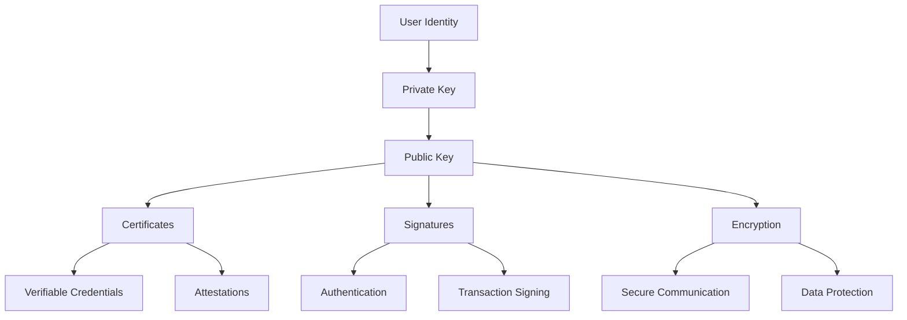
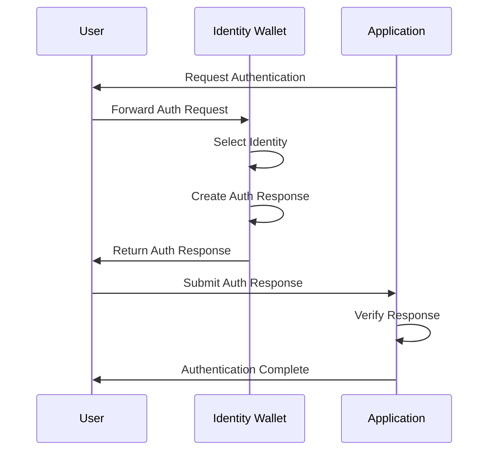

# Identity & Certificates

Cryptographic identity and certificate management are fundamental to building secure, privacy-preserving applications on BSV. This module explores certificate issuance and verification, privacy-preserving authentication, cross-application identity protocols, and selective disclosure techniques.

## 🎯 Learning Objectives

By the end of this module, you'll understand:
- How to implement certificate issuance and verification
- Privacy-preserving authentication techniques
- Cross-application identity protocols (BRC-100 and BRC-103)
- Selective disclosure for privacy protection
- Best practices for identity management

## 🔑 Cryptographic Identity Management

### Identity in the BSV Ecosystem

In the BSV ecosystem, identity is based on cryptographic keys rather than usernames and passwords:



### Key Components of BSV Identity

1. **Key Pairs**: The foundation of cryptographic identity
2. **Certificates**: Verifiable claims about an identity
3. **Signatures**: Proof of identity and intent
4. **Verification**: Validation of identity claims
5. **Protocols**: Standards for identity interaction (BRC-100, BRC-103)

## 📜 Certificate Issuance and Verification

### Certificate Structure

BSV certificates follow a standard structure:

```typescript
interface Certificate {
  // Metadata
  id: string;
  type: string;
  issuanceDate: string;
  expirationDate?: string;
  
  // Parties involved
  issuer: {
    id: string;
    publicKey: string;
    name?: string;
  };
  
  subject: {
    id: string;
    publicKey: string;
    name?: string;
  };
  
  // Certificate content
  claims: {
    [key: string]: any;
  };
  
  // Cryptographic proof
  proof: {
    type: string;
    created: string;
    verificationMethod: string;
    signature: string;
  };
}
```

### Issuing Certificates

```typescript
import { CertificateManager, KeyPair } from '@bsv/identity';

async function issueCertificate(
  issuerKeyPair: KeyPair,
  subjectPublicKey: string,
  claims: Record<string, any>
): Promise<Certificate> {
  // Create certificate manager
  const certificateManager = new CertificateManager();
  
  // Prepare certificate data
  const certificateData = {
    type: 'IdentityCertificate',
    issuer: {
      id: `bsv:${issuerKeyPair.publicKey}`,
      publicKey: issuerKeyPair.publicKey,
      name: 'Example Issuer'
    },
    subject: {
      id: `bsv:${subjectPublicKey}`,
      publicKey: subjectPublicKey
    },
    claims: claims,
    issuanceDate: new Date().toISOString(),
    expirationDate: new Date(Date.now() + 365 * 24 * 60 * 60 * 1000).toISOString() // 1 year
  };
  
  // Issue the certificate
  const certificate = await certificateManager.issue(certificateData, issuerKeyPair.privateKey);
  
  console.log(`Certificate issued with ID: ${certificate.id}`);
  return certificate;
}

// Example usage
const issuerKeyPair = KeyPair.generate();
const subjectKeyPair = KeyPair.generate();

const certificate = await issueCertificate(
  issuerKeyPair,
  subjectKeyPair.publicKey,
  {
    name: 'John Doe',
    email: 'john@example.com',
    isVerified: true,
    verificationLevel: 2,
    memberSince: '2023-01-15'
  }
);
```

### Storing Certificates On-Chain

```typescript
import { Transaction } from '@bsv/sdk';

async function storeCertificateOnChain(certificate: Certificate, keyPair: KeyPair): Promise<string> {
  // Serialize certificate to JSON
  const certificateJson = JSON.stringify(certificate);
  
  // Create a transaction
  const tx = new Transaction();
  
  // Add certificate data as OP_RETURN output
  tx.addOutput({
    script: Script.buildDataOutput(Buffer.from(certificateJson, 'utf8')),
    satoshis: 0
  });
  
  // Add funding input and change output
  // (Implementation details omitted for brevity)
  
  // Sign the transaction
  const signedTx = await tx.sign(keyPair.privateKey);
  
  // Broadcast the transaction
  const txid = await signedTx.broadcast();
  
  console.log(`Certificate stored on-chain with TXID: ${txid}`);
  return txid;
}
```

### Verifying Certificates

```typescript
import { CertificateManager } from '@bsv/identity';

async function verifyCertificate(certificate: Certificate): Promise<boolean> {
  // Create certificate manager
  const certificateManager = new CertificateManager();
  
  try {
    // Verify the certificate
    const verificationResult = await certificateManager.verify(certificate);
    
    if (verificationResult.valid) {
      console.log('Certificate is valid');
      
      // Check expiration
      if (certificate.expirationDate && new Date(certificate.expirationDate) < new Date()) {
        console.log('Certificate has expired');
        return false;
      }
      
      return true;
    } else {
      console.log(`Certificate is invalid: ${verificationResult.reason}`);
      return false;
    }
  } catch (error) {
    console.error('Certificate verification failed:', error);
    return false;
  }
}
```

### Certificate Revocation

```typescript
import { RevocationList, CertificateManager } from '@bsv/identity';

class CertificateRevocationManager {
  private revocationList: RevocationList;
  private certificateManager: CertificateManager;
  
  constructor() {
    this.revocationList = new RevocationList();
    this.certificateManager = new CertificateManager();
  }
  
  async initialize() {
    // Load revocation list from storage or blockchain
    await this.revocationList.load();
  }
  
  async revokeCertificate(
    certificateId: string,
    reason: string,
    issuerKeyPair: KeyPair
  ): Promise<boolean> {
    try {
      // Add certificate to revocation list
      await this.revocationList.revoke(certificateId, {
        reason,
        timestamp: new Date().toISOString(),
        issuer: `bsv:${issuerKeyPair.publicKey}`
      });
      
      // Sign the revocation
      await this.revocationList.sign(issuerKeyPair.privateKey);
      
      // Publish the updated revocation list
      await this.publishRevocationList();
      
      console.log(`Certificate ${certificateId} revoked`);
      return true;
    } catch (error) {
      console.error('Certificate revocation failed:', error);
      return false;
    }
  }
  
  async checkRevocationStatus(certificateId: string): Promise<boolean> {
    // Check if certificate is in the revocation list
    const isRevoked = await this.revocationList.isRevoked(certificateId);
    
    if (isRevoked) {
      const revocationInfo = await this.revocationList.getRevocationInfo(certificateId);
      console.log(`Certificate is revoked. Reason: ${revocationInfo.reason}`);
    } else {
      console.log('Certificate is not revoked');
    }
    
    return isRevoked;
  }
  
  private async publishRevocationList(): Promise<void> {
    // Publish revocation list to blockchain or storage
    // Implementation details omitted for brevity
  }
}
```

## 🔒 Privacy-Preserving Authentication

### Zero-Knowledge Proofs

Zero-knowledge proofs allow proving possession of information without revealing the information itself:

```typescript
import { ZKProof } from '@bsv/identity';

async function createAgeProof(
  dateOfBirth: string,
  minimumAge: number,
  keyPair: KeyPair
): Promise<ZKProof> {
  // Calculate age
  const birthDate = new Date(dateOfBirth);
  const today = new Date();
  const age = today.getFullYear() - birthDate.getFullYear();
  
  // Adjust age if birthday hasn't occurred yet this year
  if (
    today.getMonth() < birthDate.getMonth() ||
    (today.getMonth() === birthDate.getMonth() && today.getDate() < birthDate.getDate())
  ) {
    age--;
  }
  
  // Create a zero-knowledge proof that age >= minimumAge
  // without revealing the actual age or date of birth
  const zkProof = new ZKProof();
  
  const proof = await zkProof.create({
    predicate: 'age >= minimumAge',
    privateValues: {
      age,
      dateOfBirth
    },
    publicValues: {
      minimumAge
    },
    subject: keyPair.publicKey
  }, keyPair.privateKey);
  
  return proof;
}

async function verifyAgeProof(proof: ZKProof): Promise<boolean> {
  // Verify the zero-knowledge proof
  const zkProof = new ZKProof();
  
  try {
    const verificationResult = await zkProof.verify(proof);
    
    if (verificationResult.valid) {
      console.log(`Verified: Person is at least ${proof.publicValues.minimumAge} years old`);
      return true;
    } else {
      console.log(`Verification failed: ${verificationResult.reason}`);
      return false;
    }
  } catch (error) {
    console.error('Proof verification failed:', error);
    return false;
  }
}
```

### Blind Signatures

Blind signatures allow signing a message without seeing its content:

```typescript
import { BlindSignature } from '@bsv/identity';

// User side: Prepare a blind message
async function prepareBlindMessage(message: string, serverPublicKey: string): Promise<{
  blindedMessage: string;
  blindingFactor: string;
}> {
  const blindSignature = new BlindSignature();
  
  // Blind the message
  const { blindedMessage, blindingFactor } = await blindSignature.blind(message, serverPublicKey);
  
  return { blindedMessage, blindingFactor };
}

// Server side: Sign the blinded message
async function signBlindedMessage(
  blindedMessage: string,
  serverKeyPair: KeyPair
): Promise<string> {
  const blindSignature = new BlindSignature();
  
  // Sign the blinded message
  const blindedSignature = await blindSignature.sign(blindedMessage, serverKeyPair.privateKey);
  
  return blindedSignature;
}

// User side: Unblind the signature
async function unblindSignature(
  blindedSignature: string,
  blindingFactor: string,
  serverPublicKey: string
): Promise<string> {
  const blindSignature = new BlindSignature();
  
  // Unblind the signature
  const signature = await blindSignature.unblind(blindedSignature, blindingFactor, serverPublicKey);
  
  return signature;
}

// Anyone: Verify the signature
async function verifyBlindSignature(
  message: string,
  signature: string,
  serverPublicKey: string
): Promise<boolean> {
  const blindSignature = new BlindSignature();
  
  // Verify the signature
  const isValid = await blindSignature.verify(message, signature, serverPublicKey);
  
  return isValid;
}
```

## 🔄 Cross-Application Identity Protocols

### BRC-100 Identity Protocol

The BRC-100 protocol enables consistent identity management across applications:

```typescript
import { BRC100, KeyPair } from '@bsv/identity';

class BRC100IdentityProvider {
  private keyPair: KeyPair;
  private identities: Map<string, BRC100.Identity> = new Map();
  
  constructor(keyPair?: KeyPair) {
    this.keyPair = keyPair || KeyPair.generate();
  }
  
  // Create a new identity
  async createIdentity(name: string, attributes: Record<string, any> = {}): Promise<BRC100.Identity> {
    // Generate a new key pair for this identity
    const identityKeyPair = KeyPair.generate();
    
    // Create the identity
    const identity = new BRC100.Identity({
      publicKey: identityKeyPair.publicKey,
      name,
      attributes,
      created: new Date().toISOString()
    });
    
    // Sign the identity with the provider's key
    await identity.sign(this.keyPair.privateKey);
    
    // Store the identity
    this.identities.set(identity.id, identity);
    
    return identity;
  }
  
  // Get an identity
  getIdentity(id: string): BRC100.Identity | undefined {
    return this.identities.get(id);
  }
  
  // Create an authentication response for an application
  async createAuthResponse(
    identityId: string,
    request: BRC100.AuthRequest
  ): Promise<BRC100.AuthResponse> {
    // Get the identity
    const identity = this.identities.get(identityId);
    if (!identity) {
      throw new Error(`Identity ${identityId} not found`);
    }
    
    // Create an authentication response
    const response = new BRC100.AuthResponse({
      requestId: request.id,
      identity: identity.toJSON(),
      timestamp: new Date().toISOString()
    });
    
    // Sign the response
    await response.sign(this.keyPair.privateKey);
    
    return response;
  }
}
```

### BRC-103 Authentication Protocol

BRC-103 is a peer-to-peer mutual authentication protocol that works with BRC-100 wallets to provide secure authentication between applications and users:

```typescript
import { BRC103Client } from '@bsv/brc103';
import { BRC100Wallet } from '@bsv/brc100';

async function authenticateWithWallet() {
  // Initialize the BRC-103 client
  const brc103Client = new BRC103Client({
    appName: 'Example App',
    appId: 'com.example.app',
    certificatePath: './app-certificate.json',
    privateKeyPath: './app-private-key.pem',
  });
  
  // Generate a challenge
  const challenge = await brc103Client.generateChallenge();
  
  // Connect to the wallet (using BRC-100)
  const wallet = await BRC100Wallet.connect({
    walletUrl: 'tcp://localhost:3321',
  });
  
  // Send the challenge to the wallet
  const authResponse = await wallet.authenticate({
    challenge,
    protocol: 'BRC-103',
    appName: 'Example App',
    appId: 'com.example.app',
  });
  
  // Verify the wallet's response
  const walletVerification = await brc103Client.verifyWalletResponse({
    challenge,
    signedChallenge: authResponse.signedChallenge,
    counterChallenge: authResponse.counterChallenge,
    certificate: authResponse.certificate,
  });
  
  if (!walletVerification.valid) {
    throw new Error(`Wallet verification failed: ${walletVerification.reason}`);
  }
  
  // Sign the counter-challenge
  const signedCounterChallenge = await brc103Client.signChallenge(authResponse.counterChallenge);
  
  // Send the signed counter-challenge and certificate to the wallet
  const appVerification = await wallet.verifyApp({
    signedCounterChallenge,
    certificate: await brc103Client.getCertificate(),
  });
  
  if (appVerification.authenticated) {
    console.log('Mutual authentication successful!');
    return {
      authenticated: true,
      userIdentity: authResponse.certificate.subject,
      sessionId: appVerification.sessionId,
    };
  } else {
    throw new Error('Application verification failed');
  }
}
```

### BRC-103 Certificate Structure

BRC-103 certificates follow a standardized structure:

```json
{
  "version": "1.0",
  "type": "identity",
  "subject": {
    "id": "bsv:identity:123456789abcdef",
    "publicKey": "02a1b2c3d4e5f6...",
    "name": "Example User",
    "attributes": {
      "email": "user@example.com",
      "avatar": "https://example.com/avatar.jpg"
    }
  },
  "issuer": {
    "id": "bsv:identity:issuer123456789",
    "publicKey": "03f6e5d4c3b2a1...",
    "name": "Certificate Authority"
  },
  "validFrom": "2023-01-01T00:00:00Z",
  "validUntil": "2024-01-01T00:00:00Z",
  "permissions": ["authenticate", "sign", "encrypt"],
  "metadata": {
    "registrationDate": "2023-01-01T00:00:00Z",
    "deviceId": "device-123456"
  },
  "signature": "3045022100..."
}
```

### Cross-Application Authentication Flow



### Implementation Example

```typescript
// User's wallet
const wallet = new BRC100IdentityProvider();

// Create a user identity
const userIdentity = await wallet.createIdentity('Alice', {
  email: 'alice@example.com',
  avatar: 'https://example.com/alice.jpg'
});

// Application requesting authentication
const app = new BRC100Application('app123', 'Example App');

// App creates an authentication request
const authRequest = app.createAuthRequest(['name'], ['email', 'avatar']);

// User's wallet processes the request and creates a response
const authResponse = await wallet.createAuthResponse(userIdentity.id, authRequest);

// App verifies the response
const isValid = await app.verifyAuthResponse(authResponse);

if (isValid) {
  console.log('Authentication successful');
  console.log('User:', authResponse.identity.name);
  console.log('Email:', authResponse.identity.attributes.email);
} else {
  console.log('Authentication failed');
}
```

## 🔍 Selective Disclosure Techniques

### Selective Disclosure in Certificates

```typescript
import { Certificate, KeyPair } from '@bsv/identity';

// Create a certificate with multiple claims
async function createComprehensiveCertificate(
  issuerKeyPair: KeyPair,
  subjectKeyPair: KeyPair
): Promise<Certificate> {
  const certificateManager = new CertificateManager();
  
  // Create a certificate with multiple claims
  const certificate = await certificateManager.issue({
    type: 'IdentityCertificate',
    issuer: {
      id: `bsv:${issuerKeyPair.publicKey}`,
      publicKey: issuerKeyPair.publicKey,
      name: 'Example Issuer'
    },
    subject: {
      id: `bsv:${subjectKeyPair.publicKey}`,
      publicKey: subjectKeyPair.publicKey
    },
    claims: {
      name: 'Alice Johnson',
      dateOfBirth: '1990-05-15',
      email: 'alice@example.com',
      phone: '+1234567890',
      address: {
        street: '123 Main St',
        city: 'Anytown',
        state: 'CA',
        zip: '12345',
        country: 'USA'
      },
      socialSecurityNumber: '123-45-6789',
      driverLicense: 'DL12345678',
      membershipLevel: 'Gold',
      memberSince: '2020-01-15'
    },
    issuanceDate: new Date().toISOString(),
    expirationDate: new Date(Date.now() + 365 * 24 * 60 * 60 * 1000).toISOString()
  }, issuerKeyPair.privateKey);
  
  return certificate;
}

// Create a selective disclosure version of the certificate
async function createSelectiveDisclosure(
  certificate: Certificate,
  disclosedClaims: string[],
  subjectKeyPair: KeyPair
): Promise<Certificate> {
  const certificateManager = new CertificateManager();
  
  // Create a selective disclosure version
  const selectiveDisclosure = await certificateManager.createSelectiveDisclosure(
    certificate,
    disclosedClaims,
    subjectKeyPair.privateKey
  );
  
  return selectiveDisclosure;
}
```

### Merkle-Based Selective Disclosure

```typescript
import { MerkleDisclosure, KeyPair } from '@bsv/identity';

// Create a Merkle-based selective disclosure certificate
async function createMerkleDisclosureCertificate(
  issuerKeyPair: KeyPair,
  subjectKeyPair: KeyPair,
  claims: Record<string, any>
): Promise<MerkleDisclosure.Certificate> {
  // Create a Merkle disclosure manager
  const merkleDisclosure = new MerkleDisclosure();
  
  // Create the certificate
  const certificate = await merkleDisclosure.createCertificate({
    issuer: {
      id: `bsv:${issuerKeyPair.publicKey}`,
      publicKey: issuerKeyPair.publicKey
    },
    subject: {
      id: `bsv:${subjectKeyPair.publicKey}`,
      publicKey: subjectKeyPair.publicKey
    },
    claims,
    issuanceDate: new Date().toISOString()
  }, issuerKeyPair.privateKey);
  
  return certificate;
}

// Create a disclosure proof for specific claims
async function createDisclosureProof(
  certificate: MerkleDisclosure.Certificate,
  claimPaths: string[],
  subjectKeyPair: KeyPair
): Promise<MerkleDisclosure.Proof> {
  // Create a Merkle disclosure manager
  const merkleDisclosure = new MerkleDisclosure();
  
  // Create a disclosure proof
  const proof = await merkleDisclosure.createProof(
    certificate,
    claimPaths,
    subjectKeyPair.privateKey
  );
  
  return proof;
}
```

### Predicate Proofs

Predicate proofs allow proving that a claim satisfies a condition without revealing the claim itself:

```typescript
import { PredicateProof, KeyPair } from '@bsv/identity';

// Create a predicate proof
async function createPredicateProof(
  claim: any,
  predicate: string,
  subjectKeyPair: KeyPair
): Promise<PredicateProof> {
  // Create a predicate proof manager
  const predicateProofManager = new PredicateProof();
  
  // Create the proof
  const proof = await predicateProofManager.create({
    claim,
    predicate,
    subject: subjectKeyPair.publicKey
  }, subjectKeyPair.privateKey);
  
  return proof;
}

// Example: Age verification without revealing birth date
const dateOfBirth = '1990-05-15';
const minimumAge = 21;

// Calculate age
const birthDate = new Date(dateOfBirth);
const today = new Date();
let age = today.getFullYear() - birthDate.getFullYear();
if (
  today.getMonth() < birthDate.getMonth() ||
  (today.getMonth() === birthDate.getMonth() && today.getDate() < birthDate.getDate())
) {
  age--;
}

// Create a proof that age >= 21 without revealing the actual age
const ageProof = await createPredicateProof(
  { age, dateOfBirth },
  'age >= minimumAge',
  subjectKeyPair
);
```

## 🚀 Best Practices

### Security Considerations

```typescript
// Secure key management
class SecureKeyManager {
  // Store keys in secure storage
  async storeKey(keyPair: KeyPair, password: string): Promise<string> {
    // Encrypt the private key with the password
    const encryptedPrivateKey = await this.encryptPrivateKey(keyPair.privateKey, password);
    
    // Generate a key ID
    const keyId = crypto.randomUUID();
    
    // Store the encrypted key
    await this.secureStorage.set(keyId, {
      publicKey: keyPair.publicKey,
      encryptedPrivateKey
    });
    
    return keyId;
  }
  
  // Retrieve a key pair
  async getKeyPair(keyId: string, password: string): Promise<KeyPair> {
    // Get the stored key data
    const keyData = await this.secureStorage.get(keyId);
    if (!keyData) {
      throw new Error(`Key ${keyId} not found`);
    }
    
    // Decrypt the private key
    const privateKey = await this.decryptPrivateKey(keyData.encryptedPrivateKey, password);
    
    // Create and return the key pair
    return new KeyPair(privateKey, keyData.publicKey);
  }
}
```

### Privacy Best Practices

```typescript
// Privacy-focused identity manager
class PrivacyFocusedIdentityManager {
  // Use different identities for different contexts
  async createContextSpecificIdentity(context: string, keyPair: KeyPair): Promise<BRC100.Identity> {
    // Derive a context-specific key pair
    const contextKeyPair = await this.deriveContextSpecificKeyPair(keyPair, context);
    
    // Create an identity with minimal information
    const identity = new BRC100.Identity({
      publicKey: contextKeyPair.publicKey,
      name: `User-${context.substring(0, 8)}`, // Use pseudonym
      attributes: {}, // No unnecessary attributes
      created: new Date().toISOString()
    });
    
    // Sign the identity
    await identity.sign(contextKeyPair.privateKey);
    
    return identity;
  }
  
  // Create minimal disclosure for specific purpose
  async createMinimalDisclosure(
    certificate: Certificate,
    purpose: string
  ): Promise<Certificate> {
    // Determine which claims to disclose based on purpose
    let claimsToDisclose: string[] = [];
    
    switch (purpose) {
      case 'age-verification':
        claimsToDisclose = ['name', 'dateOfBirth'];
        break;
      case 'shipping':
        claimsToDisclose = ['name', 'address'];
        break;
      case 'contact':
        claimsToDisclose = ['name', 'email'];
        break;
      default:
        throw new Error(`Unknown purpose: ${purpose}`);
    }
    
    // Create selective disclosure
    const certificateManager = new CertificateManager();
    const disclosure = await certificateManager.createSelectiveDisclosure(
      certificate,
      claimsToDisclose,
      this.keyPair.privateKey
    );
    
    return disclosure;
  }
}
```

## 🔗 Next Steps

Now that you understand identity and certificates in the BSV ecosystem, you're ready to explore:

- [BRC-103 Authentication](brc103-authentication.md) - Dive deeper into peer-to-peer mutual authentication
- [Payment Requirements](payment-requirements.md) - Learn about BRC-41 and BRC-105 for HTTP payments
- [Metanet Desktop](../01-building-blocks/metanet-desktop.md) - Explore the BRC-100 compliant wallet implementation
- [TypeScript SDK](../01-building-blocks/ts-sdk.md) - Understand how to interact with the blockchain
- [BSV Ecosystem Components](../../BSV_ECOSYSTEM_COMPONENTS.md) - See how everything fits together

---

**Next:** [BRC-103 Authentication](brc103-authentication.md)