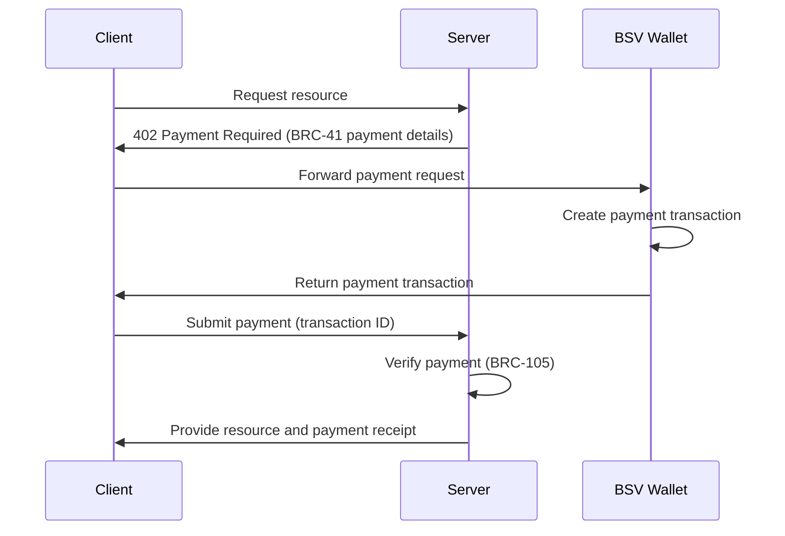

# Payment Requirements: BRC-41 and BRC-105

The HTTP 402 Payment Required status code was originally reserved for future use, but in the BSV ecosystem, it has been implemented through BRC-41 and BRC-105 protocols. This module explores how these protocols enable micropayments for web resources, APIs, and services.

## 🎯 Learning Objectives

By the end of this module, you'll understand:
- The purpose and implementation of HTTP 402 Payment Required
- How BRC-41 defines payment request formats
- How BRC-105 handles payment verification and receipts
- How to implement pay-per-use APIs and services
- Best practices for integrating payment requirements in your applications

## 🏗️ Payment Requirements Architecture

The payment requirements architecture enables seamless micropayments:



## 📚 Understanding Payment Requirements

### HTTP 402 Payment Required

The HTTP 402 status code was originally reserved in the HTTP specification for future use. In the BSV ecosystem, it has been implemented to enable micropayments for web resources, APIs, and services.

When a client requests a resource that requires payment, the server responds with a 402 Payment Required status code, along with payment details formatted according to the BRC-41 protocol. The client can then make the payment and resubmit the request with proof of payment.

### BRC-41: Payment Protocol

BRC-41 defines the format for payment requests and how they are communicated between servers and clients. It specifies:

1. **Payment Request Format**: How payment details are structured
2. **Communication Method**: How payment requests are transmitted
3. **Payment Submission**: How payments are submitted to the server

### BRC-105: Payment Verification and Receipts

BRC-105 defines how payments are verified and how receipts are issued:

1. **Payment Verification**: How servers verify that payments are valid
2. **Receipt Format**: How payment receipts are structured
3. **Receipt Verification**: How clients can verify receipt authenticity

## 🛠️ Implementing Payment Requirements

### Server-Side Implementation

Implementing payment requirements in a Node.js server:

```typescript
import express from 'express';
import { BRC41PaymentHandler, BRC105ReceiptManager } from '@bsv/payment-protocols';

const app = express();
app.use(express.json());

// Initialize the payment handler
const paymentHandler = new BRC41PaymentHandler({
  merchantName: 'Example API',
  merchantId: 'com.example.api',
  paymentAddress: '1ExampleAddressBSV123456789ABCDEF',
  privateKey: process.env.MERCHANT_PRIVATE_KEY,
});

// Initialize the receipt manager
const receiptManager = new BRC105ReceiptManager({
  merchantName: 'Example API',
  merchantId: 'com.example.api',
  privateKey: process.env.MERCHANT_PRIVATE_KEY,
});

// Middleware to check if payment is required
function requirePayment(price, description) {
  return async (req, res, next) => {
    // Check if the request includes a valid payment
    const paymentHeader = req.headers['x-payment'];
    
    if (paymentHeader) {
      try {
        // Verify the payment
        const verification = await paymentHandler.verifyPayment(paymentHeader);
        
        if (verification.valid && verification.amount >= price) {
          // Payment is valid, store it in the request
          req.payment = verification;
          
          // Generate a receipt
          const receipt = await receiptManager.generateReceipt({
            paymentId: verification.paymentId,
            amount: verification.amount,
            resourceId: req.path,
            timestamp: new Date().toISOString(),
          });
          
          // Add the receipt to the response headers
          res.setHeader('X-Payment-Receipt', receipt);
          
          // Continue to the route handler
          return next();
        }
      } catch (error) {
        console.error('Payment verification error:', error);
      }
    }
    
    // Payment is required or invalid, send 402 response
    const paymentRequest = await paymentHandler.createPaymentRequest({
      amount: price,
      description,
      resourceId: req.path,
      expiresIn: 3600, // 1 hour
    });
    
    res.status(402).json({
      status: 'payment_required',
      paymentRequest,
    });
  };
}

// Example route that requires payment
app.get('/api/premium-data', 
  requirePayment(1000, 'Access to premium data'), // 1000 satoshis
  (req, res) => {
    // Payment has been verified, provide the resource
    res.json({
      status: 'success',
      data: {
        premiumContent: 'This is premium content that required payment',
        accessTime: new Date().toISOString(),
        paymentId: req.payment.paymentId,
      },
    });
  }
);

app.listen(3000, () => {
  console.log('Server running on port 3000');
});
```

### Client-Side Implementation

Implementing payment handling in a web client:

```typescript
import { BRC41PaymentClient, BRC105ReceiptVerifier } from '@bsv/payment-protocols';
import { BRC100Wallet } from '@bsv/brc100';

async function fetchPremiumContent() {
  // Initialize the payment client and wallet
  const paymentClient = new BRC41PaymentClient();
  const receiptVerifier = new BRC105ReceiptVerifier();
  const wallet = await BRC100Wallet.connect({ walletUrl: 'tcp://localhost:3321' });
  
  try {
    // First attempt to fetch the resource (may result in 402)
    const initialResponse = await fetch('https://api.example.com/api/premium-data');
    
    if (initialResponse.status === 402) {
      // Extract the payment request
      const responseData = await initialResponse.json();
      const paymentRequest = responseData.paymentRequest;
      
      // Ask for user confirmation
      const userConfirmed = await confirmPayment(paymentRequest);
      if (!userConfirmed) throw new Error('Payment cancelled by user');
      
      // Process the payment using the wallet
      const paymentResult = await wallet.processPayment({ paymentRequest });
      if (paymentResult.status !== 'success') {
        throw new Error(`Payment failed: ${paymentResult.reason}`);
      }
      
      // Create the payment header
      const paymentHeader = paymentClient.createPaymentHeader({
        paymentId: paymentResult.paymentId,
        transactionId: paymentResult.transactionId,
        merchantId: paymentRequest.merchantId,
        amount: paymentRequest.amount,
        signature: paymentResult.signature,
      });
      
      // Retry the request with the payment header
      const paidResponse = await fetch('https://api.example.com/api/premium-data', {
        headers: { 'X-Payment': paymentHeader },
      });
      
      if (!paidResponse.ok) {
        throw new Error(`Failed to access resource: ${paidResponse.status}`);
      }
      
      // Extract and verify the receipt
      const receipt = paidResponse.headers.get('X-Payment-Receipt');
      if (receipt) {
        const receiptVerification = await receiptVerifier.verifyReceipt(receipt);
        if (receiptVerification.valid) {
          console.log('Payment receipt verified');
          await storeReceipt(receipt);
        }
      }
      
      // Return the content
      return await paidResponse.json();
    } else if (initialResponse.ok) {
      // No payment required, return the content
      return await initialResponse.json();
    } else {
      throw new Error(`Failed to access resource: ${initialResponse.status}`);
    }
  } catch (error) {
    console.error('Error fetching premium content:', error);
    throw error;
  }
}
```

### Payment Request Format

The BRC-41 payment request format:

```json
{
  "protocol": "BRC-41",
  "version": "1.0",
  "paymentId": "payment-123456789",
  "merchantId": "com.example.api",
  "merchantName": "Example API",
  "amount": 1000,
  "currency": "satoshis",
  "description": "Access to premium data",
  "resourceId": "/api/premium-data",
  "callbackUrl": "https://api.example.com/payment-callback",
  "expiresAt": "2023-01-01T12:00:00Z",
  "created": "2023-01-01T11:00:00Z",
  "metadata": {
    "category": "premium-content",
    "accessDuration": "24h"
  },
  "signature": "3045022100..."
}
```

### Payment Receipt Format

The BRC-105 payment receipt format:

```json
{
  "protocol": "BRC-105",
  "version": "1.0",
  "receiptId": "receipt-123456789",
  "paymentId": "payment-123456789",
  "merchantId": "com.example.api",
  "merchantName": "Example API",
  "amount": 1000,
  "currency": "satoshis",
  "resourceId": "/api/premium-data",
  "transactionId": "abcdef1234567890abcdef1234567890abcdef1234567890abcdef1234567890",
  "timestamp": "2023-01-01T11:05:00Z",
  "expiresAt": "2023-01-02T11:05:00Z",
  "metadata": {
    "accessGranted": true,
    "accessDuration": "24h"
  },
  "signature": "3045022100..."
}
```

## 🔒 Security Considerations

### Payment Verification

Properly verifying payments is crucial:

```typescript
import { BRC41PaymentVerifier } from '@bsv/payment-protocols';
import { TransactionVerifier } from '@bsv/sdk';

async function verifyPayment(paymentHeader) {
  // Initialize the payment verifier
  const paymentVerifier = new BRC41PaymentVerifier({
    merchantId: 'com.example.api',
    merchantPublicKey: process.env.MERCHANT_PUBLIC_KEY,
  });
  
  // Parse and verify the payment header
  const paymentInfo = await paymentVerifier.parsePaymentHeader(paymentHeader);
  if (!paymentInfo.valid) {
    throw new Error(`Invalid payment header: ${paymentInfo.reason}`);
  }
  
  // Initialize the transaction verifier
  const txVerifier = new TransactionVerifier({ network: 'mainnet' });
  
  // Verify the transaction exists and has confirmations
  const txVerification = await txVerifier.verifyTransaction({
    txid: paymentInfo.transactionId,
    requiredConfirmations: 1,
  });
  
  if (!txVerification.valid) {
    throw new Error(`Invalid transaction: ${txVerification.reason}`);
  }
  
  // Verify the payment amount and recipient
  if (txVerification.amount < paymentInfo.amount) {
    throw new Error(`Insufficient payment amount`);
  }
  
  if (txVerification.recipient !== process.env.PAYMENT_ADDRESS) {
    throw new Error(`Invalid payment recipient`);
  }
  
  return {
    valid: true,
    paymentId: paymentInfo.paymentId,
    transactionId: paymentInfo.transactionId,
    amount: txVerification.amount,
    confirmations: txVerification.confirmations,
  };
}
```

### Double-Spend Prevention

Preventing double-spending of payments requires tracking used payments:

```typescript
class PaymentTracker {
  private db: Database;
  
  constructor(db: Database) {
    this.db = db;
  }
  
  // Record a payment
  async recordPayment(paymentInfo: {
    paymentId: string;
    transactionId: string;
    amount: number;
    resourceId: string;
  }): Promise<boolean> {
    // Check if the payment has already been used
    const existingPayment = await this.db.getPayment(paymentInfo.paymentId);
    if (existingPayment) return false;
    
    // Check if the transaction has already been used
    const existingTransaction = await this.db.getTransactionUsage(paymentInfo.transactionId);
    if (existingTransaction) return false;
    
    // Record the payment
    await this.db.recordPayment({
      paymentId: paymentInfo.paymentId,
      transactionId: paymentInfo.transactionId,
      amount: paymentInfo.amount,
      resourceId: paymentInfo.resourceId,
      timestamp: new Date(),
    });
    
    return true;
  }
  
  // Check if a payment can be used for a resource
  async canUsePayment(paymentId: string, resourceId: string): Promise<boolean> {
    const payment = await this.db.getPayment(paymentId);
    
    if (!payment) return false;
    if (payment.resourceId !== resourceId) return false;
    
    // Check if the payment has expired
    const paymentAge = Date.now() - payment.timestamp.getTime();
    const maxAge = 24 * 60 * 60 * 1000; // 24 hours
    
    if (paymentAge > maxAge) return false;
    
    return true;
  }
}
```

## 🔄 Integration with Other Components

### Integration with BRC-100 Wallets

BRC-41 and BRC-105 are designed to work with BRC-100 compliant wallets:

```typescript
import { BRC41PaymentClient } from '@bsv/payment-protocols';
import { BRC100Wallet } from '@bsv/brc100';

async function processPaymentWithWallet(paymentRequest) {
  // Initialize the payment client
  const paymentClient = new BRC41PaymentClient();
  
  // Connect to the BRC-100 wallet
  const wallet = await BRC100Wallet.connect({
    walletUrl: 'tcp://localhost:3321',
  });
  
  // Check if the wallet supports BRC-41
  const capabilities = await wallet.getCapabilities();
  if (!capabilities.protocols.includes('BRC-41')) {
    throw new Error('Wallet does not support BRC-41 payments');
  }
  
  // Process the payment
  const paymentResult = await wallet.processPayment({ paymentRequest });
  if (paymentResult.status !== 'success') {
    throw new Error(`Payment failed: ${paymentResult.reason}`);
  }
  
  // Create the payment header
  const paymentHeader = paymentClient.createPaymentHeader({
    paymentId: paymentResult.paymentId,
    transactionId: paymentResult.transactionId,
    merchantId: paymentRequest.merchantId,
    amount: paymentRequest.amount,
    signature: paymentResult.signature,
  });
  
  return {
    paymentHeader,
    transactionId: paymentResult.transactionId,
  };
}
```

### Integration with BRC-103 Authentication

BRC-41 and BRC-105 can be integrated with BRC-103 authentication for authenticated payments:

```typescript
import { BRC41PaymentClient } from '@bsv/payment-protocols';
import { BRC103Client } from '@bsv/brc103';
import { BRC100Wallet } from '@bsv/brc100';

async function authenticatedPayment(paymentRequest) {
  // Initialize clients
  const brc103Client = new BRC103Client({
    appName: 'Payment Client',
    appId: 'com.example.paymentclient',
    certificatePath: './client-certificate.json',
    privateKeyPath: './client-private-key.pem',
  });
  
  const paymentClient = new BRC41PaymentClient();
  const wallet = await BRC100Wallet.connect({ walletUrl: 'tcp://localhost:3321' });
  
  // Authenticate with the wallet
  const authResult = await brc103Client.authenticateWithWallet(wallet);
  if (!authResult.authenticated) {
    throw new Error(`Authentication failed: ${authResult.reason}`);
  }
  
  // Process the payment with the authenticated session
  const paymentResult = await wallet.processPayment({
    paymentRequest,
    session: authResult.session,
  });
  
  if (paymentResult.status !== 'success') {
    throw new Error(`Payment failed: ${paymentResult.reason}`);
  }
  
  // Create the payment header with authentication info
  const paymentHeader = paymentClient.createPaymentHeader({
    paymentId: paymentResult.paymentId,
    transactionId: paymentResult.transactionId,
    merchantId: paymentRequest.merchantId,
    amount: paymentRequest.amount,
    signature: paymentResult.signature,
    authenticationInfo: {
      userId: authResult.userIdentity.id,
      certificateFingerprint: authResult.certificateFingerprint,
    },
  });
  
  return { paymentHeader, transactionId: paymentResult.transactionId };
}
```

## 📊 Example Use Cases

### Pay-Per-View Content

Implementing pay-per-view content allows content creators to monetize their work directly:

- Articles, videos, music, and other digital content can be sold on a per-item basis
- Content can be priced according to its value, from fractions of a cent to larger amounts
- Access can be time-limited or permanent, depending on the receipt configuration
- Content creators receive payments directly, without intermediaries taking a cut

### Pay-Per-API-Call

Implementing pay-per-API-call enables new business models for API providers:

- APIs can be monetized without requiring subscriptions or API keys
- Pricing can be adjusted based on the value of each endpoint
- Users only pay for what they actually use
- Micropayments make it economical to charge even for low-value API calls
- Providers can offer tiered pricing based on usage volume

### Metered Services

Implementing metered services allows for precise usage-based billing:

- Computing resources can be billed by the second
- Storage can be billed by the byte
- Network bandwidth can be billed by the megabyte
- Payments can be made in real-time as resources are consumed
- Users can set spending limits to control costs

## 🔗 Next Steps

Now that you understand payment requirements with BRC-41 and BRC-105, you're ready to explore:

- [BRC-103 Authentication](brc103-authentication.md) - Learn about peer-to-peer authentication
- [SPV Proofs](spv-proofs-updated.md) - Understand how to verify transactions efficiently
- [Wallet Infrastructure](../01-building-blocks/wallet-infrastructure.md) - Explore the server-side components
- [Metanet Desktop](../01-building-blocks/metanet-desktop.md) - Learn about a BRC-100 compliant wallet
- [BSV Ecosystem Components](../../BSV_ECOSYSTEM_COMPONENTS.md) - See how everything fits together

---

**Next:** [BRC-103 Authentication](brc103-authentication.md)