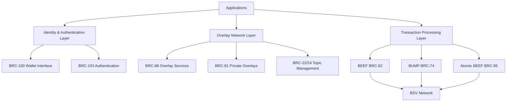
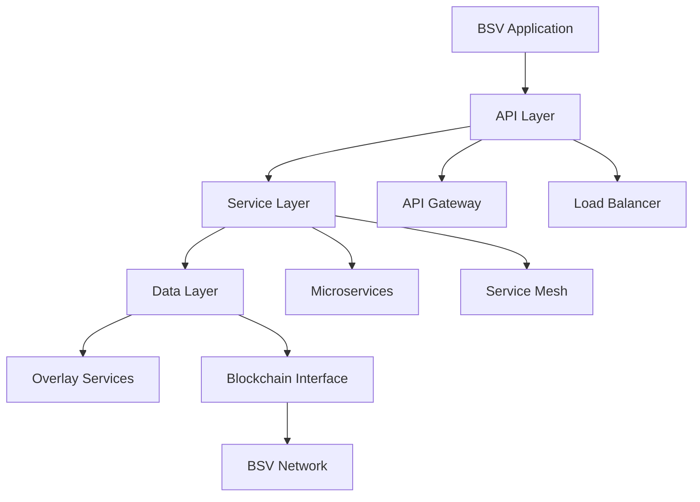

# Scaling Patterns

Building high-throughput applications on BSV requires understanding and implementing effective scaling patterns. This module explores horizontal scaling strategies, overlay network optimization, performance monitoring and tuning, and load balancing techniques, with a focus on how the BSV ecosystem components work together to enable scalable applications.

## 🎯 Learning Objectives

By the end of this module, you'll understand:
- Horizontal scaling strategies for BSV applications
- Overlay network optimization techniques
- Performance monitoring and tuning approaches
- Load balancing and failover mechanisms
- Best practices for building scalable applications
- How BSV ecosystem components enable different scaling patterns

## 🌐 BSV Ecosystem Scaling Architecture

The BSV ecosystem provides a comprehensive set of components that work together to enable scalable applications. These components form a layered architecture that allows for both horizontal and vertical scaling.



### The Mandala Network Architecture

The Mandala Network architecture (BRC-90/91/92) provides a conceptual framework for how these components interact. It consists of three primary layers:

1. **Transaction Processors** (Core): Responsible for creating blocks, witnessing transactions, and distributing Merkle proofs
2. **Overlay Services** (Middle): Enable specialized tracking and management of tokens and data
3. **Transacting Parties** (Edge): End users with specialized applications that create transactions through wallets

This architecture enables specialization and optimization at every layer, allowing the network to scale efficiently while maintaining security and reliability.

### Scaling with BEEF, BUMP, and Atomic BEEF

The core transaction processing components (BEEF, BUMP, and Atomic BEEF) enable efficient validation and verification of transactions without requiring a full node:

- **BEEF (BRC-62)**: Optimizes for minimal bandwidth while maintaining data required for independent validation
- **BUMP (BRC-74)**: Standardizes Merkle proofs for efficient verification of transaction inclusion
- **Atomic BEEF (BRC-95)**: Focuses on single-transaction validation, reducing complexity

These components enable vertical scaling by optimizing data structures for efficient processing and minimal bandwidth usage.

### Scaling with Overlay Networks

Overlay networks (BRC-22/24, BRC-88, BRC-81) enable horizontal scaling by distributing data and processing across multiple specialized services:

- **BRC-88 (SHIP/SLAP)**: Enables efficient peer discovery and data synchronization
- **BRC-81 (Private Overlays)**: Allows for private overlay networks with standard P2PKH transactions
- **BRC-22/24 (Topic Management)**: Provides mechanisms for topic-specific transaction admittance and lookup

## 🚀 Horizontal Scaling Strategies

### Scaling Architecture Overview



### Stateless Service Design

Stateless services are easier to scale horizontally:

```typescript
// Stateless service example
class StatelessTransactionService {
  private readonly configService: ConfigService;
  private readonly bsvClient: BSVClient;
  
  constructor(configService: ConfigService, bsvClient: BSVClient) {
    this.configService = configService;
    this.bsvClient = bsvClient;
  }
  
  // Stateless method - no instance state is modified
  async createTransaction(inputs: TransactionInput[], outputs: TransactionOutput[]): Promise<Transaction> {
    // Create transaction using provided inputs and outputs
    const tx = new Transaction();
    
    // Add inputs
    for (const input of inputs) {
      tx.addInput(input);
    }
    
    // Add outputs
    for (const output of outputs) {
      tx.addOutput(output);
    }
    
    // Apply fee strategy from configuration
    const feeStrategy = this.configService.getFeeStrategy();
    await this.applyFeeStrategy(tx, feeStrategy);
    
    return tx;
  }
  
  // Helper method that doesn't modify instance state
  private async applyFeeStrategy(tx: Transaction, strategy: FeeStrategy): Promise<void> {
    // Apply fee strategy logic
    // Implementation details omitted for brevity
  }
}
```

### Microservices Architecture

Breaking down applications into microservices enables independent scaling:

```typescript
// Transaction microservice
class TransactionService {
  async createTransaction(req: CreateTransactionRequest): Promise<Transaction> {
    // Implementation details omitted for brevity
    return new Transaction();
  }
  
  async broadcastTransaction(tx: Transaction): Promise<string> {
    // Implementation details omitted for brevity
    return 'txid';
  }
}

// Identity microservice
class IdentityService {
  async verifyIdentity(id: string, proof: IdentityProof): Promise<boolean> {
    // Implementation details omitted for brevity
    return true;
  }
  
  async issueCertificate(subject: string, claims: Record<string, any>): Promise<Certificate> {
    // Implementation details omitted for brevity
    return new Certificate();
  }
}

// Data storage microservice
class StorageService {
  async storeData(data: Buffer, metadata: Record<string, any>): Promise<string> {
    // Implementation details omitted for brevity
    return 'dataid';
  }
  
  async retrieveData(id: string): Promise<{ data: Buffer; metadata: Record<string, any> }> {
    // Implementation details omitted for brevity
    return { data: Buffer.from([]), metadata: {} };
  }
}
```

### Service Registry and Discovery

Enable dynamic service discovery for scalable architectures:

```typescript
// Service registry
class ServiceRegistry {
  private services: Map<string, ServiceInfo[]> = new Map();
  
  // Register a service instance
  registerService(name: string, instance: ServiceInfo): void {
    const instances = this.services.get(name) || [];
    instances.push(instance);
    this.services.set(name, instances);
    
    console.log(`Registered service ${name} at ${instance.host}:${instance.port}`);
  }
  
  // Deregister a service instance
  deregisterService(name: string, instanceId: string): void {
    const instances = this.services.get(name) || [];
    const updatedInstances = instances.filter(instance => instance.id !== instanceId);
    this.services.set(name, updatedInstances);
    
    console.log(`Deregistered service instance ${instanceId}`);
  }
  
  // Discover service instances
  discoverService(name: string): ServiceInfo[] {
    return this.services.get(name) || [];
  }
  
  // Health check for all services
  async performHealthChecks(): Promise<void> {
    for (const [name, instances] of this.services.entries()) {
      for (const instance of instances) {
        try {
          const isHealthy = await this.checkHealth(instance);
          instance.healthy = isHealthy;
          
          if (!isHealthy) {
            console.log(`Service ${name} instance ${instance.id} is unhealthy`);
          }
        } catch (error) {
          console.error(`Health check failed for ${name} instance ${instance.id}:`, error);
          instance.healthy = false;
        }
      }
    }
  }
  
  private async checkHealth(instance: ServiceInfo): Promise<boolean> {
    try {
      const response = await fetch(`http://${instance.host}:${instance.port}/health`);
      return response.status === 200;
    } catch (error) {
      return false;
    }
  }
}

// Service client with discovery
class ServiceClient {
  private registry: ServiceRegistry;
  private serviceName: string;
  
  constructor(registry: ServiceRegistry, serviceName: string) {
    this.registry = registry;
    this.serviceName = serviceName;
  }
  
  async callService(endpoint: string, data: any): Promise<any> {
    // Discover service instances
    const instances = this.registry.discoverService(this.serviceName);
    
    // Filter healthy instances
    const healthyInstances = instances.filter(instance => instance.healthy);
    
    if (healthyInstances.length === 0) {
      throw new Error(`No healthy instances of ${this.serviceName} available`);
    }
    
    // Select an instance (simple round-robin)
    const instance = healthyInstances[Math.floor(Math.random() * healthyInstances.length)];
    
    // Call the service
    try {
      const response = await fetch(`http://${instance.host}:${instance.port}/${endpoint}`, {
        method: 'POST',
        headers: {
          'Content-Type': 'application/json',
        },
        body: JSON.stringify(data),
      });
      
      if (!response.ok) {
        throw new Error(`Service call failed with status ${response.status}`);
      }
      
      return await response.json();
    } catch (error) {
      console.error(`Service call to ${this.serviceName} failed:`, error);
      
      // Mark instance as unhealthy
      instance.healthy = false;
      
      // Retry with another instance
      return this.callService(endpoint, data);
    }
  }
}
```

## 🔄 Overlay Network Optimization

### Efficient Topic Management with BRC-22/24

BRC-22 defines a method for running a server that accepts transactions, admits their outputs into topics, and tracks topical UTXO sets. BRC-24 provides a standardized way to query these UTXO sets. Together, they enable efficient topic management for overlay networks.

```typescript
// BRC-22/24 integration example
class OverlayNetworkClient {
  private baseUrl: string;
  
  constructor(baseUrl: string) {
    this.baseUrl = baseUrl;
  }
  
  // Submit a transaction to a topic (BRC-22)
  async submitTransaction(topic: string, transaction: Transaction): Promise<string> {
    const response = await fetch(`${this.baseUrl}/topics/${topic}/transactions`, {
      method: 'POST',
      headers: {
        'Content-Type': 'application/json',
      },
      body: JSON.stringify({
        rawtx: transaction.toHex(),
      }),
    });
    
    if (!response.ok) {
      throw new Error(`Failed to submit transaction: ${response.statusText}`);
    }
    
    const result = await response.json();
    return result.txid;
  }
  
  // Query UTXOs from a topic (BRC-24)
  async queryUtxos(provider: string, query: any): Promise<any[]> {
    const response = await fetch(`${this.baseUrl}/lookup/${provider}`, {
      method: 'POST',
      headers: {
        'Content-Type': 'application/json',
      },
      body: JSON.stringify(query),
    });
    
    if (!response.ok) {
      throw new Error(`Failed to query UTXOs: ${response.statusText}`);
    }
    
    const result = await response.json();
    return result.utxos;
  }
}
```

### Efficient Lookup Services

Optimize lookup services for high throughput:

```typescript
// Optimized lookup service
class OptimizedLookupService {
  private lookups: Map<string, LookupDefinition> = new Map();
  private cache: Map<string, CacheEntry> = new Map();
  private storage: StorageProvider;
  private cacheSize: number = 10000;
  private defaultTTL: number = 3600; // 1 hour in seconds
  
  constructor(storage: StorageProvider, options?: { cacheSize?: number; defaultTTL?: number }) {
    this.storage = storage;
    
    if (options?.cacheSize) {
      this.cacheSize = options.cacheSize;
    }
    
    if (options?.defaultTTL) {
      this.defaultTTL = options.defaultTTL;
    }
  }
  
  // Register a lookup
  registerLookup(definition: LookupDefinition): void {
    this.lookups.set(definition.name, definition);
    console.log(`Registered lookup ${definition.name}`);
  }
  
  // Set a value
  async set(lookupName: string, key: string, value: any): Promise<void> {
    const lookup = this.lookups.get(lookupName);
    if (!lookup) {
      throw new Error(`Lookup ${lookupName} not found`);
    }
    
    // Validate value against schema
    this.validateValue(value, lookup.valueSchema);
    
    // Store in storage
    await this.storage.set(`${lookupName}:${key}`, value);
    
    // Update cache
    const ttl = lookup.caching?.ttl || this.defaultTTL;
    this.cache.set(`${lookupName}:${key}`, {
      value,
      expires: Date.now() + ttl * 1000,
    });
    
    // Prune cache if needed
    this.pruneCache();
  }
  
  // Get a value
  async get(lookupName: string, key: string): Promise<any> {
    const lookup = this.lookups.get(lookupName);
    if (!lookup) {
      throw new Error(`Lookup ${lookupName} not found`);
    }
    
    const cacheKey = `${lookupName}:${key}`;
    
    // Check cache first
    const cached = this.cache.get(cacheKey);
    if (cached && cached.expires > Date.now()) {
      return cached.value;
    }
    
    // Get from storage
    const value = await this.storage.get(cacheKey);
    
    // Update cache if value found
    if (value !== undefined) {
      const ttl = lookup.caching?.ttl || this.defaultTTL;
      this.cache.set(cacheKey, {
        value,
        expires: Date.now() + ttl * 1000,
      });
    }
    
    return value;
  }
  
  // Prune cache if it exceeds the maximum size
  private pruneCache(): void {
    if (this.cache.size <= this.cacheSize) {
      return;
    }
    
    // Remove expired entries first
    const now = Date.now();
    for (const [key, entry] of this.cache.entries()) {
      if (entry.expires <= now) {
        this.cache.delete(key);
      }
    }
    
    // If still too large, remove oldest entries
    if (this.cache.size > this.cacheSize) {
      const entriesToRemove = this.cache.size - this.cacheSize;
      const keys = Array.from(this.cache.keys()).slice(0, entriesToRemove);
      
      for (const key of keys) {
        this.cache.delete(key);
      }
    }
  }
  
  // Validate a value against a schema
  private validateValue(value: any, schema: any): void {
    // Implementation details omitted for brevity
  }
}
```

### Sharding Strategies

Implement sharding for distributed data:

```typescript
// Sharded data service
class ShardedDataService {
  private shardCount: number;
  private shards: DataShard[];
  
  constructor(shardCount: number) {
    this.shardCount = shardCount;
    this.shards = [];
    
    // Initialize shards
    for (let i = 0; i < shardCount; i++) {
      this.shards.push(new DataShard(i));
    }
  }
  
  // Store data in the appropriate shard
  async storeData(key: string, data: any): Promise<void> {
    const shardIndex = this.getShardIndex(key);
    await this.shards[shardIndex].storeData(key, data);
  }
  
  // Retrieve data from the appropriate shard
  async retrieveData(key: string): Promise<any> {
    const shardIndex = this.getShardIndex(key);
    return await this.shards[shardIndex].retrieveData(key);
  }
  
  // Determine which shard should handle a key
  private getShardIndex(key: string): number {
    // Simple hash-based sharding
    let hash = 0;
    for (let i = 0; i < key.length; i++) {
      hash = (hash * 31 + key.charCodeAt(i)) % this.shardCount;
    }
    return Math.abs(hash) % this.shardCount;
  }
}
```

## 📊 Performance Monitoring and Tuning

### Metrics Collection

Implement comprehensive metrics collection:

```typescript
// Metrics collector
class MetricsCollector {
  private metrics: Map<string, Metric> = new Map();
  private reporters: MetricsReporter[] = [];
  private reportingInterval: number = 60000; // 1 minute
  private intervalHandle?: NodeJS.Timeout;
  
  constructor(options?: { reportingInterval?: number }) {
    if (options?.reportingInterval) {
      this.reportingInterval = options.reportingInterval;
    }
  }
  
  // Start collecting metrics
  start(): void {
    this.intervalHandle = setInterval(() => this.reportMetrics(), this.reportingInterval);
  }
  
  // Stop collecting metrics
  stop(): void {
    if (this.intervalHandle) {
      clearInterval(this.intervalHandle);
      this.intervalHandle = undefined;
    }
  }
  
  // Register a metrics reporter
  registerReporter(reporter: MetricsReporter): void {
    this.reporters.push(reporter);
  }
  
  // Register a counter metric
  registerCounter(name: string, description: string): Counter {
    const counter = new Counter(name, description);
    this.metrics.set(name, counter);
    return counter;
  }
  
  // Register a gauge metric
  registerGauge(name: string, description: string): Gauge {
    const gauge = new Gauge(name, description);
    this.metrics.set(name, gauge);
    return gauge;
  }
  
  // Register a histogram metric
  registerHistogram(name: string, description: string, buckets: number[]): Histogram {
    const histogram = new Histogram(name, description, buckets);
    this.metrics.set(name, histogram);
    return histogram;
  }
  
  // Report metrics to all registered reporters
  private reportMetrics(): void {
    const metricsData: MetricsData = {};
    
    for (const [name, metric] of this.metrics.entries()) {
      metricsData[name] = metric.getValue();
    }
    
    for (const reporter of this.reporters) {
      try {
        reporter.report(metricsData);
      } catch (error) {
        console.error(`Error reporting metrics to ${reporter.name}:`, error);
      }
    }
  }
}
```

## 🔌 Integration with BSV Ecosystem Components

### BEEF Integration for Efficient Transaction Validation

```typescript
// BEEF integration example
class BEEFTransactionValidator {
  private headerService: HeaderService;
  
  constructor(headerService: HeaderService) {
    this.headerService = headerService;
  }
  
  // Validate a BEEF transaction
  async validateBEEF(beefData: Buffer): Promise<boolean> {
    // Parse BEEF data
    const beef = parseBEEF(beefData);
    
    // Extract BUMPs
    const bumps = beef.bumps;
    
    // Calculate Merkle roots from BUMPs
    const merkleRoots = bumps.map(bump => calculateMerkleRoot(bump));
    
    // Verify Merkle roots with header service
    const rootsValid = await this.headerService.verifyMerkleRoots(merkleRoots);
    if (!rootsValid) {
      return false;
    }
    
    // Validate transactions
    for (const tx of beef.transactions) {
      // Validate transaction
      const isValid = await this.validateTransaction(tx, beef);
      if (!isValid) {
        return false;
      }
    }
    
    return true;
  }
  
  // Validate an Atomic BEEF transaction
  async validateAtomicBEEF(atomicBeefData: Buffer): Promise<boolean> {
    // Parse Atomic BEEF data
    const atomicBeef = parseAtomicBEEF(atomicBeefData);
    
    // Extract subject TXID
    const subjectTxid = atomicBeef.subjectTxid;
    
    // Validate that all transactions are related to the subject transaction
    const allRelated = validateTransactionRelationships(atomicBeef.beef.transactions, subjectTxid);
    if (!allRelated) {
      return false;
    }
    
    // Validate the BEEF structure
    return await this.validateBEEF(atomicBeef.beef);
  }
  
  // Helper functions
  private async validateTransaction(tx: Transaction, beef: BEEF): Promise<boolean> {
    // Implementation details omitted for brevity
    return true;
  }
}

// Helper functions
function parseBEEF(data: Buffer): BEEF {
  // Implementation details omitted for brevity
  return { bumps: [], transactions: [] };
}

function parseAtomicBEEF(data: Buffer): AtomicBEEF {
  // Implementation details omitted for brevity
  return { subjectTxid: '', beef: { bumps: [], transactions: [] } };
}

function calculateMerkleRoot(bump: BUMP): string {
  // Implementation details omitted for brevity
  return '';
}

function validateTransactionRelationships(transactions: Transaction[], subjectTxid: string): boolean {
  // Implementation details omitted for brevity
  return true;
}
```

### BRC-100/103 Integration for Secure Authentication

```typescript
// BRC-100/103 integration example
class SecureAuthenticationService {
  private client: MetanetDesktopClient;
  private brc103Client: BRC103Client;
  
  constructor(appName: string, appId: string) {
    this.client = new MetanetDesktopClient({
      appName,
      appId,
    });
    
    this.brc103Client = new BRC103Client({
      appName,
      appId,
      certificatePath: './app-certificate.json',
      privateKeyPath: './app-private-key.pem',
    });
  }
  
  // Authenticate with the wallet
  async authenticate(): Promise<AuthResult> {
    try {
      // Connect to the wallet
      await this.client.connect();
      
      // Authenticate with BRC-103
      const authResult = await this.brc103Client.authenticateWithWallet(this.client);
      
      if (authResult.authenticated) {
        console.log('Authentication successful');
        console.log('User ID:', authResult.userIdentity.id);
        console.log('User Name:', authResult.userIdentity.name);
        
        return {
          success: true,
          identity: authResult.userIdentity,
          session: authResult.session,
        };
      } else {
        console.error('Authentication failed:', authResult.reason);
        
        return {
          success: false,
          error: authResult.reason,
        };
      }
    } catch (error) {
      console.error('Authentication error:', error);
      
      return {
        success: false,
        error: error.message,
      };
    }
  }
}
```

## 🚀 Best Practices for Scalable BSV Applications

1. **Use BEEF and BUMP for efficient transaction validation**: Leverage these formats to minimize bandwidth and optimize validation.

2. **Implement overlay networks for horizontal scaling**: Use BRC-22/24 and BRC-88 to distribute data and processing across multiple specialized services.

3. **Design stateless services**: Make your services stateless to enable easy horizontal scaling.

4. **Implement efficient caching strategies**: Cache frequently accessed data to reduce load on the blockchain.

5. **Use microservices architecture**: Break down your application into microservices that can be scaled independently.

6. **Implement service discovery**: Use service registry and discovery to enable dynamic scaling.

7. **Monitor performance**: Implement comprehensive metrics collection and performance monitoring.

8. **Use sharding for large datasets**: Implement sharding strategies for distributed data.

9. **Optimize for the Mandala Network architecture**: Design your application to work efficiently within the three-layer architecture of the Mandala Network.

10. **Leverage BRC-100/103 for secure authentication**: Use these protocols to implement secure, decentralized authentication.

## 🔗 Next Steps

Now that you understand scaling patterns for BSV applications, you're ready to explore:

- [BSV Ecosystem Components](../../BSV_ECOSYSTEM_COMPONENTS.md) - Learn how all components work together
- [Overlay Services](../01-building-blocks/overlay-services-updated.md) - Explore overlay network services in depth
- [Metanet Desktop](../01-building-blocks/metanet-desktop.md) - Learn about the BRC-100 wallet implementation

---

**Next:** [BSV Ecosystem Components](../../BSV_ECOSYSTEM_COMPONENTS.md)