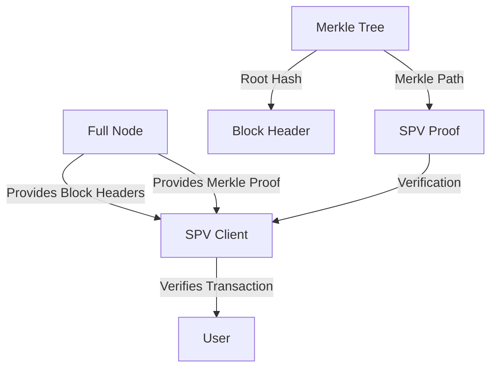

# SPV Proofs in BSV

Simplified Payment Verification (SPV) is a critical component of the Bitcoin architecture that enables lightweight clients to verify transactions without downloading the entire blockchain. This module explores how SPV proofs work in BSV, their implementation, and best practices for using them in your applications.

## 🎯 Learning Objectives

By the end of this module, you'll understand:
- The fundamental principles of SPV proofs
- How Merkle trees enable efficient verification
- How to create and verify SPV proofs using the BSV TypeScript SDK
- Best practices for implementing SPV in your applications
- Advanced use cases for SPV proofs

## 🏗️ SPV Architecture

SPV allows lightweight clients to verify transactions without running a full node:



## 📚 Understanding SPV Proofs

### Merkle Trees in Bitcoin

Bitcoin uses Merkle trees to efficiently organize transactions in a block:

```
                 Root Hash
                /        \
              /            \
            /                \
       Hash_AB              Hash_CD
        /    \              /    \
    Hash_A  Hash_B      Hash_C  Hash_D
      |       |           |       |
    Tx_A     Tx_B       Tx_C     Tx_D
```

Each transaction is hashed, and pairs of hashes are combined and hashed again until a single root hash (the Merkle root) is obtained. This root hash is included in the block header.

### SPV Proof Components

An SPV proof consists of:

1. **Transaction**: The transaction being verified
2. **Merkle Path**: The set of hashes needed to compute the Merkle root
3. **Block Header**: Contains the Merkle root and proof-of-work
4. **Confirmation Path**: Chain of block headers showing sufficient work

## 🛠️ Implementing SPV Proofs

### Creating SPV Proofs

To create an SPV proof for a transaction:

```typescript
import { SPVProof, MerkleTree } from '@bsv/sdk';

async function createSPVProof(txid: string) {
  // Initialize the SPV proof builder
  const proofBuilder = new SPVProof.Builder({
    network: 'mainnet',
    nodeUrl: 'https://api.bsv.node.example.com',
  });
  
  // Create the proof for a specific transaction
  const proof = await proofBuilder.createProof({
    txid,
    confirmations: 6, // Require 6 confirmations
    includeTransaction: true, // Include the full transaction in the proof
  });
  
  // Serialize the proof for transmission
  const serializedProof = proof.serialize();
  
  return {
    proof,
    serializedProof,
  };
}
```

### Verifying SPV Proofs

To verify an SPV proof:

```typescript
import { SPVProof } from '@bsv/sdk';

async function verifySPVProof(serializedProof: string) {
  // Deserialize the proof
  const proof = SPVProof.deserialize(serializedProof);
  
  // Initialize the verifier
  const verifier = new SPVProof.Verifier({
    checkpoints: [
      { height: 700000, hash: '000000000000000000071d6d79a2f93aacc1bb7e643e6e09a4c3c50c5f9de0a3' },
      { height: 710000, hash: '00000000000000000007839f42e0e86fd3c3f56e5e7c9c7c2c0f0d9c4d4e4a4a' },
      // Additional trusted checkpoints
    ],
  });
  
  // Verify the proof
  const result = await verifier.verify(proof);
  
  if (result.valid) {
    console.log(`Transaction ${proof.txid} is valid with ${result.confirmations} confirmations`);
    return true;
  } else {
    console.error(`Invalid proof: ${result.reason}`);
    return false;
  }
}
```

### Handling Proof Verification Results

The verification result provides detailed information:

```typescript
interface VerificationResult {
  valid: boolean;
  reason?: string;
  confirmations: number;
  blockHeight?: number;
  blockTime?: Date;
  transaction?: Transaction;
}
```

## 🔄 SPV in Practice

### Lightweight Wallet Implementation

Implementing a lightweight wallet using SPV:

```typescript
import { SPVWallet } from '@bsv/sdk';

async function setupSPVWallet() {
  // Initialize the SPV wallet
  const wallet = new SPVWallet({
    network: 'mainnet',
    seed: 'your wallet seed phrase',
    nodeUrl: 'https://api.bsv.node.example.com',
    checkpoints: [
      { height: 700000, hash: '000000000000000000071d6d79a2f93aacc1bb7e643e6e09a4c3c50c5f9de0a3' },
      // Additional trusted checkpoints
    ],
  });
  
  // Connect to the network
  await wallet.connect();
  
  // Sync headers (lightweight)
  await wallet.syncHeaders();
  
  // Get wallet balance (using SPV)
  const balance = await wallet.getBalance();
  
  // Get transaction history (using SPV)
  const history = await wallet.getTransactionHistory();
  
  // Send a transaction
  const txid = await wallet.sendTransaction({
    outputs: [
      { address: '1ExampleAddressBSV123456789ABCDEF', amount: 1000 },
    ],
  });
  
  // Wait for confirmation with SPV proof
  const confirmation = await wallet.waitForConfirmation(txid, 1);
  
  return {
    wallet,
    balance,
    history,
    txid,
    confirmation,
  };
}
```

### Payment Verification Service

Implementing a payment verification service using SPV:

```typescript
import { SPVVerifier } from '@bsv/sdk';
import express from 'express';

function createPaymentVerificationService() {
  const app = express();
  app.use(express.json());
  
  // Initialize the SPV verifier
  const verifier = new SPVVerifier({
    checkpoints: [
      { height: 700000, hash: '000000000000000000071d6d79a2f93aacc1bb7e643e6e09a4c3c50c5f9de0a3' },
      // Additional trusted checkpoints
    ],
  });
  
  // Endpoint to verify payments
  app.post('/verify-payment', async (req, res) => {
    try {
      const { proof, expectedAmount, expectedRecipient } = req.body;
      
      // Verify the SPV proof
      const result = await verifier.verifyPayment({
        proof,
        expectedAmount,
        expectedRecipient,
        requiredConfirmations: 3,
      });
      
      if (result.valid) {
        res.json({
          valid: true,
          confirmations: result.confirmations,
          blockHeight: result.blockHeight,
          blockTime: result.blockTime,
        });
      } else {
        res.json({
          valid: false,
          reason: result.reason,
        });
      }
    } catch (error) {
      res.status(400).json({
        valid: false,
        reason: error.message,
      });
    }
  });
  
  // Start the server
  app.listen(3000, () => {
    console.log('Payment verification service running on port 3000');
  });
  
  return app;
}
```

## 🔍 Advanced SPV Techniques

### Bloom Filters for Efficient SPV

Using Bloom filters to efficiently find relevant transactions:

```typescript
import { BloomFilter, SPVClient } from '@bsv/sdk';

async function useBloomFilters() {
  // Create a Bloom filter for addresses we're interested in
  const filter = new BloomFilter({
    elements: [
      '1ExampleAddressBSV123456789ABCDEF',
      '1AnotherAddressBSV123456789ABCDEF',
    ],
    falsePositiveRate: 0.001, // 0.1% false positive rate
  });
  
  // Initialize the SPV client with the filter
  const client = new SPVClient({
    network: 'mainnet',
    nodeUrl: 'https://api.bsv.node.example.com',
    filter,
  });
  
  // Connect to the network
  await client.connect();
  
  // Sync headers
  await client.syncHeaders();
  
  // Get filtered transactions
  const transactions = await client.getFilteredTransactions();
  
  // Update the filter with new addresses
  filter.add('1NewAddressBSV123456789ABCDEF');
  await client.updateFilter(filter);
  
  return {
    filter,
    client,
    transactions,
  };
}
```

### Compact Block Filters

Using compact block filters for enhanced privacy:

```typescript
import { CompactBlockFilter, SPVClient } from '@bsv/sdk';

async function useCompactBlockFilters() {
  // Initialize the SPV client with compact block filters
  const client = new SPVClient({
    network: 'mainnet',
    nodeUrl: 'https://api.bsv.node.example.com',
    useCompactFilters: true,
  });
  
  // Connect to the network
  await client.connect();
  
  // Sync headers and filters
  await client.syncHeadersAndFilters();
  
  // Add addresses to watch
  await client.watchAddresses([
    '1ExampleAddressBSV123456789ABCDEF',
    '1AnotherAddressBSV123456789ABCDEF',
  ]);
  
  // Get relevant transactions
  const transactions = await client.getRelevantTransactions();
  
  return {
    client,
    transactions,
  };
}
```

### Fraud Proofs

Implementing fraud proofs for enhanced security:

```typescript
import { FraudProof, SPVClient } from '@bsv/sdk';

async function handleFraudProofs() {
  // Initialize the SPV client with fraud proof support
  const client = new SPVClient({
    network: 'mainnet',
    nodeUrl: 'https://api.bsv.node.example.com',
    fraudProofVerification: true,
  });
  
  // Connect to the network
  await client.connect();
  
  // Register fraud proof handler
  client.on('fraudProof', async (proof: FraudProof) => {
    console.log(`Received fraud proof for block ${proof.blockHash}`);
    
    // Verify the fraud proof
    const isValid = await FraudProof.verify(proof);
    
    if (isValid) {
      console.log(`Fraud proof verified, block ${proof.blockHash} is invalid`);
      // Take appropriate action (e.g., blacklist the block)
      await client.blacklistBlock(proof.blockHash);
    } else {
      console.log(`Invalid fraud proof for block ${proof.blockHash}`);
    }
  });
  
  return client;
}
```

## 🔒 Security Considerations

### Trust Models

Understanding the trust model of SPV:

```typescript
import { TrustLevel, SPVClient } from '@bsv/sdk';

async function configureTrustLevel() {
  // Configure different trust levels
  const minimalTrust = new SPVClient({
    trustLevel: TrustLevel.MINIMAL,
    checkpoints: [
      // Many recent checkpoints from diverse sources
    ],
    requiredConfirmations: 12,
  });
  
  const moderateTrust = new SPVClient({
    trustLevel: TrustLevel.MODERATE,
    checkpoints: [
      // Several recent checkpoints
    ],
    requiredConfirmations: 6,
  });
  
  const highTrust = new SPVClient({
    trustLevel: TrustLevel.HIGH,
    checkpoints: [
      // Fewer checkpoints
    ],
    requiredConfirmations: 3,
  });
  
  return {
    minimalTrust,
    moderateTrust,
    highTrust,
  };
}
```

### Checkpoint Management

Best practices for managing checkpoints:

```typescript
import { CheckpointManager } from '@bsv/sdk';

async function manageCheckpoints() {
  // Initialize the checkpoint manager
  const manager = new CheckpointManager({
    network: 'mainnet',
    sources: [
      { url: 'https://checkpoints.source1.example.com', weight: 3 },
      { url: 'https://checkpoints.source2.example.com', weight: 2 },
      { url: 'https://checkpoints.source3.example.com', weight: 1 },
    ],
    updateInterval: 86400000, // 24 hours
  });
  
  // Get trusted checkpoints
  const checkpoints = await manager.getTrustedCheckpoints({
    minSources: 2, // Require at least 2 sources to agree
    maxAge: 604800000, // 7 days
  });
  
  // Add a local checkpoint
  await manager.addLocalCheckpoint({
    height: 720000,
    hash: '000000000000000000123456789abcdef000000000000000000123456789abcdef',
    source: 'local',
  });
  
  // Verify a checkpoint
  const isValid = await manager.verifyCheckpoint({
    height: 720000,
    hash: '000000000000000000123456789abcdef000000000000000000123456789abcdef',
  });
  
  return {
    manager,
    checkpoints,
    isValid,
  };
}
```

### Attack Mitigation

Strategies for mitigating attacks against SPV clients:

```typescript
import { SPVClient, AttackMitigation } from '@bsv/sdk';

async function configureAttackMitigation() {
  // Initialize the SPV client with attack mitigation
  const client = new SPVClient({
    network: 'mainnet',
    nodeUrl: 'https://api.bsv.node.example.com',
    mitigation: {
      // Mitigate eclipse attacks by connecting to multiple nodes
      eclipseProtection: {
        enabled: true,
        minNodes: 3,
        nodeRotationInterval: 3600000, // 1 hour
      },
      
      // Mitigate Sybil attacks by using node reputation
      sybilProtection: {
        enabled: true,
        useReputation: true,
        reputationSources: [
          'https://reputation.source1.example.com',
          'https://reputation.source2.example.com',
        ],
      },
      
      // Mitigate withholding attacks by using timeouts
      withholdingProtection: {
        enabled: true,
        timeout: 30000, // 30 seconds
        fallbackNodes: [
          'https://fallback1.bsv.node.example.com',
          'https://fallback2.bsv.node.example.com',
        ],
      },
    },
  });
  
  return client;
}
```

## 📊 Performance Optimization

### Caching Strategies

Implementing caching for SPV components:

```typescript
import { SPVCache, SPVClient } from '@bsv/sdk';

async function setupSPVCaching() {
  // Initialize the SPV cache
  const cache = new SPVCache({
    headerCache: {
      type: 'persistent',
      path: './spv-headers.db',
      maxSize: 100 * 1024 * 1024, // 100 MB
    },
    proofCache: {
      type: 'memory',
      maxSize: 1000, // Maximum number of proofs
      ttl: 3600000, // 1 hour
    },
    transactionCache: {
      type: 'persistent',
      path: './spv-transactions.db',
      maxSize: 500 * 1024 * 1024, // 500 MB
    },
  });
  
  // Initialize the SPV client with the cache
  const client = new SPVClient({
    network: 'mainnet',
    nodeUrl: 'https://api.bsv.node.example.com',
    cache,
  });
  
  // Connect to the network
  await client.connect();
  
  // Cache statistics
  const stats = await cache.getStats();
  
  return {
    cache,
    client,
    stats,
  };
}
```

### Parallel Verification

Implementing parallel verification for multiple proofs:

```typescript
import { SPVVerifier } from '@bsv/sdk';

async function parallelVerification(proofs: string[]) {
  // Initialize the verifier
  const verifier = new SPVVerifier({
    checkpoints: [
      { height: 700000, hash: '000000000000000000071d6d79a2f93aacc1bb7e643e6e09a4c3c50c5f9de0a3' },
      // Additional trusted checkpoints
    ],
    parallelization: {
      enabled: true,
      maxWorkers: 4,
    },
  });
  
  // Verify multiple proofs in parallel
  const results = await verifier.verifyMultiple(proofs);
  
  // Process results
  const validProofs = results.filter(result => result.valid);
  const invalidProofs = results.filter(result => !result.valid);
  
  return {
    validProofs,
    invalidProofs,
  };
}
```

### Header Synchronization Optimization

Optimizing header synchronization:

```typescript
import { HeaderSync, SPVClient } from '@bsv/sdk';

async function optimizeHeaderSync() {
  // Initialize the header synchronizer
  const headerSync = new HeaderSync({
    network: 'mainnet',
    checkpoints: [
      { height: 700000, hash: '000000000000000000071d6d79a2f93aacc1bb7e643e6e09a4c3c50c5f9de0a3' },
      // Additional trusted checkpoints
    ],
    optimization: {
      batchSize: 2000, // Number of headers to request in a batch
      parallelBatches: 3, // Number of batches to request in parallel
      prioritizeRecent: true, // Prioritize syncing recent headers
      skipValidation: {
        // Skip full validation for headers between trusted checkpoints
        enabled: true,
        maxSkipDistance: 10000, // Maximum distance between checkpoints to skip validation
      },
    },
  });
  
  // Sync headers
  const result = await headerSync.sync();
  
  return {
    headerSync,
    result,
  };
}
```

## 🔄 Integration with Other Components

### Integration with Wallet Infrastructure

Integrating SPV with wallet infrastructure:

```typescript
import { SPVWallet, WalletInfrastructure } from '@bsv/sdk';

async function integrateWithWalletInfrastructure() {
  // Initialize the SPV wallet
  const spvWallet = new SPVWallet({
    network: 'mainnet',
    seed: 'your wallet seed phrase',
    nodeUrl: 'https://api.bsv.node.example.com',
  });
  
  // Initialize the wallet infrastructure
  const infrastructure = new WalletInfrastructure({
    endpoint: 'https://wallet-api.example.com',
    apiKey: process.env.WALLET_API_KEY,
  });
  
  // Register the SPV wallet with the infrastructure
  await infrastructure.registerWallet(spvWallet, {
    name: 'SPV Wallet',
    type: 'spv',
    syncInterval: 300000, // 5 minutes
  });
  
  // Use the infrastructure to manage the wallet
  const balance = await infrastructure.getWalletBalance('SPV Wallet');
  
  // Create a transaction using the infrastructure
  const txid = await infrastructure.createTransaction('SPV Wallet', {
    outputs: [
      { address: '1ExampleAddressBSV123456789ABCDEF', amount: 1000 },
    ],
  });
  
  // Get SPV proof for the transaction
  const proof = await infrastructure.getSPVProof(txid);
  
  return {
    spvWallet,
    infrastructure,
    balance,
    txid,
    proof,
  };
}
```

### Integration with Smart Contracts

Using SPV proofs with smart contracts:

```typescript
import { SPVProof, SmartContract } from '@bsv/sdk';

async function integrateWithSmartContracts() {
  // Initialize the SPV proof builder
  const proofBuilder = new SPVProof.Builder({
    network: 'mainnet',
    nodeUrl: 'https://api.bsv.node.example.com',
  });
  
  // Create a proof for a transaction
  const proof = await proofBuilder.createProof({
    txid: 'abcdef1234567890abcdef1234567890abcdef1234567890abcdef1234567890',
    confirmations: 6,
  });
  
  // Initialize a smart contract that requires SPV proofs
  const contract = new SmartContract({
    script: '...', // Contract script
    network: 'mainnet',
  });
  
  // Use the proof in a contract method
  const result = await contract.methods.verifyPayment({
    proof: proof.serialize(),
    expectedAmount: 1000,
    expectedRecipient: '1ExampleAddressBSV123456789ABCDEF',
  });
  
  return {
    proof,
    contract,
    result,
  };
}
```

### Integration with Payment Protocols

Using SPV proofs with payment protocols:

```typescript
import { SPVProof, PaymentProtocol } from '@bsv/sdk';

async function integrateWithPaymentProtocols() {
  // Initialize the payment protocol client
  const paymentProtocol = new PaymentProtocol({
    network: 'mainnet',
  });
  
  // Create a payment request
  const request = await paymentProtocol.createPaymentRequest({
    amount: 1000,
    memo: 'Payment for services',
    merchantData: {
      orderId: '12345',
      merchantId: 'merchant-123',
    },
    requireSPVProof: true, // Require SPV proof with payment
  });
  
  // Make a payment
  const payment = await paymentProtocol.makePayment({
    request,
    wallet: 'your-wallet-id',
  });
  
  // Wait for the SPV proof
  const proof = await paymentProtocol.waitForSPVProof(payment.txid, {
    confirmations: 3,
    timeout: 600000, // 10 minutes
  });
  
  // Send the payment with proof
  const ack = await paymentProtocol.sendPaymentWithProof({
    payment,
    proof,
  });
  
  return {
    request,
    payment,
    proof,
    ack,
  };
}
```

## 🔗 Next Steps

Now that you understand SPV proofs in BSV, you're ready to explore:

- [Identity Certificates](identity-certificates.md) - Learn about identity and authentication
- [BRC-103 Authentication](brc103-authentication.md) - Explore peer-to-peer authentication
- [Payment Requirements](payment-requirements.md) - Understand HTTP payment mechanisms
- [Scaling Patterns](scaling-patterns.md) - Learn about scaling your BSV applications
- [BSV Ecosystem Components](../../BSV_ECOSYSTEM_COMPONENTS.md) - See how everything fits together

---

**Next:** [Identity Certificates](identity-certificates.md)