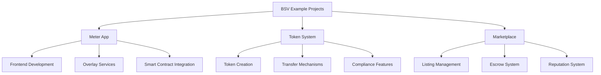

# Example Projects

Welcome to the Example Projects section of the BSV Technical Pathway. This module provides hands-on implementations that demonstrate how to build real-world applications using BSV's building blocks, smart contracts, and advanced concepts.

## 🎯 What You'll Learn

By completing this section, you'll have:
- ✅ **Built a complete meter application** with overlay services
- ✅ **Implemented a token system** with custom tokens
- ✅ **Created a marketplace** with escrow and reputation systems
- ✅ **Applied best practices** for production-ready applications
- ✅ **Integrated multiple BSV components** into cohesive solutions

## 🏗️ Example Projects Overview

## 📚 Learning Modules

### 1. [Meter App Walkthrough](meter-app.md) ⏱️ 2 hours
**Complete counter application implementation**
- Frontend development with BSV integration
- Overlay services for state management
- Smart contract interaction
- Deployment and testing

### 2. [Token System Implementation](token-system.md) ⏱️ 3 hours
**Custom token creation and management**
- Token design and implementation
- Transfer and trading mechanisms
- Compliance and audit features
- Multi-signature governance

### 3. [Marketplace Example](marketplace.md) ⏱️ 3 hours
**Decentralized marketplace architecture**
- Listing and order management
- Escrow and dispute resolution
- Reputation and review systems
- Payment processing integration

## 🔄 Learning Approach

Each example project follows a consistent structure:

1. **Project Overview**: Architecture and components
2. **Step-by-Step Implementation**: Detailed walkthrough
3. **Code Explanations**: Key concepts and patterns
4. **Testing and Validation**: Ensuring correctness
5. **Deployment**: Taking the project live
6. **Extensions**: Ideas for further development

## 🛠️ Prerequisites

Before diving into these examples, you should have:

- Completed the [BSV Building Blocks](../01-building-blocks/README.md) section
- Familiarity with [Smart Contracts](../02-smart-contracts/README.md)
- Understanding of [Advanced Topics](../03-advanced-topics/README.md) (helpful but not required)
- Development environment set up with LARS/CARS

## 🚀 Getting Started

Choose your starting point based on your interests:

| **Web Application Focus** | **Token Focus** | **Marketplace Focus** |
|---------------------------|-----------------|------------------------|
| [Meter App](meter-app.md) | [Token System](token-system.md) | [Marketplace](marketplace.md) |
| Frontend + state management | Custom tokens and transfers | Escrow and reputation systems |

---

**Next:** [Meter App Walkthrough](meter-app.md)
